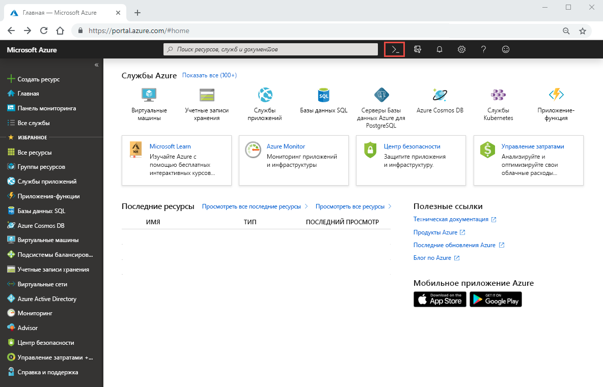

# Краткое руководство. Настройка Azure NetApp Files и создание тома NFS 

В этой статье описывается, как быстро настроить Azure NetApp Files и создать том. 

В этом кратком руководстве описывается настройка следующих элементов:

- регистрации для использования Azure NetApp Files и поставщика ресурсов NetApp;
- учетной записи NetApp;
- пула емкости;
- тома NFS для Azure NetApp Files.

Если у вас еще нет подписки Azure, [создайте бесплатную учетную запись Azure](https://azure.microsoft.com/free/?WT.mc_id=A261C142F), прежде чем начинать работу.

## Перед началом работы 

> [!IMPORTANT] 
> Необходимо иметь доступ к службе Azure NetApp Files.  Запросить доступ к службе можно на [странице заявки на доступ к Azure NetApp Files](https://forms.office.com/Pages/ResponsePage.aspx?id=v4j5cvGGr0GRqy180BHbR8cq17Xv9yVBtRCSlcD_gdVUNUpUWEpLNERIM1NOVzA5MzczQ0dQR1ZTSS4u).  Перед продолжением необходимо дождаться официального подтверждения по электронной почте от команды Azure NetApp Files. 

## Регистрация для использования Azure NetApp Files и поставщика ресурсов NetApp

1. На портале Azure щелкните значок Azure Cloud Shell в верхнем правом углу.

    

2. Укажите подписку, которая была добавлена в список разрешений для Azure NetApp Files.
    
        az account set --subscription <subscriptionId>

3. Зарегистрируйте поставщик ресурсов Azure. 
    
        az provider register --namespace Microsoft.NetApp --wait  

    Процесс регистрации может занять некоторое время.

## Создание учетной записи NetApp

1. В поле поиска на портале Azure введите **Azure NetApp Files**, затем выберите **Azure NetApp Files (preview)** из появившегося списка.

      

2. Нажмите кнопку **+ Добавить** для создания новой учетной записи NetApp.

     

3. В окне "New NetApp Account" (Новая учетная запись NetApp) укажите следующую информацию. 
   1. Введите имя учетной записи **myaccount1**. 
   2. Выберите свою подписку.
   3. Выберите **Создать**, чтобы создать группу ресурсов. Введите имя группы ресурсов **myRG1**. Последовательно выберите **ОК**. 
   4. Выберите расположение учетной записи.  

        

      

4. Нажмите кнопку **Создать**, чтобы создать учетную запись NetApp.

## Настройка пула емкости

1. В колонке управления Azure NetApp Files выберите свою учетную запись NetApp (**myaccount1**).

      

2. В колонке управления Azure NetApp Files для своей учетной записи NetApp щелкните **Пулы емкости**.

      

3. Щелкните **+ Добавить пулы**. 

      

4. Укажите сведения о пуле емкости. 
    1. Введите имя пула **mypool1**.
    2. Выберите уровень обслуживания **Премиум**. 
    3. Укажите размер пула **4 (Тиб)** . 

5. Последовательно выберите **ОК**.

## Создание тома NFS для Azure NetApp Files

1. В колонке управления Azure NetApp Files для своей учетной записи NetApp щелкните **Тома**.

      

2. Щелкните **+ Add volume** (+ Добавить том).

      

3. В окне "Создать том" укажите сведения о томе. 
   1. Введите имя тома **myvol1**. 
   3. Выберите пул емкости (**mypool1**).
   4. Используйте значение квоты по умолчанию. 
   5. В разделе "Виртуальная сеть" щелкните **Создать**, чтобы создать виртуальную сеть Azure.  Затем укажите следующие сведения.
       * Введите имя виртуальной сети **myvnet1**.
       * Укажите диапазон адресов для параметра, например 10.7.0.0/16.
       * Введите имя подсети **myANFsubnet**.
       * Укажите диапазон адресов подсети, например 10.7.0.0/24. Обратите внимание на то, что невозможно использовать выделенную подсеть совместно с другими ресурсами.
       * Для делегирования подсети выберите **Microsoft.NetApp/volumes**.
       * Нажмите кнопку **ОК**, чтобы создать виртуальную сеть.
   6. В разделе "Подсеть" выберите созданную виртуальную сеть (**myvnet1**) в качестве делегируемой подсети.

        

        

4. Нажмите кнопку **Протокол**, а затем для типа протокола тома выберите **NFS**.   

    Укажите путь к файлу (**myfilepath1**), который будет использоваться для создания пути экспорта для этого тома. 

    

5. Щелкните **Review + create** (Просмотреть и создать).

      

5. Ознакомьтесь с информацией о томе, а затем щелкните **Создать**.  
    Созданный том появится в колонке "Тома".

      

## Очистка ресурсов

По окончании группу ресурсов можно при необходимости удалить. Удаление группы ресурсов — необратимая операция.  

> [!IMPORTANT]
> Все ресурсы в группе ресурсов будут окончательно удалены, и отменить эту операцию невозможно. 

1. В поле поиска на портале Azure введите **Azure NetApp Files**, затем выберите **Azure NetApp Files** из появившегося списка.

2. В списке подписок щелкните группу ресурсов (myRG1), которую необходимо удалить. 

    

3. На странице группы ресурсов выберите команду **Удалить группу ресурсов**.

     

    Откроется окно с предупреждением о ресурсах, которые будут удалены вместе с группой ресурсов.

4. Введите имя группы ресурсов (myRG1) для подтверждения того, что вы хотите окончательно удалить группу ресурсов и все входящие в нее ресурсы, а затем нажмите кнопку **Удалить**.

     

## Дополнительная информация  

> [!div class="nextstepaction"]
> [Управление томами с помощью Azure NetApp Files](azure-netapp-files-manage-volumes.md)  
