# <a name="quickstart-set-up-azure-netapp-files-and-create-an-nfs-volume"></a>Краткое руководство. Настройка Azure NetApp Files и создание тома NFS 

В этой статье описывается, как быстро настроить Azure NetApp Files и создать том. 

В этом кратком руководстве описывается настройка следующих элементов:

- регистрации для использования Azure NetApp Files и поставщика ресурсов NetApp;
- учетной записи NetApp;
- пула емкости;
- тома NFS для Azure NetApp Files.

Если у вас еще нет подписки Azure, [создайте бесплатную учетную запись Azure](https://azure.microsoft.com/free/?WT.mc_id=A261C142F), прежде чем начинать работу.

## <a name="before-you-begin"></a>Перед началом работы 

> [!IMPORTANT] 
> Необходимо иметь доступ к службе Azure NetApp Files.  Запросить доступ к службе можно на [странице заявки на доступ к Azure NetApp Files](https://forms.office.com/Pages/ResponsePage.aspx?id=v4j5cvGGr0GRqy180BHbR8cq17Xv9yVBtRCSlcD_gdVUNUpUWEpLNERIM1NOVzA5MzczQ0dQR1ZTSS4u).  Перед продолжением необходимо дождаться официального подтверждения по электронной почте от команды Azure NetApp Files. 

[!INCLUDE [cloud-shell-try-it.md](../../includes/cloud-shell-try-it.md)]

---

## <a name="register-for-azure-netapp-files-and-netapp-resource-provider"></a>Регистрация для использования Azure NetApp Files и поставщика ресурсов NetApp

> [!NOTE]
> Процесс регистрации может занять некоторое время.
>

# <a name="portaltabazure-portal"></a>[Портал](#tab/azure-portal)

Чтобы выполнить регистрацию с помощью портала, откройте сеанс Cloud Shell, как указано выше, и выполните следующие действия на интерфейсе командной строки Azure:

[!INCLUDE [azure-netapp-files-cloudshell-include](../../includes/azure-netapp-files-azure-cloud-shell-window.md)]

# <a name="powershelltabazure-powershell"></a>[PowerShell](#tab/azure-powershell)

Для работы с этой статьей требуется модуль Azure PowerShell Az 2.6.0 или более поздней версии. Чтобы узнать, какая версия используется сейчас, выполните команду `Get-Module -ListAvailable Az`. Если вам необходимо выполнить установку или обновление, см. статью [об установке модуля Azure PowerShell](/powershell/azure/install-Az-ps). При желании вместо сеанса PowerShell можно использовать консоль Cloud Shell.

1. В командной строке PowerShell (или сеансе Cloud Shell PowerShell) укажите подписку, которая была добавлена в список разрешений для Azure NetApp Files:
    ```powershell-interactive
    Select-AzSubscription -Subscription <subscriptionId>
    ```

2. Зарегистрируйте поставщик ресурсов Azure.
    ```powershell-interactive
    Register-AzResourceProvider -ProviderNamespace Microsoft.NetApp
    ```

# <a name="azure-clitabazure-cli"></a>[Интерфейс командной строки Azure](#tab/azure-cli)

[!INCLUDE [azure-netapp-files-cloudshell-include](../../includes/azure-netapp-files-azure-cloud-shell-window.md)]

---

## <a name="create-a-netapp-account"></a>Создание учетной записи NetApp

# <a name="portaltabazure-portal"></a>[Портал](#tab/azure-portal)

1. В поле поиска на портале Azure введите **Azure NetApp Files**, затем выберите **Azure NetApp Files** из появившегося списка.

      

2. Нажмите кнопку **+ Добавить** для создания новой учетной записи NetApp.

     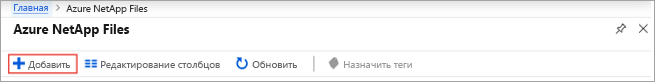

3. В окне "New NetApp Account" (Новая учетная запись NetApp) укажите следующую информацию. 
   1. Введите имя учетной записи **myaccount1**. 
   2. Выберите свою подписку.
   3. Выберите **Создать**, чтобы создать группу ресурсов. Введите имя группы ресурсов **myRG1**. Последовательно выберите **ОК**. 
   4. Выберите расположение учетной записи.  

      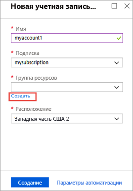  

      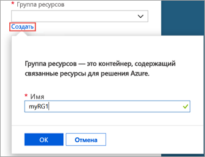

4. Нажмите кнопку **Создать**, чтобы создать учетную запись NetApp.

# <a name="powershelltabazure-powershell"></a>[PowerShell](#tab/azure-powershell)

1. Определите некоторые переменные, чтобы мы могли ссылаться на них во всех остальных примерах:

    ```powershell-interactive
    $resourceGroup = "myRG1"
    $location = "eastus"
    $anfAccountName = "myaccount1"
    ``` 

    > [!NOTE]
    > Список поддерживаемых регионов см. в статье [Доступность продуктов по регионам](https://azure.microsoft.com/global-infrastructure/services/?products=netapp&regions=all).
    > Чтобы получить имя региона, которое поддерживается нашими средствами командной строки, используйте `Get-AzLocation | select Location`
    >

1. Создайте группу ресурсов с помощью команды [New-AzResourceGroup](/powershell/module/az.resources/new-azresourcegroup):

    ```powershell-interactive
    New-AzResourceGroup -Name $resourceGroup -Location $location
    ```

2. Создайте учетную запись Azure NetApp Files с помощью команды [New-AzNetAppFilesAccount](/powershell/module/az.netappfiles/New-AzNetAppFilesAccount):
   
    ```powershell-interactive
    New-AzNetAppFilesAccount -ResourceGroupName $resourceGroup -Location $location -Name $anfAccountName
    ```

# <a name="azure-clitabazure-cli"></a>[Интерфейс командной строки Azure](#tab/azure-cli)

1. Определите некоторые переменные, чтобы мы могли ссылаться на них во всех остальных примерах:

    ```azurecli-interactive
    RESOURCE_GROUP="myRG1"
    LOCATION="eastus"
    ANF_ACCOUNT_NAME="myaccount1"
    ``` 

    > [!NOTE]
    > Список поддерживаемых регионов см. в статье [Доступность продуктов по регионам](https://azure.microsoft.com/global-infrastructure/services/?products=netapp&regions=all).
    > Чтобы получить имя региона, которое поддерживается нашими средствами командной строки, используйте `az account list-locations -query "[].{Region:name}" --out table`
    >

2. Создайте новую группу ресурсов с помощью команды [az group create](/cli/azure/group#az-group-create):

    ```azurecli-interactive
    az group create \
        --name $RESOURCE_GROUP \
        --location $LOCATION
    ```

3. Создайте учетную запись Azure NetApp Files с помощью команды [az netappfiles account create](/cli/azure/netappfiles/account#az-netappfiles-account-create):
   
    ```azurecli-interactive
    az netappfiles account create \
        --resource-group $RESOURCE_GROUP \
        --location $LOCATION \
        --account-name $ANF_ACCOUNT_NAME
    ```
---

## <a name="set-up-a-capacity-pool"></a>Настройка пула емкости

# <a name="portaltabazure-portal"></a>[Портал](#tab/azure-portal)

1. В колонке управления Azure NetApp Files выберите свою учетную запись NetApp (**myaccount1**).

    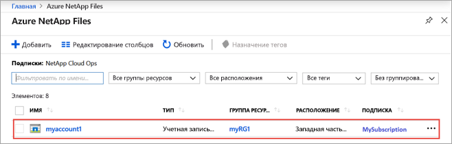  

2. В колонке управления Azure NetApp Files для своей учетной записи NetApp щелкните **Пулы емкости**.

    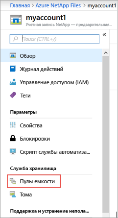  

3. Щелкните **+ Добавить пулы**. 

    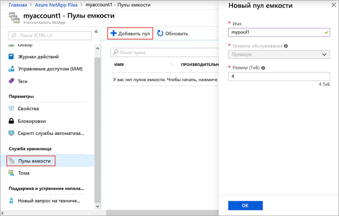  

4. Укажите сведения о пуле емкости. 
    1. Введите имя пула **mypool1**.
    2. Выберите уровень обслуживания **Премиум**. 
    3. Укажите размер пула **4 (Тиб)** . 

5. Последовательно выберите **ОК**.

# <a name="powershelltabazure-powershell"></a>[PowerShell](#tab/azure-powershell)

1. Определение новых переменных для дальнейшего использования

    ```powershell-interactive
    $poolName = "mypool1"
    $poolSizeBytes = 4398046511104 # 4TiB
    $serviceLevel = "Premium" # Valid values are Standard, Premium and Ultra
    ```

1. Создайте новый пул емкости с помощью [New-AzNetAppFilesPool](/powershell/module/az.netappfiles/new-aznetappfilespool)

    ```powershell-interactive
    New-AzNetAppFilesPool -ResourceGroupName $resourceGroup -Location $location -AccountName $anfAccountName -Name $poolName -PoolSize $poolSizeBytes -ServiceLevel $serviceLevel
    ```

# <a name="azure-clitabazure-cli"></a>[Интерфейс командной строки Azure](#tab/azure-cli)

1. Определение новых переменных для дальнейшего использования

    ```azurecli-interactive
    POOL_NAME="mypool1"
    POOL_SIZE_TiB=4 # Size in Azure CLI needs to be in TiB unit (minimum 4 TiB)
    SERVICE_LEVEL="Premium" # Valid values are Standard, Premium and Ultra
    ```

2. Создайте новый пул емкости с помощью [az netappfiles pool create](/cli/azure/netappfiles/pool#az-netappfiles-pool-create) 

    ```azurecli-interactive
    az netappfiles pool create \
        --resource-group $RESOURCE_GROUP \
        --location $LOCATION \
        --account-name $ANF_ACCOUNT_NAME \
        --pool-name $POOL_NAME \
        --size $POOL_SIZE_TiB \
        --service-level $SERVICE_LEVEL
    ```

---

## <a name="create-nfs-volume-for-azure-netapp-files"></a>Создание тома NFS для Azure NetApp Files

# <a name="portaltabazure-portal"></a>[Портал](#tab/azure-portal)

1. В колонке управления Azure NetApp Files для своей учетной записи NetApp щелкните **Тома**.

    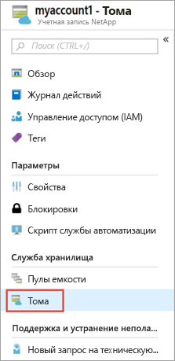  

2. Щелкните **+ Add volume** (+ Добавить том).

    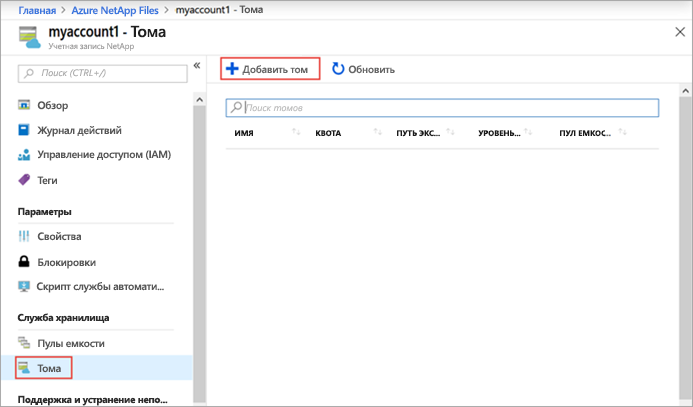  

3. В окне "Создать том" укажите сведения о томе. 
   1. Введите имя тома **myvol1**. 
   2. Выберите пул емкости (**mypool1**).
   3. Используйте значение квоты по умолчанию. 
   4. В разделе "Виртуальная сеть" щелкните **Создать**, чтобы создать виртуальную сеть Azure.  Затем укажите следующие сведения.
       * Введите имя виртуальной сети **myvnet1**.
       * Укажите диапазон адресов для параметра, например 10.7.0.0/16.
       * Введите имя подсети **myANFsubnet**.
       * Укажите диапазон адресов подсети, например 10.7.0.0/24. Невозможно использовать выделенную подсеть совместно с другими ресурсами.
       * Для делегирования подсети выберите **Microsoft.NetApp/volumes**.
       * Нажмите кнопку **ОК**, чтобы создать виртуальную сеть.
   5. В разделе "Подсеть" выберите созданную виртуальную сеть (**myvnet1**) в качестве делегируемой подсети.

      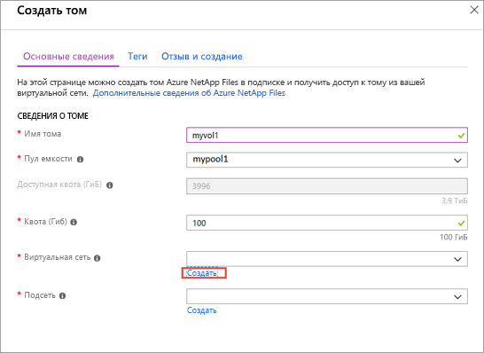  

      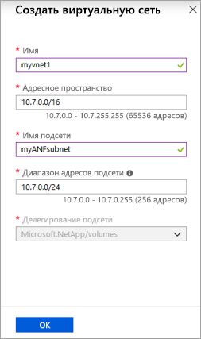  

4. Щелкните **Протокол**, а затем выполните приведенные ниже действия. 
    * Выберите **NFS** в качестве типа протокола тома.  
    * Укажите путь к файлу (**myfilepath1**), который будет использоваться для создания пути экспорта для этого тома.  
    * Выберите версию NFS (**NFSv3** или **NFSv4.1**) для тома.  
      Сведения о версиях NFS см. в разделах [Сonsiderations](azure-netapp-files-create-volumes.md#considerations) (Рекомендации) и [Best practice](azure-netapp-files-create-volumes.md#best-practice) (Лучшая методика). 
      
  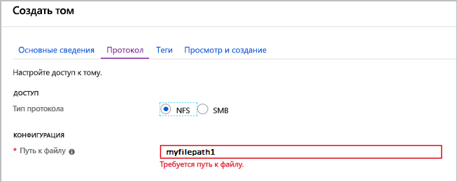

5. Щелкните **Review + create** (Просмотреть и создать).

    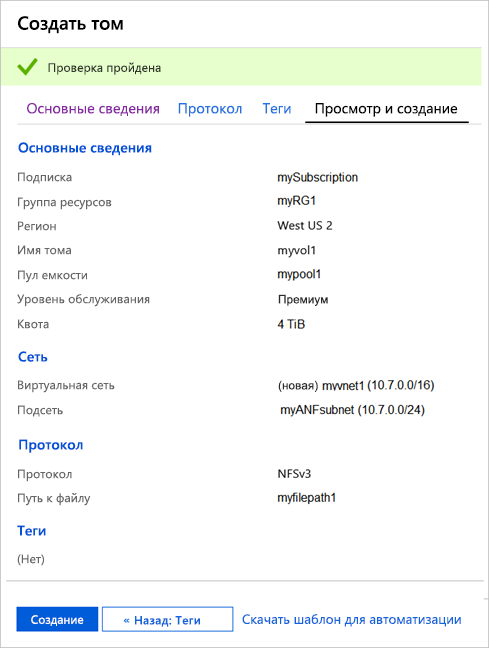  

6. Ознакомьтесь с информацией о томе, а затем щелкните **Создать**.  
    Созданный том появится в колонке "Тома".

    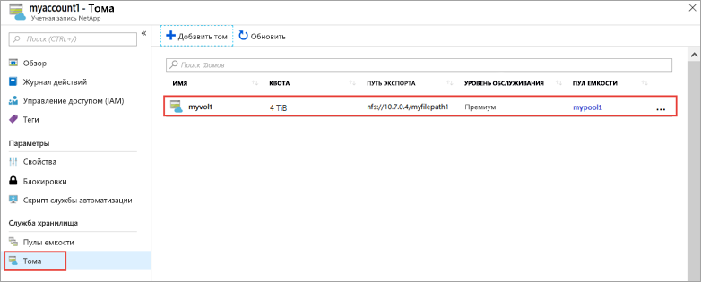  

# <a name="powershelltabazure-powershell"></a>[PowerShell](#tab/azure-powershell)

1. Создайте делегирование подсети для "Microsoft.NetApp/volumes" с помощью команды [New-AzDelegation](/powershell/module/az.network/new-azdelegation).

    ```powershell-interactive
    $anfDelegation = New-AzDelegation -Name ([guid]::NewGuid().Guid) -ServiceName "Microsoft.NetApp/volumes"
    ```

2. Создайте конфигурацию подсети с помощью команды [New-AzVirtualNetworkSubnetConfig](/powershell/module/az.network/new-azvirtualnetworksubnetconfig).

    ```powershell-interactive
    $subnet = New-AzVirtualNetworkSubnetConfig -Name "myANFSubnet" -AddressPrefix "10.7.0.0/24" -Delegation $anfDelegation
    ```

3. Создайте виртуальную сеть с помощью команды [New-AzVirtualNetwork](/powershell/module/az.network/new-azvirtualnetwork).
    
    ```powershell-interactive
    $vnet = New-AzVirtualNetwork -Name "myvnet1" -ResourceGroupName $resourceGroup -Location $location -AddressPrefix "10.7.0.0/16" -Subnet $subnet
    ```

4. Создайте том с помощью команды [New-AzNetAppFilesVolume](/powershell/module/az.netappfiles/new-aznetappfilesvolume).
   
    ```powershell-interactive
    $volumeSizeBytes = 1099511627776 # 100GiB
    $subnetId = $vnet.Subnets[0].Id

    New-AzNetAppFilesVolume -ResourceGroupName $resourceGroup `
        -Location $location `
        -AccountName $anfAccountName `
        -PoolName $poolName `
        -Name "myvol1" `
        -UsageThreshold $volumeSizeBytes `
        -SubnetId $subnetId `
        -CreationToken "myfilepath1" `
        -ServiceLevel $serviceLevel `
        -ProtocolType NFSv3
    ```

# <a name="azure-clitabazure-cli"></a>[Интерфейс командной строки Azure](#tab/azure-cli)

1. Определение некоторых переменных для последующего использования.
    
    ```azurecli-interactive
    VNET_NAME="myvnet1"
    SUBNET_NAME="myANFSubnet"
    ```

1. Создайте виртуальную сеть без подсети с помощью команды [az network vnet create](/cli/azure/network/vnet#az-network-vnet-create).
    
    ```azurecli-interactive
    az network vnet create \
        --resource-group $RESOURCE_GROUP \
        --name $VNET_NAME \
        --location $LOCATION \
        --address-prefix "10.7.0.0/16"

    ```

2. Создайте делегированную подсеть с помощью команды [az network vnet subnet create](/cli/azure/network/vnet/subnet#az-network-vnet-subnet-create).

    ```azurecli-interactive
    az network vnet subnet create \
        --resource-group $RESOURCE_GROUP \
        --vnet-name $VNET_NAME \
        --name $SUBNET_NAME \
        --address-prefixes "10.7.0.0/24" \
        --delegations "Microsoft.NetApp/volumes"
    ```

3. Создайте том с помощью команды [az netappfiles volume create](/cli/azure/netappfiles/volume#az-netappfiles-volume-create).
   
    ```azurecli-interactive
    VNET_ID=$(az network vnet show --resource-group $RESOURCE_GROUP --name $VNET_NAME --query "id" -o tsv)
    SUBNET_ID=$(az network vnet subnet show --resource-group $RESOURCE_GROUP --vnet-name $VNET_NAME --name $SUBNET_NAME --query "id" -o tsv)
    VOLUME_SIZE_GiB=100 # 100 GiB
    UNIQUE_FILE_PATH="myfilepath2" # Please note that creation token needs to be unique within subscription and region

    az netappfiles volume create \
        --resource-group $RESOURCE_GROUP \
        --location $LOCATION \
        --account-name $ANF_ACCOUNT_NAME \
        --pool-name $POOL_NAME \
        --name "myvol1" \
        --service-level $SERVICE_LEVEL \
        --vnet $VNET_ID \
        --subnet $SUBNET_ID \
        --usage-threshold $VOLUME_SIZE_GiB \
        --file-path $UNIQUE_FILE_PATH \
        --protocol-types "NFSv3"
    ```

---

## <a name="clean-up-resources"></a>Очистка ресурсов

# <a name="portaltabazure-portal"></a>[Портал](#tab/azure-portal)

По окончании группу ресурсов можно при необходимости удалить. Удаление группы ресурсов — необратимая операция.  

> [!IMPORTANT]
> Все ресурсы в группе ресурсов будут окончательно удалены, и отменить эту операцию невозможно. 

1. В поле поиска на портале Azure введите **Azure NetApp Files**, затем выберите **Azure NetApp Files** из появившегося списка.

2. В списке подписок щелкните группу ресурсов (myRG1), которую необходимо удалить. 

    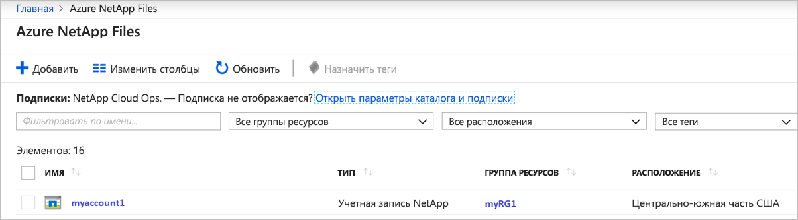


3. На странице группы ресурсов выберите команду **Удалить группу ресурсов**.

    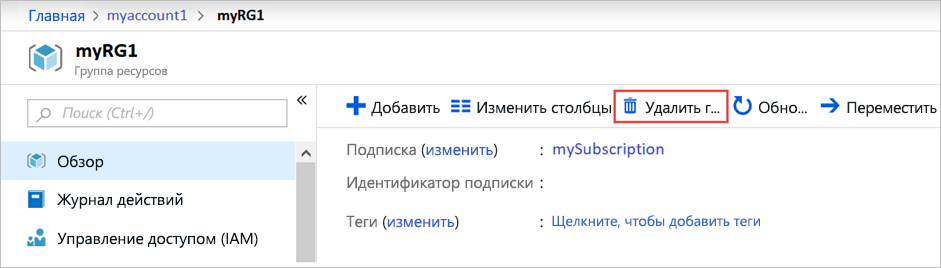 

    Откроется окно с предупреждением о ресурсах, которые будут удалены вместе с группой ресурсов.

4. Введите имя группы ресурсов (myRG1) для подтверждения того, что вы хотите окончательно удалить группу ресурсов и все входящие в нее ресурсы, а затем нажмите кнопку **Удалить**.

    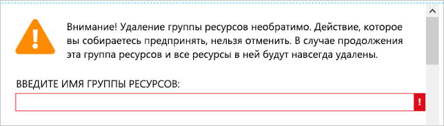 

# <a name="powershelltabazure-powershell"></a>[PowerShell](#tab/azure-powershell)

По окончании группу ресурсов можно при необходимости удалить. Удаление группы ресурсов — необратимая операция.  

> [!IMPORTANT]
> Все ресурсы в группе ресурсов будут окончательно удалены, и отменить эту операцию невозможно.

1. Удалите группу ресурсов с помощью команды [Remove-AzResourceGroup](/powershell/module/az.resources/remove-azresourcegroup).
   
    ```powershell-interactive
    Remove-AzResourceGroup -Name $resourceGroup
    ```

# <a name="azure-clitabazure-cli"></a>[Интерфейс командной строки Azure](#tab/azure-cli)

По окончании группу ресурсов можно при необходимости удалить. Удаление группы ресурсов — необратимая операция.  

> [!IMPORTANT]
> Все ресурсы в группе ресурсов будут окончательно удалены, и отменить эту операцию невозможно.

1. Удалите группу ресурсов с помощью команды [az group delete](/cli/azure/group#az-group-delete).
   
    ```azurecli-interactive
    az group delete \
        --name $RESOURCE_GROUP
    ```
---

## <a name="next-steps"></a>Дополнительная информация  

> [!div class="nextstepaction"]
> [Управление томами с помощью Azure NetApp Files](azure-netapp-files-manage-volumes.md)  
