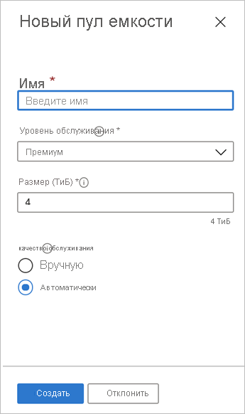

# Настройка пула емкости

Настройка пула емкости позволяет создавать в нем тома.  

## Перед началом работы 

Должна быть создана учетная запись NetApp.   

[Создание учетной записи NetApp](azure-netapp-files-create-netapp-account.md)

## Действия 

1. Перейдите в колонку управления учетной записью NetApp, а затем в навигационной панели выберите **Пулы емкости**.  
    
    

2. Нажмите **+ Добавить пулы** для создания нового пула емкости.   
    Появится окно New Capacity Pool (Новый пул емкости).

3. Укажите следующую информацию для нового пула емкости.  
  * **Имя**  
    Придумайте название для пула емкости.  
    Название пула емкости должно быть уникальным для каждой учетной записи NetApp.

  * **Уровень службы**   
    В этом поле отображается целевая производительность пула емкости.  
    Выберите уровень обслуживания для пула емкости: [**"Премиум"**](azure-netapp-files-service-levels.md#Premium) или [**"Стандартный"**](azure-netapp-files-service-levels.md#Standard).

  * **Размер**      
    Укажите приобретаемый размер пула емкости.        
    Минимальный размер пула емкости равен 4 ТиБ. Можно создавать пул с размером, кратным 4 ТиБ.   
      
    

4. Последовательно выберите **ОК**.

## Дополнительная информация 

- [Service levels for Azure NetApp Files](azure-netapp-files-service-levels.md) (Уровни обслуживания для для службы Azure NetApp Files)
- Сведения о ценах на разные уровни обслуживания см. на странице [Цены на службу Azure NetApp Files](https://azure.microsoft.com/pricing/details/storage/netapp/)
- [Делегирование подсети службе Azure NetApp Files](azure-netapp-files-delegate-subnet.md)
