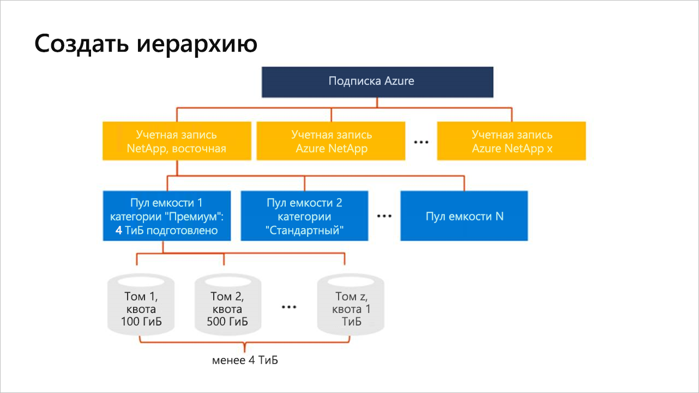

# Что собой представляет иерархия хранилища Azure NetApp Files

Перед созданием тома в Azure NetApp Files необходимо приобрести и настроить пул для подготовленной емкости.  Чтобы настроить емкость пула, необходимо иметь учетную запись NetApp. Понимание иерархии хранилища помогает настроить и управлять ресурсами Azure NetApp Files.

## Учетные записи NetApp

- Учетная запись NetApp служит в качестве административного группирования составных емкостей пулов.  
- Учетная запись NetApp отличается от учетной записи хранения Azure. 
- Учетная запись NetApp является региональной областью.   
- Можно иметь несколько учетных записей NetApp в регионе, но каждая учетная запись NetApp привязана только к одному региону.

## Пулы емкости

- Емкость пула определяется по его производительности.  
- Емкость предоставляется в пределах фиксированных номеров SKU, которые вы приобрели (например, емкость 4 ТиБ).
- Пул емкости может содержать только один уровень службы.  
- Каждый пул емкости может принадлежать только одной учетной записи NetApp. Но в учетной записи NetApp может быть несколько пулов емкости.  
- Пул емкости нельзя перемещать между различными учетными записями NetApp.   
  Например, в [концептуальной схеме иерархии хранения](#conceptual_diagram_of_storage_hierarchy) ниже, Capacity Pool 1 невозможно переместить из учётной записи NetApp восточной части США в учётную запись NetApp западной части США 2.  
- Нельзя удалить пул емкости, пока не будут удалены все содержащиеся в нем тома.

## Тома

- Том измеряется с использованием логической емкости и масштабируется. 
- Потребление емкости тома зависит от подготовленной емкости пула.
- Каждый том принадлежит только одному пулу, но пул может содержать несколько томов. 
- Том нельзя перемещать между пулами емкости. <!--Within the same NetApp account, you can move a volume across pools.  -->   
  Например, в [концептуальной схеме иерархии хранения](#conceptual_diagram_of_storage_hierarchy), представленной ниже, нельзя переместить тома из пула емкости 1 в пул емкости 2.
- Том нельзя удалить, пока не будут удалены все его моментальные снимки.

## Концептуальная схема иерархии хранения 
В следующем примере показаны связи подписки Azure, учетных записей NetApp, пулов емкости и томов.   

## Дополнительная информация

- [Ограничения ресурсов для службы Azure NetApp Files](azure-netapp-files-resource-limits.md)
- [Регистрация в службе Azure NetApp Files](azure-netapp-files-register.md)
