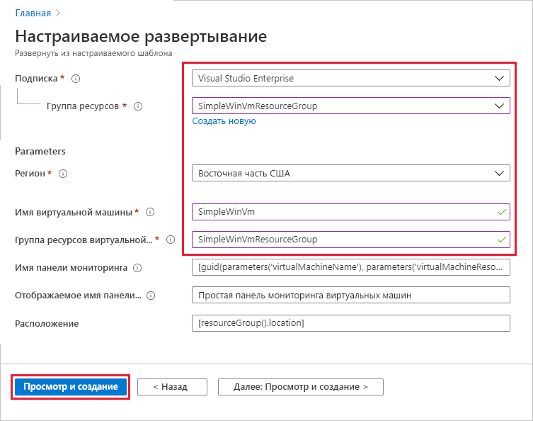
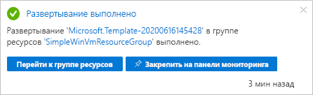
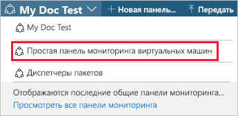
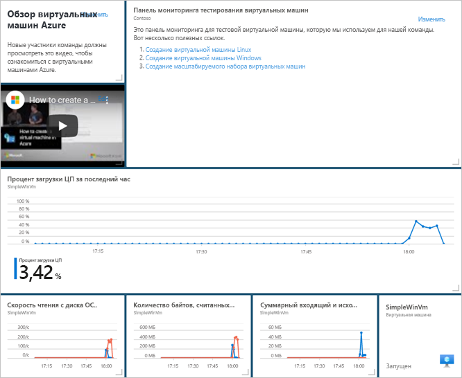
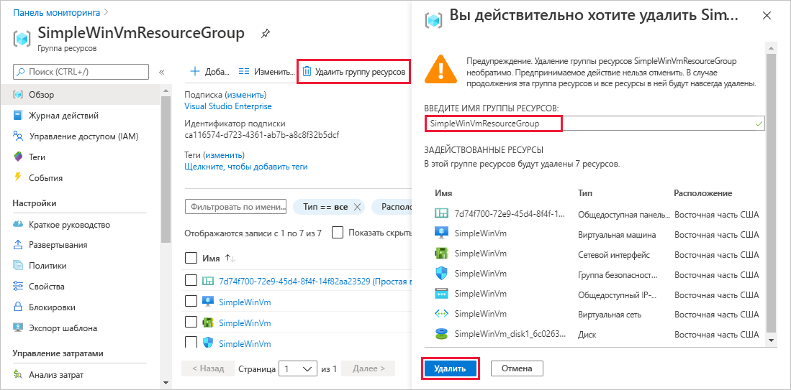

# <a name="quickstart-create-a-dashboard-in-the-azure-portal-by-using-an-arm-template"></a>Краткое руководство. Создание панели мониторинга на портале Azure с помощью шаблона ARM

Панель мониторинга на портале Azure — это организованное и упорядоченное представление облачных ресурсов. В этом кратком руководстве показано, как развернуть шаблон Azure Resource Manager (шаблон ARM), чтобы создать панель мониторинга. На панели мониторинга отображаются сведения о производительности виртуальной машины, а также некоторые статические данные и ссылки.

[!INCLUDE [About Azure Resource Manager](../../includes/resource-manager-quickstart-introduction.md)]

Если среда соответствует предварительным требованиям и вы знакомы с использованием шаблонов ARM, нажмите кнопку **Развертывание в Azure**. Шаблон откроется на портале Azure.

[](https://portal.azure.com/#create/Microsoft.Template/uri/https%3A%2F%2Fraw.githubusercontent.com%2FAzure%2Fazure-quickstart-templates%2Fmaster%2F101-azure-portal-dashboard%2Fazuredeploy.json)

## <a name="prerequisites"></a>Предварительные требования

- Если у вас еще нет подписки Azure, [создайте бесплатную учетную запись](https://azure.microsoft.com/free/?WT.mc_id=A261C142F), прежде чем начинать работу.
- Существующая виртуальная машина.

## <a name="create-a-virtual-machine"></a>Создание виртуальной машины

Для панели мониторинга, которую вы создадите с помощью этого краткого руководства, требуется виртуальная машина. Чтобы создать виртуальную машину, выполните следующие действия.

1. На портале Azure выберите Cloud Shell.

    

1. Скопируйте следующую команду и введите ее в командной строке, чтобы создать группу ресурсов.

    ```powershell
    New-AzResourceGroup -Name SimpleWinVmResourceGroup -Location EastUS
    ```

    

1. Скопируйте следующую команду и введите ее в командной строке, чтобы создать виртуальную машину в группе ресурсов.

    ```powershell
    New-AzVm `
        -ResourceGroupName "SimpleWinVmResourceGroup" `
        -Name "SimpleWinVm" `
        -Location "East US" 
    ```

1. Введите имя пользователя и пароль для виртуальной машины. Вам нужно создать новые имя пользователя и пароль, а не вводить данные от существующей учетной записи, например используемой для входа в Azure. Дополнительные сведения см. в описании требований к [имени пользователя](../virtual-machines/windows/faq.md#what-are-the-username-requirements-when-creating-a-vm) и [паролю](../virtual-machines/windows/faq.md#what-are-the-password-requirements-when-creating-a-vm).

    Начнется развертывание виртуальной машины, которое обычно занимает несколько минут. По завершении развертывания перейдите к следующему разделу.

## <a name="review-the-template"></a>Изучение шаблона

Шаблон, используемый в этом кратком руководстве, взят из [шаблонов быстрого запуска Azure](https://azure.microsoft.com/resources/templates/101-azure-portal-dashboard/). Шаблон для этой статьи слишком длинный, чтобы его можно было здесь отобразить. Вы можете просмотреть этот шаблон в файле [azuredeploy.json](https://raw.githubusercontent.com/Azure/azure-quickstart-templates/master/101-azure-portal-dashboard/azuredeploy.json). В этом шаблоне определяется один ресурс Azure [Microsoft.Portal/dashboards](/azure/templates/microsoft.portal/dashboards), который создает панель мониторинга на портале Azure.

## <a name="deploy-the-template"></a>Развертывание шаблона

1. Выберите следующее изображение, чтобы войти на портал Azure и открыть шаблон.

    [](https://portal.azure.com/#create/Microsoft.Template/uri/https%3A%2F%2Fraw.githubusercontent.com%2FAzure%2Fazure-quickstart-templates%2Fmaster%2F101-azure-portal-dashboard%2Fazuredeploy.json)

1. Выберите или введите следующие значения, а затем щелкните **Проверка и создание**.

    

    Если не указано иное, используйте для создания панели мониторинга значения по умолчанию.

    * **Подписка**. Выберите нужную подписку Azure.
    * **Группа ресурсов**: выберите **SimpleWinVmResourceGroup**.
    * **Расположение**: выберите регион **Восточная часть США**.
    * **Имя виртуальной машины**: введите **SimpleWinVm**.
    * **Группа ресурсов виртуальной машины**: введите **SimpleWinVmResourceGroup**.

1. Щелкните **Создать** или **Приобрести**. После успешного развертывания панели мониторинга вы получите следующее уведомление.

    

Этот шаблон развернут с помощью портала Azure. Помимо портала Azure можно также использовать Azure PowerShell, Azure CLI и REST API. Дополнительные сведения о других методах развертывания см. в статье о [развертывании с использованием шаблонов](../azure-resource-manager/templates/deploy-powershell.md).

## <a name="review-deployed-resources"></a>Просмотр развернутых ресурсов

Убедитесь, что панель мониторинга создана успешно и от виртуальной машины поступают данные.

1. На портале Azure выберите **Панель мониторинга**.

    

1. На странице панели мониторинга выберите **Простая панель мониторинга виртуальной машины**.

    

1. Проверьте панель мониторинга, которую создал шаблон ARM. Вы увидите, что часть содержимого является статическим, но здесь также представлены диаграммы, отображающие производительность ранее созданной виртуальной машины.

    

## <a name="clean-up-resources"></a>Очистка ресурсов

Если вы хотите удалить виртуальную машину и связанную с ней панель мониторинга, удалите связанную группу ресурсов.

1. На портале Azure выполните поиск по запросу **SimpleWinVmResourceGroup**, а затем выберите этот элемент в результатах поиска.

1. На странице **SimpleWinVmResourceGroup** выберите действие **Удалить группу ресурсов**, введите имя группы ресурсов для подтверждения и щелкните **Удалить**.

    

## <a name="next-steps"></a>Дальнейшие действия

Дополнительные сведения о панелях мониторинга на портале Azure см. в следующей статье:

> [!div class="nextstepaction"]
> [Создание панелей мониторинга на портале Azure и предоставление общего доступа к ним](azure-portal-dashboards.md)