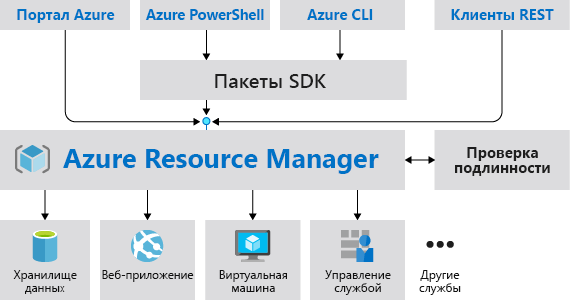
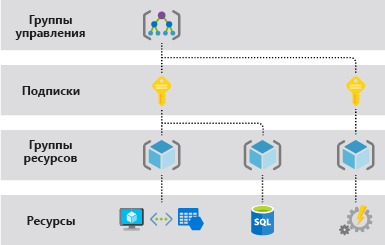
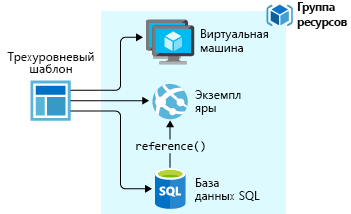
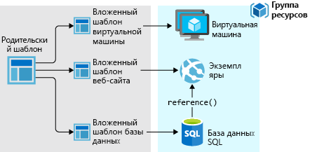
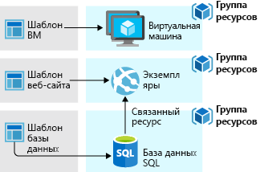

# <a name="azure-resource-manager-overview"></a>Общие сведения о диспетчере ресурсов Azure

Azure Resource Manager — это служба развертывания и управления для Azure. Она обеспечивает уровень согласованного управления, позволяющий создавать, обновлять и удалять ресурсы в подписке Azure. Вы можете использовать ее функции управления доступом, аудита и добавления тегов, чтобы защитить и упорядочить ресурсы после развертывания.

При выполнении действий с помощью портала, PowerShell, интерфейса командной строки Azure, REST API или клиентских пакетов SDK ваш запрос обрабатывается с помощью API Azure Resource Manager. Так как все запросы обрабатываются через один API, результаты и возможности будут согласованы в различных средствах. Все доступные на портале возможности также доступны в PowerShell, Azure CLI, REST API и клиентских пакетах SDK. Функции, предоставленные через API, будут представлены на портале в течение 180 дней после выпуска.

На приведенном ниже рисунке показано, как эти средства взаимодействуют с API Azure Resource Manager. API передает запросы в службу Resource Manager, где они проходят проверку подлинности и авторизацию. Потом Resource Manager перенаправляет запросы к соответствующей службе.



## <a name="terminology"></a>Терминология

Если у вас еще нет опыта работы с Azure Resource Manager, возможно, некоторые термины окажутся незнакомыми.

* **Ресурс** — управляемый элемент, доступный в Azure. Виртуальные машины, учетные записи хранения, веб-приложения, базы данных и виртуальные сети являются примерами ресурсов.
* **Группа ресурсов** — контейнер, содержащий связанные ресурсы для решения Azure. Группа ресурсов содержит ресурсы, которыми вы хотите управлять как группой. Пользователи могут выбрать оптимальный для своей организации способ распределения ресурсов в группах ресурсов. См. раздел [Группы ресурсов](#resource-groups).
* **Поставщик ресурсов** — служба, которая предоставляет ресурсы Azure. Например, распространенный поставщик ресурсов **Microsoft.Compute**, который предоставляет ресурс виртуальной машины. **Microsoft.Storage** является еще одним распространенным поставщиком ресурсов. См. раздел [Поставщики ресурсов](#resource-providers).
* **Шаблон Resource Manager** — файл в формате JSON (нотация объектов JavaScript), определяющий один или несколько ресурсов для развертывания в группе ресурсов или подписке. Шаблон можно использовать для согласованного и многократного развертывания ресурсов. См. раздел [Развертывание шаблона](#template-deployment).
* **Декларативный синтаксис** — синтаксис, позволяющий указать объект, который вы собираетесь создать. При этом для создания объекта не нужно писать последовательность команд. Шаблон Resource Manager — пример декларативного синтаксиса. В файле можно задать свойства для инфраструктуры, развертываемой в Azure.

## <a name="the-benefits-of-using-resource-manager"></a>Преимущества использования диспетчера ресурсов

Диспетчер ресурсов предоставляет несколько преимуществ.

* Вы можете развертывать и отслеживать все ресурсы вашего решения как единую группу, а не работать с ними по отдельности.
* Вы можете повторно развертывать решение на протяжении всего цикла разработки и гарантировать, что ресурсы развертываются в согласованном состоянии.
* Инфраструктурой можно управлять с помощью декларативных шаблонов, а не сценариев.
* Вы можете определять зависимости между ресурсами, чтобы их развертывание выполнялось в правильном порядке.
* Вы можете применить контроль доступа ко всем службам, так как контроль доступа на основе ролей (RBAC) изначально интегрирован в платформу управления.
* Для логического упорядочивания всех ресурсов в вашей подписке к ним можно применять теги.
* Чтобы узнать о выставлении счетов для вашей организации, просмотрите затраты на группу ресурсов с одним тегом.

## <a name="understand-management-scope"></a>Сведения об области управления

В Azure предоставляются четыре уровня области управления: группы управления, подписки, группы ресурсов и ресурсы. [Группы управления](../governance/management-groups/index.md) доступны в режиме предварительной версии. Пример этих уровней приведен на следующем изображении.



Параметры управления можно применить на любом из этих уровней области. Выбранный уровень определяет, насколько широка область применения параметра. На более низких уровнях наследуются параметры более высоких уровней. Например, если [политика](../governance/policy/overview.md) применяется к подписке, она применяется ко всем группам ресурсов и ресурсам в подписке. Если же политика применяется к группе ресурсов, то она применяется ко всем ресурсам в ней. Но в другой группе ресурсов этого назначения политики не будет.

## <a name="guidance"></a>Руководство

Следующие рекомендации помогут использовать все преимущества Resource Manager при работе с решениями.

* Определите и разверните инфраструктуру с помощью декларативного синтаксиса в шаблонах диспетчера ресурсов, а не с помощью безусловных команд.
* Определите все шаги развертывания и настройки в шаблоне. При настройке решения вы не должны выполнять какие-либо действия вручную.
* Используйте безусловные команды для управления ресурсами, например для запуска и остановки приложения или компьютера.
* Объедините ресурсы с одинаковым жизненным циклом в группу ресурсов. Для упорядочивания всех остальных ресурсов используйте теги.

Инструкции по использованию Resource Manager для эффективного управления подписками в организациях см. в статье [Корпоративный каркас Azure: рекомендуемая система управления подписками](/azure/architecture/cloud-adoption-guide/subscription-governance?toc=%2fazure%2fazure-resource-manager%2ftoc.json).

Дополнительные рекомендации по созданию шаблонов Resource Manager см. в статье [Рекомендации по работе с шаблонами Azure Resource Manager](template-best-practices.md).

## <a name="resource-groups"></a>Группы ресурсов
Существуют некоторые важные факторы, которые необходимо учитывать при определении группы ресурсов:

* Все ресурсы в группе должны совместно использовать один и тот же жизненный цикл. Развертывание, обновление и удаление производится сразу для всех ресурсов. Если один ресурс, например сервер базы данных, должен присутствовать в другом цикле развертывания, его следует поместить в другую группу ресурсов.
* Каждый ресурс может существовать только в одной группе ресурсов.
* Ресурс можно добавить в группу ресурсов или удалить из нее в любое время.
* Ресурс можно перемещать из одной группы ресурсов в другую. Дополнительные сведения см. в статье [Перемещение ресурсов в новую группу ресурсов или подписку](resource-group-move-resources.md).
* Группа ресурсов может содержать ресурсы, которые находятся в разных регионах.
* Группу ресурсов можно использовать, чтобы определить область действия управления доступом для административных действий.
* Ресурс может взаимодействовать с ресурсом в других группах. Такое взаимодействие чаще всего происходит, если эти два ресурса связаны, но имеют разные жизненные циклы (например, веб-приложения, подключенные к базе данных).

При создании группы ресурсов необходимо указать ее расположение. У пользователя может возникнуть вопрос, зачем для группы ресурсов нужно расположение. И если ресурсы и группа ресурсов могут находиться в разных расположениях, то какой смысл указывать расположение группы ресурсов? В группе ресурсов хранятся метаданные о ресурсах. Таким образом, указывая расположение группы ресурсов, вы определяете расположение метаданных. В целях обеспечения соответствия необходимо убедиться, что данные хранятся в определенном регионе.

## <a name="resource-providers"></a>Поставщики ресурсов

Каждый поставщик ресурсов предоставляет набор ресурсов и операций для работы с этими ресурсами. Например, чтобы хранить ключи и секреты, вам придется работать с поставщиком ресурсов **Microsoft.KeyVault**. Этот поставщик ресурсов предлагает тип ресурса с именем **vaults** для создания хранилища ключей.

Формат имени типа ресурса: **{поставщик_ресурса}/{тип_ресурса}**. Тип ресурса для хранилища ключей — **Microsoft.KeyVault/vaults**.

Прежде чем начинать развертывание ресурсов, необходимо подробнее узнать о доступных поставщиках ресурсов. Сведения об именах поставщиков ресурсов и самих ресурсов помогут определить, какие ресурсы необходимо развернуть в Azure. Также вы должны знать допустимые расположения и версии API для каждого типа ресурсов. См. дополнительные сведения о [поставщиках и типах ресурсов](resource-manager-supported-services.md).

Дополнительные сведения обо всех операциях, предоставляемых поставщиками ресурсов, см. в [справочнике по Azure REST API](/rest/api/azure/).

## <a name="template-deployment"></a>Развертывание шаблона

С помощью Resource Manager можно создать шаблон (в формате JSON), определяющий инфраструктуру и конфигурацию решения Azure. Этот шаблон можно использовать, чтобы повторно развертывать решение на протяжении всего его жизненного цикла и гарантировать, что ресурсы развертываются в согласованном состоянии.

Дополнительные сведения о формате и создании шаблона см. в статье [Описание структуры и синтаксиса шаблонов Azure Resource Manager](resource-group-authoring-templates.md). См. дополнительные сведения о синтаксисе JSON при [определении ресурсов в шаблонах Azure Resource Manager](/azure/templates/).

Resource Manager обрабатывает шаблон, как и любой другой запрос. Он анализирует шаблон и преобразует его синтаксис в операции REST API для соответствующих поставщиков ресурсов. Например, Resource Manager получает шаблон со следующим определением ресурса:

```json
"resources": [
  {
    "apiVersion": "2016-01-01",
    "type": "Microsoft.Storage/storageAccounts",
    "name": "mystorageaccount",
    "location": "westus",
    "sku": {
      "name": "Standard_LRS"
    },
    "kind": "Storage",
    "properties": {
    }
  }
]
```

В таком случае Resource Manager преобразует определение в операцию REST API, которая отправляется поставщику ресурсов Microsoft.Storage:

```HTTP
PUT
https://management.azure.com/subscriptions/{subscriptionId}/resourceGroups/{resourceGroupName}/providers/Microsoft.Storage/storageAccounts/mystorageaccount?api-version=2016-01-01
REQUEST BODY
{
  "location": "westus",
  "properties": {
  }
  "sku": {
    "name": "Standard_LRS"
  },
  "kind": "Storage"
}
```

Вы выбираете определение шаблонов и групп ресурсов по своему усмотрению в зависимости от того, как нужно управлять решением. Например, трехуровневое приложение можно развернуть из одного шаблона в одной группе ресурсов.



Но определять всю инфраструктуру в одном шаблоне не нужно. Во многих случаях целесообразно разделять требования к развертыванию между несколькими наборами шаблонов, предназначенными для определенных задач. Эти шаблоны можно многократно использовать для различных решений. Чтобы развернуть конкретное решение, создайте главный шаблон, связывающий все необходимые шаблоны. Ниже показано, как развернуть трехуровневое решение из родительского шаблона, в который входят три вложенных шаблона.



Если в вашем случае у уровней отдельные жизненные циклы, эти уровни можно развернуть в отдельные группы ресурсов. Обратите внимание, что ресурсы по-прежнему могут быть связаны с ресурсами в других группах.



Дополнительные сведения см. в статье [Использование связанных шаблонов в Azure Resource Manager](resource-group-linked-templates.md).

Azure Resource Manager анализирует зависимости, чтобы обеспечить создание ресурсов в правильном порядке. Если один ресурс зависит от значения в другом ресурсе (например, виртуальная машина, для которой требуется учетная запись хранения диска), можно задать зависимость. Дополнительные сведения см. в статье [Определение зависимостей в шаблонах диспетчера ресурсов Azure](resource-group-define-dependencies.md).

Кроме того, шаблон можно использовать для внесения обновлений в инфраструктуру. Например, можно добавить новый ресурс в решение и правила конфигурации для уже развернутых ресурсов. Если шаблон определяет ресурс, который уже существует, Resource Manager обновляет существующий ресурс вместо создания нового.

Диспетчер ресурсов предоставляет расширения для сценариев, когда необходимы дополнительные операции, такие как установка определенного программного обеспечения, не включенного в программу установки. Если вы уже работаете со службой управления конфигурацией, такую как DSC, Chef или Puppet, это можно делать и дальше, используя расширения. Дополнительные сведения о расширениях виртуальных машин см. в статье [Обзор расширений и компонентов виртуальной машины](../virtual-machines/windows/extensions-features.md?toc=%2fazure%2fvirtual-machines%2fwindows%2ftoc.json).

Если решение создается на портале, оно автоматически включает в себя шаблон развертывания. Вам не нужно создавать шаблон с нуля, так как можно начать с шаблона для своего решения и настроить его в соответствии с конкретными потребностями. Пример см. в [кратком руководстве по созданию и развертыванию шаблонов Azure Resource Manager с помощью портала Azure](./resource-manager-quickstart-create-templates-use-the-portal.md). Шаблон для существующей группы ресурсов можно получить, либо экспортировав текущее состояние группы ресурсов, либо просмотрев шаблон, использованный для конкретного развертывания. Чтобы лучше понять синтаксис шаблона, изучите [экспортированный шаблон](./manage-resource-groups-portal.md#export-resource-groups-to-templates).

Наконец, шаблон становится частью исходного кода для вашего приложения. Можно включить его в репозиторий исходного кода и обновлять по мере развития приложения. Шаблон можно изменить в Visual Studio.

Определив шаблон, можно приступить к развертыванию ресурсов в Azure. Дополнительные сведения о развертывании ресурсов см. в следующих источниках.

* [Развертывание ресурсов с использованием шаблонов Resource Manager и Azure PowerShell](resource-group-template-deploy.md)
* [Развертывание ресурсов с использованием шаблонов Resource Manager и Azure CLI](resource-group-template-deploy-cli.md)
* [Развертывание ресурсов с использованием шаблонов Resource Manager и портала Azure](resource-group-template-deploy-portal.md)
* [Развертывание ресурсов с использованием шаблонов и REST API Resource Manager](resource-group-template-deploy-rest.md)

## <a name="safe-deployment-practices"></a>Методики безопасного развертывания

При развертывании комплексной службы в Azure, прежде чем переходить к следующему шагу, необходимо развернуть службу в нескольких регионах и проверить ее работоспособность. Чтобы выпустить поэтапное развертывание службы, используйте [диспетчер развертывания Azure](deployment-manager-overview.md). Помещая выпуск службы на промежуточное хранение и обработку, можно обнаружить потенциальные проблемы, прежде чем он будет развернут во всех регионах. Если эти меры предосторожности не нужны, отображаемые в предыдущем разделе операции развертывания являются лучшим вариантом.

Диспетчер развертывания предоставляется в закрытой предварительной версии.

[!INCLUDE [arm-tutorials-quickstarts](../../includes/resource-manager-tutorials-quickstarts.md)]

## <a name="next-steps"></a>Дополнительная информация

С помощью этой статьи вы научились использовать Azure Resource Manager для развертывания, контроля ресурсов в Azure и управления доступом к ним. Перейдите к следующей статье, чтобы узнать, как создать свой первый шаблон Azure Resource Manager.

> [!div class="nextstepaction"]
> [Краткое руководство Создание и развертывание шаблонов Azure Resource Manager с помощью портала Azure](./resource-manager-quickstart-create-templates-use-the-portal.md)
