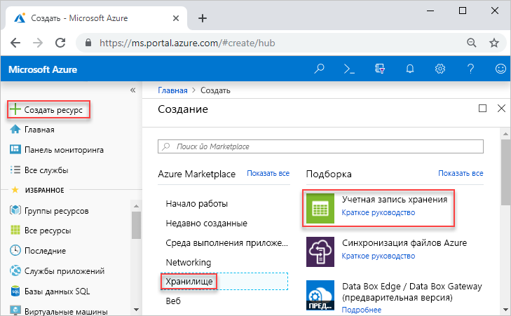
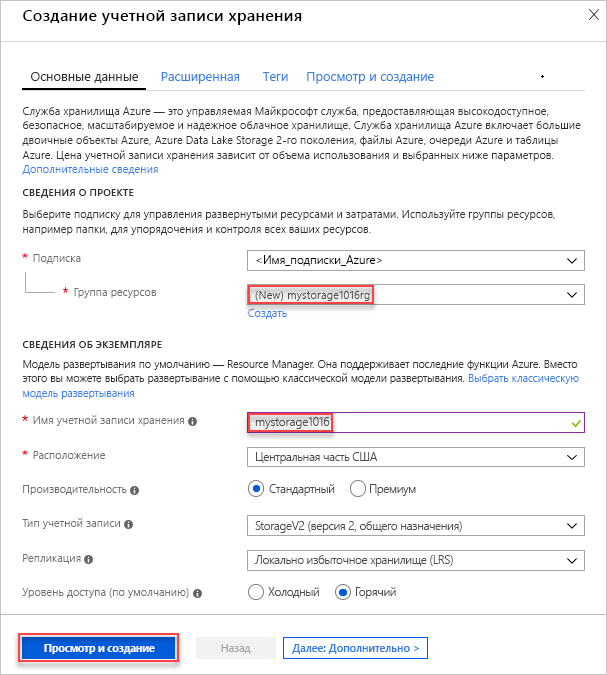
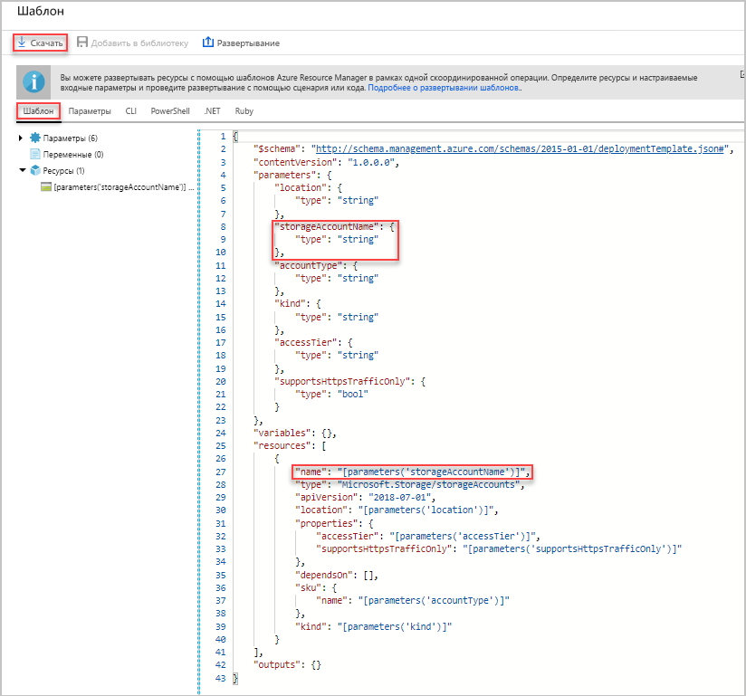
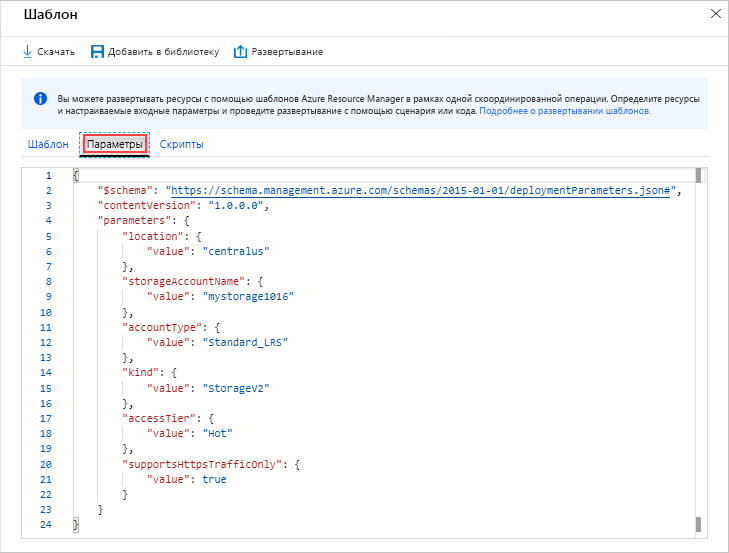
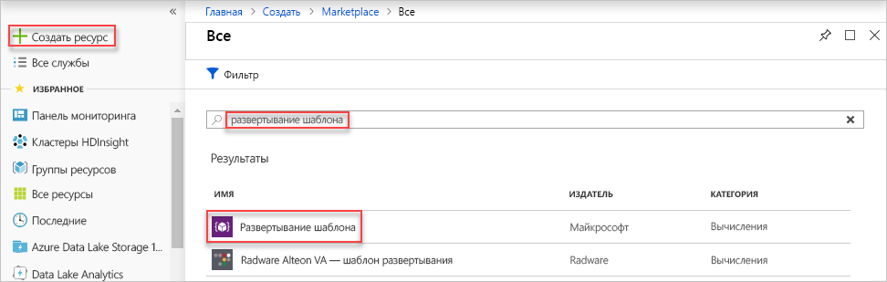
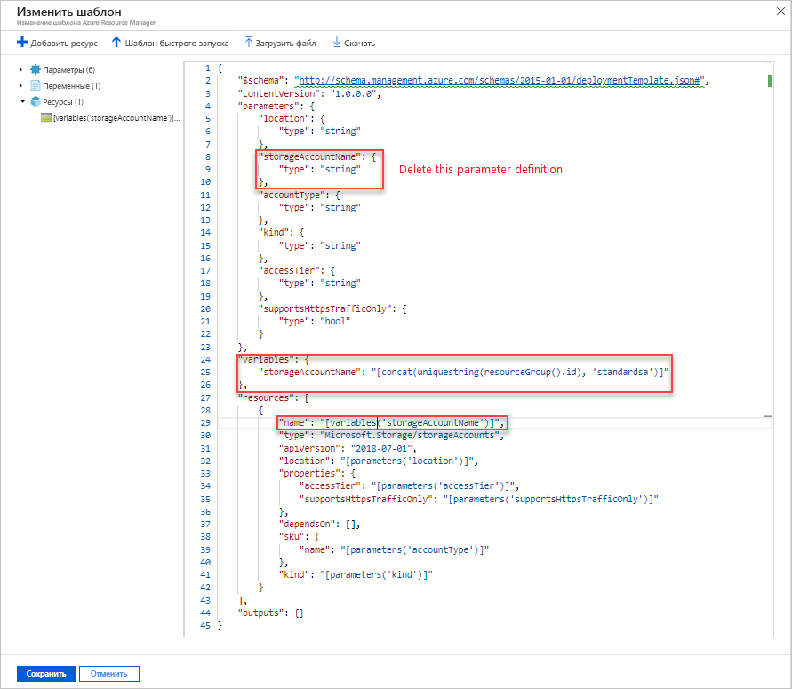
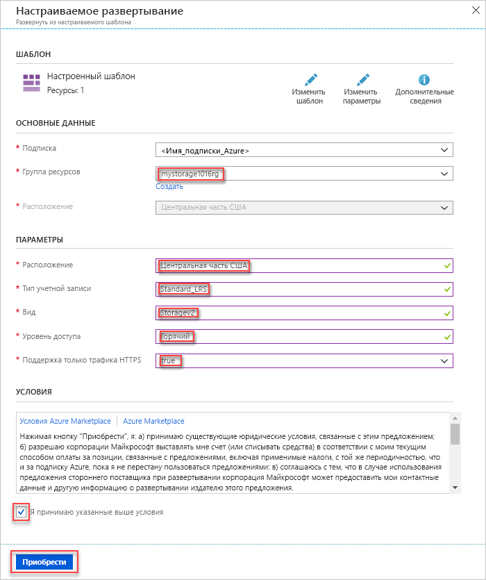
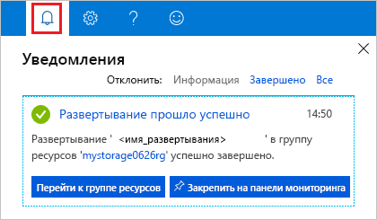
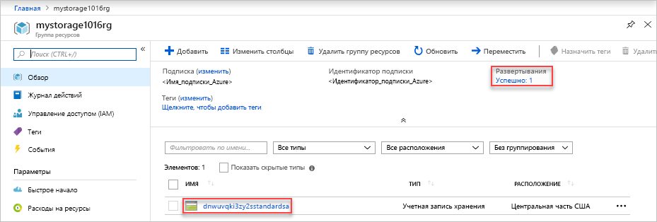

# <a name="quickstart-create-and-deploy-azure-resource-manager-templates-by-using-the-azure-portal"></a>Краткое руководство. Создание и развертывание шаблонов Azure Resource Manager с помощью портала Azure

Узнайте, как создавать шаблон Azure Resource Manager, а также изменять и развертывать его с помощью портала Azure. Шаблоны Resource Manager — это JSON-файлы, которые определяют ресурсы, необходимые для развертывания решения. В этом руководстве приведены инструкции по созданию учетной записи хранения Azure. Эту же процедуру можно использовать и для создания других ресурсов Azure.

Если у вас еще нет подписки Azure, [создайте бесплатную учетную запись Azure](https://azure.microsoft.com/free/), прежде чем начинать работу.

## <a name="generate-a-template-using-the-portal"></a>Создание шаблона с помощью портала

В этом разделе вы создадите учетную запись хранения с помощью портала Azure. Прежде чем развертывать учетную запись хранения, вы можете изучить шаблон, созданный с помощью портала, с учетом своих конфигураций. Вы можете сохранить шаблон и использовать его в будущем.

1. Войдите на [портале Azure](https://portal.azure.com).
2. Последовательно выберите **Создать ресурс** > **Хранилище** > **Учетная запись хранения — BLOB-объект, файл, таблица, очередь**.

    
3. Введите следующие сведения. 

    - **Группа ресурсов**. Создайте новую группу ресурсов Azure с именем по своему выбору. На снимке экрана ниже группа ресурсов называется *mystorage1016rg*.
    - **Имя**. Укажите уникальное имя учетной записи хранения. На показанном ниже снимке экрана это имя *mystorage1016*.

    Для остальных свойств можно использовать значения по умолчанию.

    

    > [!NOTE]
    > Перед развертыванием некоторые экспортированные шаблоны требуют изменений.

4. Выберите **Просмотр и создание** в нижней части экрана. 
5. Выберите **Загрузить шаблон для автоматизации** в нижней части экрана. На портале отобразится созданный шаблон.

    

    Шаблон отображается на главной панели. Это файл JSON с четырьмя элементами верхнего уровня: `schema`, `contentVersion`, `parameters` и `resources`. Дополнительные сведения см. в статье [Описание структуры и синтаксиса шаблонов Azure Resource Manager](./resource-group-authoring-templates.md).

    В шаблоне определяются шесть параметров. Один из них — **storageAccountName**. Во втором выделенном блоке показано, как использовать этот параметр в шаблоне. В следующем разделе описано, как изменить шаблон, указав в нем имя созданной учетной записи хранения.

    В шаблоне определяется один ресурс Azure. Тип ресурса — [Microsoft.Storage/storageAccounts]. См. сведения о том, как определяется ресурс и какова структура его определения.
6. Выберите **Скачать**. Сохраните файл **template.json** из скачанного пакета на компьютер. В следующем разделе описано, как изменить шаблон с помощью средства развертывания шаблона.
7. Выберите вкладку **Параметры**, чтобы просмотреть заданные вами значения для параметров. Запишите эти значения, так как они понадобятся в следующем разделе при развертывании шаблона.

    

    Вы можете создать учетную запись хранения Azure, используя как шаблон, так и файлы параметров.

## <a name="edit-and-deploy-the-template"></a>Редактирование и развертывание шаблона

Портал Azure может использоваться для выполнения базовых операций изменения шаблона. В этом кратком руководстве используется средство портала с именем *Развертывание шаблона*. Чтобы изменить более сложный шаблон, рекомендуем использовать [Visual Studio Code](./resource-manager-quickstart-create-templates-use-visual-studio-code.md) с более широкими возможностями редактирования.

В Azure требуется, чтобы каждая служба Azure имела уникальное имя. Развертывание завершится сбоем, если ввести имя учетной записи хранения, которое уже существует. Чтобы избежать этой проблемы, можно использовать вызов функции шаблона `uniquestring()` для создания уникального имени учетной записи хранения.

1. На портале Azure выберите **Создать ресурс**.
2. В строке **Поиск в Marketplace** введите **развертывание шаблона** и нажмите клавишу **ВВОД**.
3. Выберите **Развертывание шаблона**.

    
4. Нажмите кнопку **Создать**.
5. Выберите **Создать собственный шаблон в редакторе**.
6. Выберите **Загрузка файла** и выполните инструкции, чтобы загрузить файл template.json, скачанный вами в предыдущем разделе.
7. Добавьте одну переменную, как показано на снимке экрана.

    ```json
    "storageAccountName": "[concat(uniquestring(resourceGroup().id), 'standardsa')]"
    ```
    

    Здесь используются две функции: `concat()` и `uniqueString()`.

8. Удалите параметр **storageAccountName**, выделенный на предыдущем снимке экрана.
9. Обновите элемент name ресурса **Microsoft.Storage/storageAccounts**, чтобы использовать новую заданную переменную вместо параметра:

    ```json
    "name": "[variables('storageAccountName')]",
    ```

    Окончательная версия шаблона должна выглядеть так:

    ```json
    {
        "$schema": "https://schema.management.azure.com/schemas/2015-01-01/deploymentTemplate.json#",
        "contentVersion": "1.0.0.0",
        "parameters": {
            "location": {
                "type": "string"
            },
            "accountType": {
                "type": "string"
            },
            "kind": {
                "type": "string"
            },
            "accessTier": {
                "type": "string"
            },
            "supportsHttpsTrafficOnly": {
                "type": "bool"
            }
        },
        "variables": {
            "storageAccountName": "[concat(uniquestring(resourceGroup().id), 'standardsa')]"
        },
        "resources": [
            {
                "name": "[variables('storageAccountName')]",
                "type": "Microsoft.Storage/storageAccounts",
                "apiVersion": "2018-07-01",
                "location": "[parameters('location')]",
                "properties": {
                    "accessTier": "[parameters('accessTier')]",
                    "supportsHttpsTrafficOnly": "[parameters('supportsHttpsTrafficOnly')]"
                },
                "dependsOn": [],
                "sku": {
                    "name": "[parameters('accountType')]"
                },
                "kind": "[parameters('kind')]"
            }
        ],
        "outputs": {}
    }
    ```
7. Щелкните **Сохранить**.
8. Введите следующие значения.

    - **Группа ресурсов**. Укажите уникальное имя для группы ресурсов.
    - **Расположение**. Выберите расположение группы ресурсов.
    - **Расположение**. Выберите расположение учетной записи хранения.  Вы можете выбрать то же расположение, которое используется для группы ресурсов.
    - **Тип учетной записи.** В нашем примере используется **Standard_LRS**.
    - **Вид**. В нашем примере используется **StorageV2**.
    - **Уровень доступа**. В нашем примере используется **Горячий**.
    - **Https Traffic Only Enabled** (Включен только трафик HTTPS).  В нашем примере используется значение **true**.
    - Выберите **Я принимаю указанные выше условия**.

    Ниже приведен снимок экрана с примером развертывания.

    

10. Щелкните **Приобрести**.
11. Чтобы просмотреть состояние развертывания, щелкните значок колокольчика (уведомления) в верхней части экрана. Подождите, пока развертывание завершится.

    

12. Выберите **Перейти к группе ресурсов** в области уведомлений. Появится приблизительно такой экран:

    

    Вы увидите, что развертывание выполнено успешно и что в группе ресурсов есть только одна учетная запись хранения. Имя учетной записи хранения — это уникальная строка, созданная с помощью шаблона. Дополнительные сведения об использовании учетных записях хранения Azure см. в статье [Краткое руководство. Передача, скачивание и составление списка больших двоичных объектов с помощью портала Azure](../storage/blobs/storage-quickstart-blobs-portal.md).

## <a name="clean-up-resources"></a>Очистка ресурсов

Если ресурсы Azure больше не нужны, их можно удалить. Для этого необходимо удалить группу ресурсов.

1. На портале Azure в меню слева выберите **Группа ресурсов**.
2. В поле **Фильтровать по имени** введите имя группы ресурсов.
3. Выберите имя группы ресурсов.  В группе ресурсов должна быть учетная запись хранения.
4. В главном меню выберите **Удалить группу ресурсов**.

## <a name="next-steps"></a>Дополнительная информация

Из этого руководства вы узнали, как создавать и развертывать шаблоны на портале Azure. В этом кратком руководстве используется простой шаблон с одним ресурсом Azure. Если шаблон является сложным, для его разработки удобнее использовать Visual Studio Code или Visual Studio. В следующем кратком руководстве показано, как развертывать шаблоны с помощью Azure PowerShell и интерфейса командной строки Azure (CLI).

> [!div class="nextstepaction"]
> [Руководство по созданию шаблонов с помощью Visual Studio Code](./resource-manager-quickstart-create-templates-use-visual-studio-code.md)
