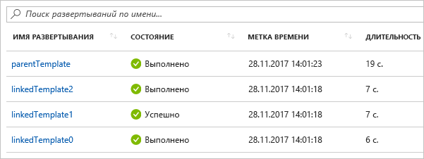

# <a name="using-linked-and-nested-templates-when-deploying-azure-resources"></a>Использование связанных и вложенных шаблонов при развертывании ресурсов Azure

Для развертывания сложных решений можно разбить шаблон на множество связанных шаблонов, а затем развернуть их вместе с помощью основного шаблона. Связанные шаблоны могут быть отдельными файлами или синтаксисом шаблонов, внедренными в основной шаблон. В этой статье используется термин **связанный шаблон** для ссылки на отдельный файл шаблона, связанный с основным шаблоном. Он использует термин **вложенный шаблон** для ссылки на синтаксис внедренного шаблона в основном шаблоне.

Для небольших и средних решений отдельный шаблон проще в понимании и обслуживании. Все ресурсы и значения можно увидеть в отдельном файле. В сложных сценариях связанные шаблоны позволяют разбить решение на целевые компоненты. Вы можете легко повторно использовать эти шаблоны для других сценариев.

Подробнее см. [Руководство. Создание связанных шаблонов Azure Resource Manager](template-tutorial-create-linked-templates.md).

> [!NOTE]
> Для связанных и вложенных шаблонов можно использовать только [добавочный](deployment-modes.md) режим развертывания.
>

## <a name="nested-template"></a>Вложенный шаблон

Чтобы вложить шаблон, добавьте [ресурс развертывания](/azure/templates/microsoft.resources/deployments) в основной шаблон. В свойстве **шаблона** укажите синтаксис шаблона.

```json
{
  "$schema": "https://schema.management.azure.com/schemas/2019-04-01/deploymentTemplate.json#",
  "contentVersion": "1.0.0.0",
  "parameters": {},
  "variables": {},
  "resources": [
    {
      "name": "nestedTemplate1",
      "apiVersion": "2017-05-10",
      "type": "Microsoft.Resources/deployments",
      "properties": {
        "mode": "Incremental",
        "template": {
          <nested-template-syntax>
        }
      }
    }
  ],
  "outputs": {
  }
}
```

В следующем примере учетная запись хранения развертывается с помощью вложенного шаблона.

```json
{
  "$schema": "https://schema.management.azure.com/schemas/2019-04-01/deploymentTemplate.json#",
  "contentVersion": "1.0.0.0",
  "parameters": {
    "storageAccountName": {
      "type": "string"
    }
  },
  "resources": [
    {
      "name": "nestedTemplate1",
      "apiVersion": "2017-05-10",
      "type": "Microsoft.Resources/deployments",
      "properties": {
        "mode": "Incremental",
        "template": {
          "$schema": "https://schema.management.azure.com/schemas/2015-01-01/deploymentTemplate.json#",
          "contentVersion": "1.0.0.0",
          "resources": [
            {
              "type": "Microsoft.Storage/storageAccounts",
              "apiVersion": "2019-04-01",
              "name": "[parameters('storageAccountName')]",
              "location": "West US",
              "sku": {
                "name": "Standard_LRS"
              },
              "kind": "StorageV2"
            }
          ]
        }
      }
    }
  ],
  "outputs": {
  }
}
```

### <a name="scope-for-expressions-in-nested-templates"></a>Область для выражений во вложенных шаблонах

При использовании вложенного шаблона можно указать, должны ли выражения шаблона вычисляться в области родительского шаблона или вложенного шаблона. Область определяет, как разрешаются параметры, переменные и функции, такие как [resourceGroup](template-functions-resource.md#resourcegroup) и [Подписка](template-functions-resource.md#subscription) .

Область задается с помощью свойства `expressionEvaluationOptions`. По умолчанию свойство `expressionEvaluationOptions` имеет значение `outer`. Это означает, что он использует область родительского шаблона. Задайте для параметра значение `inner`, чтобы ограничить область выражения вложенным шаблоном.

```json
{
  "type": "Microsoft.Resources/deployments",
  "apiVersion": "2017-05-10",
  "name": "nestedTemplate1",
  "properties": {
  "expressionEvaluationOptions": {
    "scope": "inner"
  },
  ...
```

В следующем шаблоне показано, как выражения шаблона разрешаются в соответствии с областью. Он содержит переменную с именем `exampleVar`, определенную как в родительском, так и во вложенном шаблоне. Он возвращает значение переменной.

```json
{
  "$schema": "https://schema.management.azure.com/schemas/2019-04-01/deploymentTemplate.json#",
  "contentVersion": "1.0.0.0",
  "parameters": {
  },
  "variables": {
    "exampleVar": "from parent template"
  },
  "resources": [
    {
      "type": "Microsoft.Resources/deployments",
      "apiVersion": "2017-05-10",
      "name": "nestedTemplate1",
      "properties": {
        "expressionEvaluationOptions": {
          "scope": "inner"
        },
        "mode": "Incremental",
        "template": {
          "$schema": "https://schema.management.azure.com/schemas/2015-01-01/deploymentTemplate.json#",
          "contentVersion": "1.0.0.0",
          "variables": {
            "exampleVar": "from nested template"
          },
          "resources": [
          ],
          "outputs": {
            "testVar": {
              "type": "string",
              "value": "[variables('exampleVar')]"
            }
          }
        }
      }
    }
  ],
  "outputs": {
    "messageFromLinkedTemplate": {
      "type": "string",
      "value": "[reference('nestedTemplate1').outputs.testVar.value]"
    }
  }
}
```

Значение переменной изменяется в зависимости от области. В следующей таблице показаны результаты для обеих областей.

| Область | Вывод |
| ----- | ------ |
| Внутреннее | из вложенного шаблона |
| внешний (или по умолчанию) | из родительского шаблона |

В следующем примере выполняется развертывание SQL Server и получение секрета хранилища ключей, используемого для пароля. Область имеет значение `inner`, так как динамически создает идентификатор хранилища ключей и передает его в качестве параметра вложенному шаблону.

```json
{
  "$schema": "https://schema.management.azure.com/schemas/2015-01-01/deploymentTemplate.json#",
  "contentVersion": "1.0.0.0",
  "parameters": {
    "location": {
      "type": "string",
      "defaultValue": "[resourceGroup().location]",
      "metadata": {
        "description": "The location where the resources will be deployed."
      }
    },
    "vaultName": {
      "type": "string",
      "metadata": {
        "description": "The name of the keyvault that contains the secret."
      }
    },
    "secretName": {
      "type": "string",
      "metadata": {
        "description": "The name of the secret."
      }
    },
    "vaultResourceGroupName": {
      "type": "string",
      "metadata": {
        "description": "The name of the resource group that contains the keyvault."
      }
    },
    "vaultSubscription": {
      "type": "string",
      "defaultValue": "[subscription().subscriptionId]",
      "metadata": {
        "description": "The name of the subscription that contains the keyvault."
      }
    }
  },
  "resources": [
    {
      "type": "Microsoft.Resources/deployments",
      "apiVersion": "2018-05-01",
      "name": "dynamicSecret",
      "properties": {
        "mode": "Incremental",
        "expressionEvaluationOptions": {
          "scope": "inner"
        },
        "template": {
          "$schema": "https://schema.management.azure.com/schemas/2015-01-01/deploymentTemplate.json#",
          "contentVersion": "1.0.0.0",
          "parameters": {
            "adminLogin": {
              "type": "string"
            },
            "adminPassword": {
              "type": "securestring"
            },
            "location": {
              "type": "string"
            }
          },
          "variables": {
            "sqlServerName": "[concat('sql-', uniqueString(resourceGroup().id, 'sql'))]"
          },
          "resources": [
            {
              "type": "Microsoft.Sql/servers",
              "apiVersion": "2018-06-01-preview",
              "name": "[variables('sqlServerName')]",
              "location": "[parameters('location')]",
              "properties": {
                "administratorLogin": "[parameters('adminLogin')]",
                "administratorLoginPassword": "[parameters('adminPassword')]"
              }
            }
          ],
          "outputs": {
            "sqlFQDN": {
              "type": "string",
              "value": "[reference(variables('sqlServerName')).fullyQualifiedDomainName]"
            }
          }
        },
        "parameters": {
          "location": {
            "value": "[parameters('location')]"
          },
          "adminLogin": {
            "value": "ghuser"
          },
          "adminPassword": {
            "reference": {
              "keyVault": {
                "id": "[resourceId(parameters('vaultSubscription'), parameters('vaultResourceGroupName'), 'Microsoft.KeyVault/vaults', parameters('vaultName'))]"
              },
              "secretName": "[parameters('secretName')]"
            }
          }
        }
      }
    }
  ],
  "outputs": {
  }
}
```

> [!NOTE]
>
> Если для параметра scope задано значение `outer`, то нельзя использовать функцию `reference` в разделе выходные данные вложенного шаблона для ресурса, развернутого во вложенном шаблоне. Чтобы получить значения для развернутого ресурса во вложенном шаблоне, следует либо использовать внутреннюю область, либо преобразовать вложенный шаблон в связанный шаблон.

## <a name="linked-template"></a>Связанный шаблон

Чтобы связать шаблон, добавьте [ресурс развертывания](/azure/templates/microsoft.resources/deployments) в основной шаблон. В свойстве **templateLink** укажите универсальный код ресурса (URI) шаблона, который нужно включить. В следующем примере выполняется ссылка на шаблон, который развертывает новую учетную запись хранения.

```json
{
  "$schema": "https://schema.management.azure.com/schemas/2019-04-01/deploymentTemplate.json#",
  "contentVersion": "1.0.0.0",
  "parameters": {},
  "variables": {},
  "resources": [
    {
      "type": "Microsoft.Resources/deployments",
      "apiVersion": "2017-05-10",
      "name": "linkedTemplate",
      "properties": {
        "mode": "Incremental",
        "templateLink": {
          "uri":"https://mystorageaccount.blob.core.windows.net/AzureTemplates/newStorageAccount.json",
          "contentVersion":"1.0.0.0"
        }
      }
    }
  ],
  "outputs": {
  }
}
```

Вы не можете указать локальный файл или файл, доступный только в локальной сети. Можно предоставить только универсальный код ресурса (URI), который включает в себя **http** или **https**. Диспетчер ресурсов должен иметь доступ к шаблону. Один из вариантов — разместить связанный шаблон в учетной записи хранения и использовать универсальный код ресурса (URI) этого элемента.

Шаблону или параметрам предоставлять свойство `contentVersion` не требуется. Если не указать значение версии содержимого, развертывается текущая версия шаблона. Если предоставить значение для версии содержимого, оно должно совпадать с версией связанного шаблона, в противном случае развертывание завершится ошибкой.

### <a name="parameters-for-linked-template"></a>Параметры для связанного шаблона

Параметры для связанного шаблона можно указать во внешнем файле или в встроенном виде. При предоставлении файла внешнего параметра используйте свойство **parametersLink** :

```json
"resources": [
  {
  "type": "Microsoft.Resources/deployments",
  "apiVersion": "2018-05-01",
  "name": "linkedTemplate",
  "properties": {
    "mode": "Incremental",
    "templateLink": {
    "uri":"https://mystorageaccount.blob.core.windows.net/AzureTemplates/newStorageAccount.json",
    "contentVersion":"1.0.0.0"
    },
    "parametersLink": {
    "uri":"https://mystorageaccount.blob.core.windows.net/AzureTemplates/newStorageAccount.parameters.json",
    "contentVersion":"1.0.0.0"
    }
  }
  }
]
```

Чтобы передать значения параметров в строке, используйте свойство **Parameters** .

```json
"resources": [
  {
   "type": "Microsoft.Resources/deployments",
   "apiVersion": "2018-05-01",
   "name": "linkedTemplate",
   "properties": {
     "mode": "Incremental",
     "templateLink": {
      "uri":"https://mystorageaccount.blob.core.windows.net/AzureTemplates/newStorageAccount.json",
      "contentVersion":"1.0.0.0"
     },
     "parameters": {
      "StorageAccountName":{"value": "[parameters('StorageAccountName')]"}
    }
   }
  }
]
```

Нельзя использовать одновременно встроенные параметры и ссылку на их файл. Развертывание завершается сбоем с ошибкой когда указываются `parametersLink` и `parameters`.

## <a name="using-copy"></a>Использование инструкции Copy

Чтобы создать несколько экземпляров ресурса с вложенным шаблоном, добавьте элемент Copy на уровне ресурса **Microsoft. Resources/deployments** . Или, если область является внутренней, можно добавить копию внутри вложенного шаблона.

В следующем примере шаблона показано, как использовать Copy с вложенным шаблоном.

```json
"resources": [
  {
  "type": "Microsoft.Resources/deployments",
  "apiVersion": "2018-05-01",
  "name": "[concat('nestedTemplate', copyIndex())]",
  // yes, copy works here
  "copy":{
    "name": "storagecopy",
    "count": 2
  },
  "properties": {
    "mode": "Incremental",
    "expressionEvaluationOptions": {
    "scope": "inner"
    },
    "template": {
    "$schema": "https://schema.management.azure.com/schemas/2015-01-01/deploymentTemplate.json#",
    "contentVersion": "1.0.0.0",
    "resources": [
      {
      "type": "Microsoft.Storage/storageAccounts",
      "apiVersion": "2019-04-01",
      "name": "[concat(variables('storageName'), copyIndex())]",
      "location": "West US",
      "sku": {
        "name": "Standard_LRS"
      },
      "kind": "StorageV2"
      // Copy works here when scope is inner
      // But, when scope is default or outer, you get an error
      //"copy":{
      //  "name": "storagecopy",
      //  "count": 2
      //}
      }
    ]
    }
  }
  }
]
```

## <a name="using-variables-to-link-templates"></a>Использование переменных для связывания шаблонов

В предыдущих примерах были показаны жестко запрограммированные значения URL-адреса для ссылок на шаблоны. Этот подход может подойти для простого шаблона, но он не действует при работе с большим набором модульных шаблонов. Вместо этого можно создать статическую переменную, которая содержит базовый URL-адрес для основного шаблона, а затем динамически создавать URL-адреса для связанных шаблонов на основе этого адреса. Преимущество этого подхода заключается в том, что можно легко переместить или разветвить шаблон, так как для этого необходимо лишь изменить статическую переменную в основном шаблоне. Основной шаблон передает правильные URI через разделенный шаблон.

В следующем примере показано, как использовать базовый URL-адрес для создания двух URL-адресов для связанных шаблонов (**sharedTemplateUrl** и **vmTemplate**).

```json
"variables": {
  "templateBaseUrl": "https://raw.githubusercontent.com/Azure/azure-quickstart-templates/master/postgresql-on-ubuntu/",
  "sharedTemplateUrl": "[concat(variables('templateBaseUrl'), 'shared-resources.json')]",
  "vmTemplateUrl": "[concat(variables('templateBaseUrl'), 'database-2disk-resources.json')]"
}
```

Вы также можете получить базовый URL-адрес текущего шаблона с помощью функции [deployment()](template-functions-deployment.md#deployment) , а затем использовать его для получения URL-адресов других шаблонов в том же расположении. Это полезно, если расположение шаблонов меняется или если вы не хотите указывать URL-адреса непосредственно в файле шаблона. Свойство templateLink возвращается только при подключении к удаленному шаблону по URL-адресу. Если вы используете локальный шаблон, свойство недоступно.

```json
"variables": {
  "sharedTemplateUrl": "[uri(deployment().properties.templateLink.uri, 'shared-resources.json')]"
}
```

## <a name="get-values-from-linked-template"></a>Получение значений из связанного шаблона

Чтобы получить выходные значения из связанного шаблона, извлеките значение свойства с синтаксисом, например: `"[reference('deploymentName').outputs.propertyName.value]"`.

При получении выходного свойства из связанного шаблона имя свойства не должно содержать тире.

В следующих примерах показано, как ссылаться на связанный шаблон и извлекать выходные значения. Связанный шаблон возвращает простое сообщение.

```json
{
  "$schema": "https://schema.management.azure.com/schemas/2015-01-01/deploymentTemplate.json#",
  "contentVersion": "1.0.0.0",
  "parameters": {},
  "variables": {},
  "resources": [],
  "outputs": {
    "greetingMessage": {
      "value": "Hello World",
      "type" : "string"
    }
  }
}
```

Основной шаблон развертывает связанный шаблон и возвращает значение. Обратите внимание, что он ссылается на ресурс развертывания по имени и использует имя свойства, возвращенное связанным шаблоном.

```json
{
  "$schema": "https://schema.management.azure.com/schemas/2015-01-01/deploymentTemplate.json#",
  "contentVersion": "1.0.0.0",
  "parameters": {},
  "variables": {},
  "resources": [
    {
      "type": "Microsoft.Resources/deployments",
      "apiVersion": "2018-05-01",
      "name": "linkedTemplate",
      "properties": {
        "mode": "Incremental",
        "templateLink": {
          "uri": "[uri(deployment().properties.templateLink.uri, 'helloworld.json')]",
          "contentVersion": "1.0.0.0"
        }
      }
    }
  ],
  "outputs": {
    "messageFromLinkedTemplate": {
      "type": "string",
      "value": "[reference('linkedTemplate').outputs.greetingMessage.value]"
    }
  }
}
```

Как и для прочих типов ресурсов, вы можете задать зависимости между связанным шаблоном и другими ресурсами. Если другим ресурсам требуется выходное значение из связанного шаблона, убедитесь, что связанный шаблон развернут перед ними. Если же связанный шаблон зависит от других ресурсов, обязательно разверните их перед развертыванием связанного шаблона.

Ниже приведен пример шаблона, который развертывает общедоступный IP-адрес и возвращает идентификатор ресурса.

```json
{
  "$schema": "https://schema.management.azure.com/schemas/2015-01-01/deploymentTemplate.json#",
  "contentVersion": "1.0.0.0",
  "parameters": {
    "publicIPAddresses_name": {
      "type": "string"
    }
  },
  "variables": {},
  "resources": [
    {
      "type": "Microsoft.Network/publicIPAddresses",
      "apiVersion": "2018-11-01",
      "name": "[parameters('publicIPAddresses_name')]",
      "location": "eastus",
      "properties": {
        "publicIPAddressVersion": "IPv4",
        "publicIPAllocationMethod": "Dynamic",
        "idleTimeoutInMinutes": 4
      },
      "dependsOn": []
    }
  ],
  "outputs": {
    "resourceID": {
      "type": "string",
      "value": "[resourceId('Microsoft.Network/publicIPAddresses', parameters('publicIPAddresses_name'))]"
    }
  }
}
```

Чтобы использовать общедоступный IP-адрес из предыдущего шаблона при развертывании подсистемы балансировки нагрузки, создайте связь с шаблоном и добавьте зависимость для ресурса развертывания. Для общедоступного IP-адреса в подсистеме балансировки нагрузки задается выходное значение из связанного шаблона.

```json
{
  "$schema": "https://schema.management.azure.com/schemas/2015-01-01/deploymentTemplate.json#",
  "contentVersion": "1.0.0.0",
  "parameters": {
    "loadBalancers_name": {
      "defaultValue": "mylb",
      "type": "string"
    },
    "publicIPAddresses_name": {
      "defaultValue": "myip",
      "type": "string"
    }
  },
  "variables": {},
  "resources": [
    {
      "type": "Microsoft.Network/loadBalancers",
      "apiVersion": "2018-11-01",
      "name": "[parameters('loadBalancers_name')]",
      "location": "eastus",
      "properties": {
        "frontendIPConfigurations": [
          {
            "name": "LoadBalancerFrontEnd",
            "properties": {
              "privateIPAllocationMethod": "Dynamic",
              "publicIPAddress": {
                "id": "[reference('linkedTemplate').outputs.resourceID.value]"
              }
            }
          }
        ],
        "backendAddressPools": [],
        "loadBalancingRules": [],
        "probes": [],
        "inboundNatRules": [],
        "outboundNatRules": [],
        "inboundNatPools": []
      },
      "dependsOn": [
        "linkedTemplate"
      ]
    },
    {
      "type": "Microsoft.Resources/deployments",
      "apiVersion": "2018-05-01",
      "name": "linkedTemplate",
      "properties": {
        "mode": "Incremental",
        "templateLink": {
          "uri": "[uri(deployment().properties.templateLink.uri, 'publicip.json')]",
          "contentVersion": "1.0.0.0"
        },
        "parameters":{
          "publicIPAddresses_name":{"value": "[parameters('publicIPAddresses_name')]"}
        }
      }
    }
  ]
}
```

## <a name="deployment-history"></a>Журнал развертывания

Resource Manager обрабатывает каждый шаблон как отдельное развертывание в журнале развертывания. Основной шаблон с тремя связанными или вложенными шаблонами отображается в журнале развертывания как:



С помощью этих отдельных записей в журнале можно извлечь выходные значения после развертывания. Следующий шаблон создает общедоступный IP-адрес и выводит IP-адрес:

```json
{
  "$schema": "https://schema.management.azure.com/schemas/2015-01-01/deploymentTemplate.json#",
  "contentVersion": "1.0.0.0",
  "parameters": {
    "publicIPAddresses_name": {
      "type": "string"
    }
  },
  "variables": {},
  "resources": [
    {
      "type": "Microsoft.Network/publicIPAddresses",
      "apiVersion": "2018-11-01",
      "name": "[parameters('publicIPAddresses_name')]",
      "location": "southcentralus",
      "properties": {
        "publicIPAddressVersion": "IPv4",
        "publicIPAllocationMethod": "Static",
        "idleTimeoutInMinutes": 4,
        "dnsSettings": {
          "domainNameLabel": "[concat(parameters('publicIPAddresses_name'), uniqueString(resourceGroup().id))]"
        }
      },
      "dependsOn": []
    }
  ],
  "outputs": {
    "returnedIPAddress": {
      "type": "string",
      "value": "[reference(parameters('publicIPAddresses_name')).ipAddress]"
    }
  }
}
```

Указанный ниже шаблон ссылается на предыдущий шаблон. Он создает три общедоступных IP-адреса.

```json
{
  "$schema": "https://schema.management.azure.com/schemas/2015-01-01/deploymentTemplate.json#",
  "contentVersion": "1.0.0.0",
  "parameters": {
  },
  "variables": {},
  "resources": [
    {
      "type": "Microsoft.Resources/deployments",
      "apiVersion": "2018-05-01",
      "name": "[concat('linkedTemplate', copyIndex())]",
      "copy": {
        "count": 3,
        "name": "ip-loop"
      },
      "properties": {
        "mode": "Incremental",
        "templateLink": {
        "uri": "[uri(deployment().properties.templateLink.uri, 'static-public-ip.json')]",
        "contentVersion": "1.0.0.0"
        },
        "parameters":{
          "publicIPAddresses_name":{"value": "[concat('myip-', copyIndex())]"}
        }
      }
    }
  ]
}
```

После развертывания можно извлечь выходные значения, выполнив следующий сценарий PowerShell.

```azurepowershell-interactive
$loopCount = 3
for ($i = 0; $i -lt $loopCount; $i++)
{
  $name = 'linkedTemplate' + $i;
  $deployment = Get-AzResourceGroupDeployment -ResourceGroupName examplegroup -Name $name
  Write-Output "deployment $($deployment.DeploymentName) returned $($deployment.Outputs.returnedIPAddress.value)"
}
```

Или сценарий Azure CLI в оболочке Bash:

```azurecli-interactive
#!/bin/bash

for i in 0 1 2;
do
  name="linkedTemplate$i";
  deployment=$(az group deployment show -g examplegroup -n $name);
  ip=$(echo $deployment | jq .properties.outputs.returnedIPAddress.value);
  echo "deployment $name returned $ip";
done
```

## <a name="securing-an-external-template"></a>Защита внешнего шаблона

Хотя связанный шаблон должен быть доступен извне, он не должен быть общедоступным. Шаблон можно добавить к личной учетной записи хранения, доступ к которой есть только у владельца учетной записи хранения. Затем создайте маркер подписанного URL-адреса для использования при развертывании. Этот маркер SAS добавляется в универсальный код ресурса (URI) связанного шаблона. Несмотря на то, что маркер передается в защищенной строке, универсальный код ресурса (URI) связанного шаблона, включающий в себя маркер SAS, добавляется в журнал операций развертывания. Чтобы снизить риск раскрытия, задайте срок действия маркера.

Доступ к файлу параметров также можно ограничить с помощью маркера SAS.

Сейчас невозможно создать ссылку на шаблон в учетной записи хранения, которая находится за [брандмауэром службы хранилища Azure](../../storage/common/storage-network-security.md).

В следующем примере показано, как передать маркер SAS при создании связи с шаблоном.

```json
{
  "$schema": "https://schema.management.azure.com/schemas/2015-01-01/deploymentTemplate.json#",
  "contentVersion": "1.0.0.0",
  "parameters": {
  "containerSasToken": { "type": "securestring" }
  },
  "resources": [
  {
    "type": "Microsoft.Resources/deployments",
    "apiVersion": "2018-05-01",
    "name": "linkedTemplate",
    "properties": {
    "mode": "Incremental",
    "templateLink": {
      "uri": "[concat(uri(deployment().properties.templateLink.uri, 'helloworld.json'), parameters('containerSasToken'))]",
      "contentVersion": "1.0.0.0"
    }
    }
  }
  ],
  "outputs": {
  }
}
```

В PowerShell получение маркера для контейнера и развертывание шаблонов выполняется с помощью следующих команд. Обратите внимание на то, что параметр **containerSasToken** определен в шаблоне. Это не параметр команды **New-AzResourceGroupDeployment**.

```azurepowershell-interactive
Set-AzCurrentStorageAccount -ResourceGroupName ManageGroup -Name storagecontosotemplates
$token = New-AzStorageContainerSASToken -Name templates -Permission r -ExpiryTime (Get-Date).AddMinutes(30.0)
$url = (Get-AzStorageBlob -Container templates -Blob parent.json).ICloudBlob.uri.AbsoluteUri
New-AzResourceGroupDeployment -ResourceGroupName ExampleGroup -TemplateUri ($url + $token) -containerSasToken $token
```

Для Azure CLI в оболочке Bash происходит получение маркера для контейнера и развертывание шаблонов с помощью следующего кода.

```azurecli-interactive
#!/bin/bash

expiretime=$(date -u -d '30 minutes' +%Y-%m-%dT%H:%MZ)
connection=$(az storage account show-connection-string \
  --resource-group ManageGroup \
  --name storagecontosotemplates \
  --query connectionString)
token=$(az storage container generate-sas \
  --name templates \
  --expiry $expiretime \
  --permissions r \
  --output tsv \
  --connection-string $connection)
url=$(az storage blob url \
  --container-name templates \
  --name parent.json \
  --output tsv \
  --connection-string $connection)
parameter='{"containerSasToken":{"value":"?'$token'"}}'
az group deployment create --resource-group ExampleGroup --template-uri $url?$token --parameters $parameter
```

## <a name="example-templates"></a>Образцы шаблонов

В следующих примерах показаны наиболее частые способы использования связанных шаблонов.

|Основной шаблон  |Связанный шаблон |Description  |
|---------|---------| ---------|
|[Привет, мир!](https://github.com/Azure/azure-docs-json-samples/blob/master/azure-resource-manager/linkedtemplates/helloworldparent.json) |[связанный шаблон](https://github.com/Azure/azure-docs-json-samples/blob/master/azure-resource-manager/linkedtemplates/helloworld.json) | Возвращает строку из связанного шаблона. |
|[Подсистема балансировки нагрузки с общедоступным IP-адресом](https://github.com/Azure/azure-docs-json-samples/blob/master/azure-resource-manager/linkedtemplates/public-ip-parentloadbalancer.json) |[связанный шаблон](https://github.com/Azure/azure-docs-json-samples/blob/master/azure-resource-manager/linkedtemplates/public-ip.json) |Возвращает общедоступный IP-адрес из связанного шаблона и задает это значение в подсистеме балансировки нагрузки. |
|[Несколько IP-адресов](https://github.com/Azure/azure-docs-json-samples/blob/master/azure-resource-manager/linkedtemplates/static-public-ip-parent.json) | [связанный шаблон](https://github.com/Azure/azure-docs-json-samples/blob/master/azure-resource-manager/linkedtemplates/static-public-ip.json) |Создает несколько общедоступных IP-адресов в связанном шаблоне.  |

## <a name="next-steps"></a>Дальнейшие действия

* Подробнее см. [Руководство. Создание связанных шаблонов Azure Resource Manager](template-tutorial-create-linked-templates.md).
* Сведения о том, как определить порядок развертывания ресурсов, см. в статье [Определение порядка развертывания ресурсов в шаблонах Azure Resource Manager](define-resource-dependency.md).
* Сведения о том, как определить один ресурс и создать несколько экземпляров, см. в статье [Развертывание нескольких экземпляров ресурса или свойства в шаблонах Azure Resource Manager](copy-resources.md).
* Действия по настройке шаблона в учетной записи хранения и созданию маркера SAS описаны в разделах [Развертывание ресурсов с использованием шаблонов Resource Manager и Azure PowerShell](deploy-powershell.md) и [Развертывание ресурсов с использованием шаблонов Resource Manager и Azure CLI](deploy-cli.md).
