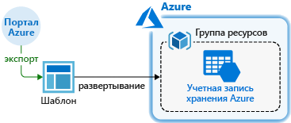
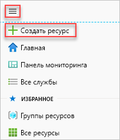
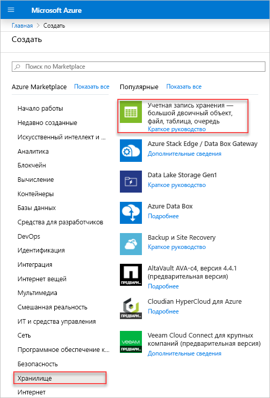
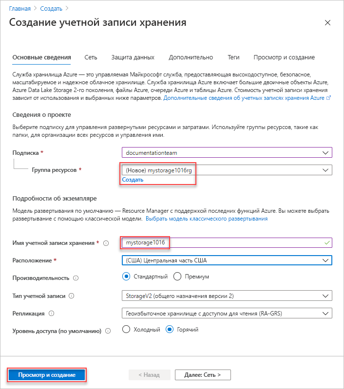
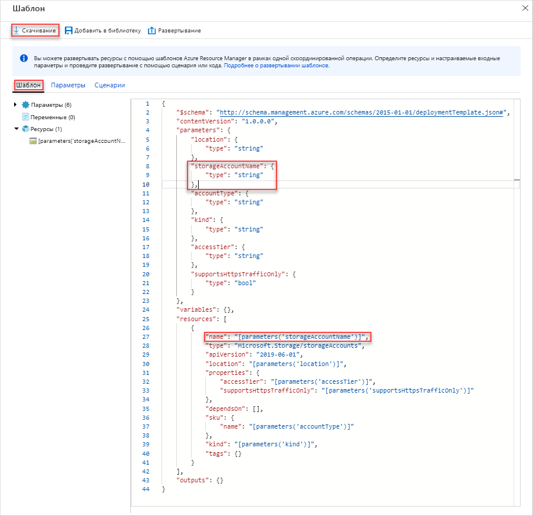
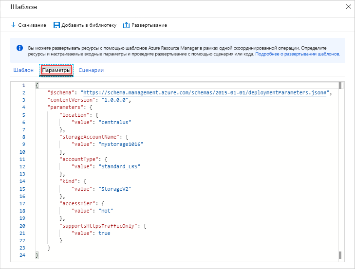
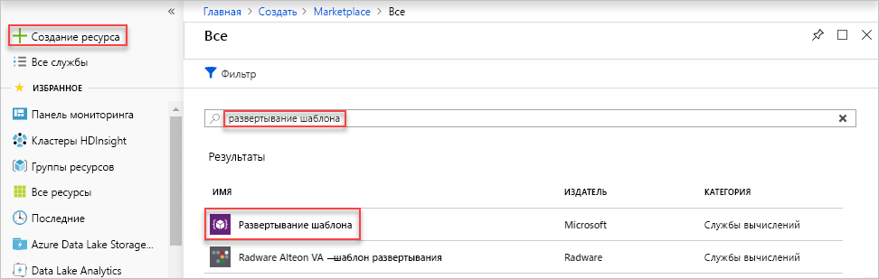
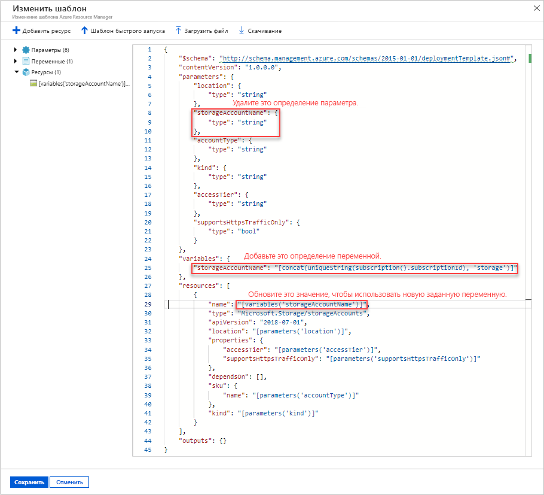
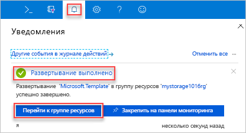
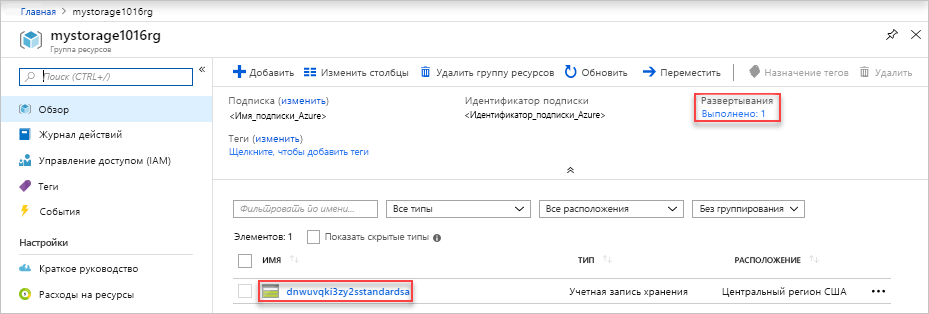

# <a name="quickstart-create-and-deploy-arm-templates-by-using-the-azure-portal"></a>Краткое руководство. Создание и развертывание шаблонов ARM с помощью портала Azure

Узнайте, как создавать шаблон Azure Resource Manager (ARM) с помощью портала Azure, а также изменять и развертывать его на портале. Шаблоны ARM — это JSON-файлы, которые определяют ресурсы, необходимые для развертывания решения. Основные понятия, связанные с развертыванием и администрированием решений Azure, см. в статье с [общими сведениями о развертывании шаблонов](overview.md).



Изучив это руководство, вы развернете учетную запись службы хранилища Azure. Тем же способом развертывайте ресурсы Azure.

Если у вас еще нет подписки Azure, [создайте бесплатную учетную запись Azure](https://azure.microsoft.com/free/), прежде чем начинать работу.

## <a name="generate-a-template-using-the-portal"></a>Создание шаблона с помощью портала

Создание шаблона ARM с нуля является непростой задачей, особенно в том случае, если вы не знакомы с развертыванием Azure и форматом JSON. С помощью портала Azure можно настроить ресурс, например, учетную запись службы хранилища Azure. Перед развертыванием ресурса вы можете экспортировать конфигурацию в шаблон. Вы можете сохранить шаблон и использовать его в будущем.

Многие опытные разработчики шаблонов используют этот метод для создания шаблонов при попытке развернуть другие ресурсы Azure. Дополнительные сведения об экспорте шаблонов с помощью портала см. в разделе, посвященном [экспорту групп ресурсов в шаблоны](../management/manage-resource-groups-portal.md#export-resource-groups-to-templates). Вы также можете найти рабочий шаблон в разделе [Шаблоны быстрого запуска Azure](https://azure.microsoft.com/resources/templates/).

1. В веб-браузере перейдите на [портал Azure](https://portal.azure.com) и войдите.
1. В меню портала Azure выберите **Создать ресурс**.

    

1. Выберите **Хранилище** > **Учетная запись хранения**.

    
1. Введите следующие сведения:

    |Имя|Значение|
    |----|----|
    |**Группа ресурсов**|Выберите **Создать новый** и укажите имя выбранной группы ресурсов. На снимке экрана ниже группа ресурсов называется *mystorage1016rg*. Группа ресурсов Azure служит контейнером для ресурсов Azure. Она облегчает управление ресурсами Azure. |
    |**имя**;|Укажите уникальное имя учетной записи хранения. Учетная запись хранения должна быть уникальной в Azure и содержать только строчные буквы и цифры. Имя должно состоять из 3–24 символов. Если вы получаете сообщение об ошибке "Имя учетной записи хранения mystorage1016 уже занято", попробуйте использовать **&lt;ваше имя>хранилище&lt;сегодняшняя дата в формате ММДД>** , например **johndolestorage1016**. Дополнительные сведения см. в разделе [Правила именования и ограничения](/azure/architecture/best-practices/resource-naming).|

    Для остальных свойств можно использовать значения по умолчанию.

    

    > [!NOTE]
    > Перед развертыванием некоторые экспортированные шаблоны требуют изменений.

1. Выберите **Просмотр и создание** в нижней части экрана. При выполнении следующего шага не выбирайте **Создание**.
1. Выберите **Загрузить шаблон для автоматизации** в нижней части экрана. На портале отобразится созданный шаблон.

    

    Шаблон отображается на главной панели. Это файл JSON с шестью элементами верхнего уровня: `schema`, `contentVersion`, `parameters`, `variables`, `resources` и `output`. Дополнительные сведения см. в статье [Понимание структуры и синтаксиса шаблонов ARM](./template-syntax.md).

    В шаблоне определяются восемь параметров. Один из них — **storageAccountName**. На втором выделенном элементе на предыдущем снимке экрана показано, как ссылаться на этот параметр в шаблоне. В следующем разделе описано, как изменить шаблон, указав в нем имя созданной учетной записи хранения.

    В шаблоне определяется один ресурс Azure. Тип — `Microsoft.Storage/storageAccounts`. Рассмотрите, как определен ресурс и какова структура его определения.
1. В верхней части экрана выберите **Загрузить**.
1. Откройте загруженный ZIP-файл, а затем сохраните файл **template.json** на компьютере. В следующем разделе описано, как изменить шаблон с помощью средства развертывания шаблона.
1. Выберите вкладку **Параметры**, чтобы просмотреть заданные вами значения для параметров. Запишите эти значения, так как они понадобятся в следующем разделе при развертывании шаблона.

    

    Вы можете создать ресурс (в этом учебнике учетную запись хранения Azure), используя как файл шаблона, так и файл параметров.

## <a name="edit-and-deploy-the-template"></a>Редактирование и развертывание шаблона

Портал Azure может использоваться для выполнения базовых операций изменения шаблона. В этом кратком руководстве используется средство портала с именем *Развертывание шаблона*. *Развертывание шаблона* используется в этом руководстве, поэтому можно изучить все руководство с помощью одного интерфейса — портала Azure. Чтобы изменить более сложный шаблон, используйте [Visual Studio Code](quickstart-create-templates-use-visual-studio-code.md) с широкими возможностями редактирования.

> [!IMPORTANT]
> Средство "Развертывание шаблона" предоставляет интерфейс для тестирования простых шаблонов. Мы не советуем использовать эту функцию в рабочей среде. Вместо этого храните свои шаблоны в учетной записи хранения Azure или репозитории исходного кода, таком как GitHub.

В Azure требуется, чтобы каждая служба Azure имела уникальное имя. Развертывание может завершится сбоем, если ввести уже существующее имя учетной записи. Чтобы избежать этой проблемы, измените шаблон для использования вызова функции шаблона `uniquestring()`, чтобы создать уникальное имя учетной записи хранения.

1. В меню портала Azure в поле поиска введите **развернуть**, а затем выберите **Развернуть настраиваемый шаблон**.

    

1. Выберите **Создать собственный шаблон в редакторе**.
1. Выберите **Загрузка файла** и выполните инструкции, чтобы загрузить файл template.json, скачанный вами в предыдущем разделе.
1. Внесите в шаблон следующие три изменения:

    

   - Удалите параметр **storageAccountName**, как показано на предыдущем снимке экрана.
   - Добавьте одну переменную с именем **storageAccountName**, как показано на предыдущем снимке экрана:

       ```json
       "storageAccountName": "[concat(uniqueString(subscription().subscriptionId), 'storage')]"
       ```

       Здесь используются две функции шаблона: `concat()` и `uniqueString()`.
   - Обновите элемент name ресурса **Microsoft.Storage/storageAccounts**, чтобы использовать новую заданную переменную вместо параметра:

       ```json
       "name": "[variables('storageAccountName')]",
       ```

     Окончательная версия шаблона должна выглядеть так:

     ```json
     {
       "$schema": "http://schema.management.azure.com/schemas/2015-01-01/deploymentTemplate.json#",
       "contentVersion": "1.0.0.0",
       "parameters": {
         "location": {
           "type": "string"
         },
         "accountType": {
           "type": "string"
         },
         "kind": {
           "type": "string"
         },
         "accessTier": {
           "type": "string"
         },
         "minimumTlsVersion": {
           "type": "string"
         },
         "supportsHttpsTrafficOnly": {
          "type": "bool"
         },
         "allowBlobPublicAccess": {
           "type": "bool"
         }
       },
       "variables": {
         "storageAccountName": "[concat(uniqueString(subscription().subscriptionId), 'storage')]"
       },
       "resources": [
         {
           "name": "[variables('storageAccountName')]",
           "type": "Microsoft.Storage/storageAccounts",
           "apiVersion": "2019-06-01",
           "location": "[parameters('location')]",
           "properties": {
             "accessTier": "[parameters('accessTier')]",
             "minimumTlsVersion": "[parameters('minimumTlsVersion')]",
             "supportsHttpsTrafficOnly": "[parameters('supportsHttpsTrafficOnly')]",
             "allowBlobPublicAccess": "[parameters('allowBlobPublicAccess')]"
           },
           "dependsOn": [],
           "sku": {
             "name": "[parameters('accountType')]"
           },
           "kind": "[parameters('kind')]",
           "tags": {}
         }
       ],
       "outputs": {}
     }
     ```

1. Щелкните **Сохранить**.
1. Введите следующие значения.

    |Имя|Значение|
    |----|----|
    |**Группа ресурсов**|Выберите имя группы ресурсов, созданной в предыдущем разделе. |
    |**Регион**|Выберите расположение группы ресурсов. Например, **центральная часть США**. |
    |**Расположение**|Выберите расположение учетной записи хранения. Например, **центральная часть США**. |
    |**Тип учетной записи**|В нашем примере используется **Standard_LRS**. |
    |**Вид**|В нашем примере используется **StorageV2**. |
    |**Уровень доступа**|В нашем примере используется **Горячий**. |
    |**Минимальная версия TLS**|Введите **TLS1_0**. |
    |**Supports Https Traffic Only** (Поддержка только трафика HTTPS)| В нашем примере используется значение **true**. |
    |**Allow Blob Public Access** (Разрешить общий доступ к BLOB-объектам)| Для этого краткого руководства выберите **false**. |

1. Выберите **Review + create** (Просмотреть и создать).
1. Нажмите кнопку **создания**.
1. Чтобы просмотреть состояние развертывания, щелкните значок колокольчика (уведомления) в верхней части экрана. Появится уведомление **Выполняется развертывание**. Подождите, пока развертывание завершится.

    

1. Выберите **Перейти к группе ресурсов** в области уведомлений. Появится приблизительно такой экран:

    

    Вы увидите, что развертывание выполнено успешно и что в группе ресурсов есть только одна учетная запись хранения. Имя учетной записи хранения — это уникальная строка, созданная с помощью шаблона. Дополнительные сведения об использовании учетных записях хранения Azure см. в статье [Краткое руководство. Передача, скачивание и составление списка больших двоичных объектов с помощью портала Azure](../../storage/blobs/storage-quickstart-blobs-portal.md).

## <a name="clean-up-resources"></a>Очистка ресурсов

Если ресурсы Azure больше не нужны, их можно удалить. Для этого необходимо удалить группу ресурсов.

1. На портале Azure в меню слева выберите **Группа ресурсов**.
1. В поле **Фильтровать по имени** введите имя группы ресурсов.
1. Выберите имя группы ресурсов.  В группе ресурсов должна быть учетная запись хранения.
1. В главном меню выберите **Удалить группу ресурсов**.

## <a name="next-steps"></a>Дальнейшие действия

Из этого руководства вы узнали, как создавать и развертывать шаблоны на портале Azure. В этом кратком руководстве используется простой шаблон с одним ресурсом Azure. Если шаблон является сложным, для его разработки удобнее использовать Visual Studio Code или Visual Studio. Дополнительные сведения о разработке шаблонов см. в новой серии

> [!div class="nextstepaction"]
> [руководств для начинающих](./template-tutorial-create-first-template.md).
