# <a name="quickstart-create-azure-resource-manager-templates-with-visual-studio-code"></a>Краткое руководство. Создание шаблонов Azure Resource Manager c помощью Visual Studio Code

Средства Azure Resource Manager для Visual Studio Code предоставляют языковую поддержку, фрагменты ресурсов и функцию автозавершения ресурсов. Эти средства помогают создавать и проверять шаблоны Azure Resource Manager. В этом кратком руководстве вы будете использовать расширение, чтобы создать шаблон Azure Resource Manager с нуля. При этом вы воспользуетесь возможностями расширений, например фрагментами кода шаблона Resource Manager, функциями проверки и завершения, а также поддержкой файла параметров.

Для работы с этим кратким руководством вам необходимо установить [Visual Studio Code](https://code.visualstudio.com/) с [расширением средств Azure Resource Manager](https://marketplace.visualstudio.com/items?itemName=msazurermtools.azurerm-vscode-tools). Вам также потребуется установить и аутентифицировать [Azure CLI](/cli/azure/?view=azure-cli-latest) или [модуль Azure PowerShell](/powershell/azure/new-azureps-module-az?view=azps-3.7.0).

Если у вас еще нет подписки Azure, [создайте бесплатную учетную запись Azure](https://azure.microsoft.com/free/), прежде чем начинать работу.

## <a name="create-an-arm-template"></a>Создание шаблона Resource Manager

Создайте и откройте файл *azuredeploy.json* с помощью Visual Studio Code. Введите `arm` в редактор кода, который инициирует фрагмент кода Azure Resource Manager для формирования шаблона Resource Manager.

Выберите `arm!`, чтобы создать шаблон для развертывания группы ресурсов Azure.


В этом фрагменте кода создаются стандартные блоки для шаблона Resource Manager.

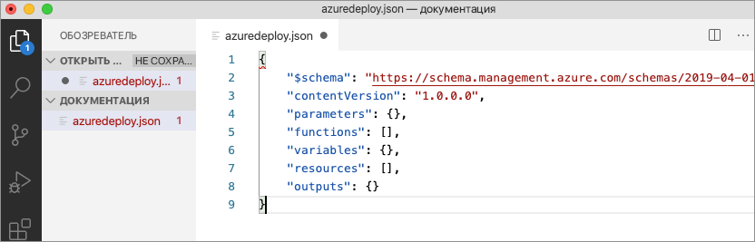

Обратите внимание, что языковой режим Visual Studio Code изменился с *JSON* на *шаблон Azure Resource Manager*. Расширение включает в себя языковой сервер, который предоставляет возможности проверки и завершения, и другие языковые службы, предназначенные для шаблонов Resource Manager.

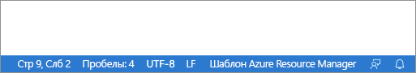

## <a name="add-an-azure-resource"></a>Добавление ресурса Azure

Расширение содержит фрагменты кода для многих ресурсов Azure. С помощью этих фрагментов кода можно легко добавить ресурсы к развертыванию шаблона.

Поместите курсор в блок **ресурсов** шаблона, введите `storage` и выберите фрагмент кода *arm-storage*.

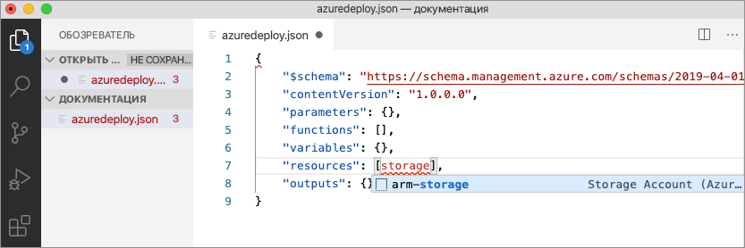

В результате этого действия в шаблон будет добавлен ресурс хранилища.

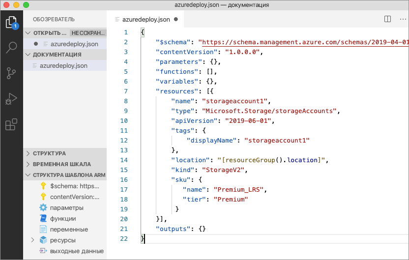

Вы можете переключаться между настраиваемыми свойствами в учетной записи хранения с помощью клавиши **TAB**.

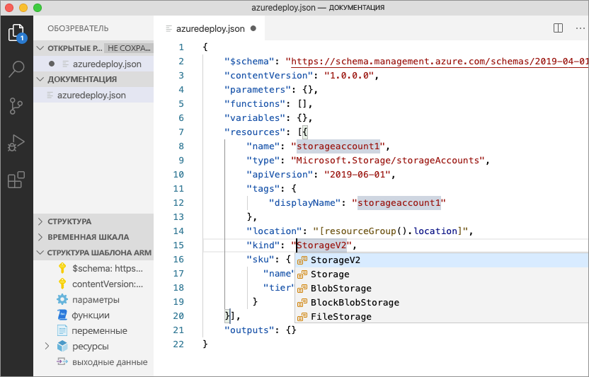

## <a name="completion-and-validation"></a>Завершение и проверка

Одной из наиболее мощных возможностей расширения является интеграция со схемами Azure. Схемы Azure предоставляют расширения с возможностями проверки и завершения ресурсов. Давайте изменим учетную запись хранения, чтобы увидеть возможности проверки и завершения в действии. 

Сначала задайте для типа учетной записи хранения недопустимое значение, например `megaStorage`. Обратите внимание, что в результате этого действия появится предупреждение, уведомляющее, что `megaStorage` не является допустимым значением.

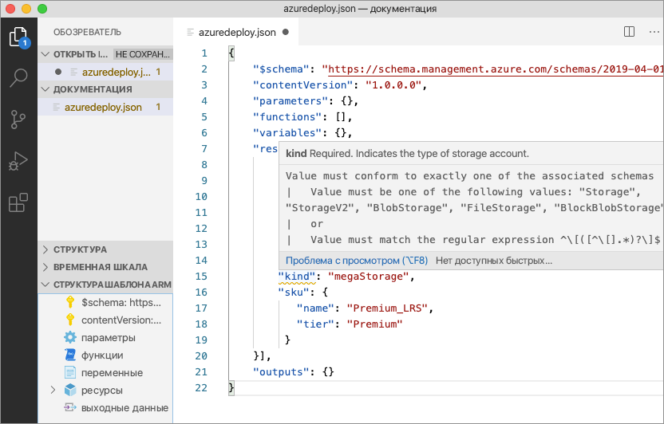

Чтобы использовать возможности завершения, удалите `megaStorage`, поместите курсор внутри двойных кавычек и нажмите `ctrl` + `space`. Отобразится список завершения допустимых значений.

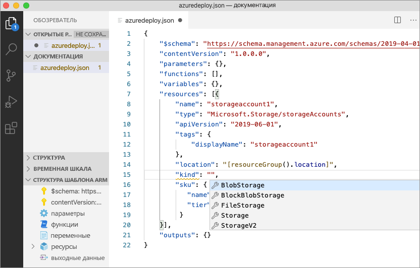

## <a name="add-template-parameters"></a>Добавление параметров шаблона

Теперь создайте параметр и воспользуйтесь им, чтобы указать имя учетной записи хранения.

Поместите курсор в блок параметров, добавьте символ возврата каретки, введите `"`, а затем выберите фрагмент кода `new-parameter`. В шаблон будет добавлен универсальный параметр.

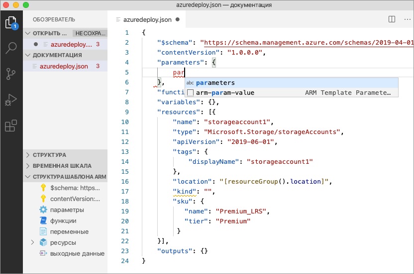

Измените имя параметра на `storageAccountName`, а описание на `Storage Account Name`.

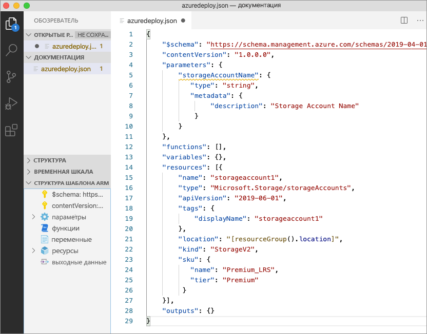

Минимальная длина имен учетных записей хранения Azure — 3 символа, а максимальная — 24. Добавьте в параметр `minLength` и `maxLength`, а затем укажите соответствующие значения.

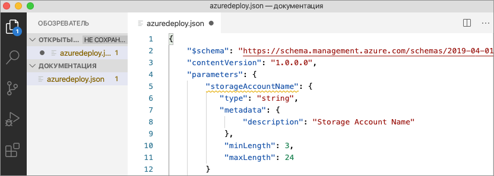

Теперь обновите свойство Name в ресурсе хранилища, чтобы использовать параметр. Для этого удалите текущее имя. Введите двойные кавычки и открывающуюся квадратную скобку `[`, которая вызывает список функций шаблона Resource Manager. В списке выберите *parameters*. 

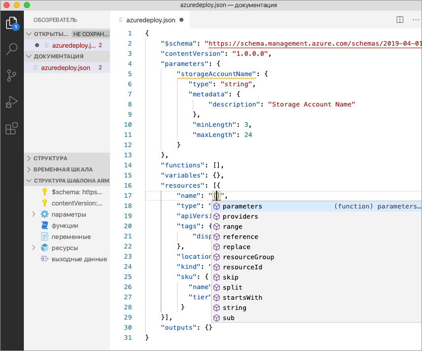

Если ввести одинарную кавычку `'` внутри круглых скобок, откроется список всех параметров, определенных в шаблоне, в данном случае — *storageAccountName*. Выберите параметр.

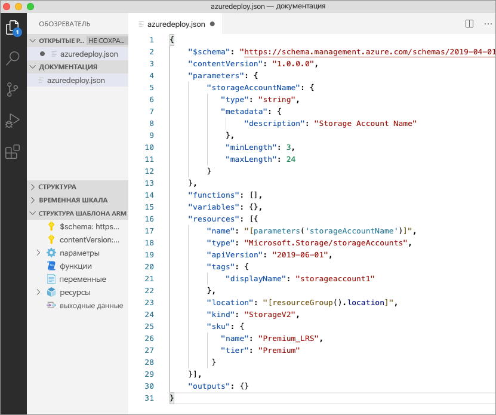

## <a name="create-a-parameter-file"></a>Создание файла параметров

Файл параметров шаблона Resource Manager позволяет сохранять значения параметров среды и передавать их в виде группы во время развертывания. Например, у вас может быть один файл параметров со значениями для конкретной тестовой среды, а второй — для рабочей среды.

Расширение позволяет легко создавать файл параметров на основе имеющихся шаблонов. Для этого щелкните правой кнопкой мыши шаблон в редакторе кода и выберите `Select/Create Parameter File`.

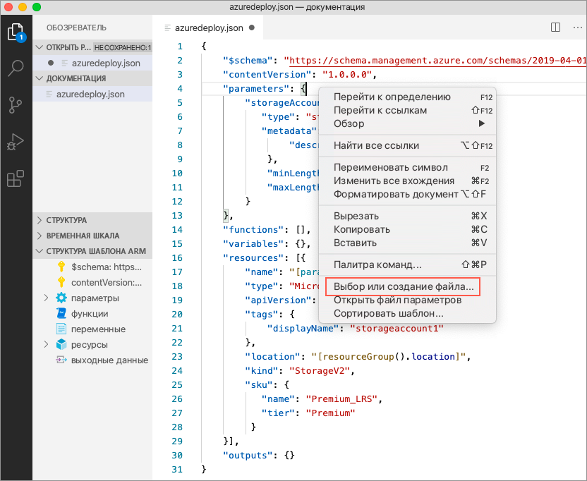

Щелкните `New` > `All Parameters`, а затем выберите имя и расположение файла параметров.

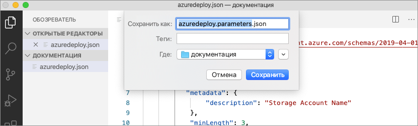

В результате этого действия будет создан файл параметров, который затем сопоставляется с шаблоном, на основе которого он был создан. Вы можете выбрать параметр, чтобы просмотреть и изменить текущий шаблон и сопоставление файла параметров в строке состояния Visual Studio Code.

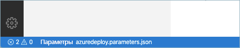

Теперь, когда файл параметров сопоставлен с шаблоном, расширение проверит шаблон и файл параметров вместе. Чтобы увидеть эту проверку на практике, добавьте двухсимвольное значение в параметр `storageAccountName` в файле параметров и сохраните файл.

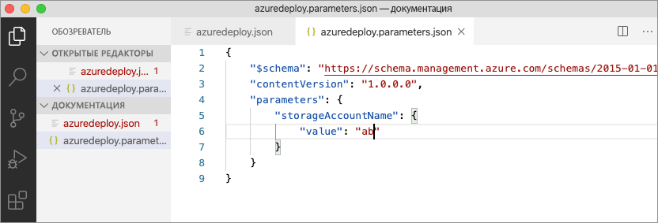

Вернитесь к шаблону Resource Manager и обратите внимание, что возникла ошибка, указывающая, что значение не соответствует критериям параметра.

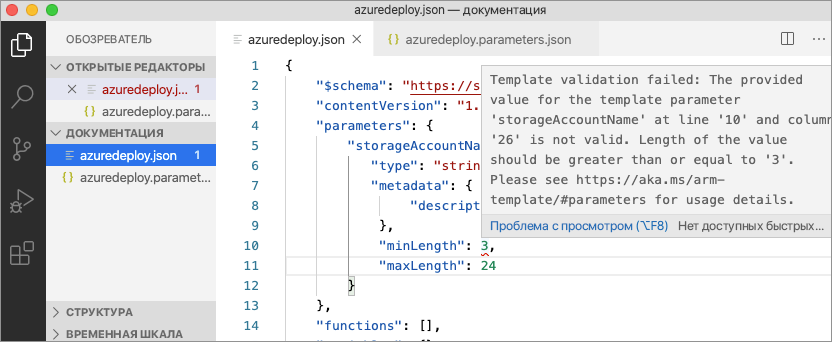

Установите соответствующее значение, сохраните файл и вернитесь к шаблону. Обратите внимание, что ошибка в параметре устранена.

## <a name="deploy-the-template"></a>Развертывание шаблона

Откройте встроенный терминал Visual Studio Code, используя сочетание клавиш `ctrl` + ```` ` ````, и разверните шаблон с помощью Azure CLI или модуля Azure PowerShell.

# <a name="cli"></a>[CLI](#tab/CLI)

```azurecli
az group create --name arm-vscode --location eastus

az deployment group create --resource-group arm-vscode --template-file azuredeploy.json --parameters azuredeploy.parameters.json
```

# <a name="powershell"></a>[PowerShell](#tab/PowerShell)

```azurepowershell
New-AzResourceGroup -Name arm-vscode -Location eastus

New-AzResourceGroupDeployment -ResourceGroupName arm-vscode -TemplateFile ./azuredeploy.json -TemplateParameterFile ./azuredeploy.parameters.json
```
---

## <a name="clean-up-resources"></a>Очистка ресурсов

Если ресурсы Azure больше не нужны, используйте Azure CLI или модуль Azure PowerShell, чтобы удалить группу ресурсов, созданную для краткого руководства.

# <a name="cli"></a>[CLI](#tab/CLI)

```azurecli
az group delete --name arm-vscode
```

# <a name="powershell"></a>[PowerShell](#tab/PowerShell)

```azurepowershell
Remove-AzResourceGroup -Name arm-vscode
```
---

## <a name="next-steps"></a>Дальнейшие действия

> [!div class="nextstepaction"]
> [руководств для начинающих](./template-tutorial-create-first-template.md).
