# <a name="creating-and-deploying-azure-resource-groups-through-visual-studio"></a>Создание и развертывание групп ресурсов Azure с помощью Visual Studio

С помощью Visual Studio можно создать проект для развертывания инфраструктуры и кода в Azure. Например, вы можете развернуть веб-узел, веб-сайт и код для веб-сайта. Visual Studio предоставляет разные начальные шаблоны для распространенных сценариев развертывания. В этой статье показано, как развернуть веб-приложение.

В этой статье показано, как использовать [Visual Studio 2019 или более поздней версии для разработки Azure и установленных рабочих нагрузок ASP.NET](/visualstudio/install/install-visual-studio?view=vs-2019). Использование Visual Studio 2017 в основном такое же.

## <a name="create-azure-resource-group-project"></a>Создание проекта группы ресурсов Azure

В этом разделе будет создан проект группы ресурсов Azure с помощью шаблона **Веб-приложение**.

1. В Visual Studio выберите **Файл**>**Создать**>**Проект**.
1. Выберите шаблон проекта **группы ресурсов Azure** и нажмите кнопку **Далее**.

    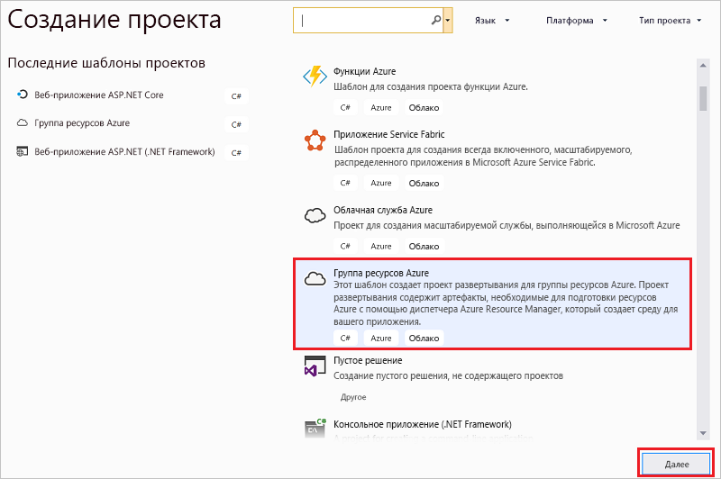

1. Дайте имя вашему проекту. Другие настройки по умолчанию, вероятно, подойдут, но проверьте их функционирование в вашей среде. Затем выберите **Создать**.

    

1. Выберите шаблон, который вы намерены развернуть в диспетчере ресурсов Azure. Обратите внимание, что доступны разные варианты, основывающиеся на типе проекта, который вы хотите развернуть. В этом примере следует выбрать шаблон **Веб-приложение** и нажать кнопку **ОК**.

    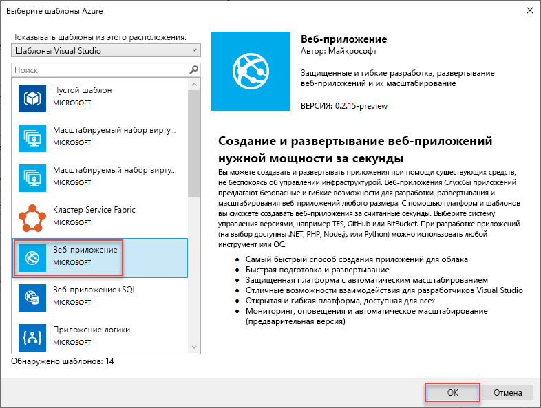

    Выбор шаблона — это просто отправная точка. Вы можете добавлять и удалять ресурсы для реализации своего сценария.

1. Visual Studio создает проект развертывания группы ресурсов для веб-приложения. Чтобы увидеть файлы для вашего проекта, посмотрите на узел в проекте развертывания.

    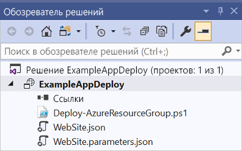

    Так как вы выбрали шаблон "Веб-приложение", отобразятся указанные ниже файлы.

   | Имя файла | ОПИСАНИЕ |
   | --- | --- |
   | Deploy-AzureResourceGroup.ps1 |Сценарий PowerShell, вызывающий команды PowerShell для развертывания в Azure Resource Manager. Visual Studio использует этот скрипт PowerShell для развертывания шаблона. |
   | WebSite.json |Шаблон Resource Manager, определяющий инфраструктуру, которую требуется развернуть в Azure, и параметры, которые можно указать во время развертывания. Кроме того, он определяет зависимости между ресурсами, благодаря чему Resource Manager развертывает их в правильном порядке. |
   | WebSite.parameters.json |Файл параметров, который содержит значения, необходимые для шаблона. Это значения, передаваемые для настройки каждого развертывания. |

    Все проекты развертывания группы ресурсов содержат эти основные файлы. Другие проекты могут содержать дополнительные файлы для поддержки других функциональных возможностей.

## <a name="customize-resource-manager-template"></a>Настройка шаблона Resource Manager

Вы можете настроить проект развертывания, изменив шаблон Resource Manager, описывающий ресурсы, которые требуется развернуть. Сведения об элементах шаблона Resource Manager см. в статье [Создание шаблонов диспетчера ресурсов Azure](resource-group-authoring-templates.md).

1. Для работы с шаблоном откройте файл **WebSite.json**.

1. Редактор Visual Studio предоставляет средства, которые помогают изменить шаблон Resource Manager. Окно **Структура JSON** упрощает просмотр элементов, определенных в шаблоне.

   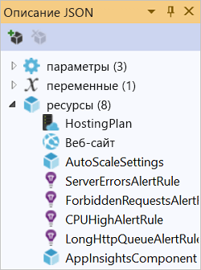

1. Выберите элемент в структуре, чтобы перейти к этой части шаблона.

   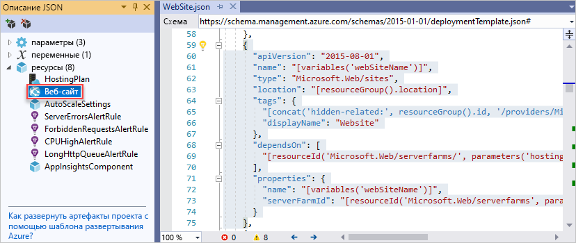

1. Можно добавить новый ресурс, нажав кнопку **Добавить ресурс** в верхней части окна структуры JSON. Или же можно щелкнуть правой кнопкой мыши элемент **Ресурсы** и выбрать команду **Добавить новый ресурс**.

   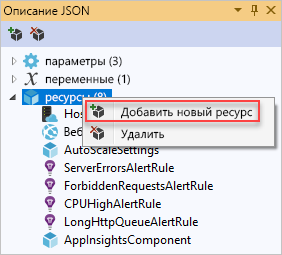

1. Выберите **Учетная запись хранения** и укажите имя. Имя учетной записи хранения должно содержать только цифры и строчные буквы, а длина не должна превышать 11 символов.

   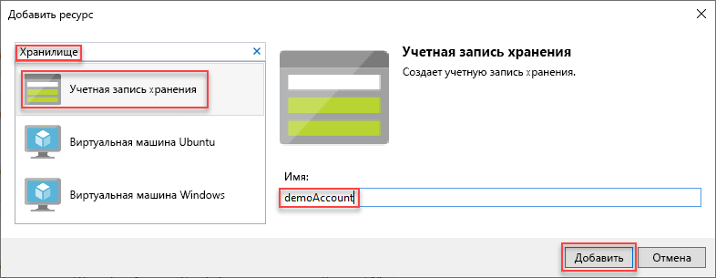

1. Обратите внимание, что добавляется не только ресурс: для типа учетной записи хранения также будет добавлен параметр, а для ее имени — переменная.

   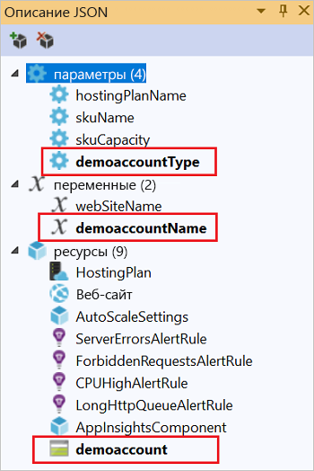

1. В параметре для типа учетной записи хранения предварительно определяются допустимые типы и тип по умолчанию. Вы можете использовать эти значения или изменить их для своего сценария. Если требуется ограничить доступ к развертыванию учетной записи хранения **Premium_LRS** с помощью этого шаблона, то удалите его из списка допустимых типов.

   ```json
   "demoaccountType": {
     "type": "string",
     "defaultValue": "Standard_LRS",
     "allowedValues": [
       "Standard_LRS",
       "Standard_ZRS",
       "Standard_GRS",
       "Standard_RAGRS"
     ]
   }
   ```

1. Кроме того, Visual Studio предоставляет шаблон IntelliSense, который определяет свойства, доступные при редактировании шаблона. Например, чтобы изменить свойства плана службы приложений, перейдите к ресурсу **HostingPlan** и задайте значение для параметра **properties**. Обратите внимание, что в шаблоне IntelliSense отображаются доступные значения, а также приводится описание каждого значения.

   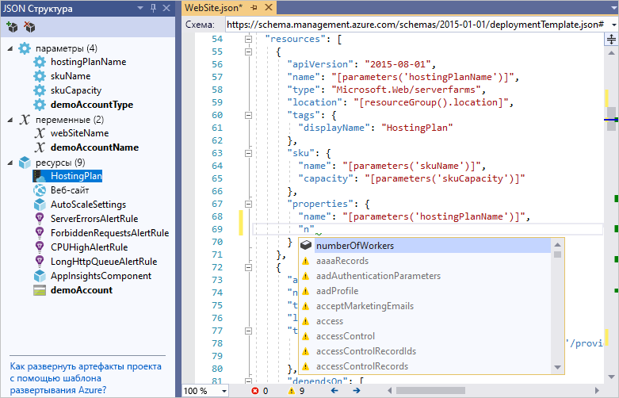

   Можно задать для параметра **numberOfWorkers** значение 1 и сохранить файл.

   ```json
   "properties": {
     "name": "[parameters('hostingPlanName')]",
     "numberOfWorkers": 1
   }
   ```

1. Откройте файл **WebSite.parameters.json**. Файл параметров используется для передачи во время развертывания значений, на основе которых настраивается развертываемый ресурс. Дайте имя плану размещения и сохраните файл.

   ```json
   {
     "$schema": "https://schema.management.azure.com/schemas/2015-01-01/deploymentParameters.json#",
     "contentVersion": "1.0.0.0",
     "parameters": {
       "hostingPlanName": {
         "value": "demoHostPlan"
       }
     }
   }
   ```

## <a name="deploy-project-to-azure"></a>Развертывание проекта в Azure

Теперь все готово для развертывания проекта в группе ресурсов.

По умолчанию скрипт PowerShell (Deploy-AzureResourceGroup.ps1) в проекте использует модуль AzureRM. Если у вас все еще установлен модуль AzureRM и вы хотите продолжить его использование, можно воспользоваться этим скриптом по умолчанию. При использовании этого скрипта можно развернуть свое решение с помощью интерфейса Visual Studio.

Однако, если вы перешли на новый модуль [Az](/powershell/azure/new-azureps-module-az), в проект нужно добавить новый скрипт. Чтобы добавить скрипт, использующий модуль Az, скопируйте скрипт [Deploy-AzTemplate.ps1](https://github.com/Azure/azure-quickstart-templates/blob/master/Deploy-AzTemplate.ps1) и добавьте его в свой проект. Чтобы использовать этот скрипт для развертывания, необходимо запустить его из консоли PowerShell, а не через интерфейс развертывания Visual Studio.

В этой статье описаны оба подхода. В этой статье скрипт по умолчанию называется скриптом модуля AzureRM, а новый скрипт — скриптом модуля Az.

### <a name="az-module-script"></a>Скрипт модуля Az

Для скрипта модуля Az откройте консоль PowerShell и запустите:

```powershell
.\Deploy-AzTemplate.ps1 -ArtifactStagingDirectory . -Location centralus -TemplateFile WebSite.json -TemplateParametersFile WebSite.parameters.json
```

### <a name="azurerm-module-script"></a>Скрипт модуля AzureRM

Для скрипта модуля AzureRM используйте Visual Studio:

1. В контекстном меню узла проекта развертывания последовательно выберите пункты **Развернуть** > **Новое**.

    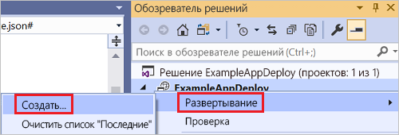

1. Откроется диалоговое окно **Развертывание в группе ресурсов** . В раскрывающемся списке **Группа ресурсов** выберите существующую группу ресурсов или создайте новую. Выберите **Развернуть**.

    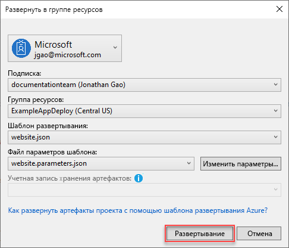

1. Состояние развертывания отображается в окне **Выходные данные** . После успешного завершения развертывания появится примерно такое сообщение:

   ```output
   18:00:58 - Successfully deployed template 'website.json' to resource group 'ExampleAppDeploy'.
   ```

## <a name="view-deployed-resources"></a>Отображение развернутых ресурсов

Давайте проверим результаты.

1. Откройте в браузере [портал Azure](https://portal.azure.com/) и войдите в свою учетную запись. Чтобы просмотреть группу ресурсов, щелкните **Группы ресурсов** и укажите группу ресурсов, в которой выполнено развертывание.

1. Отобразятся все развернутые ресурсы. Обратите внимание, что имя учетной записи хранения не совпадает с именем, указанным во время добавления этого ресурса. Учетная запись хранения должна быть уникальной. Шаблон автоматически добавляет строку символов в предоставленное имя, чтобы сделать его уникальным.

    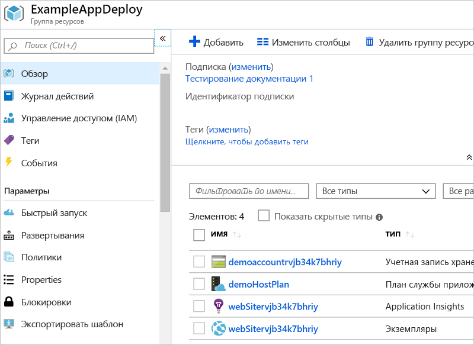

## <a name="add-code-to-project"></a>Добавление кода в проект

На этом этапе инфраструктура для приложения уже развернута, а фактический код для проекта — еще нет.

1. Добавьте проект в свое решение Visual Studio. Щелкните правой кнопкой мыши решение и выберите команду **Добавить** > **Новый проект**.

    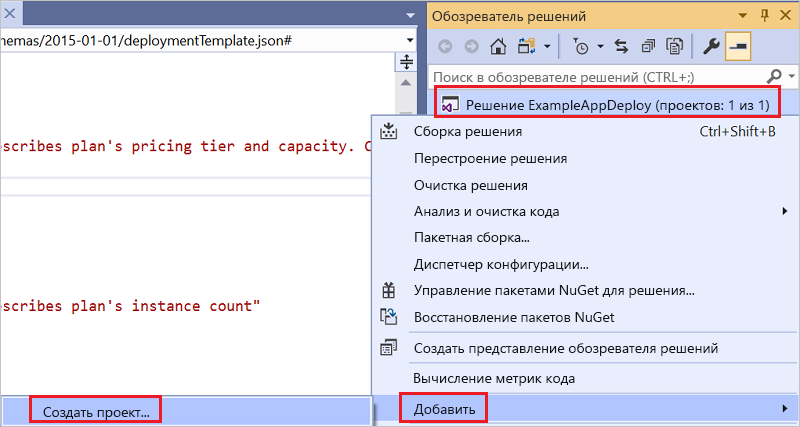

1. Добавьте **веб-приложение ASP.NET Core**.

    

1. Дайте вашему веб-приложению имя и нажмите кнопку **Создать**.

    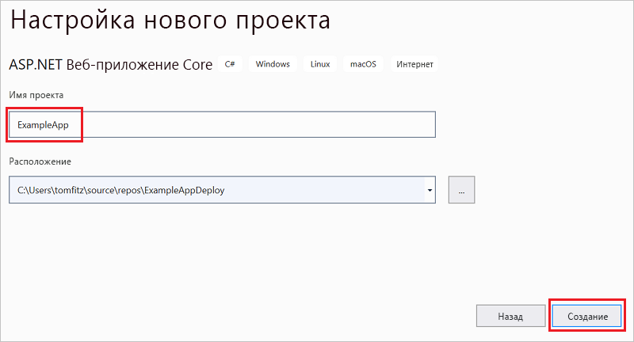

1. Выберите **Веб-приложение** и нажмите кнопку **Создать**.

    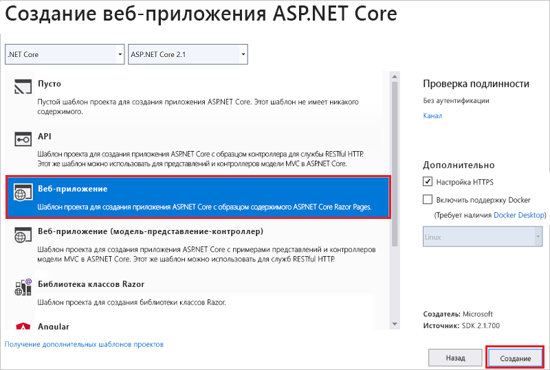

1. После создания веб-приложения в Visual Studio оба проекта отобразятся в решении.

    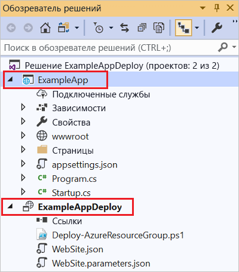

1. Теперь нужно убедиться, что проект группы ресурсов уведомлен о новом проекте. Вернитесь к проекту группы ресурсов (ExampleAppDeploy). Щелкните правой кнопкой мыши **Ссылки** и выберите **Добавить ссылку**.

    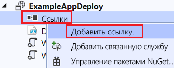

1. Выберите созданный проект веб-приложения.

   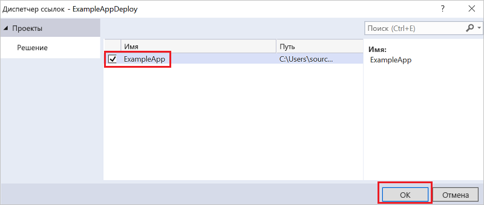

   Добавляя ссылку, вы связываете проект веб-приложения с проектом группы ресурсов и автоматически задаете ряд свойств. Свойства отображаются в окне **Свойства** для ссылки. Свойство **Include File Path** (Включать путь к файлу) содержит путь к расположению, в котором будет создан пакет. Обратите внимание на папку (ExampleApp) и файл (package.zip). Эти значения необходимо знать, так как их нужно указывать при развертывании приложения.

   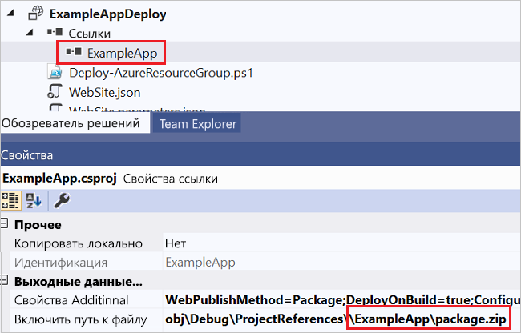

1. Вернитесь к шаблону WebSite.json и добавьте ресурс в шаблон.

    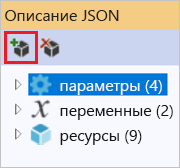

1. На этот раз выберите **Веб-развертывание для веб-приложений**.

    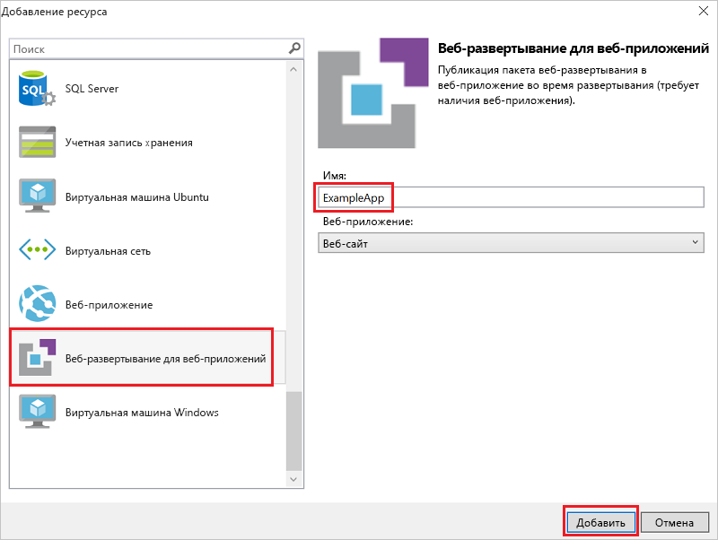

   Сохраните свой шаблон.

1. В вашем шаблоне есть несколько новых параметров. Они были добавлены на предыдущем этапе. Вам не нужно задавать значения для параметров **_artifactsLocation** или **_artifactsLocationSasToken**, так как эти значения создаются автоматически. Тем не менее, вы должны задать папку и имя файла, соответствующие пути, по которому расположен пакет развертывания. Имена этих параметров заканчиваются на **PackageFolder** и **PackageFileName**. Первая часть имени — это имя добавленного вами ресурса веб-развертывания. В этой статье они названы **ExampleAppPackageFolder** и **ExampleAppPackageFileName**.

   Откройте файл **Website.parameters.json** и установите для этих параметров значения, которые вы видели в справочных свойствах. Задайте для параметра **ExampleAppPackageFolder** имя папки. Задайте для параметра **ExampleAppPackageFileName** имя ZIP-файла.

   ```json
   {
     "$schema": "https://schema.management.azure.com/schemas/2015-01-01/deploymentParameters.json#",
     "contentVersion": "1.0.0.0",
     "parameters": {
       "hostingPlanName": {
         "value": "demoHostPlan"
       },
       "ExampleAppPackageFolder": {
         "value": "ExampleApp"
       },
       "ExampleAppPackageFileName": {
         "value": "package.zip"
       }
     }
   }
   ```

## <a name="deploy-code-with-infrastructure"></a>Развертывание кода с инфраструктурой

Так как вы добавили код в проект, на этот раз ваше развертывание немного отличается. Во время развертывания разместите артефакты для проекта в расположении, к которому сможет обращаться Resource Manager. Артефакты размещаются в учетной записи хранения.

### <a name="az-module-script"></a>Скрипт модуля Az

Если вы используете скрипт модуля Az, вам нужно внести одно небольшое изменение в свой шаблон. Этот скрипт добавляет косую черту к расположению артефактов, но ваш шаблон не ожидает такой косой черты. Откройте файл WebSite.json и найдите свойства для расширения MSDeploy. Он содержит свойство с именем **packageUri**. Удалите косую черту между расположением артефактов и папкой пакета.

Результат будет выглядеть так:

```json
"packageUri": "[concat(parameters('_artifactsLocation'), parameters('ExampleAppPackageFolder'), '/', parameters('ExampleAppPackageFileName'), parameters('_artifactsLocationSasToken'))]",
```

Обратите внимание, что в предыдущем примере нет `'/',` между параметрами **parameters('_artifactsLocation')** и **parameters('ExampleAppPackageFolder')** .

Выполните повторную сборку проекта. Сборка проекта гарантирует, что файлы, которые нужно развернуть, будут добавлены в промежуточную папку.

Теперь откройте консоль PowerShell и запустите:

```powershell
.\Deploy-AzTemplate.ps1 -ArtifactStagingDirectory .\bin\Debug\staging\ExampleAppDeploy -Location centralus -TemplateFile WebSite.json -TemplateParametersFile WebSite.parameters.json -UploadArtifacts -StorageAccountName <storage-account-name>
```

### <a name="azurerm-module-script"></a>Скрипт модуля AzureRM

Для скрипта модуля AzureRM используйте Visual Studio:

1. Для повторного развертывания щелкните **Развернуть** и выберите группу ресурсов, которую вы развернули ранее.

    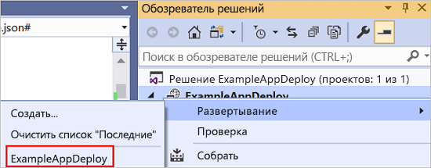

1. Для параметра **Учетная запись хранения артефактов** выберите учетную запись, развернутую в этой группе ресурсов.

   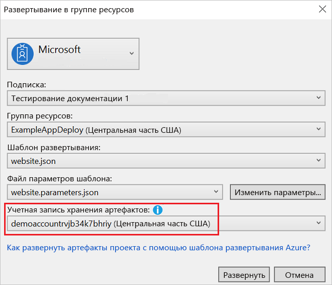

## <a name="view-web-app"></a>Просмотр веб-приложения

1. После завершения развертывания выберите веб-приложение на портале. Щелкните URL-адрес, чтобы перейти на сайт.

   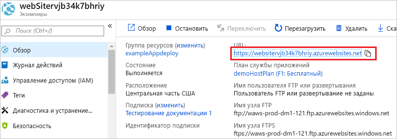

1. Приложение ASP.NET по умолчанию успешно развернуто.

   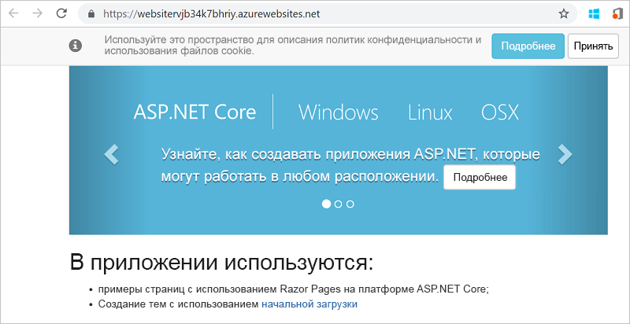

## <a name="add-operations-dashboard"></a>Добавление панели мониторинга операций

Вы можете использовать не только ресурсы, доступные через интерфейс Visual Studio. Развертывание можно настроить, добавив пользовательский ресурс в шаблон. Для отображения добавления ресурса следует добавить панель мониторинга операций, позволяющую управлять развертываемым ресурсом.

1. Откройте файл WebSite.json и добавьте следующий JSON после ресурса учетной записи хранения, но перед закрывающей скобкой `]` раздела ресурсов.

   ```json
    ,{
      "properties": {
        "lenses": {
          "0": {
            "order": 0,
            "parts": {
              "0": {
                "position": {
                  "x": 0,
                  "y": 0,
                  "colSpan": 4,
                  "rowSpan": 6
                },
                "metadata": {
                  "inputs": [
                    {
                      "name": "resourceGroup",
                      "isOptional": true
                    },
                    {
                      "name": "id",
                      "value": "[resourceGroup().id]",
                      "isOptional": true
                    }
                  ],
                  "type": "Extension/HubsExtension/PartType/ResourceGroupMapPinnedPart"
                }
              },
              "1": {
                "position": {
                  "x": 4,
                  "y": 0,
                  "rowSpan": 3,
                  "colSpan": 4
                },
                "metadata": {
                  "inputs": [],
                  "type": "Extension[azure]/HubsExtension/PartType/MarkdownPart",
                  "settings": {
                    "content": {
                      "settings": {
                        "content": "__Customizations__\n\nUse this dashboard to create and share the operational views of services critical to the application performing. To customize simply pin components to the dashboard and then publish when you're done. Others will see your changes when you publish and share the dashboard.\n\nYou can customize this text too. It supports plain text, __Markdown__, and even limited HTML like images  and <a href='https://azure.microsoft.com' target='_blank'>links</a> that open in a new tab.\n",
                        "title": "Operations",
                        "subtitle": "[resourceGroup().name]"
                      }
                    }
                  }
                }
              }
            }
          }
        },
        "metadata": {
          "model": {
            "timeRange": {
              "value": {
                "relative": {
                  "duration": 24,
                  "timeUnit": 1
                }
              },
              "type": "MsPortalFx.Composition.Configuration.ValueTypes.TimeRange"
            }
          }
        }
      },
      "apiVersion": "2015-08-01-preview",
      "name": "[concat('ARM-',resourceGroup().name)]",
      "type": "Microsoft.Portal/dashboards",
      "location": "[resourceGroup().location]",
      "tags": {
        "hidden-title": "[concat('OPS-',resourceGroup().name)]"
      }
    }
   ```

1. Заново разверните проект.

1. После завершения развертывания просмотрите панель мониторинга на портале. Щелкните **Панель мониторинга** и выберите ту, которую вы развернули.

   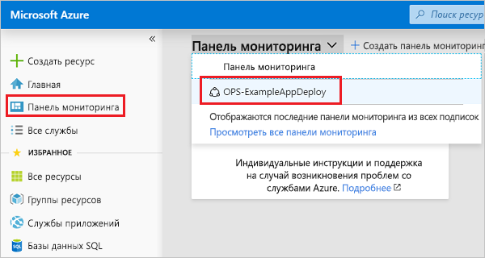

1. Вы увидите настроенную панель мониторинга.

   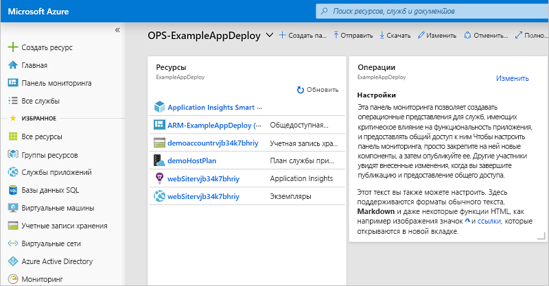

Доступом к панели мониторинга можно управлять с помощью групп RBAC. Кроме того, после развертывания панели мониторинга можно настроить ее внешний вид. Однако если вы повторно развернете группу ресурсов, панель мониторинга будет сброшена до значений по умолчанию в шаблоне. Дополнительные сведения о создании панелей мониторинга см. в статье [Создание панелей мониторинга Azure программными средствами](../azure-portal/azure-portal-dashboards-create-programmatically.md).

## <a name="clean-up-resources"></a>Очистка ресурсов

Если ресурсы Azure больше не нужны, их можно удалить. Для этого необходимо удалить группу ресурсов.

1. На портале Azure в меню слева выберите **Группы ресурсов**.

1. Выберите имя группы ресурсов.

1. В главном меню выберите **Удалить группу ресурсов**.

## <a name="next-steps"></a>Дополнительная информация

В этом кратком руководстве вы узнали, как создать и развернуть шаблоны с помощью Visual Studio. Дополнительные сведения о разработке шаблонов см. в новой серии

> [!div class="nextstepaction"]
> [руководств для начинающих](./template-tutorial-create-first-template.md).
