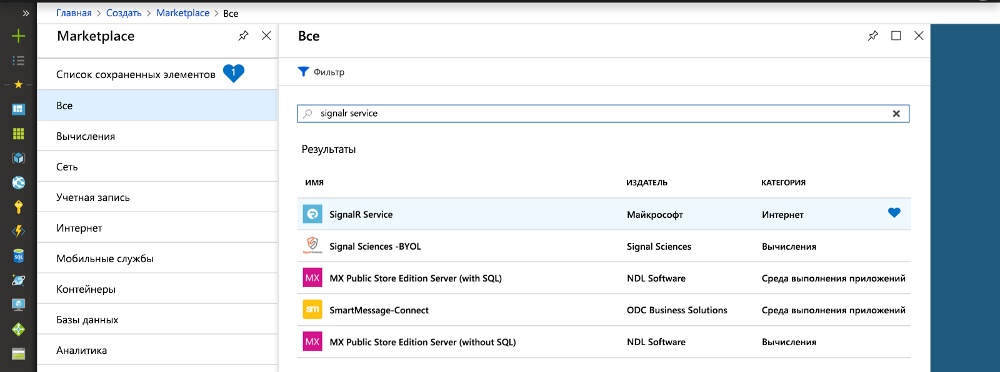
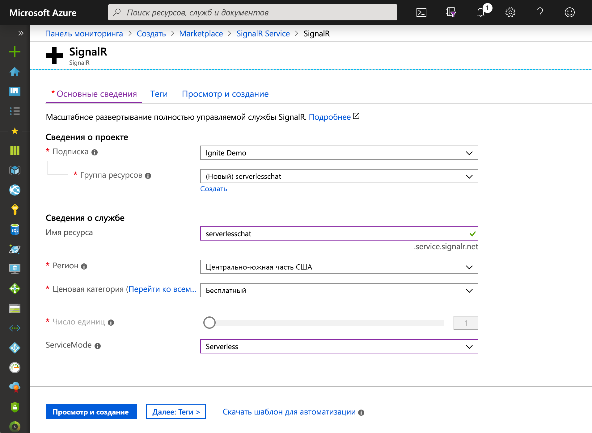

## Создание экземпляра службы Azure SignalR

Приложение будет подключено к экземпляру службы SignalR в Azure.

1. Нажмите кнопку "Создать" в верхнем левом углу портала Azure. На экране "Создание" введите в поле поиска *Служба SignalR* и нажмите клавишу ВВОД.

    

1. Выберите **Служба SignalR** в результатах поиска и щелкните **Создать**.

1. Введите следующие параметры.

    | Параметр      | Рекомендуемое значение  | ОПИСАНИЕ                                        |
    | ------------ |  ------- | -------------------------------------------------- |
    | **Имя ресурса** | Глобально уникальное имя | Имя, которое определяет новый экземпляр службы SignalR. Допустимые символы: `a-z`, `0-9` и `-`.  | 
    | **Подписка** | Ваша подписка | Подписка, в рамках которой создается экземпляр службы SignalR. | 
    | **[Группа ресурсов](../../azure-resource-manager/resource-group-overview.md)** |  myResourceGroup | Имя новой группы ресурсов, в которой будет создан экземпляр службы SignalR. | 
    | **Местоположение.** | Запад США | Выберите ближайший [регион](https://azure.microsoft.com/regions/). |
    | **Ценовая категория** | Free | Поработайте со службой Azure SignalR бесплатно. |
    | **Число единиц** |  Не применяется | Число единиц определяет количество подключений, которые поддерживает ваш экземпляр службы SignalR. Это можно настроить только для цен. категории "Стандартный". |

    

1. Щелкните **Создать**, чтобы начать развертывание экземпляра службы SignalR.