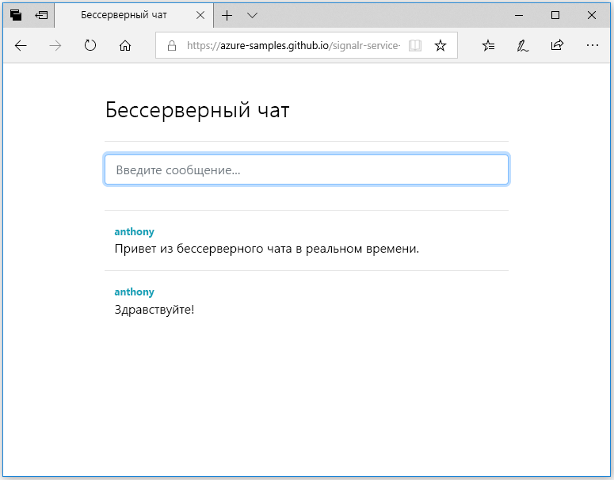

## Запуск веб-приложения

1. На платформе GitHub размещен пример одностраничного веб-приложения. Откройте в браузере [https://azure-samples.github.io/signalr-service-quickstart-serverless-chat/demo/chat/](https://azure-samples.github.io/signalr-service-quickstart-serverless-chat/demo/chat/).

    > [!NOTE]
    > Путь к исходному HTML-файлу: [/docs/demo/chat/index.html](https://github.com/Azure-Samples/signalr-service-quickstart-serverless-chat/blob/master/docs/demo/chat/index.html).

1. При запросе базового URL-адреса приложения-функции введите *http://localhost:7071*.

1. Введите имя пользователя при появлении запроса.

1. Веб-приложение вызывает функцию *GetSignalRInfo* в приложении-функции для получения сведений о подключении, чтобы подключиться к службе Azure SignalR. После установки подключения появится поле ввода сообщений чата.

1. Введите сообщение и нажмите клавишу ВВОД. Приложение отправляет сообщение в функцию *SendMessage* приложения-функции Azure, которое использует привязку для вывода SignalR, чтобы транслировать сообщение всем подключенным клиентам. Если все работает правильно, сообщение должно появиться в приложении.

    

1. Откройте другой экземпляр веб-приложения в новом окне браузера. Вы увидите, что все отправляемые сообщения отображаются во всех экземплярах приложения.