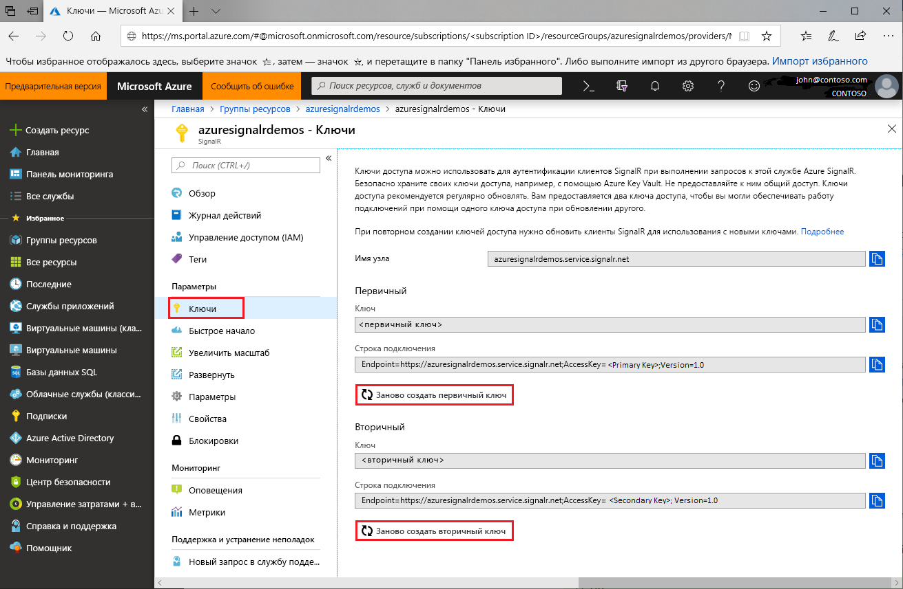

# Смена ключей доступа для Службы Azure SignalR

В каждом экземпляре Службы Azure SignalR есть пара ключей доступа, которые называются первичными и вторичными. Эти ключи используются для проверки подлинности клиентов SignalR при составлении запросов к службе. Они связаны с URL-адресом конечной точки экземпляра. Обеспечьте безопасность ключей и меняйте их регулярно. Вам предоставляются два ключа доступа, так что вы можете выполнять подключения с помощью одного из них во время обновления другого.

## Для чего менять ключи доступа?

По соображениям безопасности и для соблюдения требований соответствия разработчикам регулярно меняйте ключи доступа.

## Повторное создание ключей доступа

1. Войдите на [портал Azure](https://portal.azure.com/) со своими учетными данными.

1. Перейдите в раздел **Ключи** в экземпляре Службы Azure SignalR, для которого требуется повторно создать ключи.

1. Выберите **Ключи** в меню навигации.

1. Выберите **Повторно создать основной ключ** или **Повторно создать вторичный ключ**.

   Отобразится новая строка ключа и соответствующего подключения.

   

Вы также можете повторно создать ключи с помощью [Azure CLI](/cli/azure/ext/signalr/signalr/key?view=azure-cli-latest#ext-signalr-az-signalr-key-renew).

## Обновление конфигураций с помощью новых строк подключения

1. Скопируйте новую строку подключения.

1. Чтобы использовать новую строку подключения, обновите все конфигурации.

1. При необходимости перезапустите приложение.

## Принудительное повторное создание ключа доступа

В некоторых ситуациях Служба Azure SignalR может применять обязательное повторное создание ключа доступа. Клиенты получают уведомления службы по электронной почте и на портале. Если вы получили такое оповещение или произошел сбой службы из-за ключа доступа, смените ключи, следуя инструкциям из этого руководства.

## Дополнительная информация

По соображениям безопасности рекомендуется регулярно менять ключи доступа.

В этом руководстве вы узнали, как повторно создавать ключи доступа. Изучите следующие руководства, чтобы узнать больше о проверке подлинности с помощью OAuth или Функций Azure.

> [!div class="nextstepaction"]
> [Учебник по аутентификации службы Azure SignalR](./signalr-authenticate-oauth.md)

> [!div class="nextstepaction"]
> [Руководство по аутентификации в службе Azure SignalR с помощью Функций Azure](./signalr-authenticate-azure-functions.md)