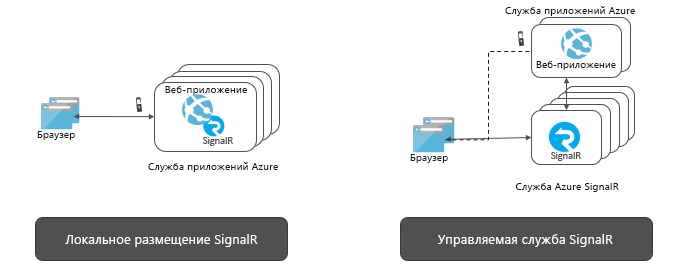

# Сведения о службе Azure SignalR

Azure SignalR — это служба, которая позволяет в реальном времени и без усилий добавлять в приложения веб-функции по протоколу HTTP. Функции, работающие в реальном времени, позволяют службе отправлять обновления содержимого в подключенные клиенты, например одностраничные веб-приложения и мобильные приложения. В результате клиенты обновляются без необходимости опроса сервера или отправки новых HTTP-запросов на обновления.

Эта статья содержит общие сведения о службе Azure SignalR.

## Для чего используется служба Azure SignalR?

Служба Azure SignalR может быть использована в любом сценарии, для которого требуется передача данных от сервера к клиенту в режиме реального времени.

Стандартные функции в режиме реального времени, которые часто требуют опроса сервера, также могут использовать службу Azure SignalR.

Службу Azure SignalR можно использовать в различных отраслях и для любых задач, для которых требуется обновление содержимого в режиме реального времени. Далее перечислены примеры, которые хорошо работают со службой Azure SignalR.

* **Частое обновление данных** — игры, голосования, опросы, аукционы.
* **Панели управления и мониторинга** — панели мониторинга компании, данные финансового рынка, мгновенное обновление статистики продаж, список лидеров многопользовательских игр, а также мониторинг интернета вещей.
* **Чат** — видеочат, чат-бот, онлайн-поддержка клиентов, помощник по покупкам в режиме реального времени, мессенджер, внутриигровой чат и т. д.
* **Расположение на карте в режиме реального времени** — отслеживание логистики, отслеживание состояния доставки, обновления статуса транспорта, GPS-приложения.
* **Адресная реклама в режиме реального времени** — персонализированные push-сообщения и предложения для чтения в режиме реального времени, интерактивные объявления.
* **Приложения для совместной работы** — коллективная подготовка документов, электронные белые доски и программное обеспечение для конференций.
* **Push-уведомления** — социальные сети, электронная почта, игры, оповещение о путешествиях.
* **Трансляция в режиме реального времени** — прямая трансляция аудио и видео, субтитры в режиме реального времени, переводы, трансляция событий / новостей.
* **Интернет вещей и подключенные устройства** — метрики Интернета вещей в режиме реального времени, дистанционное управление, состояние в режиме реального времени и отслеживание местоположения.
* **Автоматизация** — запуск в режиме реального времени вышестоящими событиями.

## Преимущества использования службы Azure SignalR.

**Использование стандартов.**

SignalR предоставляет абстракцию по ряду методов, используемых для создания веб-приложений, работающих в реальном времени. [WebSockets](https://wikipedia.org/wiki/WebSocket) — это оптимальный транспорт, но также используются такие методы, как [Server-Sent Events (SSE)](https://wikipedia.org/wiki/Server-sent_events) и продолжительный опрос, когда другие варианты недоступны. SignalR автоматически обнаруживает и инициализирует соответствующий транспорт на основе функций, поддерживаемых на сервере и клиенте.

**Встроенная поддержка ASP.NET Core.**

Служба SignalR предоставляет собственные приемы программирования с помощью ASP.NET Core и ASP.NET. Разработка нового приложения SignalR со службой SignalR или переход от существующего приложения, которое основано на SignalR, к службе SignalR требует минимальных усилий.
Служба SignalR также поддерживает новую функцию ASP.NET Core, серверную службу Blazor.

**Обширная поддержка клиентов**

Служба SignalR работает с использованием такого широкого круга клиентов, как веб-браузеры и браузеры мобильных устройств, классические приложения, мобильные приложения, серверные процессы, устройства Интернета вещей и игровые консоли. Служба SignalR предоставляет пакеты SDK на разных языках. В дополнении к собственным пакетам SDK ASP.NET Core или ASP.NET C#, служба SignalR также предоставляет клиентский пакет SDK на JavaScript, что позволяет использовать веб-клиенты и множество платформ JavaScript. Клиентский пакет SDK Java также поддерживает Java приложения, в том числе собственные приложения Android. Служба SignalR поддерживает REST API и благодаря интеграции с функциями Azure и сеткой событий работает без серверов.

**Обработка крупномасштабных клиентских подключений.**

Служба SignalR предназначена для крупномасштабных приложений, которые работают в режиме реального времени. Служба SignalR позволяет совместно использовать несколько экземпляров для масштабирования до миллионов клиентских подключений. Служба также поддерживает несколько глобальных регионов с целью обеспечения разделения, высокой доступности или аварийного восстановления.

**Снятие собственной нагрузки службы SignalR.**

Если сравнивать с локальными приложениями SignalR, то переход на службу SignalR избавит от необходимости управлять масштабированием и клиентскими подключениями. Также полностью управляемая служба упрощает веб-приложения и снижает стоимость размещения. Служба SignalR предоставляет глобальный доступ к центрам обработки данных и сетям, объединяет до миллионов подключений, гарантирует соблюдение соглашений об уровне обслуживания. При этом она обеспечивает соответствие требованиям и безопасность на уровне стандартов Azure.

**Широкие возможности API для различных схем обмена сообщениями.**

Служба SignalR позволяет серверу отправлять сообщения для конкретного подключения, ко всем подключениям или их группам, которые принадлежат конкретному пользователю или были помещены в произвольную группу.

## Использование службы Azure SignalR

Существует много различных способов программирования с использованием службы Azure SignalR. К ним можно отнести некоторые из перечисленных ниже примеров:

- **[Масштабирование приложений ASP.NET Core SignalR](signalr-concept-scale-aspnet-core.md)** . Интегрируйте службу Azure SignalR с приложением ASP.NET Core SignalR, чтобы масштабировать сотни тысяч подключений.
- **[Создание бессерверных приложений, работающих в реальном времени](signalr-concept-azure-functions.md)** . Интегрируйте службу "Функции Azure" со службой Azure SignalR, чтобы создавать бессерверные приложения, работающие в реальном времени, на таких языках, как JavaScript, C# и Java.
- **[Отправка сообщений с сервера клиентам через REST API](https://github.com/Azure/azure-signalr/blob/dev/docs/rest-api.md)** . Служба Azure SignalR предоставляет REST API, чтобы приложения могли публиковать сообщения в клиентах, подключенных с помощью службы SignalR, на любом языке программирования с поддержкой REST.
