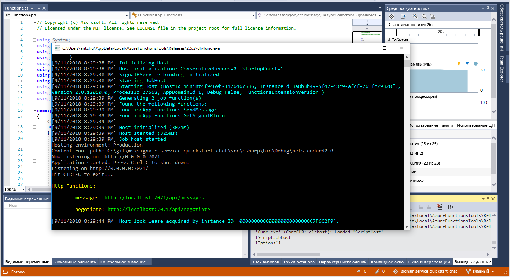

# <a name="quickstart-create-a-chat-room-with-azure-functions-and-signalr-service-using-c"></a>Краткое руководство. Создание комнаты чата с помощью служб "Функции Azure" и SignalR с помощью C\#

Служба Azure SignalR позволяет легко добавлять в приложение функции реального времени. Функции Azure — бессерверная платформа, которая позволяет выполнять код без необходимости управлять какой-либо инфраструктурой. В этом кратком руководстве вы научитесь использовать службы SignalR и "Функции Azure" для построения бессерверного чат-приложения, работающего в режиме реального времени.

## <a name="prerequisites"></a>Предварительные требования

Если вы еще не установили Visual Studio 2017, вы можете скачать и использовать **бесплатный** [выпуск Community для Visual Studio 2017](https://www.visualstudio.com/downloads/). При установке Visual Studio необходимо включить возможность **разработки для Azure**.

Вы также можете запустить это руководство из командной строки (macOS, Windows или Linux) с помощью [Azure Functions Core Tools (v2)](https://github.com/Azure/azure-functions-core-tools#installing), [пакета SDK для .NET Core](https://dotnet.microsoft.com/download) или любого другого редактора кода.

[!INCLUDE [quickstarts-free-trial-note](../../includes/quickstarts-free-trial-note.md)]

## <a name="log-in-to-azure"></a>Вход в Azure

Войдите на портал Azure по адресу <https://portal.azure.com/> с помощью своей учетной записи Azure.

[!INCLUDE [Create instance](includes/signalr-quickstart-create-instance.md)]

[!INCLUDE [Clone application](includes/signalr-quickstart-clone-application.md)]

## <a name="configure-and-run-the-azure-function-app"></a>Настройка и запуск приложения-функции Azure

1. Запустите Visual Studio (или любой другой редактор кода) и откройте решение в папке *src/chat/csharp* клонированного репозитория.

1. В браузере, где открыт портал Azure, выполнив поиск имени в верхней части портала, убедитесь, что ранее развернутый экземпляр службы SignalR успешно создан. Выберите экземпляр, чтобы открыть его.

    

1. Выберите **ключи** для просмотра строк подключения экземпляра службы SignalR.

1. Выберите и скопируйте основную строку подключения.

1. В Visual Studio в обозревателе решений переименуйте *local.settings.sample.json* в *local.settings.json*.

1. В файл **local.settings.json** вставьте строку подключения как значение параметра **AzureSignalRConnectionString**. Сохраните файл.

1. Откройте **Functions.cs**. В этом приложении-функции есть две функции триггеров HTTP.

    - **GetSignalRInfo** — использует входную привязку *SignalRConnectionInfo* для создания и возврата сведений о текущем соединении.
    - **SendMessage** — получает мгновенное сообщение в тексте запроса и использует выходную привязку *SignalR*, чтобы разослать сообщение всем подключенным клиентским приложениям.

1. Для локального запуска приложения-функции Azure можно использовать один из следующих вариантов.

    - **Visual Studio**. Чтобы запустить приложение, в меню *Отладка* выберите *Начать отладку*.

        

    - **Командная строка**. Выполните следующую команду, чтобы запустить узел функции.

        ```bash
        func start
        ```

[!INCLUDE [Run web application](includes/signalr-quickstart-run-web-application.md)]

[!INCLUDE [Cleanup](includes/signalr-quickstart-cleanup.md)]

## <a name="next-steps"></a>Дополнительная информация

В этом кратком руководстве вы создали и запустили бессерверное приложение в режиме реального времени в Visual Studio. Далее узнайте, как разрабатывать и развертывать Функций Azure с помощью Visual Studio.

> [!div class="nextstepaction"]
> [Разработка Функций Azure с помощью Visual Studio](../azure-functions/functions-develop-vs.md)