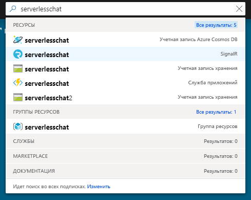
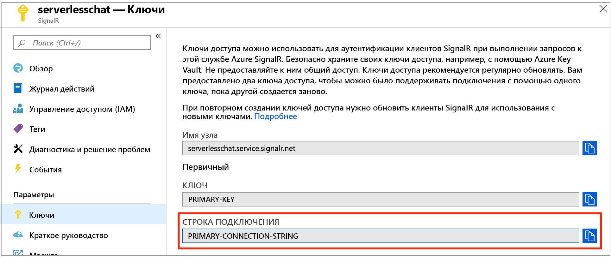

# <a name="quickstart-create-a-chat-room-with-azure-functions-and-signalr-service-using-java"></a>Краткое руководство. Создание комнаты чата с помощью служб "Функции Azure" и SignalR с использованием Java

Служба Azure SignalR позволяет легко добавлять в приложение функции реального времени. Функции Azure — бессерверная платформа, которая позволяет выполнять код без необходимости управлять какой-либо инфраструктурой. В этом кратком руководстве вы научитесь использовать службы SignalR и "Функции Azure" для построения бессерверного чат-приложения, работающего в режиме реального времени.

## <a name="prerequisites"></a>Предварительные требования

Это краткое руководство предназначено для macOS, Windows или Linux.

Скачайте и установите редактор кодов [Visual Studio Code](https://code.visualstudio.com/).

Установите [Основные инструменты службы "Функции Azure" (версии 2)](https://github.com/Azure/azure-functions-core-tools#installing) для локального запуска приложения "Функции Azure".

> [!NOTE]
> Чтобы использовать привязку Службы SignalR в Java, версия основных инструментов службы "Функции Azure" должна быть 2.4.419 или более поздней (версия узла 2.0.12332).

Чтобы установить расширения основных инструментов Функции Azure в настоящее время требуется, чтобы был установлен [пакет SDK для .NET Core](https://www.microsoft.com/net/download). Тем не менее для создания приложения "Функции Azure" для JavaScript не требуются знания платформы .NET.

Для разработки функций приложения с помощью Java, должны быть установлены следующие компоненты:

* [Java Developer Kit (JDK)](https://www.azul.com/downloads/zulu/) версии 8.
* [Apache Maven](https://maven.apache.org) 3.0 или более поздней версии.

[!INCLUDE [quickstarts-free-trial-note](../../includes/quickstarts-free-trial-note.md)]

## <a name="log-in-to-azure"></a>Вход в Azure

Войдите на портал Azure по адресу <https://portal.azure.com/> с помощью своей учетной записи Azure.

[!INCLUDE [Create instance](includes/signalr-quickstart-create-instance.md)]

[!INCLUDE [Clone application](includes/signalr-quickstart-clone-application.md)]

## <a name="configure-and-run-the-azure-function-app"></a>Настройка и запуск приложения-функции Azure

1. В браузере, где открыт портал Azure, выполнив поиск имени в верхней части портала, убедитесь, что ранее развернутый экземпляр службы SignalR успешно создан. Выберите экземпляр, чтобы открыть его.

    

1. Выберите **ключи** для просмотра строк подключения экземпляра службы SignalR.

1. Выберите и скопируйте основную строку подключения.

    

1. В редакторе кода откройте папку *src/chat/java* из клонированного репозитория.

1. Переименуйте *local.settings.sample.json* на *local.settings.json*.

1. В файл **local.settings.json** вставьте строку подключения как значение параметра **AzureSignalRConnectionString**. Сохраните файл.

1. Основной файл, содержащий функции, находится по такому пути: *src/chat/java/src/main/java/com/function/Functions.java*.

    - **Согласование** использует входную привязку *SignalRConnectionInfo* для генерации и возврата сведений о допустимом соединении.
    - **sendMessage** получает мгновенное сообщение в тексте запроса и использует выходную привязку *SignalR*, чтобы разослать сообщение всем подключенным клиентским приложениям.

1. В терминале убедитесь, что вы находитесь в папке *src/chat/java*. Создайте приложение-функцию.

    ```bash
    mvn clean package
    ```

1. Выполните локальное тестирование приложения-функции.

    ```bash
    mvn azure-functions:run
    ```

[!INCLUDE [Run web application](includes/signalr-quickstart-run-web-application.md)]

[!INCLUDE [Cleanup](includes/signalr-quickstart-cleanup.md)]

## <a name="next-steps"></a>Дополнительная информация

В этом кратком руководстве вы создали и запустили бессерверное приложение в режиме реального времени с помощью Maven. Узнайте, как создавать функции Azure на языке Java с нуля.

> [!div class="nextstepaction"]
> [Создание первой функции с помощью Java и Maven](../azure-functions/functions-create-first-java-maven.md)