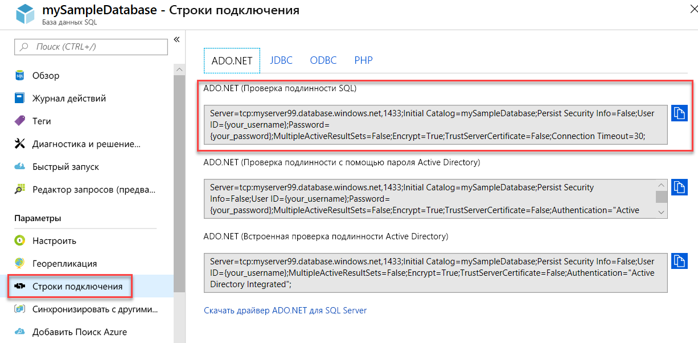

# <a name="quickstart-use-net-core-c-to-query-a-database-in-azure-sql-database-or-azure-sql-managed-instance"></a>Краткое руководство. Использование .NET Core (C#) для отправки запросов к базе данных в службах "База данных SQL Azure" или "Управляемый экземпляр SQL Azure"
[!INCLUDE[appliesto-sqldb-sqlmi](../includes/appliesto-sqldb-sqlmi.md)]

При работе с этим кратким руководством вы будете использовать [.NET Core](https://www.microsoft.com/net/) и код C# для подключения к базе данных. Затем вы выполните инструкцию Transact-SQL для запроса данных.

> [!TIP]
> Следующий модуль Microsoft Learn поможет вам научиться бесплатно [разрабатывать и настраивать приложение ASP.NET, которое запрашивает базу данных в службе "База данных SQL Azure"](https://docs.microsoft.com/learn/modules/develop-app-that-queries-azure-sql/).

## <a name="prerequisites"></a>Предварительные требования

Для работы с этим кратким руководством вам понадобится:

- Учетная запись Azure с активной подпиской. [Создайте учетную запись](https://azure.microsoft.com/free/?ref=microsoft.com&utm_source=microsoft.com&utm_medium=docs&utm_campaign=visualstudio) бесплатно.
- База данных. Для создания и настройки базы данных можно использовать одно из этих кратких руководств.

  || База данных SQL | Управляемый экземпляр SQL | SQL Server на виртуальной машине Azure |
  |:--- |:--- |:---|:---|
  | Создание| [Портал](single-database-create-quickstart.md) | [Портал](../managed-instance/instance-create-quickstart.md) | [Портал](../virtual-machines/windows/sql-vm-create-portal-quickstart.md)
  || [CLI](scripts/create-and-configure-database-cli.md) | [CLI](https://medium.com/azure-sqldb-managed-instance/working-with-sql-managed-instance-using-azure-cli-611795fe0b44) |
  || [PowerShell](scripts/create-and-configure-database-powershell.md) | [PowerShell](../managed-instance/scripts/create-configure-managed-instance-powershell.md) | [PowerShell](../virtual-machines/windows/sql-vm-create-powershell-quickstart.md)
  | Configure | [Правило брандмауэра для IP-адресов на уровне сервера](firewall-create-server-level-portal-quickstart.md)| [Подключение из виртуальной машины](../managed-instance/connect-vm-instance-configure.md)|
  |||[Подключение из локальной сети](../managed-instance/point-to-site-p2s-configure.md) | [Подключение к экземпляру SQL Server](../virtual-machines/windows/sql-vm-create-portal-quickstart.md)
  |Загрузка данных|База данных Adventure Works, загруженная для краткого руководства|[Восстановление базы данных Wide World Importers](../managed-instance/restore-sample-database-quickstart.md) | [Восстановление базы данных Wide World Importers](../managed-instance/restore-sample-database-quickstart.md) |
  |||Восстановление или импорт Adventure Works из файла [BACPAC](database-import.md), размещенного на [GitHub](https://github.com/Microsoft/sql-server-samples/tree/master/samples/databases/adventure-works)| Восстановление или импорт Adventure Works из файла [BACPAC](database-import.md), размещенного на [GitHub](https://github.com/Microsoft/sql-server-samples/tree/master/samples/databases/adventure-works)|
  |||

  > [!IMPORTANT]
  > Скрипты в этой статье предназначены для использования базы данных Adventure Works. Используя Управляемый экземпляр SQL, необходимо импортировать базу данных Adventure Works в базу данных экземпляра или изменить скрипты в этой статье для использования базы данных Wide World Importers.

- Установленный [.NET Core для вашей операционной системы](https://www.microsoft.com/net/core).

> [!NOTE]
> В этом кратком руководстве используется база данных *mySampleDatabase*. Если вы хотите использовать другую базу данных, необходимо будет изменить ссылки на базы данных и изменить запрос `SELECT` в коде C#.

## <a name="get-server-connection-information"></a>Получение сведений о подключении к серверу

Получите сведения, необходимые для подключения к базе данных в службе "База данных SQL Azure". Для дальнейших действий вам понадобится полное имя сервера или имя узла, имя базы данных и данные для входа.

1. Войдите на [портал Azure](https://portal.azure.com/).

2. Перейдите на страницу **Базы данных SQL** или **Управляемые экземпляры SQL**.

3. На странице **Обзор** просмотрите полное имя сервера рядом с полем **Имя сервера** для базы данных в службе "База данных SQL Azure" или полное имя сервера (либо IP-адрес) рядом с полем **Узел** для Управляемого экземпляра SQL Azure или SQL Server на виртуальной машине Azure. Чтобы скопировать имя сервера или имя узла, наведите на него указатель мыши и щелкните значок **копирования**.

> [!NOTE]
> Сведения о подключении SQL Server на виртуальной машине Azure см. в [этом разделе](../virtual-machines/windows/sql-vm-create-portal-quickstart.md#connect-to-sql-server).

## <a name="get-adonet-connection-information-optional---sql-database-only"></a>Получение сведений о подключении к ADO.NET (необязательно — только для Базы данных SQL)

1. Перейдите на страницу **mySampleDatabase** и в разделе **Параметры** выберите **Строки подключения**.

2. Просмотрите полную строку подключения **ADO.NET**.

    

3. Скопируйте строку подключения **ADO.NET**, если вы планируете использовать ее.
  
## <a name="create-a-new-net-core-project"></a>Создание проекта .NET Core

1. Откройте командную строку и создайте папку с именем **sqltest**. Перейдите в эту папку и выполните следующую команду.

    ```cmd
    dotnet new console
    ```

    Эта команда создает файлы проекта нового приложения, включая первоначальный файл кода C# (**Program.cs**), файл конфигурации XML (**sqltest.csproj**) и необходимые двоичные файлы.

2. В текстовом редакторе откройте **sqltest.csproj** и вставьте следующий XML-код между тегами `<Project>`. Этот XML-код добавляет `System.Data.SqlClient` как зависимость.

    ```xml
    <ItemGroup>
        <PackageReference Include="System.Data.SqlClient" Version="4.6.0" />
    </ItemGroup>
    ```

## <a name="insert-code-to-query-the-database-in-azure-sql-database"></a>Вставка кода для запроса к Базе данных SQL Azure

1. Откройте файл **Program.cs** в текстовом редакторе.

2. Замените содержимое следующим кодом и добавьте соответствующие значения для сервера, базы данных, имени пользователя и пароля.

> [!NOTE]
> Чтобы использовать строку подключения ADO.NET, замените 4 строки в коде, устанавливающем сервер, базу данных, имя пользователя и пароль, следующей строкой. В строке задайте имя пользователя и пароль.
>
>    `builder.ConnectionString="<your_ado_net_connection_string>";`

```csharp
using System;
using System.Data.SqlClient;
using System.Text;

namespace sqltest
{
    class Program
    {
        static void Main(string[] args)
        {
            try 
            { 
                SqlConnectionStringBuilder builder = new SqlConnectionStringBuilder();

                builder.DataSource = "<your_server.database.windows.net>"; 
                builder.UserID = "<your_username>";            
                builder.Password = "<your_password>";     
                builder.InitialCatalog = "<your_database>";
         
                using (SqlConnection connection = new SqlConnection(builder.ConnectionString))
                {
                    Console.WriteLine("\nQuery data example:");
                    Console.WriteLine("=========================================\n");
                    
                    connection.Open();       
                    StringBuilder sb = new StringBuilder();
                    sb.Append("SELECT TOP 20 pc.Name as CategoryName, p.name as ProductName ");
                    sb.Append("FROM [SalesLT].[ProductCategory] pc ");
                    sb.Append("JOIN [SalesLT].[Product] p ");
                    sb.Append("ON pc.productcategoryid = p.productcategoryid;");
                    String sql = sb.ToString();

                    using (SqlCommand command = new SqlCommand(sql, connection))
                    {
                        using (SqlDataReader reader = command.ExecuteReader())
                        {
                            while (reader.Read())
                            {
                                Console.WriteLine("{0} {1}", reader.GetString(0), reader.GetString(1));
                            }
                        }
                    }                    
                }
            }
            catch (SqlException e)
            {
                Console.WriteLine(e.ToString());
            }
            Console.WriteLine("\nDone. Press enter.");
            Console.ReadLine(); 
        }
    }
}
```

## <a name="run-the-code"></a>Выполнение кода

1. Выполните следующие команды при выводе запроса.

   ```cmd
   dotnet restore
   dotnet run
   ```

2. Убедитесь, что возвращены первые 20 строк.

   ```text
   Query data example:
   =========================================

   Road Frames HL Road Frame - Black, 58
   Road Frames HL Road Frame - Red, 58
   Helmets Sport-100 Helmet, Red
   Helmets Sport-100 Helmet, Black
   Socks Mountain Bike Socks, M
   Socks Mountain Bike Socks, L
   Helmets Sport-100 Helmet, Blue
   Caps AWC Logo Cap
   Jerseys Long-Sleeve Logo Jersey, S
   Jerseys Long-Sleeve Logo Jersey, M
   Jerseys Long-Sleeve Logo Jersey, L
   Jerseys Long-Sleeve Logo Jersey, XL
   Road Frames HL Road Frame - Red, 62
   Road Frames HL Road Frame - Red, 44
   Road Frames HL Road Frame - Red, 48
   Road Frames HL Road Frame - Red, 52
   Road Frames HL Road Frame - Red, 56
   Road Frames LL Road Frame - Black, 58
   Road Frames LL Road Frame - Black, 60
   Road Frames LL Road Frame - Black, 62

   Done. Press enter.
   ```

3. Нажмите клавишу **ВВОД**, чтобы закрыть окно приложения.

## <a name="next-steps"></a>Дальнейшие действия

- [Начало работы с .NET Core в Windows, Linux и Mac OS с помощью командной строки](/dotnet/core/tutorials/using-with-xplat-cli).
- Узнайте, как [подключиться и отправить запрос к Базе данных SQL Azure или Управляемому экземпляру SQL Azure с помощью .NET Framework и Visual Studio](connect-query-dotnet-visual-studio.md).  
- Узнайте, как [спроектировать первую базу данных с помощью SSMS](design-first-database-tutorial.md) или [спроектировать базу данных и выполнить подключение с помощью C# и ADO.NET](design-first-database-csharp-tutorial.md).
- Дополнительные сведения о .NET см. в [этой документации](https://docs.microsoft.com/dotnet/).
