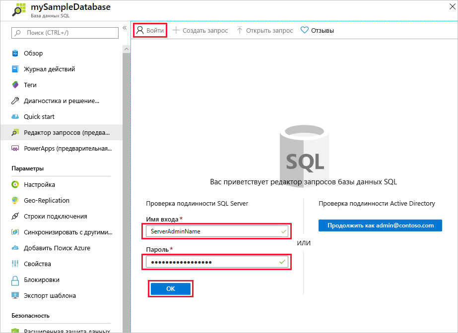
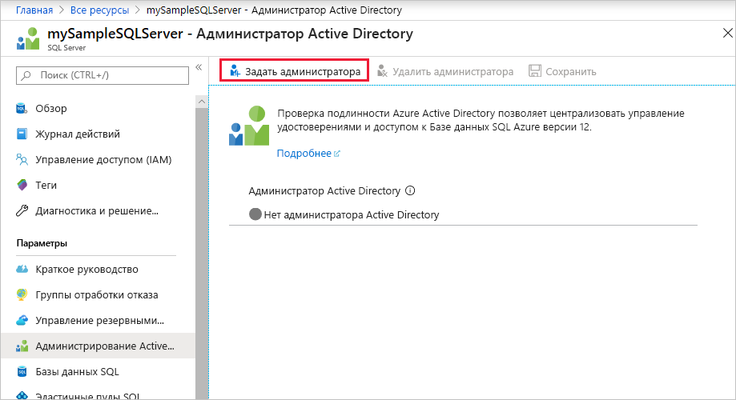
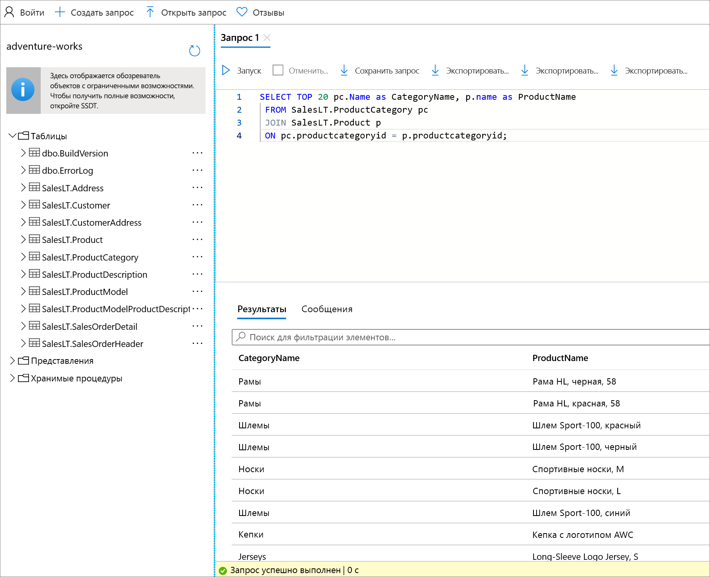

# <a name="quickstart-use-the-azure-portals-query-editor-preview-to-query-an-azure-sql-database"></a>Краткое руководство. Выполнение запросов к Базе данных SQL Azure с помощью редактора запросов (предварительная версия) на портале Azure
[!INCLUDE[appliesto-sqldb](../includes/appliesto-sqldb.md)]

Редактор запросов на портале Azure позволяет выполнять SQL-запросы к базе данных в Базе данных SQL Azure или к хранилищу данных в Azure Synapse Analytics. 

В этом кратком руководстве показано, как с помощью редактора запросов выполнять запросы Transact-SQL (T-SQL) к базе данных.

## <a name="prerequisites"></a>Предварительные требования

Для работы с этим кратким руководством требуется пример базы данных AdventureWorksLT. Если у вас нет рабочей копии с образцом базы данных AdventureWorksLT в Базе данных SQL, создайте ее с помощью следующего краткого руководства:

- [Краткое руководство. Создание базы данных в Базе данных SQL Azure с помощью портала Azure, PowerShell или Azure CLI](single-database-create-quickstart.md) 

### <a name="configure-network-settings"></a>Настройка параметров сети

В редакторе запросов вы можете увидеть одно из следующих сообщений об ошибке: *Параметры локальной сети могут препятствовать формированию запросов в редакторе запросов. Щелкните, чтобы получить инструкции по настройке параметров сети* или *Не удалось установить подключение к серверу. Это может свидетельствовать о проблеме с конфигурацией локального брандмауэра или с параметрами прокси-сервера сети*. В таком случае попробовать устранить проблему можно несколькими способами:

> [!IMPORTANT]
> Редактор запросов использует порты 443 и 1443 для обмена данными. Обязательно включите исходящий трафик HTTPS для этих портов. Кроме того, необходимо [добавить на сервере исходящий IP-адрес в разрешающие правила брандмауэра](firewall-create-server-level-portal-quickstart.md) для обращения к базам данных и хранилищам данных.


## <a name="open-the-sql-database-query-editor"></a>Открытие редактора запросов Базы данных SQL

1. Войдите на [портал Azure](https://portal.azure.com/) и выберите базу данных, которой будут адресоваться запросы.

2. В меню **Базы данных SQL** выберите **Редактор запросов (предварительная версия)** .

    


## <a name="establish-a-connection-to-the-database"></a>Установка подключения к базе данных

Даже если вы уже вошли на портал, вам нужно отдельно ввести учетные данные для доступа к базе данных. Для подключения к базе данных можно использовать аутентификацию SQL или Azure Active Directory.

### <a name="connect-using-sql-authentication"></a>Подключение с помощью аутентификации SQL

1. На странице **Вход** в разделе **Проверка подлинности SQL Server** введите **имя входа** и **пароль** пользователя, у которого есть доступ к этой базе данных. Если вы не знаете такого пользователя, введите имя входа и пароль администратора сервера этой базы данных.

    

2. Щелкните **ОК**.


### <a name="connect-using-azure-active-directory"></a>Подключение с помощью Azure Active Directory

Настройка администратора Azure Active Directory (Azure AD) позволяет использовать единое удостоверение для входа на портал Azure и в вашу базу данных. Чтобы подключиться к базе данных с помощью Azure AD, выполните описанный ниже процесс настройки администратора Azure AD для экземпляра сервера SQL Server.

> [!NOTE]
> * Учетные записи электронной почты (например, outlook.com, gmail.com, yahoo.com и др.) пока не поддерживаются как учетные записи администраторов Azure AD. Выберите пользователя, который изначально был создан в Azure AD или же интегрирован с этой службой.
> * Выполнить вход администратора Azure AD с помощью учетных записей, в которых включена двухфакторная проверка подлинности, не получится.

#### <a name="set-an-active-directory-admin-for-the-server"></a>Настройка администратора Active Directory для сервера

1. На портале Azure выберите экземпляр сервера SQL Server.

2. В меню **SQL Server** выберите **Администратор Active Directory**.

3. На странице **администратора Active Directory** SQL Server щелкните на панели инструментов **Задать администратора** и выберите пользователя или группу, которым будет назначена роль администратора Azure AD.

    

4. На странице **Добавление администратора** в поле поиска введите пользователя или группу для поиска, выберите их в качестве администратора, а затем нажмите кнопку **Выбрать**.

5. Вернувшись на страницу **администратора Active Directory** SQL Server, щелкните на панели инструментов кнопку **Сохранить**.

### <a name="connect-to-the-database"></a>Подключение к базе данных

6. В меню **SQL Server** выберите сначала **Базы данных SQL**, а затем свою базу данных.

7. В меню **Базы данных SQL** выберите **Редактор запросов (предварительная версия)** . На странице **Вход** в разделе **Проверка подлинности Active Directory** появится сообщение о том, что вы вошли в систему, если являетесь администратором Azure AD. Нажмите кнопку **Продолжить как** *\<your user or group ID>* . Если на странице сообщается, что вход не выполнен, попробуйте обновить эту страницу.

## <a name="query-a-database-in-sql-database"></a>Запрос к базе данных в Базе данных SQL

Следующие примеры запросов должны выполняться в примере базы данных AdventureWorksLT.

### <a name="run-a-select-query"></a>Выполнение запроса SELECT

1. Вставьте следующий запрос в редактор запросов:

   ```sql
    SELECT TOP 20 pc.Name as CategoryName, p.name as ProductName
    FROM SalesLT.ProductCategory pc
    JOIN SalesLT.Product p
    ON pc.productcategoryid = p.productcategoryid;
   ```

2. Щелкните **Выполнить** и просмотрите выходные данные в области **Результаты**.

   

3. При желании можно сохранить запрос в виде файла .sql или экспортировать возвращенные данные в файл .json, .csv или .xml.

### <a name="run-an-insert-query"></a>Выполнение запроса INSERT

Выполните следующую инструкцию T-SQL [INSERT](/sql/t-sql/statements/insert-transact-sql/), чтобы добавить новый продукт в таблицу `SalesLT.Product`.

1. Замените предыдущий запрос следующим содержимым.

    ```sql
    INSERT INTO [SalesLT].[Product]
           ( [Name]
           , [ProductNumber]
           , [Color]
           , [ProductCategoryID]
           , [StandardCost]
           , [ListPrice]
           , [SellStartDate]
           )
    VALUES
           ('myNewProduct'
           ,123456789
           ,'NewColor'
           ,1
           ,100
           ,100
           ,GETDATE() );
   ```


2. Щелкните **Выполнить**, чтобы вставить новую строку в таблицу `Product`. Отобразится панель **сообщений** с результатом: **Запрос выполнен. Затронуто строк: 1**.


### <a name="run-an-update-query"></a>Выполнение запроса UPDATE

Выполните следующую инструкцию T-SQL [UPDATE](/sql/t-sql/queries/update-transact-sql/), чтобы изменить новый продукт.

1. Замените предыдущий запрос следующим содержимым.

   ```sql
   UPDATE [SalesLT].[Product]
   SET [ListPrice] = 125
   WHERE Name = 'myNewProduct';
   ```

2. Щелкните **Выполнить**, чтобы обновить указанную строку в таблице`Product`. Отобразится панель **сообщений** с результатом: **Запрос выполнен. Затронуто строк: 1**.

### <a name="run-a-delete-query"></a>Выполнение запроса DELETE

Выполните следующую инструкцию T-SQL [DELETE](/sql/t-sql/statements/delete-transact-sql/), чтобы удалить новый продукт.

1. Замените предыдущий запрос следующим содержимым:

   ```sql
   DELETE FROM [SalesLT].[Product]
   WHERE Name = 'myNewProduct';
   ```

2. Щелкните **Выполнить**, чтобы удалить указанную строку в таблице`Product`. Отобразится панель **сообщений** с результатом: **Запрос выполнен. Затронуто строк: 1**.


## <a name="query-editor-considerations"></a>Рекомендации по работе с редактором запросов

Ознакомьтесь с рекомендациями по работе с редактором запросов.

* Редактор запросов использует порты 443 и 1443 для обмена данными. Обязательно включите исходящий трафик HTTPS для этих портов. Кроме того, необходимо будет добавить исходящий IP-адрес к правилам брандмауэра, разрешенным для сервера, для доступа к базам данных и хранилищам данных.

* Если вы используете подключение к Приватному каналу, для работы редактора запросов не нужно добавлять IP-адрес клиента в брандмауэр Базы данных SQL.

* Если нажать клавишу **F5**, страница редактора запросов обновится, а выполняемый запрос будет закрыт.

* Редактор запросов не поддерживает подключение к базе данных `master`.

* Время ожидания для выполнения запроса составляет 5 минут.

* Редактор запросов поддерживает только цилиндрическую проекцию для типов данных geography.

* Поддержка IntelliSense для таблиц и представлений баз данных отсутствует, но редактор поддерживает автозаполнение для введенных ранее имен.


## <a name="next-steps"></a>Дальнейшие действия

Подробнее о поддержке Transact-SQL (T-SQL) в Базе данных SQL Azure см. в разделе о [решении проблем, связанных с отличиями Transact-SQL, при миграции в Базу данных SQL](transact-sql-tsql-differences-sql-server.md).
