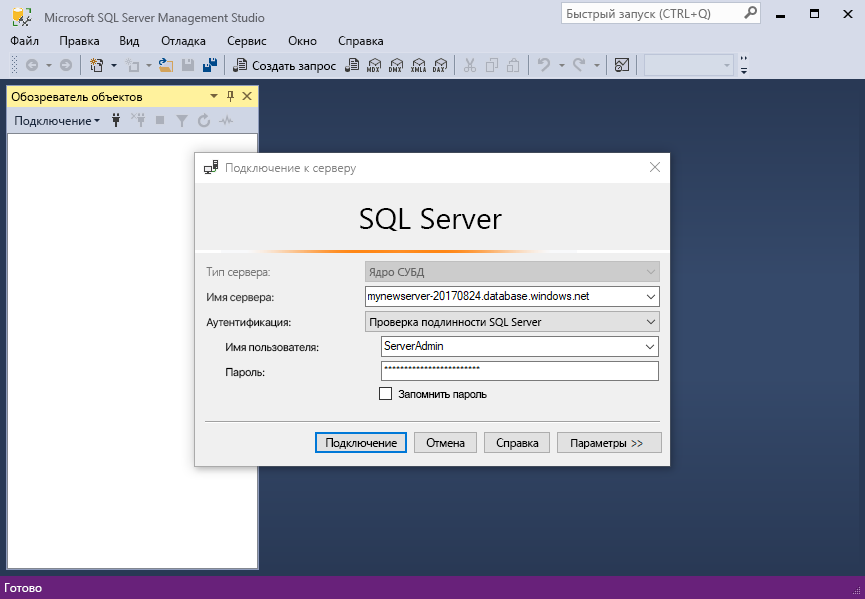
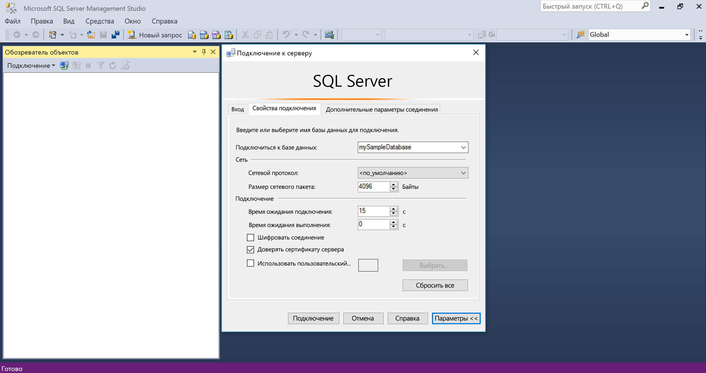
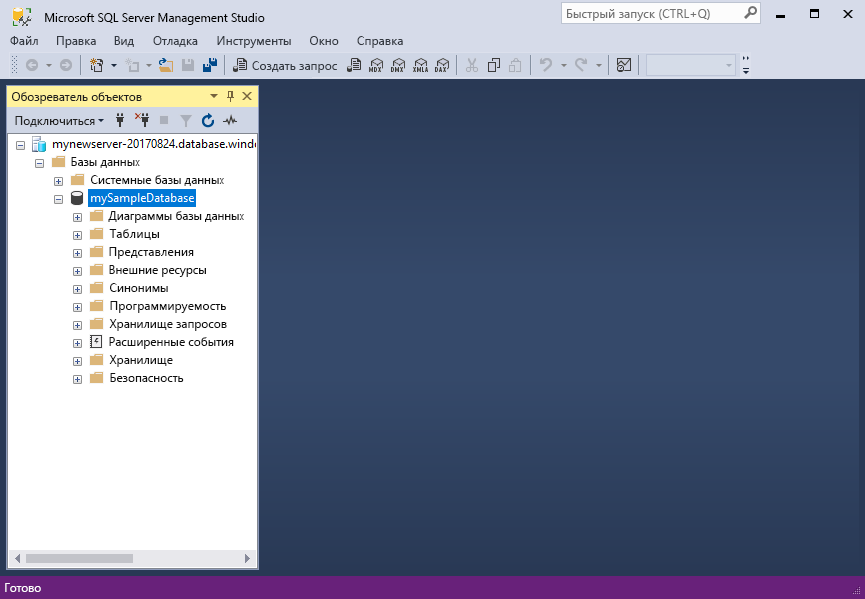
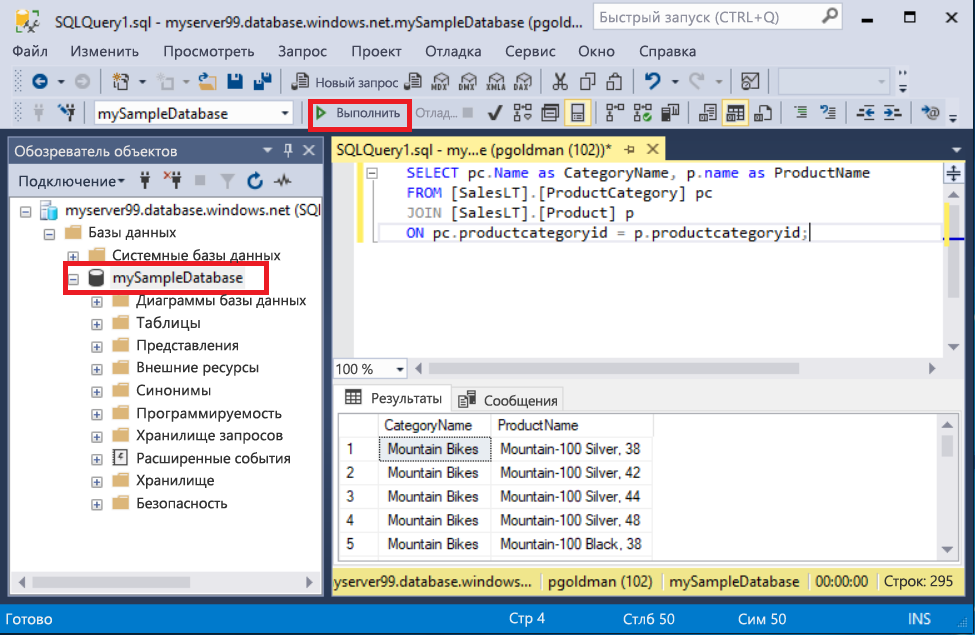
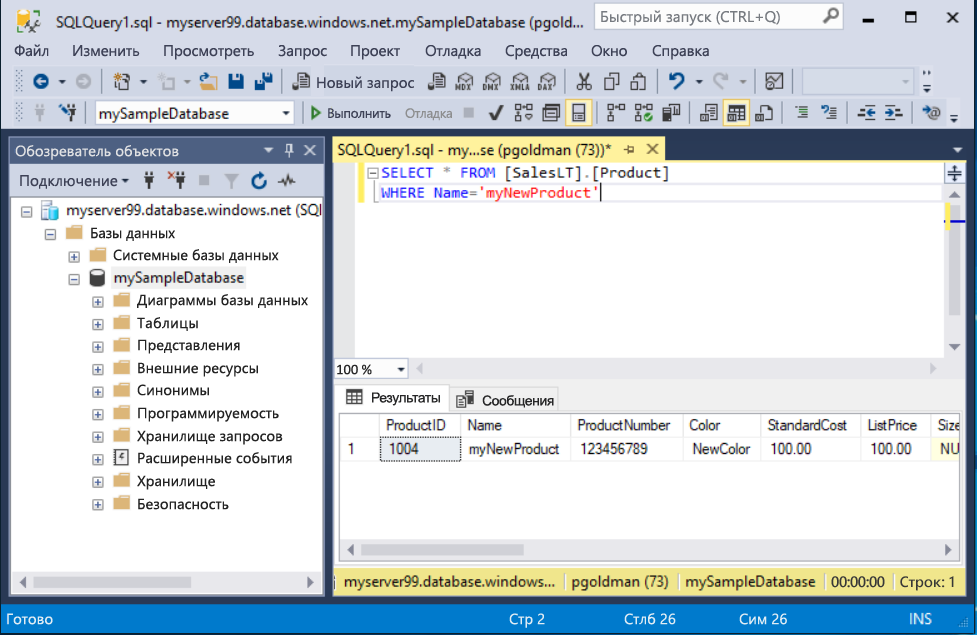

# <a name="quickstart-use-ssms-to-connect-to-and-query-azure-sql-database-or-azure-sql-managed-instance"></a>Краткое руководство. Использование SSMS для подключения к Базе данных SQL Azure или Управляемому экземпляру SQL Azure
[!INCLUDE[appliesto-sqldb-sqlmi](../includes/appliesto-sqldb-sqlmi.md)]

Из этого краткого руководства вы узнаете, как использовать SQL Server Management Studio (SSMS) для подключения к Базе данных SQL Azure и Управляемому экземпляру SQL Azure и выполнять запросы.

## <a name="prerequisites"></a>Предварительные требования

Для работы с этим кратким руководством требуется следующее:

- [SQL Server Management Studio (SSMS).](/sql/ssms/download-sql-server-management-studio-ssms/)

- База данных в службе "База данных SQL Azure". Для создания и настройки базы данных в службе "База данных SQL Azure" можно использовать одно из этих кратких руководств.

  || База данных SQL | Управляемый экземпляр SQL | SQL Server на виртуальной машине Azure |
  |:--- |:--- |:---|:---|
  | Создание| [Портал](single-database-create-quickstart.md) | [Портал](../managed-instance/instance-create-quickstart.md) | [Портал](../virtual-machines/windows/sql-vm-create-portal-quickstart.md)
  || [CLI](scripts/create-and-configure-database-cli.md) | [CLI](https://medium.com/azure-sqldb-managed-instance/working-with-sql-managed-instance-using-azure-cli-611795fe0b44) |
  || [PowerShell](scripts/create-and-configure-database-powershell.md) | [PowerShell](../managed-instance/scripts/create-configure-managed-instance-powershell.md) | [PowerShell](../virtual-machines/windows/sql-vm-create-powershell-quickstart.md)
  | Configure | [Правило брандмауэра для IP-адресов на уровне сервера](firewall-create-server-level-portal-quickstart.md)| [Подключение из виртуальной машины](../managed-instance/connect-vm-instance-configure.md)|
  |||[Подключение "точка — сеть"](../managed-instance/point-to-site-p2s-configure.md) | [Диалоговое окно "Подключение к SQL Server"](../virtual-machines/windows/sql-vm-create-portal-quickstart.md)
  |Загрузка данных|База данных Adventure Works, загруженная для краткого руководства|[Восстановление базы данных Wide World Importers](../managed-instance/restore-sample-database-quickstart.md) | [Восстановление базы данных Wide World Importers](../managed-instance/restore-sample-database-quickstart.md) |
  |||Восстановление или импорт Adventure Works из файла [BACPAC](database-import.md), размещенного на [GitHub](https://github.com/Microsoft/sql-server-samples/tree/master/samples/databases/adventure-works)| Восстановление или импорт Adventure Works из файла [BACPAC](database-import.md), размещенного на [GitHub](https://github.com/Microsoft/sql-server-samples/tree/master/samples/databases/adventure-works)|
  |||

  > [!IMPORTANT]
  > Скрипты в этой статье предназначены для использования базы данных Adventure Works. Используя управляемый экземпляр, необходимо импортировать базу данных Adventure Works в базу данных экземпляра или изменить скрипты в этой статье для использования базы данных Wide World Importers.

Если вы просто хотите выполнить некоторые нерегламентированные запросы, не устанавливая SSMS, см. статью [Краткое руководство. Использование редактора запросов на портале Azure для запросов к базе данных SQL](connect-query-portal.md).

## <a name="get-server-connection-information"></a>Получение сведений о подключении к серверу

Получите сведения, необходимые для подключения к базе данных. Для выполнения инструкций из этого краткого руководства вам понадобится полное имя [сервера](logical-servers.md) или имя узла, имя базы данных и данные для входа.

1. Войдите на [портал Azure](https://portal.azure.com/).

2. Перейдите на страницу **База данных**  или **Управляемые экземпляры**, к которым хотите отправить запрос.

3. На странице **Обзор** просмотрите полное имя сервера рядом с полем **Имя сервера** для вашей базы данных в службе "База данных SQL" или полное имя сервера (или IP-адрес) рядом с полем **Узел** для вашего управляемого экземпляра в Управляемом экземпляре SQL или вашего экземпляра SQL Server на виртуальной машине. Чтобы скопировать имя сервера или имя узла, наведите на него указатель мыши и щелкните значок **копирования**.

> [!NOTE]
> Сведения о подключении SQL Server на виртуальной машине Azure см. в разделе [Подключение к SQL Server](../virtual-machines/windows/sql-vm-create-portal-quickstart.md#connect-to-sql-server).

## <a name="connect-to-your-database"></a>Подключение к базе данных

В среде SSMS подключитесь к серверу.

> [!IMPORTANT]
> Сервер прослушивает порт 1433. Чтобы подключиться к серверу из-за пределов корпоративного брандмауэра, необходимо открыть этот порт в брандмауэре.

1. Откройте SSMS.

2. Откроется диалоговое окно **Соединение с сервером** . Введите следующие сведения:

   | Параметр      | Рекомендуемое значение    | Описание |
   | ------------ | ------------------ | ----------- |
   | **Тип сервера** | Ядро СУБД | Обязательное значение. |
   | **Имя сервера** | Полное имя сервера | Что-то вроде: **имя_сервера.база_данных.windows.net**. |
   | **Аутентификация** | Проверка подлинности SQL Server | В этом руководстве используется проверка подлинности SQL. |
   | **Имя входа** | Идентификатор пользователя учетной записи администратора сервера | Идентификатор пользователя учетной записи администратора сервера, используемый для создания сервера. |
   | **Пароль** | Пароль для учетной записи администратора сервера | Пароль учетной записи администратора сервера, используемый для создания сервера. |
   ||||

     

3. Выберите **Параметры** в диалоговом окне **Подключение к серверу**. В раскрывающемся меню **Подключение к базе данных** выберите **mySampleDatabase**. После выполнения [предварительных требований](#prerequisites) краткого руководства у вас будет база данных AdventureWorksLT с именем mySampleDatabase. Если рабочая копия базы данных AdventureWorks имеет имя, отличное от mySampleDatabase, выберите ее.

     

4. Выберите **Подключиться**. После этого откроется окно обозревателя объектов.

5. Чтобы просмотреть объекты базы данных, разверните раздел **Базы данных**, а затем узел своей базы данных.

     

## <a name="query-data"></a>Данные запросов

Запустите следующий код Transact-SQL [SELECT](/sql/t-sql/queries/select-transact-sql/), чтобы запросить за категорией 20 основных продуктов.

1. В обозревателе объектов щелкните правой кнопкой мыши **mySampleDatabase** и выберите **Новый запрос**. После этого откроется новое окно запроса, подключенное к базе данных.

2. В окне запроса вставьте следующий SQL-запрос:

   ```sql
   SELECT pc.Name as CategoryName, p.name as ProductName
   FROM [SalesLT].[ProductCategory] pc
   JOIN [SalesLT].[Product] p
   ON pc.productcategoryid = p.productcategoryid;
   ```

3. На панели инструментов выберите команду **Выполнить**, чтобы выполнить запрос и извлечь данные из таблиц `Product` и `ProductCategory`.

    

### <a name="insert-data"></a>Добавление данных

Запустите следующий код Transact-SQL [INSERT](/sql/t-sql/statements/insert-transact-sql/), чтобы добавить новый продукт в таблицу `SalesLT.Product`.

1. Замените предыдущий запрос следующим содержимым.

   ```sql
   INSERT INTO [SalesLT].[Product]
           ( [Name]
           , [ProductNumber]
           , [Color]
           , [ProductCategoryID]
           , [StandardCost]
           , [ListPrice]
           , [SellStartDate] )
     VALUES
           ('myNewProduct'
           ,123456789
           ,'NewColor'
           ,1
           ,100
           ,100
           ,GETDATE() );
   ```

2. Щелкните **Выполнить**, чтобы вставить новую строку в таблицу `Product`. В области **Сообщения** отображается текст: **(1 затронутая строка)**

#### <a name="view-the-result"></a>Просмотр результата

1. Замените предыдущий запрос следующим содержимым.

   ```sql
   SELECT * FROM [SalesLT].[Product]
   WHERE Name='myNewProduct'
   ```

2. Нажмите кнопку **Выполнить**. Отобразится такой результат.

   

### <a name="update-data"></a>Обновление данных

Запустите код Transact-SQL [UPDATE](/sql/t-sql/statements/update-transact-sql), чтобы обновить новый продукт.

1. Замените предыдущий запрос текущим, который возвращает созданную ранее запись:

   ```sql
   UPDATE [SalesLT].[Product]
   SET [ListPrice] = 125
   WHERE Name = 'myNewProduct';
   ```

2. Щелкните **Выполнить**, чтобы обновить указанную строку в таблице `Product`. В области **Сообщения** отображается текст: **(1 затронутая строка)**

### <a name="delete-data"></a>Удаление данных

Запустите код Transact-SQL [DELETE](/sql/t-sql/statements/delete-transact-sql/), чтобы удалить новый продукт.

1. Замените предыдущий запрос следующим содержимым.

   ```sql
   DELETE FROM [SalesLT].[Product]
   WHERE Name = 'myNewProduct';
   ```

2. Щелкните **Выполнить**, чтобы удалить указанную строку в таблице `Product`. В области **Сообщения** отображается текст: **(1 затронутая строка)**

## <a name="next-steps"></a>Дальнейшие действия

- Дополнительные сведения об использовании SSMS см. в [этой статье](/sql/ssms/sql-server-management-studio-ssms/).
- Чтобы подключиться и выполнять запросы при помощи портала Azure, прочитайте статью [Портал Azure. Использование редактора SQL-запросов для подключения к данным и их запроса](connect-query-portal.md).
- См. дополнительные сведения о [подключении и создании запросов с помощью Visual Studio Code](connect-query-vscode.md).
- См. дополнительные сведения о [подключении и создании запросов с помощью .NET](connect-query-dotnet-visual-studio.md).
- См. дополнительные сведения о [подключении и создании запросов с помощью PHP](connect-query-php.md).
- См. дополнительные сведения о [подключении и создании запросов с помощью Node.js](connect-query-nodejs.md).
- См. дополнительные сведения о [подключении и создании запросов с помощью Java](connect-query-java.md).
- См. дополнительные сведения о [подключении и создании запросов с помощью Python](connect-query-python.md).
- См. дополнительные сведения о [подключении и создании запросов с помощью Ruby](connect-query-ruby.md).
