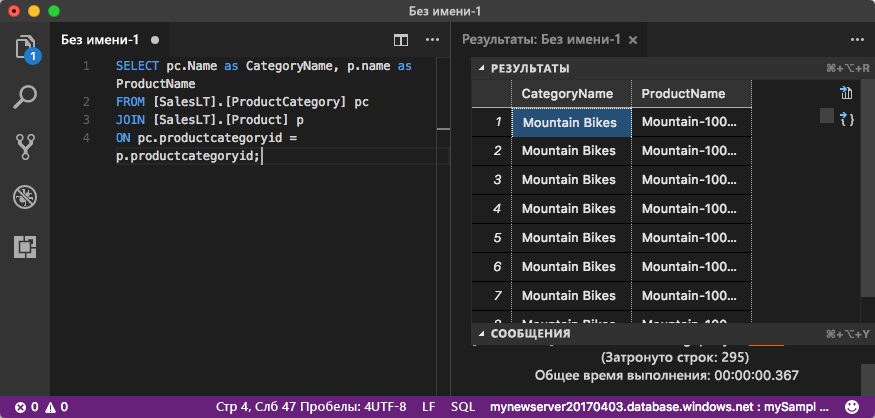

# <a name="quickstart-use-visual-studio-code-to-connect-and-query"></a>Краткое руководство. Использование Visual Studio Code для подключения и отправки запросов 
[!INCLUDE[appliesto-sqldb-sqlmi](../includes/appliesto-sqldb-sqlmi.md)]

[Visual Studio Code](https://code.visualstudio.com/docs) — это графический редактор кода для Linux, macOS и Windows. Он поддерживает расширения, включая [расширение mssql](https://aka.ms/mssql-marketplace) для выполнения запроса к экземпляру SQL Server, Базе данных SQL Azure, Управляемому экземпляру SQL Azure и базе данных в Azure Synapse Analytics. В этом кратком руководстве показано использование Visual Studio Code для подключения к Базе данных SQL Azure или Управляемому экземпляру SQL Azure, а также выполнение запроса, вставки, обновления и удаления данных с помощью инструкций Transact-SQL.

## <a name="prerequisites"></a>Предварительные требования

- База данных в службе "База данных SQL Azure" или Управляемый экземпляр SQL Azure. Для создания и настройки базы данных в службе "База данных SQL Azure" можно использовать одно из этих кратких руководств.

  | Действие | База данных SQL Azure | Управляемый экземпляр SQL Azure |
  |:--- |:--- |:---|
  | Создание| [Портал](single-database-create-quickstart.md) | [Портал](../managed-instance/instance-create-quickstart.md) |
  || [CLI](scripts/create-and-configure-database-cli.md) | [CLI](https://medium.com/azure-sqldb-managed-instance/working-with-sql-managed-instance-using-azure-cli-611795fe0b44) |
  || [PowerShell](scripts/create-and-configure-database-powershell.md) | [PowerShell](../managed-instance/scripts/create-configure-managed-instance-powershell.md) |
  | Configure | [Правило брандмауэра для IP-адресов на уровне сервера](firewall-create-server-level-portal-quickstart.md)| [Подключение виртуальной машины (VM)](../managed-instance/connect-vm-instance-configure.md)|
  |||[Подключение из локальной сети](../managed-instance/point-to-site-p2s-configure.md)
  |Загрузка данных|База данных Adventure Works, загруженная для краткого руководства|[Восстановление базы данных Wide World Importers](../managed-instance/restore-sample-database-quickstart.md)
  |||Восстановление или импорт Adventure Works из файла [BACPAC](database-import.md), размещенного на [GitHub](https://github.com/Microsoft/sql-server-samples/tree/master/samples/databases/adventure-works)|
  |||

  > [!IMPORTANT]
  > Скрипты в этой статье предназначены для использования базы данных Adventure Works. Используя Управляемый экземпляр SQL, необходимо импортировать базу данных Adventure Works в базу данных экземпляра или изменить скрипты в этой статье для использования базы данных Wide World Importers.

## <a name="install-visual-studio-code"></a>Установка Visual Studio Code

Убедитесь, что установили последнюю версию [Visual Studio Code](https://code.visualstudio.com/Download) и загрузили [расширение mssql](https://aka.ms/mssql-marketplace). Руководство по установке расширения mssql см. в разделе [об установке Visual Studio Code](https://docs.microsoft.com/sql/linux/sql-server-linux-develop-use-vscode#install-and-start-visual-studio-code) и на странице [расширения mssql для Visual Studio Code](https://marketplace.visualstudio.com/items?itemName=ms-mssql.mssql).

## <a name="configure-visual-studio-code"></a>Откройте Visual Studio Code.

### <a name="macos"></a>**macOS**

Для macOS необходимо установить OpenSSL. Это предварительное требование для платформы .NET Core, используемой для расширения mssql. Откройте терминал и введите следующие команды для установки **brew** и **OpenSSL**.

```bash
ruby -e "$(curl -fsSL https://raw.githubusercontent.com/Homebrew/install/master/install)"
brew update
brew install openssl
mkdir -p /usr/local/lib
ln -s /usr/local/opt/openssl/lib/libcrypto.1.0.0.dylib /usr/local/lib/
ln -s /usr/local/opt/openssl/lib/libssl.1.0.0.dylib /usr/local/lib/
```

### <a name="linux-ubuntu"></a>**Linux (Ubuntu)**

Специальная настройка не требуется.

### <a name="windows"></a>**Windows**

Специальная настройка не требуется.

## <a name="get-server-connection-information"></a>Получение сведений о подключении к серверу

Получите сведения, необходимые для подключения к Базе данных SQL Azure. Для дальнейших действий вам понадобится полное имя сервера или имя узла, имя базы данных и данные для входа.

1. Войдите на [портал Azure](https://portal.azure.com/).

2. Перейдите на страницу **Базы данных SQL** или **Управляемые экземпляры SQL**.

3. На странице **Обзор** просмотрите полное имя сервера рядом с полем **Имя сервера** для Базы данных SQL или полное имя сервера рядом с полем **Узел** для Управляемого экземпляра SQL. Чтобы скопировать имя сервера или имя узла, наведите на него указатель мыши и щелкните значок **копирования**.

## <a name="set-language-mode-to-sql"></a>Выбор режима языка SQL

В Visual Studio Code укажите для режима языка значение **SQL**, чтобы активировать команды mssql и T-SQL IntelliSense.

1. Откройте новое окно Visual Studio Code.

2. Нажмите клавиши **CTRL**+**N**. Откроется новый обычный текстовый файл.

3. В правом нижнем углу строки состояния выберите **Обычный текст**.

4. В открывшемся раскрывающемся меню **Выберите языковой режим** выберите **SQL**.

## <a name="connect-to-your-database"></a>Подключение к базе данных

Установите подключение к серверу с помощью Visual Studio Code.

> [!IMPORTANT]
> Прежде чем продолжить, приготовьте сервер и данные для входа. Если при вводе данных профиля подключения переключиться с Visual Studio Code, понадобится начать создание профиля заново.

1. В Visual Studio Code нажмите клавиши **CTRL+SHIFT+P** (или **F1**), чтобы открыть палитру команд.

2. Выберите **MS SQL:Connect** и нажмите клавишу **ВВОД**.

3. Выберите **Create Connection Profile** (Создать профиль подключения).

4. Следуйте инструкциям на экране, чтобы указать свойства для нового профиля подключения. Укажите все значения и нажмите клавишу **ВВОД** для продолжения.

   | Свойство       | Рекомендуемое значение | Описание |
   | ------------ | ------------------ | ------------------------------------------------- |
   | **Имя сервера** | Полное имя сервера | Примерно такое: **mynewserver20170313.database.windows.net**. |
   | **Имя базы данных** | mySampleDatabase | База данных для подключения. |
   | **Аутентификация** | Имя входа SQL| В этом руководстве используется проверка подлинности SQL. |
   | **User name** | Имя пользователя | Имя пользователя учетной записи администратора сервера, используемое для создания сервера. |
   | **Пароль (имя входа SQL)** | Пароль | Пароль учетной записи администратора сервера, используемый для создания сервера. |
   | **Сохранить пароль?** | "Да" или "Нет". | Выберите **Да**, если вы не хотите вводить пароль каждый раз. |
   | **Введите имя для этого профиля** | Имя профиля, например **mySampleProfile** | Сохраненный профиль повышает скорость подключения при последующих входах. |

   В случае успешного выполнения появится уведомление о том, что профиль создан и подключен.

## <a name="query-data"></a>Данные запросов

Выполните указанную нижу инструкцию Transact-SQL [SELECT](https://msdn.microsoft.com/library/ms189499.aspx), чтобы запросить 20 основных продуктов из категории.

1. В окне редактора вставьте следующий запрос SQL.

   ```sql
   SELECT pc.Name as CategoryName, p.name as ProductName
   FROM [SalesLT].[ProductCategory] pc
   JOIN [SalesLT].[Product] p
   ON pc.productcategoryid = p.productcategoryid;
   ```

2. Нажмите клавиши **CTRL**+**SHIFT**+**E** для выполнения запроса и отображения результатов из таблиц `Product` и `ProductCategory`.

    

## <a name="insert-data"></a>Добавление данных

Выполните указанную ниже инструкцию Transact-SQL [INSERT](https://msdn.microsoft.com/library/ms174335.aspx), чтобы добавить новый продукт в таблицу `SalesLT.Product`.

1. Замените предыдущий запрос следующим содержимым.

   ```sql
   INSERT INTO [SalesLT].[Product]
        ( [Name]
        , [ProductNumber]
        , [Color]
        , [ProductCategoryID]
        , [StandardCost]
        , [ListPrice]
        , [SellStartDate]
        )
     VALUES
        ('myNewProduct'
        ,123456789
        ,'NewColor'
        ,1
         ,100
         ,100
         ,GETDATE() );
   ```

2. Нажмите клавиши **CTRL**+**SHIFT**+**E** для вставки новой строки в таблицу `Product`.

## <a name="update-data"></a>Обновление данных

Выполните указанную ниже инструкцию Transact-SQL [UPDATE](https://msdn.microsoft.com/library/ms177523.aspx), чтобы обновить добавленный продукт.

1. Замените предыдущий запрос следующим содержимым:

   ```sql
   UPDATE [SalesLT].[Product]
   SET [ListPrice] = 125
   WHERE Name = 'myNewProduct';
   ```

2. Нажмите клавиши **CTRL**+**SHIFT**+**E**, чтобы обновить указанную строку в таблице `Product`.

## <a name="delete-data"></a>Удаление данных

Выполните указанную ниже инструкцию Transact-SQL [DELETE](https://docs.microsoft.com/sql/t-sql/statements/delete-transact-sql), чтобы удалить новый продукт.

1. Замените предыдущий запрос следующим содержимым:

   ```sql
   DELETE FROM [SalesLT].[Product]
   WHERE Name = 'myNewProduct';
   ```

2. Нажмите клавиши **CTRL**+**SHIFT**+**E**, чтобы удалить указанную строку в таблице `Product`.

## <a name="next-steps"></a>Дальнейшие действия

- Сведения о подключении и отправке запросов с помощью SQL Server Management Studio см. в статье [Краткое руководство. Использование SSMS для подключения и создания запросов к Базе данных SQL Azure или Управляемому экземпляру SQL Azure](connect-query-ssms.md).
- Сведения о подключении и отправке запросов с помощью портала Azure см. в статье [Краткое руководство. Портал Azure: использование редактора SQL-запросов для подключения к данным и создания запросов к данным](connect-query-portal.md).
- Статью из журнала MSDN, посвященную использованию кода Visual Studio, можно просмотреть в записи блога о [создании базы данных IDE с помощью расширения MSSQL](https://msdn.microsoft.com/magazine/mt809115).
