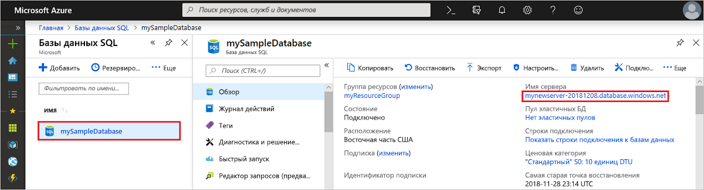
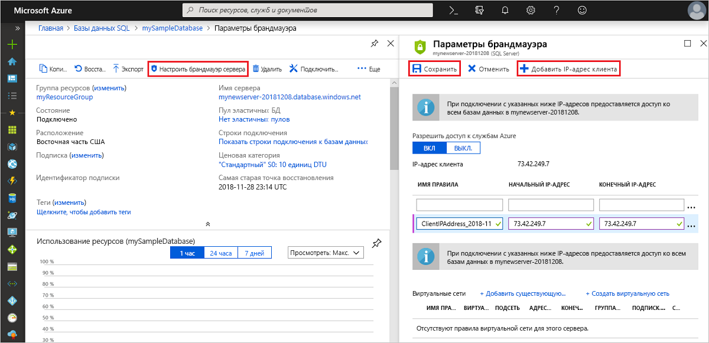

# Краткое руководство. Создание правила брандмауэра на уровне сервера с помощью портала Azure
[!INCLUDE[appliesto-sqldb](../includes/appliesto-sqldb.md)]

В этом кратком руководстве описано, как создать на портале Azure [правило брандмауэра на уровне сервера](firewall-configure.md) для Базы данных SQL Azure, чтобы получить возможность подключаться к [логическим серверам SQL Server](logical-servers.md) и отдельным базам данных, а также эластичным пулам и входящим в их состав базам данных. При подключении из других ресурсов Azure и из локальных ресурсов нужно настроить правило брандмауэра. Правила брандмауэра уровня сервера не применяются к управляемому экземпляру SQL Azure.

## Предварительные требования

В этом кратком руководстве в качестве начальной точки используются ресурсы, созданные в статье о [создании отдельной базы данных с помощью портала Azure](single-database-create-quickstart.md).

## Вход на портал Azure

Войдите на [портал Azure](https://portal.azure.com/).

## Создание правила брандмауэра для IP-адресов на уровне сервера

 База данных SQL создает брандмауэр на уровне сервера для отдельных баз данных и баз данных в пуле. Если вы не создадите правило брандмауэра для IP-адресов для открытия брандмауэра, он не позволит клиентским приложениям подключиться к серверу или к любым базам данных. Для подключения с IP-адреса за пределами Azure создайте правило брандмауэра для конкретного IP-адреса или диапазона адресов, к которым вы хотите подключаться. Дополнительные сведения о правилах брандмауэра для IP-адресов уровня сервера и базы данных см. в [этой статье](firewall-configure.md).

> [!NOTE]
> База данных SQL обменивается данными через порт 1433. Если вы пытаетесь подключиться из корпоративной сети, то сетевой брандмауэр может запретить исходящий трафик через порт 1433. В таком случае вы не сможете подключиться к серверу, пока ваш ИТ-отдел не откроет порт 1433.
> [!IMPORTANT]
> Правило брандмауэра 0.0.0.0 позволяет всем службам Azure пропустить правило брандмауэра уровня сервера и пытаться подключиться к базе данных через сервер.

Выполните следующие действия, чтобы создать на уровне сервера правило брандмауэра для IP-адреса вашего клиента и разрешить внешнее подключение через брандмауэр Базы данных SQL только с вашего IP-адреса.

1. Завершив развертывание [базы данных](#prerequisites), щелкните в меню слева раздел **Базы данных SQL** и выберите **mySampleDatabase** на странице **Базы данных SQL**. После этого откроется страница обзора базы данных, где будет указано полное имя сервера (например, **mynewserver-20170824.database.windows.net**) и предоставлены параметры для дальнейшей настройки.

2. Скопируйте полное имя сервера, которое понадобится вам при роботе с последующими руководствами для подключения к серверу и связанным базам данных.

   

3. На панели инструментов щелкните **Настройка брандмауэра для сервера**. Откроется страница **Параметры брандмауэра** сервера.

   

4. На панели инструментов выберите **Добавить IP-адрес клиента**, чтобы добавить текущий IP-адрес в новое правило брандмауэра для IP-адресов на уровне сервера. С использованием правила брандмауэра для IP-адресов на уровне сервера вы можете открыть порт 1433 для одного IP-адреса или диапазона IP-адресов.

   > [!IMPORTANT]
   > Доступ через брандмауэр Базы данных SQL Azure отключен по умолчанию для всех служб Azure. Чтобы включить его, задайте состояние **вкл.**
   >

5. Щелкните **Сохранить**. Для текущего IP-адреса будет создано правило брандмауэра уровня сервера, с помощью которого можно открыть порт 1433 сервера.

6. Закройте страницу **Параметры брандмауэра**.

Теперь вы можете подключаться с этого IP-адреса к серверу и его базам данных с помощью SQL Server Management Studio или другого средства по вашему усмотрению, используя созданную ранее учетную запись администратора сервера.

## Очистка ресурсов

Сохраните эти ресурсы, если вы планируете перейти к [дальнейшим действиям](#next-steps) и узнать о различных методах подключения к базе данных и отправки запросов к ней. Если вы все-таки решите удалить ресурсы, созданные в этом кратком руководстве, выполните следующие действия.

1. На портале Azure в меню слева щелкните **Группы ресурсов**, а затем выберите **myResourceGroup**.
2. На странице группы ресурсов щелкните **Удалить**, в текстовом поле введите **myResourceGroup** и выберите **Удалить**.

## Дальнейшие действия

- Теперь, когда у вас есть база данных, вы можете [подключиться и создать запрос](connect-query-content-reference-guide.md), используя одно из привычных средств или языков, в том числе
  - [подключиться и создать запрос с помощью SQL Server Management Studio](connect-query-ssms.md);
  - [подключиться и создать запрос с помощью Azure Data Studio](/sql/azure-data-studio/quickstart-sql-database?toc=/azure/sql-database/toc.json).
- Научитесь разрабатывать базы данных, создавать таблицы и вставлять данные при помощи одного из следующих руководств:
  - [Руководство. Разработка первой базы данных SQL Azure с использованием SSMS](design-first-database-tutorial.md)
  - [Руководство. Проектирование базы данных SQL Azure и подключение к ней с помощью C# и ADO.NET](design-first-database-csharp-tutorial.md)
