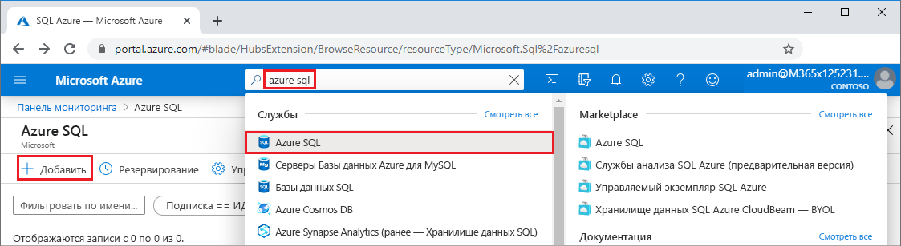
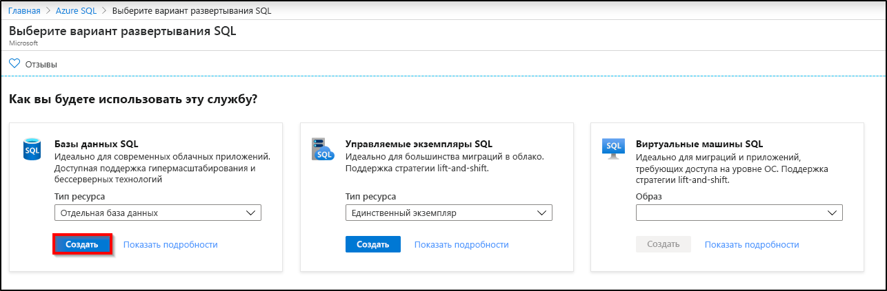
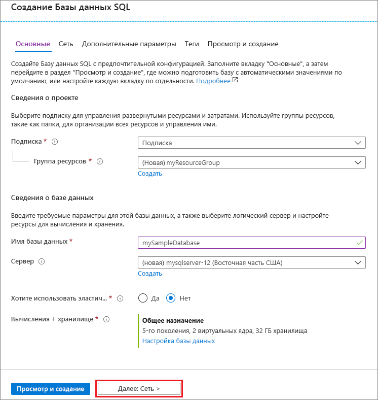
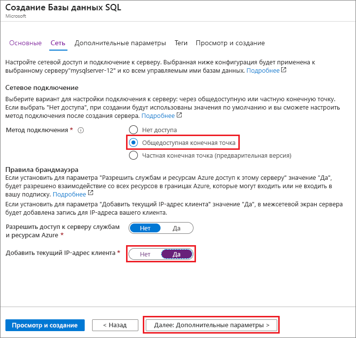
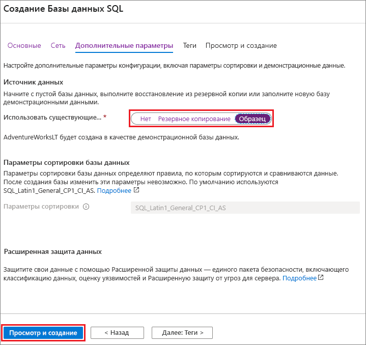

На этом шаге вы создадите [логический сервер SQL Server](../database/logical-servers.md) и [отдельную базу данных](../database/single-database-overview.md), в которой используются образцы данных AdventureWorksLT. Базу данных можно создать с помощью меню и экранов портала Azure либо с помощью Azure CLI или сценария PowerShell в Azure Cloud Shell.

Все эти методы предусматривают настройку правила брандмауэра на уровне сервера, чтобы открыть общедоступный IP-адрес компьютера, который вы используете для доступа к серверу. Дополнительные сведения о создании правил уровня брандмауэра сервера см. в разделе [Создание брандмауэра на уровне сервера](../database/firewall-create-server-level-portal-quickstart.md). Можно также задать правила брандмауэра на уровне базы данных. См. [Создание правила брандмауэра уровня базы данных](/sql/relational-databases/system-stored-procedures/sp-set-database-firewall-rule-azure-sql-database).

# <a name="portal"></a>[Портал](#tab/azure-portal)

Чтобы создать группу ресурсов, сервер и отдельную базу данных на портале Azure:

1. Войдите на [портал](https://portal.azure.com).
1. В строке поиска найдите и выберите **Azure SQL**.
1. На странице **Azure SQL** выберите **Добавить**.

   

1. На странице **Выберите вариант развертывания SQL** выберите плитку **Базы данных SQL** и **Одна база данных** в **Тип ресурса**. Чтобы просмотреть дополнительные сведения о различных базах данных, выберите **Показать подробности**.
1. Нажмите кнопку **создания**.

   

1. На вкладке **Основные сведения** формы **Создание базы данных SQL** в разделе **Сведения о проекте** выберите подходящую **подписку Azure** если она еще не выбрана.
1. В разделе **Группа ресурсов** выберите **Создать**, введите *myResourceGroup* и нажмите кнопку **ОК**.
1. В разделе **Сведения о базе данных** в поле **Имя базы данных** введите *mySampleDatabase*.
1. В группе **Сервер** выберите **Создать** и заполните форму **Новый сервер** следующим образом:
   - **Имя сервера**: Введите *mysqlserver* и добавьте еще символы, чтобы имя было уникальным.
   - **Имя для входа администратора сервера**. Введите *azureuser*.
   - **Пароль**. Введите пароль, соответствующий требованиям, и введите его еще раз в поле **Подтверждение пароля**.
   - **Расположение.** В раскрывающемся списке выберите расположение, например **(США) Восточная часть США**.

   Щелкните **ОК**.

   

   Запишите имя и пароль администратора сервера для входа на сервер и в его базы данных. Если вы забыли имя входа или пароль, узнать имя входа или сбросить пароль можно на странице **SQL Server** после создания базы данных. Чтобы открыть страницу **SQL Server**, выберите имя сервера на странице **Обзор** для базы данных.

1. Если вы хотите изменить параметры по умолчанию, в разделе **Compute + storage** (Вычисления и хранение) выберите **Настроить базу данных**.

   На странице **Настройка** можно дополнительно:
   - Изменить **Уровень вычислений** с **Подготовленный** на **Без сервера**.
   - Проверить и измените параметры **Виртуальные ядра** и **Максимальный размер данных**.
   - Выберите **Изменить конфигурацию**, чтобы изменить создание оборудования.

   После внесения изменений нажмите кнопку **Применить**.

1. По завершении выберите **Next: Networking** (Далее: сеть) в нижней части экрана.

   

1. На вкладке **Сеть** в разделе **Метод подключения** выберите **Общедоступная конечная точка**.
1. В разделе **Правила брандмауэра** установите переключатель **Добавить текущий IP-адрес клиента** в положение **Да**.
1. По завершении выберите **Next: Additional settings** (Далее: дополнительные параметры) в нижней части страницы.

   
  
   Дополнительные сведения о параметрах брандмауэра см. в разделе [Управление доступом к сети для базы данных SQL Azure и хранилища данных](../database/network-access-controls-overview.md) и [Что такое частная конечная точка Azure?](../database/private-endpoint-overview.md).

1. На вкладке **Дополнительные параметры** в разделе **Источник данных** для параметра **Использовать существующие данные** выберите значение **Пример**.
1. В нижней части страницы выберите **Review + create** (Проверить и создать).

   

1. Проверив параметры, нажмите кнопку **Создать**.

# <a name="azure-cli"></a>[Azure CLI](#tab/azure-cli)

Создать группу ресурсов Azure, сервер и отдельную базу данных можно с помощью интерфейса командной строки Azure (Azure CLI). Если вы не хотите использовать Azure Cloud Shell, [установите Azure CLI](/cli/azure/install-azure-cli) на компьютере.

Чтобы запустить следующий пример кода в Azure Cloud Shell, нажмите **Попробовать** в строке заголовка примера кода. После открытия Cloud Shell выберите **Копировать** в строке заголовка примера кода и вставьте пример кода в окно Cloud Shell. В коде замените `<Subscription ID>` идентификатором подписки Azure, а для `$startip` и `$endip` замените `0.0.0.0` общедоступным IP-адресом используемого компьютера.

Следуйте инструкциям на экране, чтобы войти в Azure и запустить код.

Можно также использовать Azure Cloud Shell из портала Azure, щелкнув значок Cloud Shell на верхней панели.

   

При первом использовании Cloud Shell на портале выберите **Bash** в диалоговом окне **Добро пожаловать**. В последующих сеансах Azure CLI будет использоваться в среде Bash, или же можно выбрать **Bash** в панели управления Cloud Shell.

Приведенный ниже код Azure CLI создает группу ресурсов Azure, сервер, отдельную базу данных и правило брандмауэра для IP-адресов на уровне сервера для доступа к серверу. Обязательно запишите созданные имена группы ресурсов и сервера, чтобы впоследствии можно было управлять этими ресурсами.

```azurecli-interactive
#!/bin/bash

# Sign in to Azure and set execution context (if necessary)
az login
az account set --subscription <Subscription ID>

# Set the resource group name and location for your server
resourceGroupName=myResourceGroup-$RANDOM
location=westus2

# Set an admin login and password for your database
adminlogin=azureuser
password=Azure1234567

# Set a server name that is unique to Azure DNS (<server_name>.database.windows.net)
servername=server-$RANDOM

# Set the ip address range that can access your database
startip=0.0.0.0
endip=0.0.0.0

# Create a resource group
az group create \
    --name $resourceGroupName \
    --location $location

# Create a server in the resource group
az sql server create \
    --name $servername \
    --resource-group $resourceGroupName \
    --location $location  \
    --admin-user $adminlogin \
    --admin-password $password

# Configure a server-level firewall rule for the server
az sql server firewall-rule create \
    --resource-group $resourceGroupName \
    --server $servername \
    -n AllowYourIp \
    --start-ip-address $startip \
    --end-ip-address $endip

# Create a gen5 2 vCore database in the server
az sql db create \
    --resource-group $resourceGroupName \
    --server $servername \
    --name mySampleDatabase \
    --sample-name AdventureWorksLT \
    --edition GeneralPurpose \
    --family Gen5 \
    --capacity 2 \
```

В приведенном выше коде используются следующие команды Azure CLI.

| Get-Help | Описание |
|---|---|
| [az account set](/cli/azure/account?view=azure-cli-latest#az-account-set) | Позволяет указать подписку в качестве текущей активной подписки. |
| [az group create](/cli/azure/group#az-group-create) | Создает группу ресурсов, в которой хранятся все ресурсы. |
| [az sql server create](/cli/azure/sql/server#az-sql-server-create) | Создает сервер, на котором размещены базы данных и эластичные пулы. |
| [az sql server firewall-rule create](/cli/azure/sql/server/firewall-rule##az-sql-server-firewall-rule-create) | Создает правило брандмауэра на уровне сервера. |
| [az sql db create](/cli/azure/sql/db#az-sql-db-create?view=azure-cli-latest) | Создает базу данных. |

Дополнительные примеры Azure CLI для базы данных SQL Azure см. в разделе [Примеры для Azure CLI](../database/az-cli-script-samples-content-guide.md).

# <a name="powershell"></a>[PowerShell](#tab/azure-powershell)

Создать группу ресурсов, сервер и отдельную базу данных можно с помощью Windows PowerShell. Если вы не хотите использовать Azure Cloud Shell, [установите модуль Azure PowerShell](/powershell/azure/install-az-ps).

[!INCLUDE [updated-for-az](../../../includes/updated-for-az.md)]

Чтобы запустить следующий пример кода в Azure Cloud Shell, нажмите **Попробовать** в строке заголовка кода. После открытия Cloud Shell выберите **Копировать** в строке заголовка примера кода и вставьте пример кода в окно Cloud Shell. В коде замените `<Subscription ID>` идентификатором подписки Azure, а для `$startIp` и `$endIp` замените `0.0.0.0` общедоступным IP-адресом используемого компьютера.

Следуйте инструкциям на экране, чтобы войти в Azure и запустить код.

Можно также использовать Azure Cloud Shell из портала Azure, щелкнув значок Cloud Shell на верхней панели.

   

При первом использовании Cloud Shell на портале выберите **PowerShell** в диалоговом окне **Добро пожаловать**. В последующих сеансах будет использоваться PowerShell, или его можно выбрать на панели управления Cloud Shell.

Приведенный ниже код PowerShell создает группу ресурсов Azure, сервер, отдельную базу данных и правило брандмауэра для доступа к серверу. Обязательно запишите созданные имена группы ресурсов и сервера, чтобы впоследствии можно было управлять этими ресурсами.

   ```powershell-interactive
   # Set variables for your server and database
   $subscriptionId = '<SubscriptionID>'
   $resourceGroupName = "myResourceGroup-$(Get-Random)"
   $location = "West US"
   $adminLogin = "azureuser"
   $password = "Azure1234567"
   $serverName = "mysqlserver-$(Get-Random)"
   $databaseName = "mySampleDatabase"

   # The ip address range that you want to allow to access your server
   $startIp = "0.0.0.0"
   $endIp = "0.0.0.0"

   # Show randomized variables
   Write-host "Resource group name is" $resourceGroupName
   Write-host "Server name is" $serverName

   # Connect to Azure
   Connect-AzAccount

   # Set subscription ID
   Set-AzContext -SubscriptionId $subscriptionId

   # Create a resource group
   Write-host "Creating resource group..."
   $resourceGroup = New-AzResourceGroup -Name $resourceGroupName -Location $location -Tag @{Owner="SQLDB-Samples"}
   $resourceGroup

   # Create a server with a system wide unique server name
   Write-host "Creating primary server..."
   $server = New-AzSqlServer -ResourceGroupName $resourceGroupName `
      -ServerName $serverName `
      -Location $location `
      -SqlAdministratorCredentials $(New-Object -TypeName System.Management.Automation.PSCredential `
      -ArgumentList $adminLogin, $(ConvertTo-SecureString -String $password -AsPlainText -Force))
   $server

   # Create a server firewall rule that allows access from the specified IP range
   Write-host "Configuring firewall for primary server..."
   $serverFirewallRule = New-AzSqlServerFirewallRule -ResourceGroupName $resourceGroupName `
      -ServerName $serverName `
      -FirewallRuleName "AllowedIPs" -StartIpAddress $startIp -EndIpAddress $endIp
   $serverFirewallRule

   # Create General Purpose Gen4 database with 1 vCore
   Write-host "Creating a gen5 2 vCore database..."
   $database = New-AzSqlDatabase  -ResourceGroupName $resourceGroupName `
      -ServerName $serverName `
      -DatabaseName $databaseName `
      -Edition GeneralPurpose `
      -VCore 2 `
      -ComputeGeneration Gen5 `
      -MinimumCapacity 2 `
      -SampleName "AdventureWorksLT"
   $database
   ```

В приведенном выше коде используются следующие командлеты PowerShell:

| Get-Help | Примечания |
|---|---|
| [New-AzResourceGroup](/powershell/module/az.resources/new-azresourcegroup) | Создает группу ресурсов, в которой хранятся все ресурсы. |
| [New-AzSqlServer](/powershell/module/az.sql/new-azsqlserver) | Создает сервер, на котором размещены базы данных и эластичные пулы. |
| [New-AzSqlServerFirewallRule](/powershell/module/az.sql/new-azsqlserverfirewallrule) | Создает для сервера правило брандмауэра на уровне сервера. |
| [New-AzSqlDatabase](/powershell/module/az.sql/new-azsqldatabase) | Создает базу данных. |

Дополнительные примеры PowerShell для Базы данных SQL Azure см. в разделе [Примеры сценариев Azure PowerShell](../database/powershell-script-content-guide.md).

---
