# Краткое руководство. Создание управляемого экземпляра Управляемого экземпляра SQL
[!INCLUDE[appliesto-sqlmi](../includes/appliesto-sqlmi.md)]

В этом кратком руководстве описано, как создать управляемый экземпляр [Управляемого экземпляра SQL Azure](sql-managed-instance-paas-overview.md) на портале Azure.

> [!IMPORTANT]
> Сведения об ограничениях см. в разделах [Поддерживаемые регионы](resource-limits.md#supported-regions) и [Поддерживаемые типы подписок](resource-limits.md#supported-subscription-types).

## Создание управляемого экземпляра

Чтобы создать управляемый экземпляр, сделайте следующее. 

### Вход на портал Azure

Если у вас еще нет подписки Azure, [создайте бесплатную учетную запись](https://azure.microsoft.com/free/).

1. Войдите на [портал Azure](https://portal.azure.com/).
1. Выберите **Azure SQL** в левом меню портала Azure. Если **Azure SQL** отсутствует в списке, выберите **Все службы** , а затем введите **Azure SQL** в поле поиска.
1. Выберите **Добавить** , чтобы открыть страницу **выбора варианта развертывания SQL** . Вы можете просмотреть дополнительные сведения об Управляемом экземпляре SQL Azure, щелкнув **Показать подробности** на плитке **Управляемые экземпляры SQL** .
1. Нажмите кнопку **создания** .

   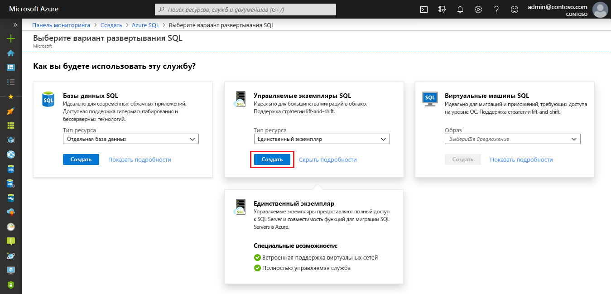

4. Укажите необходимую и дополнительную информацию о будущем Управляемом экземпляре на вкладках в форме подготовки **Создание Управляемого экземпляра SQL Azure** . Эти вкладки описываются в разделах ниже.

### Вкладка "Основные сведения"

- Укажите обязательные сведения, требуемые на вкладке **Основные сведения** . Это минимальный набор необходимых сведений для подготовки управляемого экземпляра.

   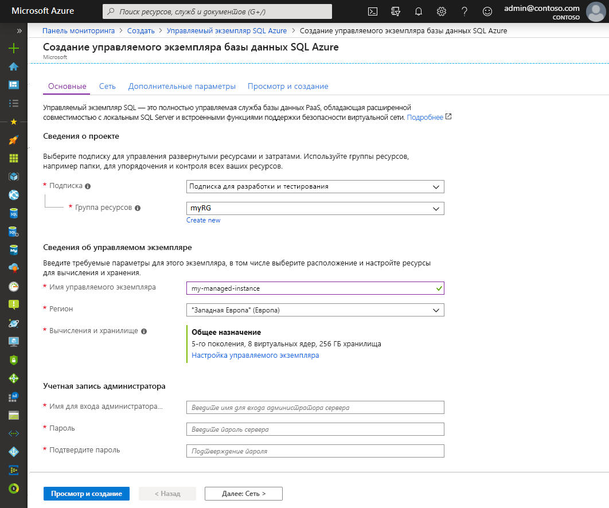

   Используйте приведенную ниже таблицу в качестве справочной информации, необходимой на этой вкладке.

   | Параметр| Рекомендуемое значение | Описание |
   | ------ | --------------- | ----------- |
   | **Подписка** | Ваша подписка | Подписка, которая дает вам разрешение на создание ресурсов |
   | **Группа ресурсов** | Новая или существующая группа ресурсов.|Допустимые имена групп ресурсов см. в статье о [правилах и ограничениях именования](/azure/architecture/best-practices/resource-naming).|
   | **Имя управляемого экземпляра** | Любое допустимое имя|Сведения о допустимых именах см. в статье [Соглашения об именовании](/azure/architecture/best-practices/resource-naming).|
   | **Регион** |Регион, в котором хотите создать управляемый экземпляр.|Дополнительные сведения о регионах Azure см. [здесь](https://azure.microsoft.com/regions/).|
   | **Имя для входа администратора управляемого экземпляра** | Любое допустимое имя пользователя | Сведения о допустимых именах см. в статье [Соглашения об именовании](/azure/architecture/best-practices/resource-naming). Не используйте serveradmin. Это имя зарезервировано для роли уровня сервера.|
   | **Пароль** | Любой допустимый пароль| Пароль должен включать минимум 16 символов и соответствовать [определенным требованиям к сложности](../../virtual-machines/windows/faq.md#what-are-the-password-requirements-when-creating-a-vm).|

- Выберите **Настроить управляемый экземпляр** для определения размера вычислительных ресурсов и ресурсов хранения, а также для просмотра ценовой категории. Укажите нужный объем хранилища и количество виртуальных ядер, используя ползунки или текстовые поля. По завершении щелкните **Применить** для сохранения выбранных параметров. 

   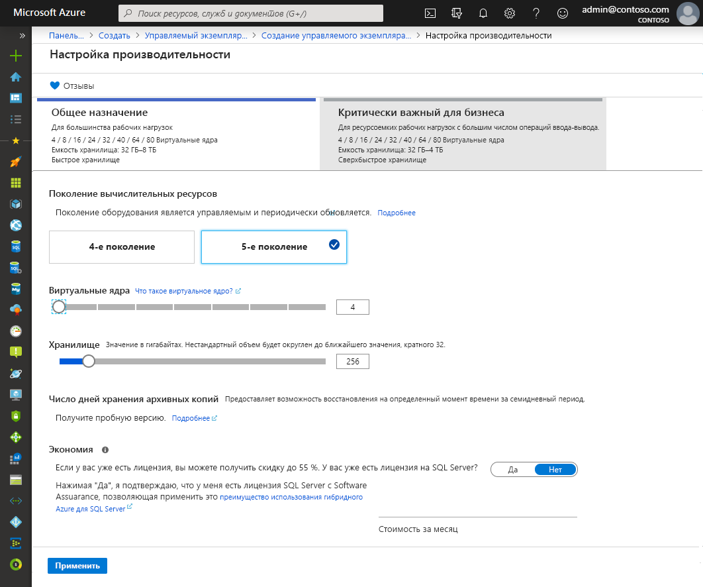

- Чтобы проверить выбранные параметры перед созданием Управляемого экземпляра SQL, нажмите **Просмотр и создание** . Или настройте сетевые параметры, выбрав **Далее: сеть** .

### Вкладка "Сеть"

- Заполните дополнительные сведения на вкладке **Сетевые подключения** . Если пропустить эти сведения, на портале будут применяться параметры по умолчанию.

   

   Используйте приведенную ниже таблицу в качестве справочной информации, необходимой на этой вкладке.

   | Параметр| Рекомендуемое значение | Описание |
   | ------ | --------------- | ----------- |
   | **Виртуальная сеть** | Щелкните **Создать виртуальную сеть** или выберите допустимую виртуальную сеть и подсеть.| Если поля сети и подсети недоступны, прежде чем выбирать эти значения в качестве целевого объекта для нового управляемого экземпляра, нужно [изменить их в соответствии с требованиями сети](vnet-existing-add-subnet.md). См. статью [Настройка виртуальной сети для Управляемого экземпляра SQL](connectivity-architecture-overview.md). |
   | **Тип подключения:** | Выберите тип соединения: прокси-сервер или перенаправление.|[Подробнее о типах соединений, используемых для создания Управляемых экземпляров SQL Azure.](../database/connectivity-architecture.md#connection-policy)|
   | **Общедоступная конечная точка**  | Нажмите кнопку **Включить** . | Для того, чтобы управляемый экземпляр был доступен через конечную точку общедоступных данных, необходимо включить эту опцию. | 
   | **Разрешить доступ из** (если **Общедоступная конечная точка** включена) | Выберите один из способов.   |Использование портала позволяет настроить группу безопасности с помощью общедоступной конечной точки.     Выберите один из следующих вариантов, соответствующий вашему сценарию.   <ul> <li>**Службы Azure** : Мы рекомендуем эту опцию при подключении через Power BI или другую многопользовательскую службу. </li> <li> **Интернет** . Используйте для тестирования, если вы хотите быстро запустить управляемый экземпляр. Мы не рекомендуем использовать его для рабочих сред. </li> <li> **Нет доступа** : Эта опция создает правило безопасности **Запретить** . Измените это правило, чтобы сделать управляемый экземпляр доступным через общедоступную конечную точку. </li> </ul>   [Подробнее о безопасном использовании Управляемого экземпляра SQL Azure с помощью общедоступной конечной точки.](public-endpoint-overview.md)|

- Выберите **Проверка и создание** , чтобы проверить выбор перед созданием управляемого экземпляра. Или настройте дополнительные пользовательские параметры, выбрав **Далее: Дополнительные параметры** .

### Дополнительные параметры

- Заполните дополнительные сведения на вкладке **Дополнительные настройки** . Если пропустить эти сведения, на портале будут применяться параметры по умолчанию.

   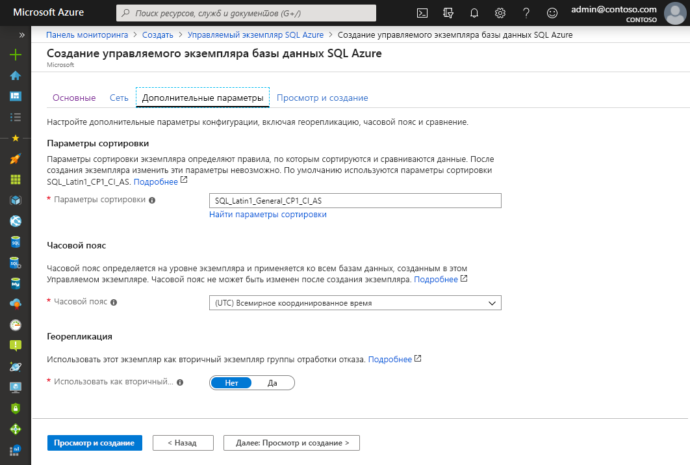

   Используйте приведенную ниже таблицу в качестве справочной информации, необходимой на этой вкладке.

   | Параметр| Рекомендуемое значение | Описание |
   | ------ | --------------- | ----------- |
   | **Параметры сортировки** | Выберите параметры сортировки, которые вы хотите использовать для управляемого экземпляра. При переносе баз данных SQL Server необходимо проверить параметры сортировки источника с помощью `SELECT SERVERPROPERTY(N'Collation')` и использовать это значение.| Сведения о параметрах сортировки см. в статье [Задание или изменение параметров сортировки сервера](/sql/relational-databases/collations/set-or-change-the-server-collation).|   
   | **Часовой пояс** | Выберите для управляемого экземпляра нужный часовой пояс.|Дополнительные сведения см. в статье о [часовых поясах](timezones-overview.md).|
   | **Использовать как дополнительную отработку отказа** | Выберите **Да** . | Включите эту опцию, чтобы использовать управляемый экземпляр в качестве дополнительной группы отработки отказа.|
   | **Первичный Управляемый экземпляр SQL** (если для параметра **Использовать как дополнительную отработку отказа** выбрано значение **Да** ) | Выберите существующий первичный управляемый экземпляр, который будет присоединен в той же зоне DNS к создаваемому управляемому экземпляру. | Этот шаг включит конфигурацию после создания группы отработки отказа. Дополнительные сведения см. в статье [Учебник. Добавление управляемого экземпляра в группу отработки отказа](failover-group-add-instance-tutorial.md).|

## Отзыв и создание

1. Чтобы проверить выбранные параметры перед созданием управляемого экземпляра, перейдите на вкладку **Просмотр и создание** .

   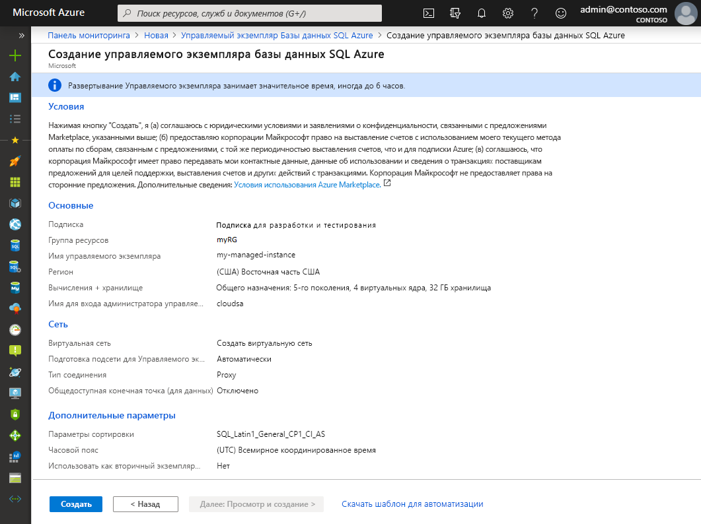

1. Выберите **Создать** , чтобы начать подготовку управляемого экземпляра.

> [!IMPORTANT]
> Развертывание управляемого экземпляра — это длительная операция. Развертывание первого экземпляра в подсети обычно занимает гораздо больше времени, чем развертывание в подсети с существующими управляемыми экземплярами. Среднее время подготовки см. в информации об [операциях управления Управляемыми экземплярами SQL](sql-managed-instance-paas-overview.md#management-operations).

## Мониторинг хода выполнения развертывания

1. Щелкните значок **Уведомления** , чтобы просмотреть состояние развертывания.

   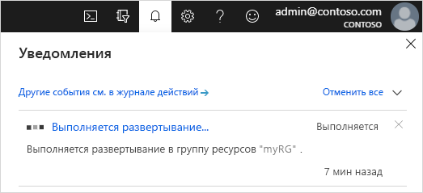

1. Щелкните по ссылке **Выполняется развертывание** в уведомлении, чтобы открыть окно Управляемого экземпляра SQL и следить за подробной информацией о ходе развертывания. 

> [!TIP]
> Если вы закрыли веб-браузер или окно с ходом выполнения развертывания, выполните следующие действия, чтобы вернуться к экрану хода развертывания:
> 1. На портале Azure откройте группу ресурсов (на вкладке **Основные сведения** ), в которой развертывается Управляемый экземпляр SQL.
> 2. Выберите **Развертывания** .
> 3. Выберите выполняемую операцию развертывания Управляемого экземпляра SQL.

> [!IMPORTANT]
> - Создание Управляемого экземпляра SQL — это длительный процесс, на завершение которого может потребоваться несколько часов в зависимости от условий. Сведения о стандартном времени создания см. в разделе [Длительность операций управления](management-operations-overview.md#duration).
> - Запуск создания Управляемого экземпляра SQL можно отложить в тех случаях, когда выполняются другие ресурсоемкие операции, например восстановления или масштабирования, на других управляемых экземплярах в этой же подсети. Дополнительные сведения см. в статье [Перекрестное влияние операций управления](management-operations-overview.md#management-operations-cross-impact).
> - Чтобы узнать состояние создания управляемого экземпляра, вам потребуются **разрешения на чтение** для группы ресурсов. Если у вас нет этого разрешения или вы отменили его при создании управляемого экземпляра, Управляемый экземпляр SQL может не отображаться в списке развертываний в группе ресурсов.
>

## Просмотр созданных ресурсов

Чтобы просмотреть созданные ресурсы после успешного развертывания управляемого экземпляра, сделайте следующее.

1. Откройте группу ресурсов для управляемого экземпляра. 

   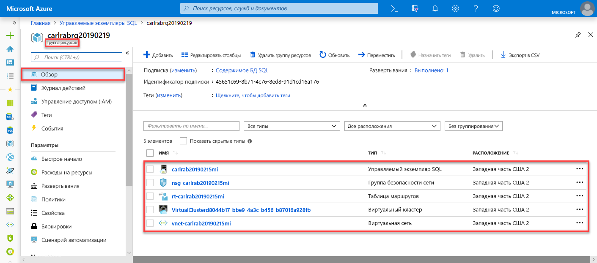

## Просмотр и точная настройка параметров сети

Чтобы точно настроить параметры сети, проверьте приведенные ниже параметры.

1. Выберите таблицу маршрутов, чтобы просмотреть созданный для вас пользовательский маршрут UDR.

   

2. В таблице маршрутизации просмотрите записи маршрутизации исходящего и внутреннего трафика виртуальной сети Управляемого экземпляра SQL. Если вы создаете или настраиваете таблицу маршрутизации вручную, обязательно создайте эти записи в таблице Управляемых экземпляров SQL.

   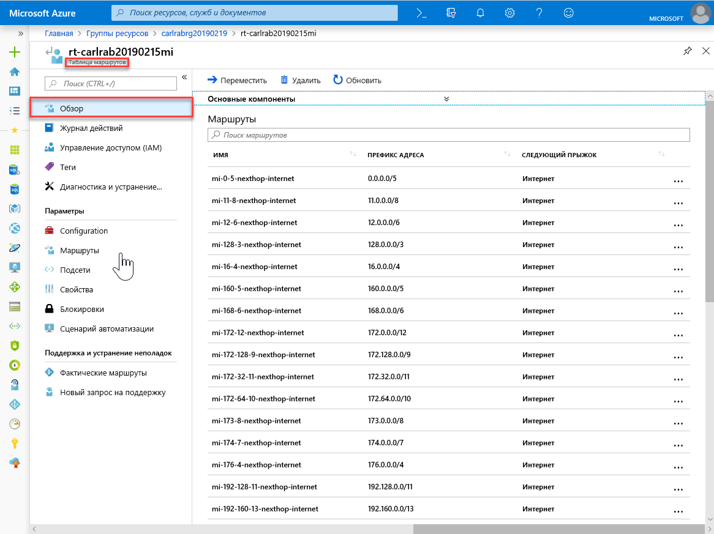

3. Вернитесь в группу ресурсов и выберите группу безопасности сети.

   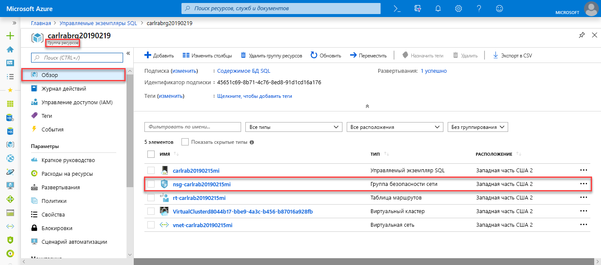

4. Просмотрите правила безопасности относительно входящего и исходящего трафика. 

   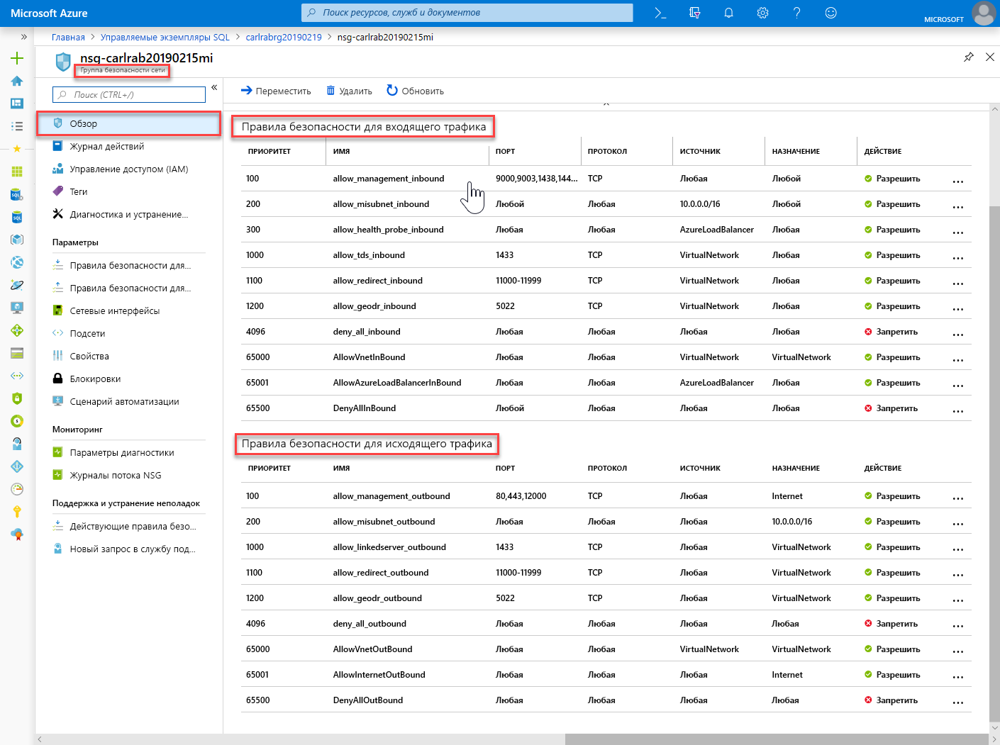

> [!IMPORTANT]
> Если вы настроили общедоступную конечную точку для Управляемого экземпляра SQL, необходимо открыть порты, чтобы разрешить сетевой трафик, разрешающий подключения к Управляемому экземпляру SQL из общедоступного сегмента Интернета. См. раздел [Разрешение трафика общедоступной конечной точки в группе безопасности сети](public-endpoint-configure.md#allow-public-endpoint-traffic-on-the-network-security-group).
>

## Получение сведений о подключении к Управляемому экземпляру SQL

Чтобы подключиться к Управляемому экземпляру SQL, нужно получить имя узла и полное доменное имя (FQDN). Для этого сделайте следующее.

1. Вернитесь в группу ресурсов и выберите свой управляемый экземпляр.

   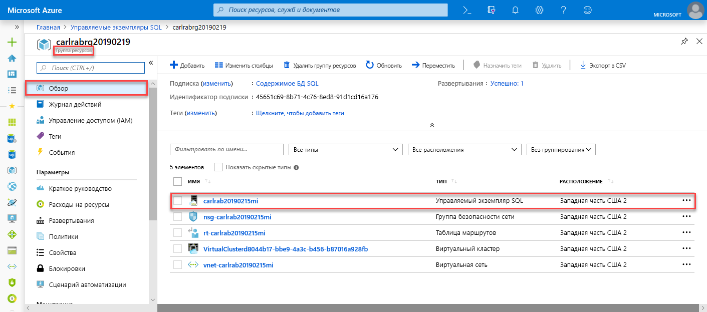

2. На вкладке **Обзор** найдите свойство **Узел** . Скопируйте имя узла управляемого экземпляра для использования в следующем кратком руководстве.

   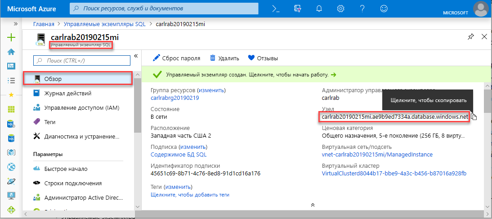

   Скопированное значение — это полное доменное имя (FQDN), которое можно использовать для подключения к Управляемому экземпляру SQL. Оно похоже на следующий пример адреса: *your_host_name.a1b2c3d4e5f6.database.windows.net* .

## Дальнейшие действия

Узнайте, как подключиться к Управляемому экземпляру SQL:
- Обзор вариантов подключения для приложений см. в статье [Подключение приложений к Управляемому экземпляру SQL](connect-application-instance.md).
- См. статью [Краткое руководство. Настройка виртуальной машины Azure для подключения к Управляемому экземпляру SQL](connect-vm-instance-configure.md).
- См. статью [Краткое руководство. Настройка подключения "точка — сеть" к Управляемому экземпляру SQL с локального клиентского компьютера](point-to-site-p2s-configure.md).

Чтобы восстановить существующую базу данных SQL Server из локальной среды в Управляемый экземпляр SQL, сделайте следующее: 
- Используйте [Azure Database Migration Service для миграции](../../dms/tutorial-sql-server-to-managed-instance.md) для восстановления из файла резервной копии базы данных. 
- Дополнительные сведения о восстановлении из файла резервной копии базы данных см. в статье [Краткое руководство. Восстановление базы данных в Управляемый экземпляр](restore-sample-database-quickstart.md).

Сведения о расширенном мониторинге производительности базы данных Управляемого экземпляра SQL с использованием встроенных средств анализа проблем см. в статье о [мониторинге Управляемого экземпляра SQL Azure с помощью Аналитики SQL Azure](../../azure-monitor/insights/azure-sql.md).