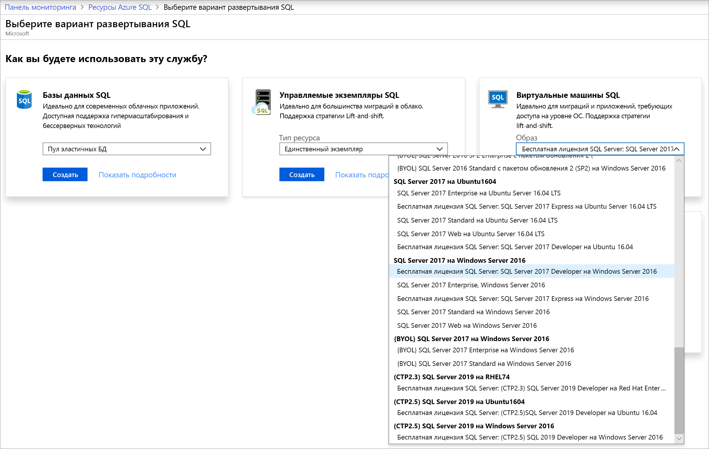
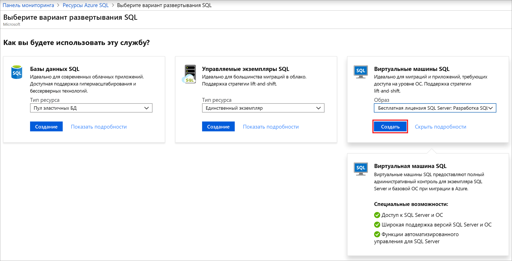
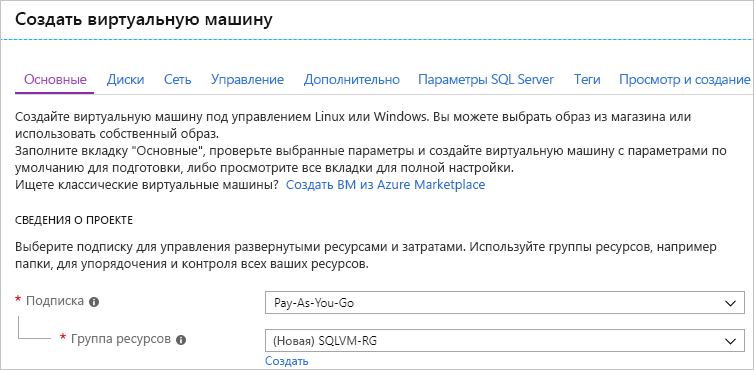
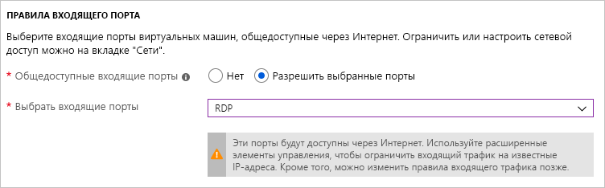
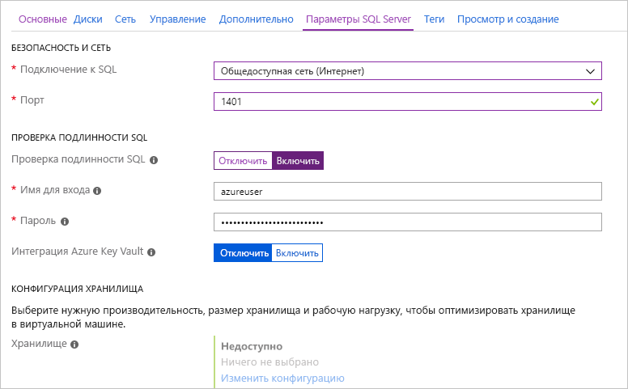
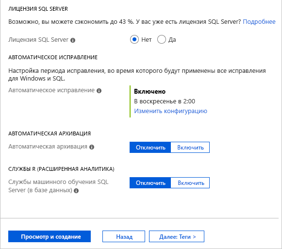
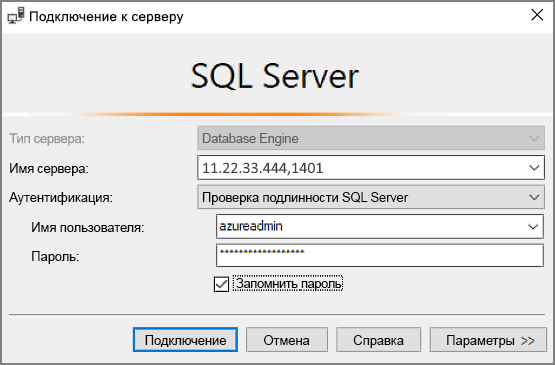

# Краткое руководство. Создание виртуальной машины SQL Server 2017 на платформе Windows с помощью портала Azure

[!INCLUDE[appliesto-sqlvm](../../includes/appliesto-sqlvm.md)]

> [!div class="op_single_selector"]
> * [Windows](sql-vm-create-portal-quickstart.md)
> * [Linux](../linux/sql-vm-create-portal-quickstart.md)

В этом кратком руководстве перечислены основные действия по созданию виртуальной машины SQL Server с помощью портала Azure.

  > [!TIP]
  > - В этом кратком руководстве приводятся инструкции по быстрой подготовке виртуальной машины SQL Server и подключению к ней. Дополнительные сведения о других вариантах подготовки виртуальных машин SQL Server см. в статье [Как подготовить виртуальную машину SQL Server на платформе Windows на портале Azure](create-sql-vm-portal.md).
  > - Если у вас есть вопросы по виртуальным машинам SQL Server, см. раздел [часто задаваемых вопросов](frequently-asked-questions-faq.md).

##  Оформление подписки Azure

Если у вас еще нет подписки Azure, [создайте бесплатную учетную запись](https://azure.microsoft.com/free/?WT.mc_id=A261C142F), прежде чем начинать работу.

##  Выбор образа виртуальной машины SQL Server

1. Войдите на [портал Azure](https://portal.azure.com), используя свои учетные данные.

1. На портале Azure в меню слева выберите **Azure SQL**. Если **Azure SQL** отсутствует в списке, выберите **Все службы** и в поле поиска введите *Azure SQL*.
1. Выберите **Добавить**, чтобы открыть страницу **выбора варианта развертывания SQL**. Чтобы просмотреть дополнительные сведения, щелкните **Показать подробности** на плитке **Виртуальные машины SQL**.
1. Выберите образ **Free SQL Server License: SQL Server 2017 Developer on Windows Server 2016** (Бесплатная лицензия на SQL Server: SQL Server 2017 Developer на базе Windows Server 2016) в раскрывающемся списке.

   

1. Нажмите кнопку **создания**.

   

##  Указание основных сведений

На вкладке **Основные сведения** укажите следующую информацию.

1. В разделе **Сведения о проекте** выберите подписку Azure, а затем выберите **Создать**, чтобы создать группу ресурсов. В качестве имени введите _SQLVM-RG_.

   

1. В разделе **Сведения об экземпляре**:
    1. Введите _SQLVM_ для параметра **Имя виртуальной машины**. 
    1. Выберите расположение для параметра **Регион**. 
    1. В этом кратком руководстве оставьте для **параметров доступности** значение _Избыточность инфраструктуры не требуется_. См. подробнее о [регионах и доступности виртуальных машин в Azure](../../../virtual-machines/windows/availability.md). 
    1. В списке **Образ** выберите _Free SQL Server License: SQL Server 2017 Developer on Windows Server 2016_ (Бесплатная лицензия на SQL Server: SQL Server 2017 Developer на базе Windows Server 2016). 
    1. Выберите **Изменить размер** для параметра **Размер** виртуальной машины, а затем выберите предложение **A2 Basic**. Обязательно очистите ресурсы после завершения работы с ними, чтобы предотвратить любые непредвиденные расходы. 

   

1. В разделе **Учетная запись администратора** укажите имя пользователя, например _azureuser_, и пароль. Пароль должен включать минимум 12 символов и соответствовать [определенным требованиям к сложности](../../../virtual-machines/windows/faq.md#what-are-the-password-requirements-when-creating-a-vm).

   

1. В разделе **Правила входящего порта** щелкните **Разрешить выбранные порты**, а затем выберите **RDP (3389)** из раскрывающегося списка. 

   

## Параметры SQL Server

На вкладке **Настройки SQL Server** настройте следующие параметры.

1. В разделе **Безопасность и сетевые подключения** выберите _Общедоступный (Интернет)_ для параметра **Подключение SQL** и измените порт на `1401`, чтобы не использовать хорошо известный номер порта в сценарии общедоступного подключения. 
1. В разделе **Проверка подлинности SQL** выберите значение **Включить**. В качестве учетных данных для входа SQL указаны имя пользователя и пароль, настроенные для виртуальной машины. Используйте для параметра [**Интеграция с Azure Key Vault**](azure-key-vault-integration-configure.md) значение по умолчанию. **Конфигурация хранилища** недоступна для базового образа виртуальной машины SQL Server, но дополнительные сведения о доступных параметрах для других образов можно найти в разделе о [настройке хранилища](storage-configuration.md#new-vms).  

   

1. При необходимости измените любые другие параметры, а затем выберите **Отзыв и создание**. 

   

## Создание виртуальной машины SQL Server

На вкладке **Отзыв и создание** просмотрите сводные данные и выберите **Создать**, чтобы создать SQL Server, группу ресурсов и ресурсы, указанные для этой виртуальной машины.

Развертывание можно отслеживать на портале Azure. Если нажать кнопку **Уведомления** в верхней части окна, будут показаны основные сведения о состоянии развертывания. Развертывание может занять несколько минут. 

## Подключение к SQL Server

1. На портале в разделе **Обзор** свойств виртуальной машины найдите **общедоступный IP-адрес** виртуальной машины SQL Server.

1. На другом компьютере, подключенном к сети Интернет, откройте [SQL Server Management Studio (SSMS)](/sql/ssms/download-sql-server-management-studio-ssms).

1. В диалоговом окне **Подключение к серверу** или **Подключение к ядру СУБД** измените значение **Имя сервера**. Введите общедоступный IP-адрес своей виртуальной машины. Затем добавьте запятую и введите пользовательский порт (**1401**), который был указан при настройке новой виртуальной машины. Например, `11.22.33.444,1401`.

1. В поле **Проверка подлинности** выберите **Проверка подлинности SQL Server**.

1. В поле **Имя пользователя** введите допустимое имя пользователя SQL.

1. В поле **Пароль** введите пароль для этого пользователя.

1. Выберите **Подключиться**.

    

##  Удаленный вход на виртуальную машину

Выполните следующие действия, чтобы подключиться к виртуальной машине SQL Server через удаленный рабочий стол.

[!INCLUDE [Connect to SQL Server VM with remote desktop](../../../../includes/virtual-machines-sql-server-remote-desktop-connect.md)]

После подключения к виртуальной машине SQL Server вы можете запустить SQL Server Management Studio и подключиться с проверкой подлинности Windows, используя свои учетные данные локального администратора. Если включена проверка подлинности SQL Server, можно также подключиться с проверкой подлинности SQL, используя имя пользователя и пароль SQL, настроенные во время подготовки.

Доступ к машине позволяет напрямую изменять настройки компьютера и SQL Server в зависимости от ваших требований. Например, можно настроить параметры брандмауэра или изменить параметры конфигурации SQL Server.

## Очистка ресурсов

Если не требуется, чтобы виртуальная машина SQL работала постоянно, можно избежать ненужных затрат, останавливая ее, когда она не используется. Кроме того, можно удалить без возможности восстановления все ресурсы, связанные с виртуальной машиной, удалив связанную с ней группу ресурсов на портале. Это также приведет к окончательному удалению самой виртуальной машины, поэтому указанную команду следует использовать с осторожностью. Дополнительные сведения см. в статье [Управление ресурсами Azure через портал](../../../azure-resource-manager/management/manage-resource-groups-portal.md).

## Дальнейшие действия

В этом кратком руководстве вы создали виртуальную машину SQL Server 2017 на портале Azure. Чтобы узнать больше о том, как перенести данные на новый сервер SQL Server, ознакомьтесь со следующей статьей.

> [!div class="nextstepaction"]
> [Миграция базы данных SQL Server в экземпляр SQL Server на виртуальной машине Azure](migrate-to-vm-from-sql-server.md)
