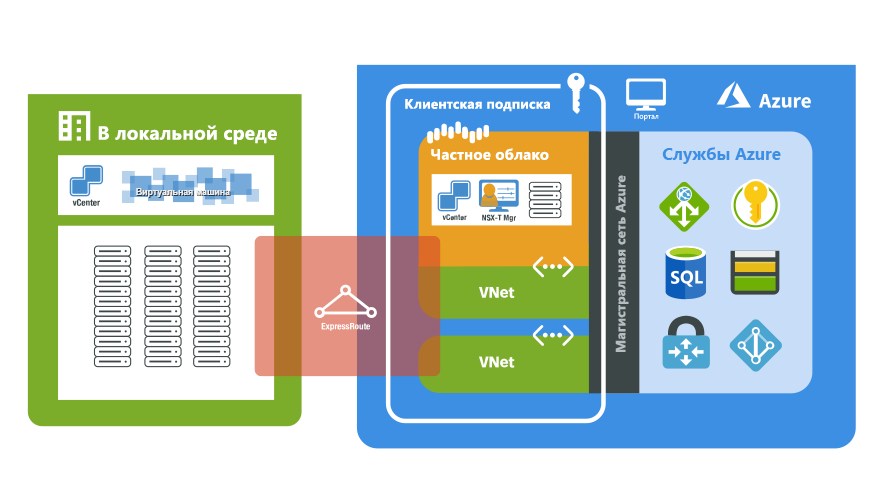

# Что такое Решение Azure VMware?

Решение Azure VMware предоставляет частные облака, содержащие кластеры vSphere, созданные на основе выделенной инфраструктуры Azure без операционной системы. Минимальное первоначальное развертывание должно включать три узла. Далее можно по одному добавлять дополнительные узлы, но не более 16 узлов на кластер.  Все частные облака подготавливаются к работе через vCenter Server, vSAN, vSphere и NSX-T. Вы можете перенести рабочие нагрузки из локальных сред, развернуть новые виртуальные машины и использовать службы Azure из частных облаков.

Решение Azure VMware подтверждено компанией VMware, которая постоянно проверяет и тестирует любые улучшения и обновления. Корпорация Майкрософт управляет инфраструктурой и программным обеспечением частного облака, а также поддерживает ее. Она позволяет сфокусироваться на разработке и выполнении рабочих нагрузок в частных облаках. 

На следующей схеме показана связь между частными облаками и виртуальными сетями в Azure, службами Azure и локальными средами. Сетевой доступ из частных облаков к службам и виртуальным сетям Azure обеспечивает интеграцию конечных точек служб Azure с поддержкой соглашений об уровне обслуживания. ExpressRoute Global Reach подключает локальную среду к частному облаку решения Azure VMware. 

## Узлы, кластеры и частные облака

Частные облака и кластеры решения Azure VMware создаются на основе узла гиперконвергентной инфраструктуры Azure без операционной системы. Мощные и современные узлы оснащены 576 ГБ ОЗУ и сдвоенными 18-ядерными процессорами Intel Core 2,3 ГГц. Эти узлы получают в свое распоряжение две дисковые группы vSAN с общим чистым объемом vSAN 15,36 ТБ (на твердотельных накопителях) и уровень кэша vSAN (NVMe) объемом 3,2 ТБ.

Новые частные облака развертываются через портал Azure или Azure CLI.

## Сеть

[!INCLUDE [avs-networking-description](includes/azure-vmware-solution-networking-description.md)]

Дополнительные сведения см. в статье об [основных понятиях сети](concepts-networking.md).

## Доступ и безопасность

Для повышения безопасности частные облака решения Azure VMware используют управление доступом на основе ролей vSphere. Возможности vSphere SSO LDAP можно интегрировать с Azure Active Directory. Подробнее о концепциях доступа и удостоверений см. [здесь](concepts-identity.md).  

Шифрование неактивных данных vSAN включено по умолчанию и используется для обеспечения безопасности хранилища vSAN. Дополнительные сведения см. в статье об [основных понятиях службы хранилища](concepts-storage.md).

## Обслуживание жизненного цикла узла и программного обеспечения

Регулярное обновление программного обеспечения для частного облака решения Azure VMware и ПО VMware гарантирует, что в частных облаках всегда действуют самые новые наборы функций, технологий безопасности и стабильности. Дополнительные сведения см. в статье об [обновлениях частного облака](concepts-upgrades.md).

## Мониторинг частного облака

После развертывания Решения Azure VMware в вашей подписке [журналы Azure Monitor](../azure-monitor/overview.md) будут созданы автоматически. 

В частном облаке вы можете выполнять следующие действия:
- собирать журналы на каждой виртуальной машине;
- [скачивать и устанавливать агент MMA](../azure-monitor/agents/log-analytics-agent.md#installation-options) на виртуальных машинах Linux и Windows;
- включать [расширение системы диагностики Azure](../azure-monitor/agents/diagnostics-extension-overview.md);
- [создавать и выполнять новые запросы](../azure-monitor/logs/data-platform-logs.md#log-queries);
- выполнять те же запросы, которые обычно выполняются на виртуальных машинах.

Шаблоны мониторинга в Решении Azure VMware аналогичны шаблонам виртуальных машин Azure на платформе IaaS. Дополнительные сведения и практические руководства см. в статье [Мониторинг виртуальных машин Azure с помощью Azure Monitor](../azure-monitor/vm/monitor-vm-azure.md).

## Дальнейшие действия

Следующий шаг — изучение [основных понятий о частном облаке и кластере](concepts-private-clouds-clusters.md).

<!-- LINKS - external -->

<!-- LINKS - internal -->
[concepts-private-clouds-clusters]: ./concepts-private-clouds-clusters.md
