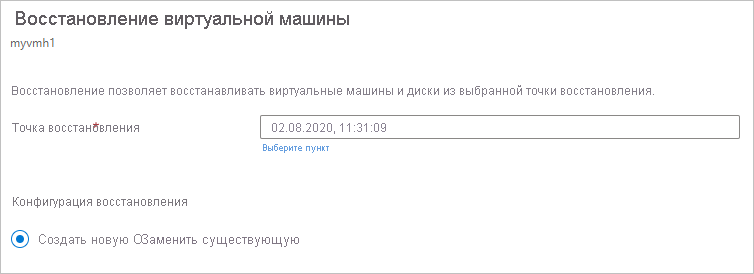

# Восстановление виртуальных машин Azure

В этой статье описывается восстановление данных виртуальной машины Azure из точек восстановления, хранящихся в хранилищах Служб восстановления [Azure Backup](backup-overview.md).

Для восстановления виртуальной Машины убедитесь, что у вас есть необходимые [RBAC](backup-rbac-rs-vault.md#mapping-backup-built-in-roles-to-backup-management-actions) разрешение.

> [!NOTE]
> Если у вас нет [RBAC](backup-rbac-rs-vault.md#mapping-backup-built-in-roles-to-backup-management-actions) разрешения, которые можно выполнять [восстановление диска](backup-azure-arm-restore-vms.md#create-new-restore-disks) и создание виртуальной Машины с помощью [развертывания шаблона](backup-azure-arm-restore-vms.md#use-templates-to-customize-a-restored-vm) функции.

### Параметры восстановления

Azure Backup предоставляет несколько способов восстановления виртуальной машины.

**Вариант восстановления** | **Дополнительные сведения**
--- | ---
**Создание виртуальной машины** | Быстрое создание и запуск базовой виртуальной машины из точки восстановления.   Можно указать имя виртуальной машины, выбрать группу ресурсов и виртуальную сеть, в которой она будет размещена, а также указать тип хранилища.
**Восстановление диска** | Восстановление диска виртуальной машины, который затем можно использовать для создания новой виртуальной машины.   Azure Backup предоставляет шаблон для настройки и создания виртуальной машины.    Этот параметр копирует VHD в учетную запись хранения, указанную вами. Задание восстановления генерирует шаблон, который можно скачать и использовать, чтобы указать пользовательские параметры и создать виртуальную машину.   -- Учетная запись хранения должна быть в том же расположении, что и хранилище. Если у вас еще нет учетной записи хранения, создайте ее.   Отобразится тип репликации учетной записи хранения. Хранилище, избыточное между зонами (ZRS), не поддерживается.   Кроме того, можно подключить диск к существующей виртуальной машине или создать новую виртуальную машину с помощью PowerShell.   Этот вариант полезен, если требуется настроить виртуальную машину, добавить параметры конфигурации, которых не было во время резервного копирования, или добавить параметры, которые необходимо настроить с помощью шаблона или PowerShell.
**Замена существующей** | Можно восстановить диск и заменить им диск на существующей виртуальной машине.   Текущая виртуальная машина должна существовать. Если она удалена, этот вариант невозможно использовать.   Azure Backup создает моментальный снимок существующей виртуальной машины перед заменой диска. Моментальный снимок хранится в указанном расположении промежуточного хранения. Затем существующие диски, подключенные к виртуальной машине, заменяются с использованием выбранной точки восстановления. Сделанный моментальный снимок копируется в хранилище и сохраняется в соответствии с указанной политикой хранения.   Замена существующей виртуальной машины поддерживается для незашифрованных управляемых виртуальных машин. Она не поддерживается для неуправляемых дисков, [общих виртуальных машин](https://docs.microsoft.com/azure/virtual-machines/windows/capture-image-resource) или для виртуальных машин, [созданных с помощью пользовательских образов](https://azure.microsoft.com/resources/videos/create-a-custom-virtual-machine-image-in-azure-resource-manager-with-powershell/).   Если точка восстановления содержит больше или меньше дисков, чем текущая виртуальная машина, то в конфигурации виртуальной машины будет отражено только количество дисков в точке восстановления.

> [!NOTE]
> Вы также можете восстановить определенные файлы и папки на виртуальной машине Azure. [Узнайте больше](backup-azure-restore-files-from-vm.md).
>
> Если вы используете [последнюю версию](backup-instant-restore-capability.md) Azure Backup для виртуальных машин Azure (называемую мгновенным восстановлением), моментальные снимки хранятся до семи дней. Вы можете восстановить виртуальную машину из моментальных снимков, прежде чем отправлять данные резервного копирования в хранилище. Если вы хотите восстановить виртуальную машину из резервной копии за последние семь дней, быстрее можно восстановить ее из моментального снимка, а не из хранилища.

## Выбор точки восстановления

1. В хранилище, связанном с виртуальной машиной, которую вы хотите восстановить, щелкните **Элементы архивации** > **Виртуальная машина Azure**.
2. Щелкните виртуальную машину. По умолчанию на панели мониторинга виртуальной машины отображаются точки восстановления за последние 30 дней. Можно отобразить точки восстановления за более чем 30 дней или выполнить фильтрацию, чтобы найти точки восстановления по датам, временным диапазонам и различным типам согласованности моментальных снимков.
3. Чтобы восстановить виртуальную машину, щелкните **Восстановить виртуальную машину**.

    

4. Выберите нужную точку восстановления.

## Выбор конфигурации восстановления для виртуальной машины

1. В разделе **Конфигурация восстановления** выберите вариант восстановления:
    - **Создать**. Этот параметр следует использовать, если вы хотите создать новую виртуальную машину. Вы можете создать виртуальную машину с простыми параметрами или восстановить диск и создать настроенную виртуальную машину.
    - **Replace existing** (Заменить существующую). Используйте этот параметр, если требуется заменить диски на существующей виртуальной машине.

        

2. Укажите параметры для выбранного варианта восстановления.

## Создание виртуальной машины

В качестве одного из [вариантов восстановления](#restore-options) можно быстро создать виртуальную машину с основными параметрами из точки восстановления.

1. В разделе **Конфигурация восстановления** > **Создать** > **Тип восстановления** выберите **Создать виртуальную машину**.
2. В поле **Имя виртуальной машины** укажите виртуальную машину, которая не существует в подписке.
3. В разделе **Группа ресурсов** выберите имеющуюся группу ресурсов для новой виртуальной машины или создайте новую с глобальным уникальным именем. При указании уже существующего имени Azure назначает группе имя, совпадающее с именем виртуальной машины.
4. В разделе **Виртуальная сеть** выберите виртуальную сеть, в которой будет размещена виртуальная машина. Здесь указаны все виртуальные сети, связанные с подпиской. Выберите подсеть. По умолчанию будет выбрана первая подсеть.
5. В разделе **Место хранения** укажите тип хранилища, используемый для виртуальной машины.

    

6. В разделе **Конфигурация восстановления** нажмите **OK**. В разделе **Восстановление** щелкните **Восстановить**, чтобы активировать восстановление.

## Создание диска/восстановление диска

В качестве одного из [вариантов восстановления](#restore-options) можно создать диск из точки восстановления. Затем с использованием диска выполните одно из следующих действий:

- Используйте шаблон, который был создан как часть операции восстановления, чтобы настроить параметры и активировать развертывание виртуальной машины. Измените параметры шаблона по умолчанию и отправьте шаблон для развертывания виртуальной машины.
- [Подключите восстановленные диски](https://docs.microsoft.com/azure/virtual-machines/windows/attach-managed-disk-portal) к имеющейся виртуальной машине.
- [Создайте виртуальную Машину](https://docs.microsoft.com/azure/backup/backup-azure-vms-automation#create-a-vm-from-restored-disks) из восстановленных дисков с помощью PowerShell.

1. В разделе **Конфигурация восстановления** > **Создать** > **Тип восстановления** выберите **Восстановить диски**.
2. В разделе **Группа ресурсов** выберите имеющуюся группу ресурсов для восстановленных дисков или создайте новую с глобальным уникальным именем.
3. В разделе **Учетная запись хранения** укажите учетную запись, в которую необходимо скопировать виртуальные жесткие диски. Убедитесь, что учетная запись находится в том же регионе, что и хранилище.

    

4. В разделе **Конфигурация восстановления** нажмите **OK**. В разделе **Восстановление** щелкните **Восстановить**, чтобы активировать восстановление.

### Использование шаблонов для настройки восстановленной виртуальной машины

После восстановления диска используйте шаблон, созданный в ходе операции восстановления, чтобы настроить и создать новую виртуальную машину.

1. Откройте окно **сведений о нужном задании восстановления**.

2. В окне **сведений о задании восстановления** нажмите кнопку **Развернуть шаблон**, чтобы запустить развертывание шаблона.

    

3. Чтобы настроить параметр виртуальной машины, указанный в шаблоне, щелкните **Изменить шаблон**. Чтобы добавить дополнительные настройки, щелкните **Изменить параметры**.
    - [Подробнее](../azure-resource-manager/resource-group-template-deploy-portal.md#deploy-resources-from-custom-template) о развертывании ресурсов из пользовательского шаблона.
    - [Дополнительные сведения](../azure-resource-manager/resource-group-authoring-templates.md) о создании шаблонов.

   

4. Введите пользовательские значения для виртуальной машины, **примите условия** и нажмите кнопку **Купить**.

   

## Замена существующих дисков

В качестве одного из [вариантов восстановления](#restore-options) можно заменить существующий диск виртуальной машины на выбранную точку восстановления. [Просмотрите](#restore-options) все параметры восстановления.

1. В разделе **Конфигурация восстановления** нажмите **Заменить существующую**.
2. На вкладке **Тип восстановления** щелкните **Replace disk/s** (Замена дисков). Это точка восстановления, которая будет использоваться для замены имеющихся дисков виртуальной машины.
3. В разделе **Расположение промежуточного хранения** укажите, где следует сохранять моментальные снимки текущих управляемых дисков.

   

## Восстановление виртуальных машин с помощью специальных конфигураций

Существует ряд распространенных ситуаций, в которых может потребоваться восстановление виртуальных машин.

**Сценарий** | **Руководство**
--- | ---
**Восстановление виртуальных машин при участии в программе преимуществ гибридного использования** | Если на виртуальной машине Windows применяется [лицензия преимущества гибридного использования (HUB)](../virtual-machines/windows/hybrid-use-benefit-licensing.md), восстановите диски и создайте новую виртуальную машину на основе предоставленного шаблона (для параметра **Тип лицензии** установите значение **Windows_Server**) или PowerShell.  Этот параметр также может применяться после создания виртуальной машины.
**Восстановление виртуальных машин в случае отказа центра обработки данных Azure** | Если хранилище использует геоизбыточное хранилище, а основной центр обработки данных виртуальной машины выходит из строя, Azure Backup поддерживает восстановление резервных копий виртуальных машин в сопряженном центре обработки данных. Выберите учетную запись хранения в сопряженном центре обработки данных и восстановите ее как обычно. В службе Azure Backup для создания восстановленной виртуальной машины используется служба вычислений, расположенная в сопряженном расположении. [Узнайте больше](../resiliency/resiliency-technical-guidance-recovery-loss-azure-region.md) об отказоустойчивости центра обработки данных.
**Восстановление одной виртуальной машины контроллера домена в одном домене** | Восстановите эту виртуальную машину обычным образом. Обратите внимание на следующее.   С точки зрения Active Directory виртуальная машина Azure соответствует любой другой виртуальной машине.   Кроме того, доступен режим восстановления служб каталогов, следовательно, все сценарии восстановления Active Directory также являются приемлемыми. [Дополнительные сведения](https://docs.microsoft.com/windows-server/identity/ad-ds/get-started/virtual-dc/virtualized-domain-controllers-hyper-v) о резервном копировании и восстановлении виртуальных контроллеров домена.
**Восстановление нескольких виртуальных машин контроллера домена в одном домене** | Если другие контроллеры домена в том же домене доступны по сети, контроллер домена можно восстановить, как любую виртуальную машину. Если это последний контроллер домена в домене или выполняется восстановление в изолированной сети, используйте [восстановление леса](https://docs.microsoft.com/windows-server/identity/ad-ds/manage/ad-forest-recovery-single-domain-in-multidomain-recovery).
**Восстановление нескольких доменов в одном лесу** | Мы рекомендуем [восстановить лес](https://docs.microsoft.com/windows-server/identity/ad-ds/manage/ad-forest-recovery-single-domain-in-multidomain-recovery).
**Восстановление исходного состояния системы** | Основным различием между виртуальными машинами Azure и локальными гипервизорами является отсутствие доступной консоли виртуальной машины в Azure. Консоль требуется в некоторых сценариях, например при восстановлении файла резервной копии с помощью восстановления исходного состояния системы. Хотя есть и полная замена такому типу восстановления. Это — восстановление виртуальной машины из хранилища.
**Восстановление виртуальных машин с использованием специальных конфигураций сети** | К специальным сетевым конфигурациям относятся виртуальные машины, использующие внутреннюю или внешнюю балансировку нагрузки, несколько сетевых интерфейсов или несколько зарезервированных IP-адресов. Эти виртуальные машины восстанавливаются с помощью варианта [восстановления диска](#create-new-restore-disks). Этот параметр создает копию виртуальные жесткие диски в указанной учетной записи хранения, а затем можно создать виртуальную Машину с помощью [внутренней](https://azure.microsoft.com/documentation/articles/load-balancer-internal-getstarted/) или [внешних](https://azure.microsoft.com/documentation/articles/load-balancer-internet-getstarted/) подсистемы балансировки нагрузки, [несколькими сетевыми КАРТАМИ](../virtual-machines/windows/multiple-nics.md), или [несколькими зарезервированными IP-адреса](../virtual-network/virtual-network-multiple-ip-addresses-powershell.md), в соответствии с вашей конфигурации.
**Группа безопасности сети (NSG) для сетевого Адаптера и подсети** | Служба архивации Azure виртуальной Машины поддерживает данные резервного копирования и восстановления из группы безопасности сети в виртуальной сети, подсети и сетевой карты.

## Отслеживание восстановления
Когда вы запускаете операцию восстановления, служба Backup создает задание для отслеживания операции. Azure Backup отображает уведомления о задании на портале. Если они не отображаются, щелкните символ **Уведомления**, чтобы увидеть их.

 Отслеживание восстановления производится следующим образом:

1. Чтобы просмотреть операции для задания, щелкните гиперссылку уведомлений. Кроме того, в хранилище щелкните **Задания резервного копирования**, а затем выберите соответствующую виртуальную машину.

    

2. Чтобы отслеживать ход восстановления, щелкните любое задание восстановления с состоянием **Выполняется**. Появится индикатор выполнения, в котором отображаются сведения о ходе восстановления.

    - **Estimated time of restore** (Предполагаемое время восстановления): изначально показывает время, необходимое для завершения операции восстановления. В ходе выполнения операции время уменьшается и достигает 0, когда операция завершается.
    - **Percentage of restore** (Процент восстановления): показывает, какая часть операции восстановления выполнена.
    - **Number of bytes transferred** (Общее число переданных байтов): при восстановлении путем создания новой виртуальной машины в этом параметре отображается, сколько байтов передано по сравнению с общим количеством байтов для передачи.

## Действия после восстановления

После восстановления виртуальной машины необходимо отметить ряд моментов:

- Расширения, имеющиеся при настройке резервного копирования, установлены, но не включены. Обнаружив проблему, переустановите расширения.
- Если виртуальная машина, для которой выполнено резервное копирование, имеет статический IP-адрес, восстановленная виртуальная машина будет иметь динамический IP-адрес, чтобы избежать конфликтов. Для [восстановленной виртуальной машины можно добавить статический IP-адрес](../virtual-network/virtual-networks-reserved-private-ip.md#how-to-add-a-static-internal-ip-to-an-existing-vm).
- У восстановленной виртуальной машины нет группы доступности. Если вы используете вариант с восстановлением диска, вы можете [указать группу доступности](../virtual-machines/windows/tutorial-availability-sets.md) при создании виртуальной машины с диска с помощью шаблона или PowerShell.
- Если вы используете дистрибутив Linux на основе cloud-init (например, Ubuntu), то в целях безопасности пароль будет заблокирован после восстановления. Чтобы [сбросить пароль](../virtual-machines/linux/reset-password.md), на восстановленной виртуальной машине рекомендуется использовать расширение VMAccess. Мы советуем использовать ключи SSH в этих дистрибутивах, чтобы не сбрасывать пароль после восстановления.

## Резервное копирование восстановленных виртуальных машин

- Если виртуальная машина восстановлена в той же группе ресурсов и с тем же именем, что и первоначально заархивированная виртуальная машина, то резервное копирование будет продолжено и после восстановления виртуальной машины.
- Если восстановить виртуальную машину в другой группе ресурсов или задать для нее другое имя, необходимо настроить резервную копию для восстановленной виртуальной машины.

## Дальнейшие действия

- Если у вас возникли трудности во время процесса восстановления, [просмотрите](backup-azure-vms-troubleshoot.md#restore) распространенные проблемы и ошибки.
- После восстановления виртуальной машины ознакомьтесь со сведениями об [управлении виртуальными машинами](backup-azure-manage-vms.md).
