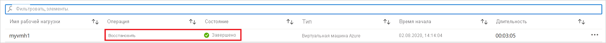
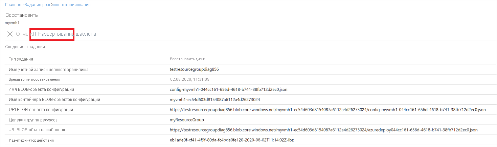
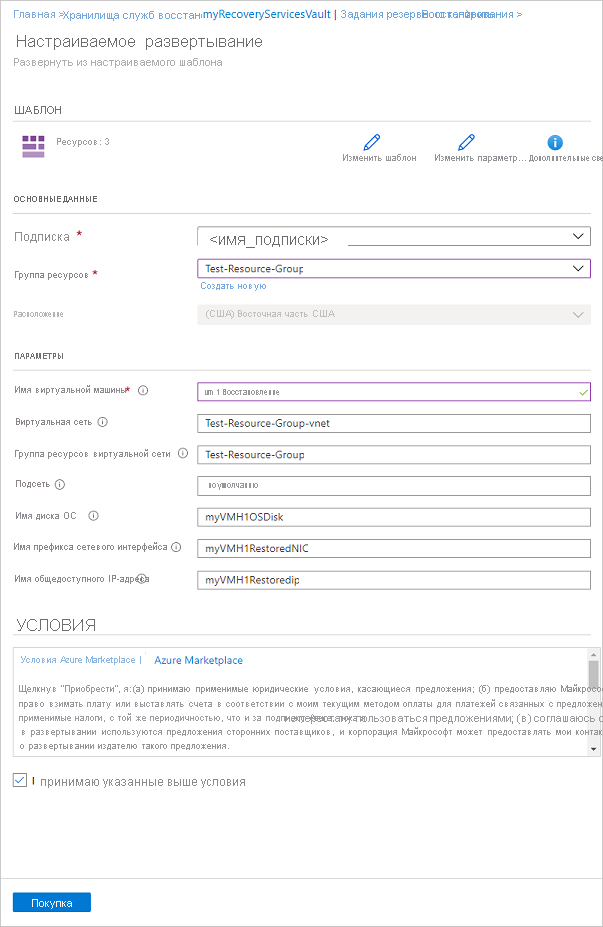

# Восстановление виртуальных машин с помощью портала Azure
Защитите свои данные, создавая моментальные снимки данных через определенные интервалы времени. Эти моментальные снимки называются точками восстановления. Они хранятся в хранилищах служб восстановления. Если вам нужно исправить или повторно создать виртуальную машину, вы можете восстановить ее из любой сохраненной точки восстановления. При восстановлении из точки восстановления можно:

* Создание виртуальной машины: из точки восстановления на определенный момент времени виртуальной машины, для которой создана резервная копия.
* Восстановление дисков: используйте шаблон, который поставляется в процессе, чтобы настроить восстановленную виртуальную машину или восстановить отдельные файлы.

В этой статье описывается, как восстановить виртуальную машину в новую виртуальную машину или как восстановить все заархивированные диски. Сведения о восстановлении отдельных файлов см. в статье [Восстановление файлов из резервной копии виртуальной машины Azure](backup-azure-restore-files-from-vm.md).

Восстановление виртуальной машины или всех дисков из резервной копии виртуальной машины выполняется в два этапа.

* Выбор точки восстановления.
* Выбор типа восстановления
    - Вариант 1. Создание виртуальной машины
    - Вариант 2. Восстановление дисков

## Выбор точки восстановления.
1. Войдите на [портале Azure](http://portal.azure.com/).

2. В меню Azure выберите **Все службы**. Из списка служб введите **Службы восстановления** или перейдите в раздел **Хранилище**, в котором указан пункт **Хранилища служб восстановления**, и выберите его.

    

3. Появится список хранилищ, доступных в подписке.

    

4. Из списка хранилищ служб восстановления выберите хранилище, связанное с восстанавливаемой виртуальной машиной. Выберите это хранилище, чтобы открыть панель мониторинга.

    

5. На панели мониторинга хранилища в элементе **Архивные элементы** щелкните **Виртуальная машина Azure**.

    

6. Откроется колонка **Архивные элементы** со списком виртуальных машин Azure.

    

7. Выберите в этом списке нужную виртуальную машину, чтобы открыть панель мониторинга. На панели мониторинга виртуальной машины откроется область мониторинга с элементом **Точки восстановления**. В этой колонке можно выполнять любые операции уровня виртуальной машины, такие как **Создать архив**, **Восстановление файла** или **Остановить архивацию**.
С помощью этой колонки можно разными способами выполнить восстановление. Обратите внимание на то, что в этой колонке отображены только точки восстановления за последние 30 дней.

    - Чтобы выполнить восстановление с помощью точки восстановления за последние 30 дней, щелкните правой кнопкой мыши виртуальную машину > **Восстановить виртуальную машину**.
    - Чтобы выполнить восстановление с помощью точки восстановления старше 30 дней, щелкните ссылку в разделе **Точки восстановления**.
    - Для вывода и фильтрация виртуальных машин с помощью настраиваемых дат нажмите **Восстановить виртуальную машину** в меню. Используйте фильтр, чтобы изменить диапазон времени отображения точек восстановления. Кроме того, можно фильтровать результаты по согласованности данных различных типов.
8. Просмотр параметров точки восстановления
    - Согласованность данных показывает [Тип согласованности](backup-azure-vms-introduction.md#consistency-types) в точке восстановления.
    - **Тип восстановления** показывает, где хранится точка (в учетной записи хранения, в хранилище или и там и там). [Узнайте больше](https://azure.microsoft.com/blog/large-disk-support/) о точках мгновенного восстановления.

  
9. Выберите точку восстановления.

10. Выберите **Конфигурация восстановления**. Откроется колонка **Restore configuration** (Конфигурация восстановления).

## Выбор конфигурации восстановления для виртуальной машины
После выбора точки восстановления выберите конфигурацию восстановления для виртуальной машины. Чтобы настроить восстановленную виртуальную машину, можно использовать портал Azure или PowerShell.

### Параметры восстановления

**Параметр** | **Дополнительные сведения**
--- | ---
**Создание виртуальной машины** | Эквивалент быстрого создания виртуальной машины. Создайте базовую виртуальную машину из точки восстановления.   Можно изменить параметры виртуальной машины в процессе восстановления.
**Создание диска/восстановление диска** | Создает виртуальную машину, которую можно настроить в процессе восстановления.   Этот параметр копирует VHD в учетную запись хранения, указанную вами.   -- Учетная запись хранения должна быть в том же расположении, что и хранилище.   Если у вас нет подходящей учетной записи хранения, то вам потребуется ее создать.   Тип репликации учетной записи хранения отображается в скобках. Хранилище, избыточное между зонами (ZRS), не поддерживается.   В учетной записи хранения можно подключить восстановленные диски к существующей виртуальной машине или создать новую виртуальную машину из восстановленных дисков с помощью PowerShell.
**Замена существующей** | С этим параметром вам не нужно создавать виртуальную машину.   Текущая виртуальная машина должна существовать. Если она удалена, этот вариант невозможно использовать.   Azure Backup создает моментальный снимок существующей виртуальной машины и сохраняет его в указанное расположение промежуточного хранения. Затем существующие диски, подключенные к виртуальной машине, заменяются выбранной точкой восстановления. Моментальный снимок, созданный ранее, копируется в хранилище и хранится в виде точки восстановления в соответствии с политикой хранения резервных копий.   Замена существующей виртуальной машины поддерживается для незашифрованных управляемых виртуальных машин. Она не поддерживается для неуправляемых дисков, [общих виртуальных машин](https://docs.microsoft.com/azure/virtual-machines/windows/capture-image-resource) или для виртуальных машин, [созданных с помощью пользовательских образов](https://azure.microsoft.com/resources/videos/create-a-custom-virtual-machine-image-in-azure-resource-manager-with-powershell/).   Если точка восстановления содержит больше или меньше дисков, чем текущая виртуальная машина, то в виртуальной машине будет отражено только количество дисков в точке восстановления.

> [!NOTE]
> Если вы хотите восстановить виртуальную машину с расширенными параметрами сети, например если они управляются внутренним или внешним балансировщиком нагрузки или имеют несколько сетевых адаптеров или несколько зарезервированных IP-адресов, выполните восстановление с помощью PowerShell. [Узнайте больше](#restore-vms-with-special-network-configurations).
> Если виртуальная машина Windows использует [лицензирование HUB](../virtual-machines/windows/hybrid-use-benefit-licensing.md), используйте вариант **Создание нового диска/восстановление диска**, а затем создайте виртуальную машину с помощью PowerShell или шаблона восстановления, указав для параметра **Тип лицензии** значение **Windows_Server**. Этот параметр также может применяться после создания виртуальной машины.

Укажите следующие параметры восстановления.

1. В разделе **Восстановить** выберите [Точка восстановления](#select-a-restore-point-for-restore) > **Конфигурация восстановления**.
2. В разделе **Конфигурация восстановления** выберите, как вы хотите восстановить виртуальную машину, в соответствии с параметрами, перечисленными в таблице выше.

    

## Создание виртуальной машины

1. В разделе **Конфигурация восстановления** > **Создать** > **Тип восстановления** выберите **Создать виртуальную машину**.
2. В поле **Имя виртуальной машины** укажите виртуальную машину, которая не существует в подписке.
3. В разделе **Группа ресурсов** выберите имеющуюся группу ресурсов для новой виртуальной машины или создайте новую с глобальным уникальным именем. При указании уже существующего имени Azure назначает группе имя, совпадающее с именем виртуальной машины.
4. В разделе **Виртуальная сеть** выберите виртуальную сеть, в которой будет размещена виртуальная машина. Здесь указаны все виртуальные сети, связанные с подпиской. Выберите подсеть. По умолчанию будет выбрана первая подсеть.
5. В разделе **Место хранения** укажите тип хранилища, используемый для виртуальной машины.

    

6. В разделе **Конфигурация восстановления** нажмите **OK**. В разделе **Восстановление** щелкните **Восстановить**, чтобы активировать восстановление.

## Создание диска/восстановление диска

1. В разделе **Конфигурация восстановления** > **Создать** > **Тип восстановления** выберите **Восстановить диски**.
2. В разделе **Группа ресурсов** выберите имеющуюся группу ресурсов для восстановленных дисков или создайте новую с глобальным уникальным именем.
3. В разделе **Учетная запись хранения** укажите учетную запись, в которую необходимо скопировать виртуальные жесткие диски. Убедитесь, что учетная запись находится в том же регионе, что и хранилище.

    

4. В разделе **Конфигурация восстановления** нажмите **OK**. В разделе **Восстановление** щелкните **Восстановить**, чтобы активировать восстановление.
5. После восстановления диска выполните любое из следующих действий, чтобы завершить операцию восстановления виртуальной машины.

    - Используйте шаблон, который был создан как часть операции восстановления, чтобы настроить параметры и активировать развертывание виртуальной машины. Измените параметры шаблона по умолчанию и отправьте шаблон для развертывания виртуальной машины.
    - Вы можете [подключить восстановленные диски](https://docs.microsoft.com/azure/virtual-machines/windows/attach-disk-ps) к имеющейся виртуальной машине.
    - Вы можете [создать новую виртуальную машину](backup-azure-vms-automation.md#restore-an-azure-vm) из восстановленных дисков с помощью PowerShell.

## Замена существующих дисков

Используйте этот вариант, чтобы заменить диски в текущей виртуальной машине дисками из выбранной точки восстановления.

1. В разделе **Конфигурация восстановления** нажмите **Заменить существующую**.
2. В разделе **Тип восстановления** выберите **Диски на замену** (точка восстановления, которая заменит существующий диск или диски виртуальной машины).
3. В разделе **Расположение промежуточного хранения** укажите, где следует сохранять моментальные снимки текущих управляемых дисков.

   

## Отслеживание восстановления
Когда вы запускаете операцию восстановления, служба архивации создает задание для отслеживания выполнения операции. Служба архивации также создает и временно отображает уведомление в области **Уведомления** портала. Если уведомление не появилось, выберите символ **Уведомления**, чтобы просмотреть его.

Щелкните гиперссылку уведомлений, чтобы перейти к списку **Задания архивации**. Все сведения об операциях для задания доступны в списках **Задания архивации**. Вы можете перейти к списку **Задания архивации** из панели мониторинга хранилища, щелкнув элемент "Задания архивации" и выбрав **Виртуальная машина Azure** для отображения заданий, связанных с этим хранилищем.

Откроется колонка **Задания архивации**, где содержится список заданий.

В колонке **Сведения о восстановлении** теперь доступен **индикатор хода выполнения**. Чтобы открыть колонку **Сведения о восстановлении**, нажмите любое задание восстановление в состоянии **выполняется**. **Индикатор выполнения** доступен во всех вариантах восстановления — **Создать новую**, **Восстановить диск** или **Заменить существующую**. Индикатор выполнения восстановления показывает **предполагаемое время восстановления**, **процент восстановления** и **число переданных байтов**.

Ниже приводятся сведения об индикаторе выполнения восстановления.

- **Предполагаемое время восстановления** изначально показывает время, необходимое для завершения операции восстановления. В ходе выполнения операции время уменьшается до 0, когда операция завершается.
- **Процент восстановления** показывает, какая часть операции восстановления выполнена.
- **Число переданных байтов** доступно в дополнительной задаче, когда восстановление выполняется как создание новой виртуальной машины. Этот параметр показывает, сколько байтов передано по сравнению с общим количеством байтов для передачи.

## Использование шаблонов для настройки восстановленной виртуальной машины
После [завершения операции восстановления дисков](#Track-the-restore-operation) используйте шаблон, созданный как часть операции восстановления, чтобы создать виртуальную машину с конфигурацией, отличающейся от конфигурации резервного копирования. Его также можно использовать для настройки имен ресурсов, созданных при создании виртуальной машины из точки восстановления.

Чтобы получить шаблон, созданный при восстановлении дисков, сделайте следующее:

1. Перейдите на страницу **Restore Job Details** (Сведения о задании восстановления) для задания.

2. На экране **подробных сведений о задании восстановления** нажмите кнопку **Deploy Template** (Развернуть шаблон), чтобы запустить развертывание шаблона.

3. В колонке **Шаблон развертывания** для настраиваемого развертывания воспользуйтесь функцией развертывания шаблона, чтобы [изменить и развернуть его](../azure-resource-manager/resource-group-template-deploy-portal.md#deploy-resources-from-custom-template), или настройте дополнительные параметры, [создав шаблон](../azure-resource-manager/resource-group-authoring-templates.md) перед развертыванием.

  

4. Введя необходимые значения, примите **условия** и выберите **Приобрести**.

  

## Действия после восстановления
* Если вы используете дистрибутив Linux на основе cloud-init (например, Ubuntu), то в целях безопасности пароль будет заблокирован после восстановления. Чтобы [сбросить пароль](../virtual-machines/linux/reset-password.md), на восстановленной виртуальной машине рекомендуется использовать расширение VMAccess. Мы рекомендуем также использовать ключи SSH с такими дистрибутивами, чтобы предотвратить сброс пароля после восстановления.
* Расширения, имеющиеся при настройке резервного копирования, установлены, но не будут включены. Обнаружив проблему, переустановите расширения.
* Если архивируемая виртуальная машина имеет статический IP-адрес, то у восстановленной виртуальной машины будет динамический IP-адрес во избежание конфликтов при ее создании. Ознакомьтесь с дополнительными сведениями о [добавлении статического IP-адреса в восстановленную виртуальную машину](../virtual-network/virtual-networks-reserved-private-ip.md#how-to-add-a-static-internal-ip-to-an-existing-vm).
* У восстановленной виртуальной машины нет набора значений доступности. При создании виртуальной машины из восстановленных дисков с помощью PowerShell или шаблонов рекомендуется использовать параметр восстановления дисков, чтобы [добавить группу доступности](../virtual-machines/windows/tutorial-availability-sets.md).

## Архивация для восстановленных виртуальных машин
Если виртуальная машина восстановлена в той же группе ресурсов и с тем же именем, что и первоначально заархивированная виртуальная машина, то архивация будет продолжена и после восстановления виртуальной машины. Если восстановить виртуальную машину в другой группе ресурсов или задать для нее другое имя, она рассматривается в качестве новой виртуальной машины. Необходимо настроить резервную копию для восстановленной виртуальной машины.

## Восстановление виртуальной машины в случае отказа центра обработки данных Azure
Azure Backup позволяет восстанавливать резервные копии виртуальных машин в сопряженном центре обработки данных в случае отказа основного центра обработки данных, в котором запущены эти виртуальные машины, если при этом хранилище архивации настроено как геоизбыточное. При выполнении таких сценариев выберите учетную запись хранения, которая присутствует в сопряженном центре обработки данных. Остальная часть процесса восстановления остается неизменной. В службе архивации для создания восстановленной виртуальной машины используется служба вычислений, расположенная в сопряженном геообъекте. Дополнительные сведения см. в [техническом руководстве по обеспечению устойчивости центра обработки данных](../resiliency/resiliency-technical-guidance-recovery-loss-azure-region.md).

## Восстановление виртуальных машин контроллера домена
Резервное копирование виртуальных машин контроллера домена поддерживается в службе Azure Backup. Тем не менее во время процесса восстановления необходимо соблюдать осторожность. Правильный процесс восстановления зависит от структуры домена. Простейший случай — один контроллер домена в одном домене. Более распространенный вариант для рабочих нагрузок — один домен с несколькими контроллерами домена (некоторые из них могут быть на локальном компьютере). И еще один вариант — лес с несколькими доменами.

Для перспективы Active Directory виртуальная машина Azure соответствует любой другой виртуальной машине в современном поддерживаемом гипервизоре. Особенностью использования локальных гипервизоров является отсутствие доступной консоли виртуальной машины в Azure. Консоль требуется в некоторых сценариях, например при восстановлении файла резервной копии с помощью восстановления исходного состояния системы. Хотя есть и полная замена такому типу восстановления. Это — восстановление виртуальной машины из резервного хранилища. Кроме того, доступен режим восстановления служб каталогов, следовательно, все сценарии восстановления Active Directory также являются приемлемыми. Дополнительные сведения см. в разделе о [резервном копировании и восстановлении для виртуализированных контроллеров домена](https://technet.microsoft.com/library/virtual_active_directory_domain_controller_virtualization_hyperv(v=ws.10).aspx#backup_and_restore_considerations_for_virtualized_domain_controllers) и в статье о [планировании для восстановления леса Active Directory](https://technet.microsoft.com/library/planning-active-directory-forest-recovery(v=ws.10).aspx).

### Один контроллер домена в одном домене
В этом случае виртуальная машина может быть восстановлена (как и любая другая виртуальная машина) на портале Azure или с помощью PowerShell.

### Несколько контроллеров домена в одном домене
Если другие контроллеры домена в одном домене доступны по сети, контроллер домена можно восстановить как виртуальную машину. Если это последний контроллер домена в домене или выполняется восстановление в изолированной сети, должно выполняться восстановление леса.

### Несколько доменов в одном лесу
Если другие контроллеры домена в одном домене доступны по сети, контроллер домена можно восстановить как виртуальную машину. Во всех остальных случаях мы рекомендуем восстановление леса.

## Восстановление виртуальных машин с помощью специальных конфигураций сети
Вы можете выполнять архивацию и восстановление виртуальных машин, используя следующие специальные конфигурации сети. Но восстановление с использованием таких конфигураций предполагает соблюдение следующих требований:

* Виртуальные машины с балансировщиками нагрузки (внутренним или внешним).
* Виртуальные машины с несколькими зарезервированными IP-адресами
* Виртуальные машины с несколькими сетевыми картами

> [!IMPORTANT]
> Если вы создаете специальную конфигурацию сети для виртуальных машин, следует использовать PowerShell, чтобы создать виртуальные машины на основе восстановленных дисков.
>
>

Вот как можно повторно создать виртуальные машины после восстановления на диск:

1. Восстановите диски из хранилища служб восстановления с помощью [PowerShell](backup-azure-vms-automation.md#restore-an-azure-vm).

1. Создайте конфигурацию виртуальной машины для сценариев с использованием балансировщика нагрузки, нескольких сетевых адаптеров или зарезервированных IP-адресов с помощью командлетов PowerShell. Затем создайте с помощью этой конфигурации виртуальную машину с нужными параметрами.

   a. Создайте виртуальную машину в облачной службе с [внутренним балансировщиком нагрузки](https://azure.microsoft.com/documentation/articles/load-balancer-internal-getstarted/).

   b. Создайте виртуальную машину для подключения к [балансировщику нагрузки, доступному в Интернете](https://azure.microsoft.com/documentation/articles/load-balancer-internet-getstarted/).

   c. Создайте виртуальную машину с [несколькими сетевыми адаптерами](../virtual-machines/windows/multiple-nics.md).

   d. Создайте виртуальную машину с [несколькими зарезервированными IP-адресами](../virtual-network/virtual-network-multiple-ip-addresses-powershell.md).

## Дополнительная информация
Теперь вы знаете, как восстанавливать виртуальные машины. Информацию о типичных ошибках, связанных с работой виртуальных машин, см. в статье об устранении неполадок. Ознакомьтесь также с инструкцией по управлению задачами, выполняемыми на виртуальных машинах.

* [Устранение ошибок](backup-azure-vms-troubleshoot.md#restore)
* [Управление виртуальными машинами](backup-azure-manage-vms.md)
