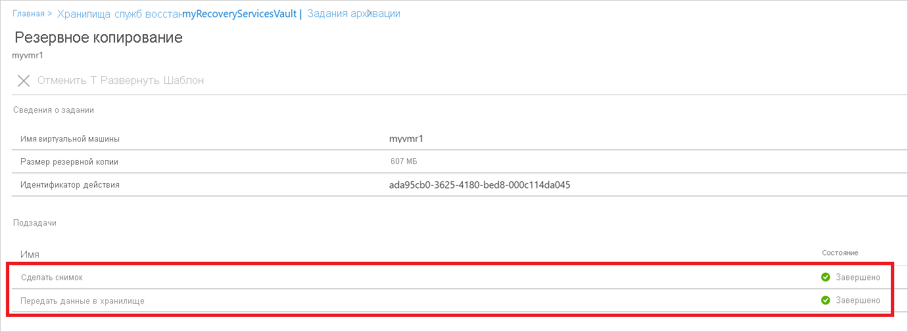

# <a name="back-up-azure-vms-in-a-recovery-services-vault"></a>Резервное копирование виртуальных машин Azure в хранилище Служб восстановления

В этой статье описывается, как выполнять резервное копирование виртуальных машин Azure в хранилище служб восстановления с помощью службы [Azure Backup](backup-overview.md) .

В этой статье раскрываются следующие темы:

> [!div class="checklist"]
>
> * Подготовка виртуальных машин Azure.
> * создание хранилища;
> * Обнаружение виртуальных машин и Настройка политики архивации.
> * Включите резервное копирование для виртуальных машин Azure.
> * Выполнение начального резервного копирования.

> [!NOTE]
> В этой статье описывается, как настроить хранилище и выбрать виртуальные машины для резервного копирования. Этот способ удобен, если вы хотите создать резервные копии нескольких виртуальных машин. Кроме того, можно [создать резервную копию отдельной виртуальной машины Azure](backup-azure-vms-first-look-arm.md) непосредственно из параметров виртуальной машины.

## <a name="before-you-start"></a>Перед началом работы

* [Ознакомьтесь](backup-architecture.md#architecture-built-in-azure-vm-backup) с архитектурой резервного копирования виртуальных машин Azure.
* [Узнайте о](backup-azure-vms-introduction.md) резервном копировании виртуальных машин Azure и расширении резервного копирования.
* Перед настройкой резервной копии [Ознакомьтесь с матрицей поддержки](backup-support-matrix-iaas.md) .

Кроме того, в некоторых случаях может потребоваться несколько действий:

* **Установите агент виртуальной машины на виртуальную машину**. Azure Backup создает резервную копию виртуальных машин Azure, установив расширение на агент виртуальной машины Azure, выполняющийся на компьютере. Если виртуальная машина была создана из образа Azure Marketplace, агент будет установлен и запущен. Если вы создаете пользовательскую виртуальную машину или выполняете миграцию локального компьютера, может потребоваться [установить агент вручную](#install-the-vm-agent).
* **Явно разрешить исходящий доступ**. как правило, вам не нужно явно разрешать исходящий доступ к сети для виртуальной машины Azure, чтобы она могла взаимодействовать с Azure Backup. Однако некоторые виртуальные машины могут столкнуться с проблемами подключения, отображая ошибку **екстенсионснапшотфаиледнонетворк** при попытке подключения. В этом случае следует [явно разрешить исходящий доступ](#explicitly-allow-outbound-access), поэтому расширение Azure Backup может взаимодействовать с общедоступными IP-адресами Azure для трафика резервного копирования.

## <a name="create-a-vault"></a>Создание хранилища

 В хранилище хранятся резервные копии и точки восстановления, созданные со временем, а также политики резервного копирования, связанные с резервными копиями виртуальных машин. Создайте хранилище следующим образом.

1. Войдите на [портале Azure](https://portal.azure.com/).
2. В окне поиска введите **службы восстановления**. В разделе **службы**выберите **хранилища служб восстановления**.

      <br/>

3. В меню **хранилища служб восстановления** щелкните **+ Добавить**.

     

4. В **хранилище служб восстановления**введите понятное имя, чтобы обозначить хранилище.
    * Имя должно быть уникальным в пределах подписки Azure.
    * Оно может содержать от 2 до 50 символов.
    * Имя должно начинаться с буквы, оно может содержать только буквы, цифры и дефисы.
5. Выберите подписку Azure, группу ресурсов и географический регион, в которых должно быть создано хранилище. Затем щелкните **Создать**.
    * Для создания хранилища может потребоваться некоторое время.
    * Следите за уведомлениями о состоянии на портале в верхней правой области.

После создания хранилище появится в списке хранилищ служб восстановления. Если вы не видите хранилища, выберите **Обновить**.


> [!NOTE]
> Azure Backup служба создает отдельную группу ресурсов (отличную от группы ресурсов виртуальной машины) для хранения моментального снимка с форматом именования **AzureBackupRG_geography_number** (пример: AzureBackupRG_northeurope_1). Данные в этой группе ресурсов будут храниться в течение суток, указанного в разделе *Сохранение моментального снимка мгновенного восстановления* политики архивации виртуальных машин Azure.  Применение блокировки к этой группе ресурсов может привести к сбоям при архивации.<br>
Эта группа ресурсов также должна быть исключена из любых ограничений имени или тега, так как политика ограничения будет блокировать создание коллекций точек ресурсов в ней снова, вызывая сбои резервного копирования.

### <a name="modify-storage-replication"></a>Изменение репликации хранилища

По умолчанию в хранилищах используется [геоизбыточное хранилище (GRS)](https://docs.microsoft.com/azure/storage/common/storage-redundancy-grs).

* Если хранилище является основным механизмом резервного копирования, рекомендуется использовать GRS.
* Для более дешевого варианта можно использовать [локально избыточное хранилище (LRS)](https://docs.microsoft.com/azure/storage/common/storage-redundancy-lrs?toc=%2fazure%2fstorage%2fblobs%2ftoc.json) .

Измените тип репликации хранилища следующим образом.

1. В новом хранилище щелкните **Свойства** в разделе **Параметры** .
2. В окне **Свойства**в разделе **Конфигурация архивации**щелкните **Обновить**.
3. Выберите тип репликации хранилища и нажмите кнопку **сохранить**.

      

> [!NOTE]
   > Вы не можете изменить тип репликации хранилища после того, как хранилище настроено и содержит элементы резервного копирования. Если вы хотите это сделать, необходимо повторно создать хранилище.

## <a name="apply-a-backup-policy"></a>Применение политики архивации

Настройте политику архивации для хранилища.

1. В хранилище щелкните **+ Backup (+ резервная копия** ) в разделе **Обзор** .

   

2. В > **цели резервного копирования** **, где выполняется ваша рабочая нагрузка?** выберите **Azure**. В **поле что вы хотите создать резервную копию?** выберите **виртуальная машина** >  **ОК**. При этом расширение виртуальной машины зарегистрируется в хранилище.

   

3. В области **Политика архивации** выберите политику, которую вы хотите связать с хранилищем.
    * Политика по умолчанию создает резервную копию виртуальной машины раз в день. Ежедневные резервные копии хранятся в течение 30 дней. Моментальные снимки мгновенного восстановления хранятся в течение двух дней.
    * Если вы не хотите использовать политику по умолчанию, выберите **создать**и создайте настраиваемую политику, как описано в следующей процедуре.

      

4. В окне **Выбор виртуальных машин**выберите виртуальные машины, для которых необходимо создать резервную копию с помощью политики. Затем нажмите кнопку **ОК**.

   * Выбранные виртуальные машины проверены.
   * Виртуальные машины можно выбрать только в том же регионе, что и хранилище.
   * Архивация виртуальных машин может выполняться только в одном хранилище.

     

5. В меню **резервное копирование**щелкните **включить резервное копирование**. При этом в хранилище и на виртуальных машинах развертывается политика и устанавливается расширение архивации на агенте ВМ на виртуальной машине Azure.

     

После включения резервного копирования

* Расширение резервного копирования устанавливается службой Azure Backup независимо от того, запущена ли виртуальная машина.
* Начальная Архивация будет выполняться в соответствии с расписанием архивации.
* При выполнении резервного копирования Обратите внимание на следующее.
  * Виртуальная машина, которая работает, имеет наибольшую шансы на запись точки восстановления, соответствующей приложению.
  * Однако, даже если виртуальная машина отключена, она архивируется. Такая виртуальная машина называется автономной виртуальной машиной. В этом случае точка восстановления будет считаться отказоустойчивой.

### <a name="create-a-custom-policy"></a>Создание настраиваемой политики

Если вы выбрали создание новой политики архивации, заполните параметры политики.

1. В списке **имя политики**укажите понятное имя.
2. В **расписанию архивации**укажите время создания резервных копий. Для виртуальных машин Azure можно создавать ежедневное или еженедельное резервное копирование.
3. В окне **мгновенное восстановление**укажите, как долго следует хранить моментальные снимки локально для мгновенного восстановления.
    * При восстановлении резервные копии дисков виртуальных машин копируются из хранилища по сети в место хранения для восстановления. С помощью мгновенного восстановления можно использовать локально сохраненные моментальные снимки, созданные во время задания резервного копирования, не дожидаясь передачи данных резервного копирования в хранилище.
    * Можно хранить моментальные снимки для мгновенного восстановления в интервале от 1 до пяти дней. Значение по умолчанию — два дня.
4. В списке **диапазон хранения**укажите, как долго следует хранить ежедневные или еженедельные точки резервного копирования.
5. При **хранении месячной точки резервного копирования**укажите, следует ли хранить ежемесячные резервные копии ежедневных или еженедельных резервных копий.
6. Нажмите кнопку **ОК** , чтобы сохранить политику.

    

> [!NOTE]
   > Azure Backup не поддерживает настройку автоматического перехода на летнее время для резервных копий виртуальных машин Azure. При возникновении изменений времени необходимо вручную изменить политики резервного копирования.

## <a name="trigger-the-initial-backup"></a>Активировать начальное резервное копирование

Начальное резервное копирование будет выполняться в соответствии с расписанием, но его можно запустить немедленно, как показано ниже.

1. В меню хранилища щелкните **Элементы архивации**.
2. В списке **элементы архивации**щелкните **Виртуальная машина Azure**.
3. В списке **архивные элементы** нажмите кнопку с многоточием (...).
4. Щелкните **Создать резервную копию**.
5. В поле **создать резервную копию**используйте элемент управления Calendar, чтобы выбрать последний день, в который должна храниться точка восстановления. Затем нажмите кнопку **ОК**.
6. Отслеживайте уведомления на портале. Вы можете отслеживать ход выполнения задания на панели мониторинга хранилища в разделе **Задания резервного копирования** > **Выполняется**. В зависимости от размера виртуальной машины создание начального архива может занять некоторое время.

## <a name="verify-backup-job-status"></a>Проверка состояния задания резервного копирования

Сведения о задании резервного копирования для каждой резервной копии виртуальной машины состоят из двух этапов: этап **создания моментального снимка** , за которым следует стадия " **Перенос данных в хранилище** ".<br/>
Этап создания моментального снимка гарантирует доступность точки восстановления, хранящейся вместе с дисками, для **мгновенного восстановления** и доступна не более пяти дней в зависимости от срока хранения моментальных снимков, настроенного пользователем. При переносе данных в хранилище в хранилище создается точка восстановления для долгосрочного хранения. Перенос данных в хранилище начинается только после завершения фазы создания моментального снимка.

  

В серверной части выполняются две **подзадачи** : одна для задания фонового копирования, которую можно проверить в колонке сведения о **задании резервного копирования** , как указано ниже.

  

На этап " **передавать данные в хранилище** " может потребоваться несколько дней для выполнения в зависимости от размера дисков, количества обновлений на диск и ряда других факторов.

Состояние задания может различаться в зависимости от следующих сценариев.

**Моментальный снимок** | **Перенос данных в хранилище** | **Состояние задания**
--- | --- | ---
Завершено | выполняется; | выполняется;
Завершено | Skipped | Завершено
Завершено | Завершено | Завершено
Завершено | Ошибка | Завершено с предупреждением
Ошибка | Ошибка | Ошибка

Теперь, используя эту возможность, для одной и той же виртуальной машины две резервные копии могут выполняться параллельно, но на одном этапе (моментальный снимок, передавать данные в хранилище) может выполняться только одна подзадача. Итак, в сценариях было задано задание резервного копирования, поэтому в следующий день резервное копирование не удастся выполнить с этой функцией разделения. Резервное копирование следующего дня может привести к завершению создания моментального снимка при **переносе данных в хранилище,** если задание резервного копирования на более ранний день находится в состоянии выполняется.
Добавочная точка восстановления, созданная в хранилище, будет записывать все изменения из последней точки восстановления, созданной в хранилище. На пользователя не влияет никаких затрат.

## <a name="optional-steps-install-agentallow-outbound"></a>Необязательные шаги (Установка агента или разрешение исходящего трафика)

### <a name="install-the-vm-agent"></a>Установка агента виртуальной машины

Для создания резервных копий виртуальных машин Azure служба Azure Backup устанавливает на них расширение агента виртуальной машины Azure. Если виртуальная машина была создана из образа Azure Marketplace, агент будет установлен и запущен. При создании пользовательской виртуальной машины или переносе локального компьютера может потребоваться установить агент вручную, как показано в таблице.

**Виртуальная машина** | **Дополнительные сведения**
--- | ---
**Windows** | 1. [скачайте и установите](https://go.microsoft.com/fwlink/?LinkID=394789&clcid=0x409) файл MSI агента.<br/><br/> 2. Установите с разрешениями администратора на компьютере.<br/><br/> 3. Проверьте установку. В *C:\WindowsAzure\Packages* на виртуальной машине щелкните правой кнопкой мыши **вааппажент. exe** > **Свойства**. На вкладке **сведения** **версия продукта** должна быть отображаться 2.6.1198.718 или выше.<br/><br/> Если вы обновляете агент, убедитесь, что операции резервного копирования не выполняются, и [переустановите агент](https://go.microsoft.com/fwlink/?LinkID=394789&clcid=0x409).
**Linux** | Установите с помощью пакета RPM или DEB из репозитория пакетов дистрибутива. Это предпочтительный способ установки и обновления агента Linux для Azure. Все [поставщики поддерживаемых дистрибутивов](https://docs.microsoft.com/azure/virtual-machines/linux/endorsed-distros) встраивают пакет агента Linux для Azure в свои образы и репозитории. Агент можно найти в [GitHub](https://github.com/Azure/WALinuxAgent), но мы не рекомендуем устанавливать его оттуда.<br/><br/> При обновлении агента убедитесь, что операции резервного копирования не выполняются, и обновите двоичные файлы.

### <a name="explicitly-allow-outbound-access"></a>Явно разрешить исходящий доступ

Для расширения резервного копирования, работающего на виртуальной машине, требуется исходящий доступ к общедоступным IP-адресам Azure.

* Обычно нет необходимости явно разрешать исходящий доступ к сети для виртуальной машины Azure, чтобы она могла взаимодействовать с Azure Backup.
* Если у вас возникли проблемы с подключением к виртуальным машинам или если вы видите ошибку **екстенсионснапшотфаиледнонетворк** при попытке подключения, необходимо явно разрешить доступ, чтобы расширение резервного копирования могла взаимодействовать с общедоступными IP-адресами Azure для трафика резервного копирования. Методы доступа приведены в следующей таблице.

**Параметр** | **Действие** | **Дополнительные сведения**
--- | --- | ---
**Настройка правил NSG** | Разрешите [диапазоны IP-адресов центра обработки данных Azure](https://www.microsoft.com/download/details.aspx?id=41653).<br/><br/> Вместо того чтобы разрешать и управлять каждым диапазоном адресов, можно добавить правило, разрешающее доступ к службе Azure Backup с помощью [тега службы](backup-azure-arm-vms-prepare.md#set-up-an-nsg-rule-to-allow-outbound-access-to-azure). | [Дополнительные сведения](../virtual-network/security-overview.md#service-tags) о тегах служб.<br/><br/> Теги служб упрощают управление доступом и не приводят к дополнительным затратам.
**Развертывание прокси-сервера** | Разверните прокси-сервер HTTP для маршрутизации трафика. | Доступ ко всей службе Azure, а не только к хранилищу.<br/><br/> Точное управление URL-адресами хранилища.<br/><br/> Единая точка доступа к виртуальным машинам через Интернет.<br/><br/> Дополнительные затраты на прокси-сервер.
**Настройка Брандмауэра Azure** | Разрешите трафик через брандмауэр Azure на виртуальной машине, используя тег полного доменного имени для службы Azure Backup. | Простой в использовании, если брандмауэр Azure настроен в подсети VNet.<br/><br/> Нельзя создавать собственные теги FQDN или изменять полные доменные имена в теге.<br/><br/> Если на виртуальных машинах Azure есть управляемые диски, может потребоваться открыть дополнительный порт (8443) в брандмауэрах.

#### <a name="establish-network-connectivity"></a>Установка сетевого подключения

Установите подключение к NSG, через прокси-сервер или через брандмауэр.

##### <a name="set-up-an-nsg-rule-to-allow-outbound-access-to-azure"></a>Настройка правила NSG для разрешения исходящего доступа к Azure

Если NSG управляет доступом к виртуальной машине, разрешите исходящий доступ к резервному хранилищу в требуемые диапазоны и порты.

1. В свойствах виртуальной машины > **сети**выберите **Добавить правило исходящего порта**.
2. В списке **Добавить правило безопасности для исходящего трафика**выберите **Дополнительно**.
3. В поле **Источник** выберите **VirtualNetwork**.
4. В списке **диапазоны портов источника**введите звездочку (*), чтобы разрешить исходящий доступ с любого порта.
5. В поле **Назначение** выберите **Тег службы**. В списке выберите **хранилище.регион**. Расположение и виртуальные машины, для которых требуется создать резервную копию, находятся в регионе.
6. В поле **Диапазоны портов назначения** выберите порт.
    * Виртуальная машина, использующая неуправляемые диски с незашифрованной учетной записью хранения: 80
    * Виртуальные машины, использующие неуправляемые диски с зашифрованной учетной записью хранения: 443 (параметр по умолчанию)
    * Виртуальная машина с управляемыми дисками: 8443.
7. В поле **Протокол** выберите **TCP**.
8. В поле **Приоритет** укажите значение приоритета меньше, чем у любых вышестоящих запрещающих правил.

   Если у вас есть правило, запрещающее доступ, новое разрешающее правило должно быть больше. Например, если у вас есть набор правил **Deny_All** с приоритетом 1000, новое правило должно иметь значение меньше 1000.
9. Укажите имя и описание правила, а затем нажмите кнопку **ОК**.

Правило группы безопасности сети можно применить к нескольким виртуальным машинам, чтобы разрешить исходящий доступ. В этом видео рассматривается вся процедура.

>[!VIDEO https://www.youtube.com/embed/1EjLQtbKm1M]

##### <a name="route-backup-traffic-through-a-proxy"></a>Маршрутизация трафика резервного копирования через прокси-сервер

Трафик резервного копирования можно перенаправить через прокси-сервер, а затем предоставить прокси-серверу доступ к нужным диапазонам Azure. Настройте виртуальную машину прокси, чтобы разрешить следующие действия:

* Виртуальная машина Azure направляет весь HTTP-трафик для общего доступа в Интернете через прокси-сервер.
* Прокси-сервер должен разрешать входящий трафик от виртуальных машин в соответствующей виртуальной сети.
* Для группы безопасности сети **NSF-lockdown** требуется правило, которое разрешает передачу интернет-трафика с виртуальной машины прокси-сервера.

###### <a name="set-up-the-proxy"></a>Настройка прокси-сервера

Если у вас нет прокси-сервера системной учетной записи, настройте его следующим образом.

1. Скачайте [PsExec](https://technet.microsoft.com/sysinternals/bb897553).
2. Запустите **PsExec.exe -i -s cmd.exe** для запуска командной строки от имени учетной записи системы.
3. Запустите браузер в контексте системы. Например, используйте **%Програмфилес%\интернет Explorer\iexplore.exe** для Internet Explorer.  
4. Задайте параметры прокси-сервера.
   * На компьютерах Linux
     * Добавьте следующую строку в файл **/etc/environment**.
       * **http_proxy = http:\//Proxy IP-адрес: порт прокси-сервера**
     * Добавьте следующие строки в файл **/etc/waagent.conf**.
         * **HttpProxy.Host=proxy IP address**
         * **HttpProxy.Port=proxy port**
   * На компьютерах Windows в настройках браузера укажите, что должен использоваться прокси-сервер. Если вы уже используете прокси-сервер для учетной записи пользователя, чтобы применить настройки на уровне учетной записи системы, можете использовать этот сценарий.

       ```powershell
      $obj = Get-ItemProperty -Path Registry::"HKEY_CURRENT_USER\Software\Microsoft\Windows\CurrentVersion\Internet Settings\Connections"
      Set-ItemProperty -Path Registry::"HKEY_USERS\S-1-5-18\Software\Microsoft\Windows\CurrentVersion\Internet Settings\Connections" -Name DefaultConnectionSettings -Value $obj.DefaultConnectionSettings
      Set-ItemProperty -Path Registry::"HKEY_USERS\S-1-5-18\Software\Microsoft\Windows\CurrentVersion\Internet Settings\Connections" -Name SavedLegacySettings -Value $obj.SavedLegacySettings
      $obj = Get-ItemProperty -Path Registry::"HKEY_CURRENT_USER\Software\Microsoft\Windows\CurrentVersion\Internet Settings"
      Set-ItemProperty -Path Registry::"HKEY_USERS\S-1-5-18\Software\Microsoft\Windows\CurrentVersion\Internet Settings" -Name ProxyEnable -Value $obj.ProxyEnable
      Set-ItemProperty -Path Registry::"HKEY_USERS\S-1-5-18\Software\Microsoft\Windows\CurrentVersion\Internet Settings" -Name Proxyserver -Value $obj.Proxyserver

       ```

###### <a name="allow-incoming-connections-on-the-proxy"></a>Разрешение входящих подключений к прокси-серверу

Разрешите входящие подключения в параметрах прокси-сервера.

1. В брандмауэре Windows откройте **Брандмауэр Windows в расширенной безопасности**.
2. Щелкните правой кнопкой мыши **Правила для входящих подключений**  >  **Новое правило**.
3. В списке **тип правила**выберите **Пользовательский** > **Далее**.
4. В области **Программы** выберите **Все программы**  >  **Далее**.
5. В списке **протоколы и порты**:
   * Задайте для параметра Тип значение **TCP**.
   * Задайте для **локальных портов** **определенные порты**.
   * Задайте для параметра **Удаленный порт** значение **все порты**.

6. Завершите работу мастера и укажите имя для правила.

###### <a name="add-an-exception-rule-to-the-nsg-for-the-proxy"></a>Добавление правила исключения к группе NSG для прокси-сервера

В правиле NSG **NSF-lockdown** разрешите трафик с любого порта на сервере 10.0.0.5 на любой адрес в Интернете по порту 80 (HTTP) или 443 (HTTPS).

Ниже приведен пример сценария PowerShell для разрешения трафика.
Вместо разрешения исходящего трафика для всех общедоступных адресов Интернета можно указать диапазон IP-адресов (`-DestinationPortRange`) или использовать тег службы Storage. Region.

```powershell
Get-AzureNetworkSecurityGroup -Name "NSG-lockdown" |
Set-AzureNetworkSecurityRule -Name "allow-proxy " -Action Allow -Protocol TCP -Type Outbound -Priority 200 -SourceAddressPrefix "10.0.0.5/32" -SourcePortRange "*" -DestinationAddressPrefix Internet -DestinationPortRange "80-443"
```

##### <a name="allow-firewall-access-with-an-fqdn-tag"></a>Разрешить доступ к брандмауэру с помощью тега полного доменного имени

Вы можете настроить брандмауэр Azure, чтобы разрешить исходящий доступ к сетевому трафику Azure Backup.

* [Дополнительные сведения](https://docs.microsoft.com/azure/firewall/tutorial-firewall-deploy-portal) о развертывании брандмауэра Azure.
* [Сведения](https://docs.microsoft.com/azure/firewall/fqdn-tags) о тегах полных доменных имен.

## <a name="next-steps"></a>Дополнительная информация

* Устранение проблем с [агентами виртуальных машин Azure](backup-azure-troubleshoot-vm-backup-fails-snapshot-timeout.md) или [резервным копированием виртуальных машин Azure](backup-azure-vms-troubleshoot.md).
* [Восстановить](backup-azure-arm-restore-vms.md) Виртуальные машины Azure.
