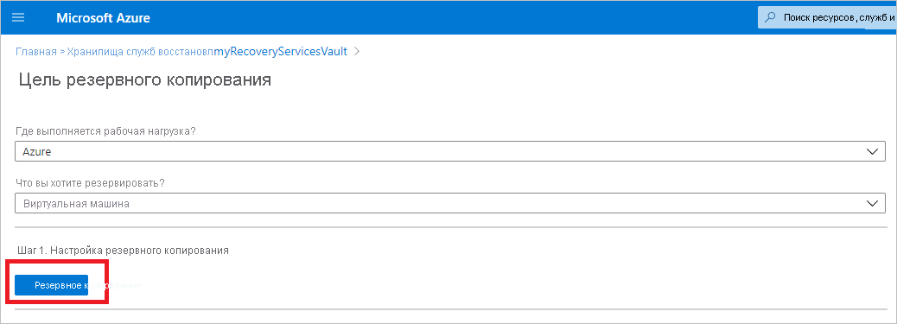
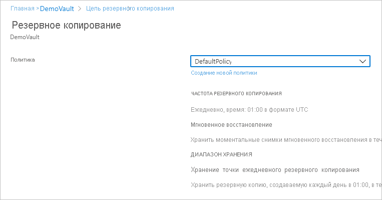
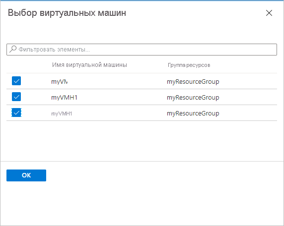

# <a name="back-up-azure-vms-in-a-recovery-services-vault"></a>Резервное копирование виртуальных машин Azure в хранилище Служб восстановления

В этой статье описывается резервное копирование виртуальных машин Azure в хранилище служб восстановления, с помощью [Azure Backup](backup-overview.md) службы. 

В этой статье раскрываются следующие темы:

> [!div class="checklist"]
> * Подготовка виртуальных машин Azure.
> * создание хранилища;
> * Обнаружение виртуальных машин и настройте политику резервного копирования.
> * Включите резервное копирование для виртуальных машин Azure.
> * Выполнение начального резервного копирования.


> [!NOTE]
> В этой статье описывается настройка хранилища и выберите виртуальные машины для резервного копирования. Этот способ удобен, если вы хотите создать резервные копии нескольких виртуальных машин. Кроме того, вы можете [резервное копирование одной виртуальной Машине Azure](backup-azure-vms-first-look-arm.md) в настройках виртуальной Машины.

## <a name="before-you-start"></a>Перед началом работы


- [Просмотрите](backup-architecture.md#architecture-direct-backup-of-azure-vms) архитектура резервного копирования виртуальной Машины Azure.
- [Узнайте о](backup-azure-vms-introduction.md) резервном копировании виртуальных машин Azure и расширении резервного копирования.
- [Ознакомьтесь с таблицей поддержки](backup-support-matrix-iaas.md) перед настройкой резервного копирования.

Кроме того существует несколько моментов, которые в некоторых случаях может потребоваться:

- **Установка агента виртуальной Машины на виртуальной Машине**: Для создания резервных копий виртуальных машин Azure служба Azure Backup устанавливает на них расширение агента виртуальной машины Azure. Если виртуальная машина создана из образа Azure marketplace, агент будет установлен и запущен. Если создать настраиваемую виртуальную Машину, или перенести на локальном компьютере, может потребоваться [установить агент вручную](#install-the-vm-agent).
- **Явным образом разрешить исходящий доступ**: Как правило не нужно явным образом разрешить исходящий сетевой доступ для виртуальной Машины Azure для его для взаимодействия со службой Azure Backup. Тем не менее, некоторые виртуальные машины могут возникнуть проблемы с подключением, показывающий **ExtensionSnapshotFailedNoNetwork** ошибка при попытке подключения. В этом случае следует [явным образом разрешить исходящий доступ](#explicitly-allow-outbound-access), поэтому расширение резервного копирования Azure могут взаимодействовать с Azure общедоступных IP-адресов для трафика резервного копирования.


## <a name="create-a-vault"></a>Создание хранилища

 В хранилище хранятся резервные копии и точки восстановления, созданные со временем, а также политики резервного копирования, связанные с резервными копиями виртуальных машин. Создайте хранилище следующим образом.    

1. Войдите на [портале Azure](https://portal.azure.com/).    
2. В поле поиска введите **служб восстановления**. В разделе **служб**, нажмите кнопку **хранилища служб восстановления**.   

      <br/> 

3. В **хранилища служб восстановления** меню, щелкните **+ добавить**.    

        

4. В **хранилище служб восстановления**, введите понятное имя для идентификации хранилища.   
    - Имя должно быть уникальным в пределах подписки Azure.   
    - Оно может содержать от 2 до 50 символов.    
    - Имя должно начинаться с буквы, оно может содержать только буквы, цифры и дефисы.   
5. Выберите подписку Azure, группу ресурсов и географическом регионе, в котором должен будет создан хранилище. Затем щелкните **Создать**.    
    - Для создания хранилища может потребоваться некоторое время.  
    - Следите за уведомлениями о состоянии на портале в верхней правой области.   


 После создания хранилище появится в списке хранилищ служб восстановления. Если вы не видите хранилища, выберите **Обновить**.
 
    

### <a name="modify-storage-replication"></a>Изменение репликации хранилища

По умолчанию хранилища используйте [геоизбыточное хранилище (GRS)](https://docs.microsoft.com/azure/storage/common/storage-redundancy-grs).

- Если хранилище является основного механизма резервного копирования, мы рекомендуем использовать GRS.
- Можно использовать [локально избыточное хранилище (LRS)](https://docs.microsoft.com/azure/storage/common/storage-redundancy-lrs?toc=%2fazure%2fstorage%2fblobs%2ftoc.json) дешевле параметра.

Измените тип репликации хранилища следующим образом:

1. В новое хранилище, щелкните **свойства** в **параметры** раздел.
2. В **свойства**в разделе **резервная конфигурация**, нажмите кнопку **обновления**.
3. Выберите тип репликации хранилища и нажмите кнопку **Сохранить**.

      
> [!NOTE]
   > После настройки хранилища, а элементы резервного копирования нельзя изменить тип репликации хранилища. Если вы хотите сделать это, необходимо повторно создать в хранилище. 

## <a name="apply-a-backup-policy"></a>Применить политику резервного копирования

Настройте политику резервного копирования для хранилища.

1. В хранилище, щелкните **и резервное копирование** в **Обзор** раздел.

   


2. В **цель резервного копирования** > **где выполняется рабочая нагрузка?** выберите **Azure**. В **действия вы хотите резервировать?** выберите **виртуальной машины** >  **ОК**. При этом расширение виртуальной машины зарегистрируется в хранилище.

   

3. В области **Политика архивации** выберите политику, которую вы хотите связать с хранилищем. 
    - Политика по умолчанию резервная копия виртуальной Машины один раз в день. Ежедневные резервные копии хранятся в течение 30 дней. Мгновенно восстановить моментальные снимки сохраняются в течение двух дней.
    - Если вы не хотите использовать политику по умолчанию, выберите **Create New**и создайте настраиваемую политику, как описано в следующей процедуре.

      

4. В **выбор виртуальных машин**, выберите виртуальные машины, необходимо создать резервную копию с помощью политики. Нажмите кнопку **ОК**.

   - Выбранные виртуальные машины будут проверяться.
   - Виртуальные машины можно выбрать только в том же регионе, что и хранилище.
   - Архивация виртуальных машин может выполняться только в одном хранилище.

     

5. В **резервного копирования**, нажмите кнопку **включить резервное копирование**. При этом в хранилище и на виртуальных машинах развертывается политика и устанавливается расширение архивации на агенте ВМ на виртуальной машине Azure.
     
     

После включения резервного копирования

- Расширение резервного копирования устанавливается службой Azure Backup независимо от того, запущена ли виртуальная машина.
- Начальный архив будет выполняться в соответствии с расписанием резервного копирования.
- При выполнении резервного копирования, обратите внимание, что:
    - Виртуальную Машину, на котором выполняется имеют наибольшую вероятность для захвата точки восстановления, согласованные с приложением.
    - Тем не менее даже если виртуальная машина находится в отключенном состоянии резервного копирования. Таких виртуальных Машин называется автономной виртуальной Машиной. В этом случае будет отказоустойчивой точки восстановления.
    

### <a name="create-a-custom-policy"></a>Создание настраиваемой политики

Если вы решили создать новую политику резервного копирования, укажите параметры политики.

1. В **имя политики**, укажите понятное имя.
2. В **расписание архивации** укажите, когда должно выполняться резервное копирование. Для виртуальных машин Azure созданием резервных копий ежедневно или еженедельно.
2. В **мгновенное восстановление**, укажите, как долго требуется хранить моментальные снимки локально для мгновенное восстановление.
    - При восстановлении резервной копии виртуальной Машины копирования дисков из хранилища, по сети на место хранения для восстановления. С помощью мгновенного восстановления можно использовать снимки хранимые локально, предпринятые во время задания резервного копирования, не дожидаясь передача в хранилище резервных копий данных.
    - Вы можете сохранить моментальные снимки для мгновенное восстановление от одного до пяти дней. Два дня — это параметр по умолчанию.
3. В **диапазон хранения**, укажите, как долго вы хотите сохранить ежедневного или еженедельного резервного копирования точек.
4. В **хранение точки ежемесячного резервного копирования**, укажите, хотите ли вы сохранить ежемесячный резервную копию резервных копий ежедневно или еженедельно. 
5. Нажмите кнопку **ОК** , чтобы сохранить политику.

    

> [!NOTE]
   > Azure Backup не поддерживает настройку автоматического перехода на летнее время для резервных копий виртуальных машин Azure. По мере изменений времени измените политики резервного копирования вручную при необходимости.

## <a name="trigger-the-initial-backup"></a>Активировать начальное резервное копирование

Начальное резервное копирование будет выполняться в соответствии с расписанием, но его можно запустить непосредственно в следующим образом:

1. В меню хранилища щелкните **Элементы архивации**.
2. На плитке **Элементы архивации** щелкните **Виртуальная машина Azure**.
3. В **архивные элементы** списке, нажмите кнопку с многоточием (...).
4. Щелкните **Создать резервную копию**.
5. В **моментальная Архивация**, использование элементов управления календарем выберите последний день, следует ли хранить точки восстановления. Нажмите кнопку **ОК**.
6. Отслеживайте уведомления на портале. Вы можете отслеживать ход выполнения задания на панели мониторинга хранилища в разделе **Задания резервного копирования** > **Выполняется**. В зависимости от размера виртуальной машины создание начального архива может занять некоторое время.

## <a name="optional-steps-install-agentallow-outbound"></a>Необязательные действия (для установки агента или разрешить исходящий трафик)
### <a name="install-the-vm-agent"></a>Установка агента виртуальной машины

Для создания резервных копий виртуальных машин Azure служба Azure Backup устанавливает на них расширение агента виртуальной машины Azure. Если виртуальная машина создана из образа Azure Marketplace, агент будет установлен и запущен. Если создать настраиваемую виртуальную Машину, или перенести на локальном компьютере, может потребоваться установить агент вручную, как описано в таблице.

**Виртуальная машина** | **Сведения**
--- | ---
**Windows** | 1. [Скачайте и установите](https://go.microsoft.com/fwlink/?LinkID=394789&clcid=0x409) MSI-файл агента.<br/><br/> 2. Требуется установка с разрешениями администратора на компьютере.<br/><br/> 3. Проверьте установку. В *C:\WindowsAzure\Packages* на виртуальной Машине, щелкните правой кнопкой мыши **WaAppAgent.exe** > **свойства**. На **сведения** вкладке **Версия_продукта** должно отображаться значение 2.6.1198.718 или выше.<br/><br/> Если вы обновляете агент, убедитесь, что выполняются операции резервного копирования, и [переустановите агент](https://go.microsoft.com/fwlink/?LinkID=394789&clcid=0x409).
**Linux** | Установите с помощью пакета RPM или DEB из репозитория пакета дистрибутива. Это предпочтительный метод для установки и обновления агента Linux для Azure. Все [поставщики поддерживаемых дистрибутивов](https://docs.microsoft.com/azure/virtual-machines/linux/endorsed-distros) встраивают пакет агента Linux для Azure в свои образы и репозитории. Агент можно найти в [GitHub](https://github.com/Azure/WALinuxAgent), но мы не рекомендуем устанавливать его оттуда.<br/><br/> Если вы обновляете агент, убедитесь, что операции резервного копирования, не работает и обновляет двоичные файлы.

### <a name="explicitly-allow-outbound-access"></a>Явным образом разрешить исходящий доступ

Расширение резервного копирования на виртуальной Машине требуется исходящий доступ к Azure общедоступных IP-адресов.

- Обычно не требуется явным образом разрешить исходящий сетевой доступ для виртуальной Машины Azure для его для взаимодействия со службой Azure Backup.
- Если возникли трудности с виртуальными машинами подключение, или если появится сообщение об ошибке **ExtensionSnapshotFailedNoNetwork** при попытках установить соединение, следует явным образом разрешить доступ, чтобы расширение резервного копирования может обмениваться данными с Azure общедоступный IP-адрес адреса для трафика резервного копирования. В следующей таблице приведены методы доступа.


**Параметр** | **Действие** | **Сведения** 
--- | --- | --- 
**Настройка правил NSG** | Разрешите [диапазоны IP-адресов центра обработки данных Azure](https://www.microsoft.com/download/details.aspx?id=41653).<br/><br/> Вместо разрешения и управление каждый диапазон адресов, можно добавить правило, которое разрешает доступ к службе архивации Azure с помощью [тег службы](backup-azure-arm-vms-prepare.md#set-up-an-nsg-rule-to-allow-outbound-access-to-azure). | [Дополнительные сведения](../virtual-network/security-overview.md#service-tags) о тегах служб.<br/><br/> Теги служб упрощают управление доступом, а не повлечь дополнительные затраты.
**Развертывание прокси-сервера** | Разверните прокси-сервер HTTP для маршрутизации трафика. | Доступ ко всей службе Azure, а не только к хранилищу.<br/><br/> Точное управление URL-адресами хранилища.<br/><br/> Единая точка доступа к виртуальным машинам через Интернет.<br/><br/> Дополнительные затраты на прокси-сервер.
**Настройка Брандмауэра Azure** | Разрешите трафик через брандмауэр Azure на виртуальной машине, используя тег полного доменного имени для службы Azure Backup. | Проста в использовании при наличии брандмауэра Azure в подсети виртуальной сети.<br/><br/> Невозможно создать собственные теги полное доменное имя или измените полные доменные имена в теге.<br/><br/> Если управляемые диски виртуальных машин Azure, может потребоваться открыть дополнительный порт (8443) в брандмауэрах.

#### <a name="establish-network-connectivity"></a>Установка сетевого подключения

Установить соединение с группой безопасности сети, прокси-сервером или брандмауэром

##### <a name="set-up-an-nsg-rule-to-allow-outbound-access-to-azure"></a>Настройка правила NSG для разрешения исходящего доступа к Azure

Если группа безопасности сети управляет доступ к виртуальной Машине, разрешите исходящий доступ для хранения резервных копий, необходимых диапазонов адресов и портов.

1. В свойствах виртуальной Машины > **сети**выберите **добавить правило исходящего порта**.
2. В **добавить правило безопасности для исходящего трафика**выберите **Дополнительно**.
3. В поле **Источник** выберите **VirtualNetwork**.
4. В **диапазоны исходных портов**, введите звездочку (*), чтобы разрешить исходящий доступ из любого порта.
5. В поле **Назначение** выберите **Тег службы**. В списке выберите **хранилище.регион**. Область — в хранилище и виртуальные машины, которые вы хотите создать резервную копию, местонахождения.
6. В поле **Диапазоны портов назначения** выберите порт.
    - Неуправляемая виртуальная машина с незашифрованной учетной записью хранения: 80
    - Неуправляемая виртуальная машина с зашифрованной учетной записью хранения: 443 (значение по умолчанию)
    - Управляемая виртуальная машина: 8443
7. В поле **Протокол** выберите **TCP**.
8. В поле **Приоритет** укажите значение приоритета меньше, чем у любых вышестоящих запрещающих правил.
   
   Если у вас есть правило, которое запрещает доступ, новый разрешающие правила должен быть выше. Например, если у вас есть набор правил **Deny_All** с приоритетом 1000, новое правило должно иметь значение меньше 1000.
9. Укажите имя и описание для правила и выберите **ОК**.

Правило группы безопасности сети можно применить к нескольким виртуальным машинам, чтобы разрешить исходящий доступ. В этом видео рассматривается вся процедура.

>[!VIDEO https://www.youtube.com/embed/1EjLQtbKm1M]


##### <a name="route-backup-traffic-through-a-proxy"></a>Маршрутизация трафика резервного копирования через прокси-сервер

Трафик резервного копирования можно перенаправить через прокси-сервер, а затем предоставить прокси-серверу доступ к нужным диапазонам Azure. Настройка прокси-сервера виртуальной Машины, чтобы разрешить следующие:

- Виртуальная машина Azure направляет весь HTTP-трафик для общего доступа в Интернете через прокси-сервер.
- Прокси-сервера следует разрешить входящий трафик из виртуальных машин в виртуальной сети применимо.
- Для группы безопасности сети **NSF-lockdown** требуется правило, которое разрешает передачу интернет-трафика с виртуальной машины прокси-сервера.

###### <a name="set-up-the-proxy"></a>Настройка прокси-сервера

Если у вас нет прокси-сервера системной учетной записи, настройте его следующим образом.

1. Скачайте [PsExec](https://technet.microsoft.com/sysinternals/bb897553).
2. Запустите **PsExec.exe -i -s cmd.exe** для запуска командной строки от имени учетной записи системы.
3. Запустите браузер в контексте системы. Например, использовать **%PROGRAMFILES%\Internet Explorer\iexplore.exe** для Internet Explorer.  
4. Задайте параметры прокси-сервера.
   - На компьютерах Linux
     - Добавьте следующую строку в файл **/etc/environment**.
       - **http_proxy=http:\//proxy IP address:proxy port**
     - Добавьте следующие строки в файл **/etc/waagent.conf**.
         - **HttpProxy.Host=proxy IP address**
         - **HttpProxy.Port=proxy port**
   - На компьютерах Windows в настройках браузера укажите, что должен использоваться прокси-сервер. Если вы уже используете прокси-сервер для учетной записи пользователя, чтобы применить настройки на уровне учетной записи системы, можете использовать этот сценарий.
       ```powershell
      $obj = Get-ItemProperty -Path Registry::"HKEY_CURRENT_USER\Software\Microsoft\Windows\CurrentVersion\Internet Settings\Connections"
      Set-ItemProperty -Path Registry::"HKEY_USERS\S-1-5-18\Software\Microsoft\Windows\CurrentVersion\Internet Settings\Connections" -Name DefaultConnectionSettings -Value $obj.DefaultConnectionSettings
      Set-ItemProperty -Path Registry::"HKEY_USERS\S-1-5-18\Software\Microsoft\Windows\CurrentVersion\Internet Settings\Connections" -Name SavedLegacySettings -Value $obj.SavedLegacySettings
      $obj = Get-ItemProperty -Path Registry::"HKEY_CURRENT_USER\Software\Microsoft\Windows\CurrentVersion\Internet Settings"
      Set-ItemProperty -Path Registry::"HKEY_USERS\S-1-5-18\Software\Microsoft\Windows\CurrentVersion\Internet Settings" -Name ProxyEnable -Value $obj.ProxyEnable
      Set-ItemProperty -Path Registry::"HKEY_USERS\S-1-5-18\Software\Microsoft\Windows\CurrentVersion\Internet Settings" -Name Proxyserver -Value $obj.Proxyserver

       ```

###### <a name="allow-incoming-connections-on-the-proxy"></a>Разрешение входящих подключений к прокси-серверу

Разрешите входящие подключения в параметрах прокси-сервера.

1. В брандмауэре Windows, откройте **брандмауэр Windows в режиме повышенной безопасности**.
2. Щелкните правой кнопкой мыши **Правила для входящих подключений**  >  **Новое правило**.
3. В **тип правила**выберите **Custom** > **Далее**.
4. В области **Программы** выберите **Все программы**  >  **Далее**.
5. В **протоколы и порты**:
   - Задайте тип **TCP**.
   - Задайте **локальные порты** для **определенные порты**.
   - Задайте **удаленный порт** для **все порты**.
  
6. Завершите работу мастера и укажите имя для правила.

###### <a name="add-an-exception-rule-to-the-nsg-for-the-proxy"></a>Добавление правила исключения к группе NSG для прокси-сервера

В правиле NSG **NSF-lockdown** разрешите трафик с любого порта на сервере 10.0.0.5 на любой адрес в Интернете по порту 80 (HTTP) или 443 (HTTPS).

Ниже приведен пример сценария PowerShell для разрешения трафика.
Не позволяйте исходящий трафик для всех общедоступных IP-адресов, можно указать диапазон IP-адресов (`-DestinationPortRange`), или использовать storage.region тег службы.   

```powershell
Get-AzureNetworkSecurityGroup -Name "NSG-lockdown" |
Set-AzureNetworkSecurityRule -Name "allow-proxy " -Action Allow -Protocol TCP -Type Outbound -Priority 200 -SourceAddressPrefix "10.0.0.5/32" -SourcePortRange "*" -DestinationAddressPrefix Internet -DestinationPortRange "80-443"
```

##### <a name="allow-firewall-access-with-an-fqdn-tag"></a>Открытие брандмауэра с помощью полного доменного ИМЕНИ тега

Брандмауэр Azure можно настроить для разрешения исходящий доступ для сетевого трафика к службе архивации Azure.

- [Дополнительные сведения](https://docs.microsoft.com/azure/firewall/tutorial-firewall-deploy-portal) о развертывании брандмауэра Azure.
- [Сведения](https://docs.microsoft.com/azure/firewall/fqdn-tags) о тегах полных доменных имен.


## <a name="next-steps"></a>Дальнейшие действия

- Устраните все проблемы с [агентов виртуальных Машин Azure](backup-azure-troubleshoot-vm-backup-fails-snapshot-timeout.md) или [резервного копирования виртуальных Машин Azure](backup-azure-vms-troubleshoot.md).
- [Восстановление](backup-azure-arm-restore-vms.md) виртуальные машины Azure.

