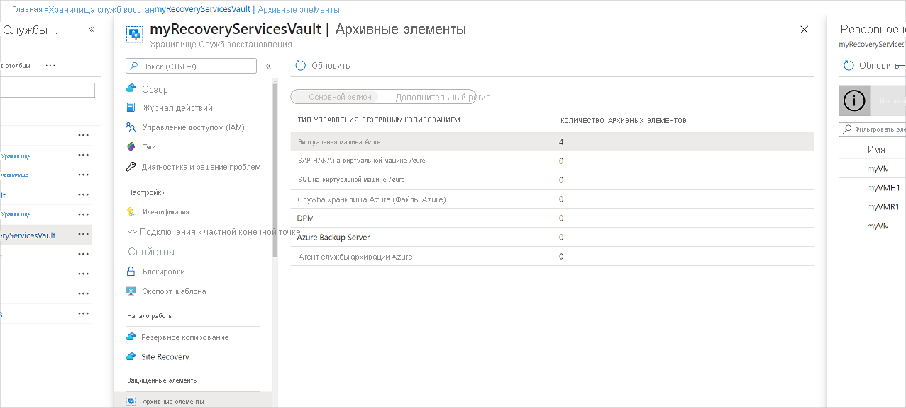
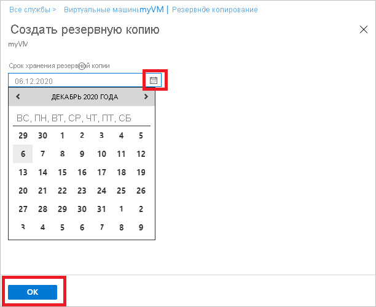
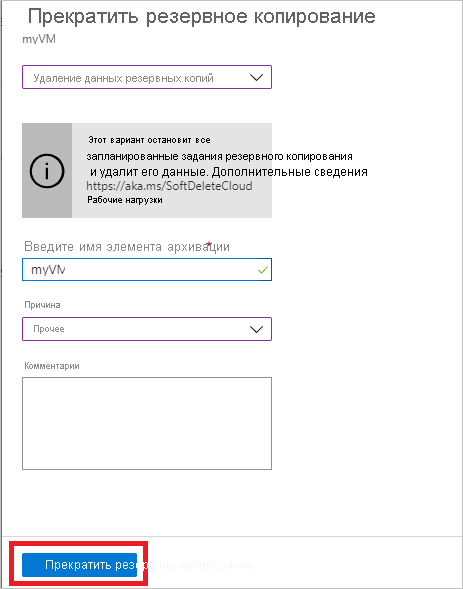

# Управление резервными копиями виртуальных машин Azure с помощью службы Azure Backup

В этой статье описывается, как управлять виртуальными машинами Azure, для которых выполняется резервное копирование с помощью [службы Azure Backup](backup-overview.md). В этой статье также приводится сводка сведений о резервном копировании, которые можно найти на панели мониторинга хранилища.

В портал Azure панель мониторинга хранилища служб восстановления предоставляет доступ к сведениям о хранилище, включая:

* последняя резервная копия, которая одновременно является последней точкой восстановления;
* Политика архивации.
* Общий размер всех моментальных снимков резервных копий.
* Число виртуальных машин, для которых включены резервные копии.

Вы можете управлять резервным копированием с помощью панели мониторинга и путем детализации до отдельных виртуальных машин. Чтобы начать создание резервных копий компьютера, откройте хранилище на панели мониторинга.

## Просмотр виртуальных машин на панели мониторинга

Чтобы просмотреть виртуальные машины на панели мониторинга хранилища, сделайте следующее:

1. Войдите на [портале Azure](https://portal.azure.com/).
2. В меню концентратора выберите **Обзор**. В списке ресурсов введите **Службы восстановления**. По мере ввода список фильтруется на основе введенных данных. Выберите **Хранилища служб восстановления**.

    

3. Чтобы упростить использование, щелкните правой кнопкой мыши хранилище и выберите **закрепить на панели мониторинга**.
4. Откройте панель мониторинга хранилища.

    

5. На плитке **элементы архивации** выберите **виртуальные машины Azure**.

    

6. В колонке **архивные элементы** можно просмотреть список защищенных виртуальных машин. В этом примере хранилище защищает одну виртуальную машину: демобаккуп.  

    

7. На панели мониторинга элемента хранилища измените политики резервного копирования, запустите резервное копирование по запросу, закройте или возобновите защиту виртуальных машин, удалите данные резервных копий, просмотрите точки восстановления и запустите восстановление.

    

## Управление политикой архивации для виртуальной машины

Для управления политикой резервного копирования выполните следующие действия.

1. Войдите на [портале Azure](https://portal.azure.com/). Откройте панель мониторинга хранилища.
2. На плитке **элементы архивации** выберите **виртуальные машины Azure**.

    

3. В колонке **архивные элементы** можно просмотреть список защищенных виртуальных машин и состояние последнего резервного копирования с последними точками восстановления.

    

4. На панели мониторинга элемента хранилища можно выбрать политику архивации.

   * Чтобы переключить политики, выберите другую политику и нажмите кнопку **сохранить**. Новая политика будет немедленно применена к хранилищу.

     

## Выполнение резервного копирования по требованию

После настройки защиты можно выполнить резервное копирование виртуальной машины по запросу. Учитывайте следующие сведения:

* Если начальная резервная копия находится в состоянии ожидания, резервное копирование по запросу создает полную копию виртуальной машины в хранилище служб восстановления.
* Если начальная Архивация завершена, то резервная копия по запросу будет отсылать изменения из предыдущего моментального снимка в хранилище служб восстановления. Это значит, что последующие резервные копии всегда являются добавочными.
* Диапазон хранения для резервного копирования по запросу — это значение хранения, указанное при активации резервного копирования.

Чтобы запустить резервное копирование по запросу, сделайте следующее:

1. На [панели мониторинга элемента хранилища](#view-vms-on-the-dashboard)в разделе **защищенный элемент**выберите **элемент архивации**.

    

2. В качестве **типа управления архивацией**выберите **Виртуальная машина Azure**. Отобразится колонка **элемент резервного копирования (виртуальная машина Azure)** .
3. Выберите виртуальную машину и щелкните **резервное копирование сейчас** , чтобы создать резервную копию по запросу. Отобразится колонка **резервная копия** .
4. В поле **хранить резервную копию до** укажите дату, в которую будет храниться резервная копия.

    

5. Нажмите кнопку **ОК** , чтобы запустить задание резервного копирования.

Чтобы отслеживать ход выполнения задания, на панели мониторинга хранилища выберите плитку **задания резервного копирования** .

## Отключение защиты для виртуальной машины

Существует два способа отключения защиты виртуальной машины.

* **Отключите защиту и храните данные резервной копии**. Этот параметр останавливает все будущие задания резервного копирования, не защищая виртуальную машину. Однако Azure Backup служба будет хранить точки восстановления, резервные копии которых были созданы.  Необходимо заплатить, чтобы удержать точки восстановления в хранилище (Дополнительные сведения см. в [Azure Backup ценах](https://azure.microsoft.com/pricing/details/backup/) ). При необходимости вы сможете восстановить виртуальную машину. Если вы решили возобновить защиту виртуальной машины, можно использовать параметр *возобновить резервное копирование* .
* **Отключите защиту и удалите данные резервных копий**. Этот параметр останавливает все будущие задания резервного копирования, не защищая виртуальную машину, и удаляет все точки восстановления. Вы не сможете восстановить виртуальную машину и использовать параметр *возобновления резервного копирования* .

>[!NOTE]
>При удалении источника данных без остановки резервного копирования происходит сбой новых операций резервного копирования. Срок действия старых точек восстановления истекает согласно политике, но одна последняя точка восстановления всегда будет сохраняться до тех пор, пока вы не завершите резервное копирование и не удалите данные.
>

### Отключение защиты и сохранность данных резервного копирования

Чтобы отключить защиту и хранить данные виртуальной машины, выполните следующие действия.

1. На [панели мониторинга элемента хранилища](#view-vms-on-the-dashboard)выберите пункт **прерывать резервную копию**.
2. Выберите **хранить данные резервной копии**и подтвердите выбор при необходимости. При необходимости добавьте комментарий. Если вы не знаете имя элемента, наведите указатель мыши на восклицательный знак, чтобы просмотреть его имя.

    

Уведомление позволяет убедиться, что задания резервного копирования остановлены.

### Отключение защиты и удаление данных резервного копирования

Чтобы отключить защиту и удалить данные виртуальной машины, выполните следующие действия.

1. На [панели мониторинга элемента хранилища](#view-vms-on-the-dashboard)выберите пункт **прерывать резервную копию**.
2. Выберите **удалить данные резервной копии**и подтвердите выбор при необходимости. Введите имя элемента резервного копирования и при необходимости добавьте комментарий.

    

## Возобновление защиты виртуальной машины

Если вы выбрали параметр [Отключить защиту и хранить данные архивации](#stop-protection-and-retain-backup-data) во время отключения защиты виртуальной машины, можно использовать **возобновить резервное копирование**. Этот параметр недоступен, если выбран параметр [Отключить защиту и удалить резервные данные](#stop-protection-and-delete-backup-data) или [удалить данные резервной](#delete-backup-data)копии.

Чтобы возобновить защиту виртуальной машины, выполните следующие действия.

1. На [панели мониторинга элемента хранилища](#view-vms-on-the-dashboard)выберите **возобновить резервное копирование**.

2. Чтобы назначить политику для виртуальной машины, выполните действия, описанные в статье [Управление политиками резервного копирования](#manage-backup-policy-for-a-vm) . Не нужно выбирать исходную политику защиты виртуальной машины.
3. После применения политики резервного копирования к виртуальной машине вы увидите следующее сообщение:

    

## Удаление данных резервных копий

Существует два способа удаления данных резервной копии виртуальной машины.

* На панели мониторинга элемента хранилища выберите пункт прерывать резервное копирование и следуйте инструкциям в разделе [Завершение защиты и удаление резервных данных](#stop-protection-and-delete-backup-data) .

  

* На панели мониторинга элемента хранилища выберите Удалить данные резервной копии. Этот параметр включен, если вы решили [Отключить защиту и хранить данные архивации](#stop-protection-and-retain-backup-data) во время отключения защиты виртуальной машины.

  

  * На [панели мониторинга элемента хранилища](#view-vms-on-the-dashboard)выберите **удалить данные архивации**.
  * Введите имя элемента резервного копирования, чтобы подтвердить, что необходимо удалить точки восстановления.

    

  * Чтобы удалить данные архивации для элемента, выберите **Удалить**. Сообщение уведомления позволяет убедиться, что данные резервного копирования удалены.

  > [!NOTE]
  > При удалении данных резервной копии удаляются все связанные точки восстановления. Вы не можете выбрать конкретные точки восстановления для удаления.

### Элемент резервного копирования, где первичный источник данных больше не существует

* Если виртуальные машины Azure, настроенные для службы архивации Azure, удалены или перемещены без остановки защиты, то запланированные задания резервного копирования и задания резервного копирования по запросу (ad-hoc) завершатся ошибкой UserErrorVmNotFoundV2. Предварительная проверка резервной копии будет отображаться как критическая только для неудачных заданий резервного копирования по требованию (невыполненные запланированные задания не отображаются).
* Эти элементы резервного копирования остаются активными в системе, придерживая политику резервного копирования и хранения, установленную пользователем. Резервные копии данных для этих виртуальных машин Azure будут сохранены в соответствии с политикой хранения. Точки восстановления с истекшим сроком действия (за исключением последней точки восстановления) очищаются в соответствии с диапазоном хранения, заданным в политике резервного копирования.
* Пользователям рекомендуется удалять архивные элементы, в которых не существует первичный источник данных, чтобы избежать дополнительных затрат, если резервная копия и данные для ресурсов удаления больше не требуются, так как последняя точка восстановления постоянно сохраняется, и плата за него взимается согласно ценам на резервное копирование.

## Дополнительная информация

* Узнайте, как [выполнять резервное копирование виртуальных машин Azure из параметров виртуальной машины](backup-azure-vms-first-look-arm.md).
* Узнайте, как [восстановить виртуальные машины](backup-azure-arm-restore-vms.md).
* Узнайте, как [отслеживать резервные копии виртуальных машин Azure](backup-azure-monitor-vms.md).
