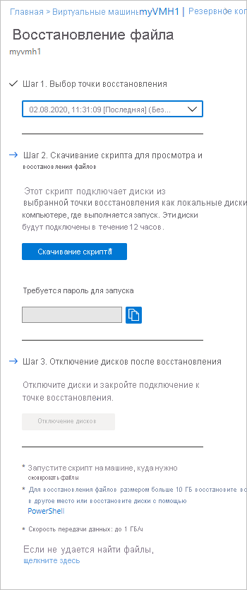
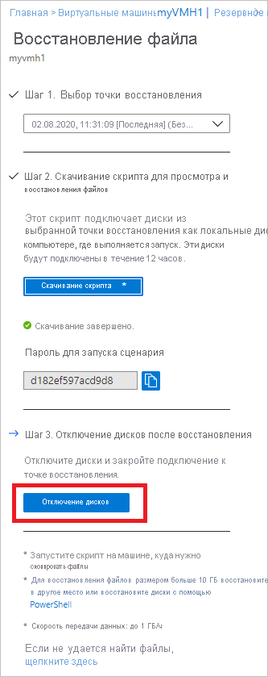

# <a name="recover-files-from-azure-virtual-machine-backup"></a>Восстановление файлов из резервной копии виртуальной машины Azure

Azure Backup предоставляет возможность восстановления [виртуальных машин и дисков Azure](./backup-azure-arm-restore-vms.md) из резервных копий виртуальных машин Azure, также известных как точки восстановления. В этой статье описывается восстановление файлов и папок из резервной копии виртуальной машины Azure. Восстановление файлов и папок доступно только для виртуальных машин Azure, развернутых с помощью модели диспетчер ресурсов и защищенных в хранилище служб восстановления.

> [!NOTE]
> Эта функция доступна для всех виртуальных машин Azure, развернутых посредством модели с помощью Resource Manager и защищенных в хранилище служб восстановления.
> Восстановление файлов из зашифрованной резервной копии виртуальной машины не поддерживается.
>

## <a name="mount-the-volume-and-copy-files"></a>Подключение тома и копирование файлов

Чтобы восстановить файлы и папки из точки восстановления, перейдите на виртуальную машину и выберите нужную точку восстановления.

1. Войдите в [портал Azure](https://portal.Azure.com) и в левой области выберите **виртуальные машины**. В списке виртуальных машин выберите виртуальную машину, чтобы открыть ее панель мониторинга.

2. В меню виртуальной машины выберите **резервное копирование** , чтобы открыть панель мониторинга резервного копирования.

    

3. В меню Панель мониторинга архивации выберите пункт **Восстановление файлов**.

    

    Открывается меню **Восстановление файла**.

    

4. В раскрывающемся меню **Выберите точку восстановления** найдите и выберите точку восстановления, которая содержит требуемые файлы. По умолчанию здесь выбрана последняя из созданных точек восстановления.

5. Чтобы скачать программное обеспечение, используемое для копирования файлов из точки восстановления, выберите **скачать исполняемый файл** (для виртуальных машин Windows Azure) или **загрузить скрипт** (для виртуальных машин Linux Azure создается скрипт Python).

    

    Azure скачает исполняемый файл или сценарий на локальный компьютер.

    

    Чтобы запустить исполняемый файл или скрипт с правами администратора, мы рекомендуем сохранить скачанный файл на компьютере.

6. Исполняемый файл или сценарий защищен, и для него требуется ввести пароль. В меню **Восстановление файла** нажмите кнопку Копировать, чтобы загрузить пароль в память.

    

7. Убедитесь, что [скрипит выполняется на нужном компьютере](#selecting-the-right-machine-to-run-the-script). Если требуемым компьютером является тот же компьютер, на котором был скачан скрипт, можно перейти к разделу скачивания. Из расположения скачивания (обычно папка *Загрузки*) щелкните исполняемый файл или скрипт правой кнопкой мыши и запустите его с учетными данными администратора. При появлении запроса введите пароль или вставьте его из памяти и нажмите клавишу **ВВОД**. После ввода пароля сценарии подключаются к точке восстановления.

    

8. Для компьютеров Linux создается скрипт Python. Нужно скачать скрипт и скопировать его на соответствующий или совместимый сервер Linux. Вам может потребоваться изменить разрешения, чтобы выполнить его с помощью ```chmod +x <python file name>```. Затем запустите файл Python с помощью ```./<python file name>```.

Чтобы убедиться, что скрипт выполнен успешно, ознакомьтесь с разделом [Требования доступа](#access-requirements).

### <a name="identifying-volumes"></a>Определение томов

#### <a name="for-windows"></a>Для Windows

При выполнении исполняемого файла операционная система подключает новые тома и назначает им буквы дисков. Для просмотра этих дисков вы можете использовать проводник Windows или проводник. Этим томам могут быть назначены не те буквы дисков, которые использовались на исходной виртуальной машине. Имена томов сохраняются. Например, если на исходной виртуальной машине том назывался "Диск данных (E:`\`)", на локальном компьютере он будет подключен как "Диск данных (любая буква:`\`)". Просмотрите все тома, которые упоминаются в выходных данных скрипта, пока не найдете нужные файлы или папки.  

   

#### <a name="for-linux"></a>Для Linux

В Linux тома точки восстановления подключаются к папке, в которой выполняет сценарий. Отображаются подключенные диски, тома и соответствующие пути подключения. Эти пути подключения видимы для пользователей с доступом на корневом уровне. Просмотрите тома, указанные в выходных данных сценария.

  

## <a name="closing-the-connection"></a>Закрытие подключения

Когда вы найдете все нужные файлы и скопируете их в локальное хранилище, удалите или отключите дополнительные диски. Чтобы отключить диски, в меню **Восстановление файлов** в портал Azure выберите **отключить диски**.



Когда диски будут отключены, появится сообщение об успешном завершении операции. На обновление состояния подключения может потребоваться несколько минут, после чего диски можно удалить.

В Linux после разрыва подключения к точке восстановления операционная система не удаляет соответствующие пути подключения автоматически. Они существуют в виде потерянных томов и видимы, но при обращении к ним или записи в них файлов происходит ошибка. Их можно удалить вручную. При запуске сценарий определяет такие тома, оставшиеся от любой предыдущей точки восстановления, и очищает их после согласия пользователя.

> [!NOTE]
> Убедитесь, что подключение закрыто после восстановления необходимых файлов. Это важно, особенно в ситуации, когда компьютер, на котором выполняется сценарий, также настроен для резервного копирования. Если подключение по-прежнему открыто, то последующая операция резервного копирования может завершиться ошибкой «Усереррорунаблетупенмаунт». Это происходит из-за того, что подключенные диски и тома считаются доступными и при доступе к ним может произойти сбой, так как базовое хранилище, то есть сервер цели iSCSI, может быть недоступно. Очистка подключения приведет к удалению этих дисков и томов, поэтому они не будут доступны во время резервного копирования.

## <a name="selecting-the-right-machine-to-run-the-script"></a>Выбор подходящего компьютера для запуска скрипта

Если скрипт успешно скачан, далее следует убедиться, что компьютер, на котором планируется выполнить скрипт, является подходящим. Ниже приведены требования, которые должны быть выполнены на компьютере.

### <a name="original-backed-up-machine-versus-another-machine"></a>Резервная копия исходного компьютера и другой компьютер

1. Если резервная копия компьютера является виртуальной машиной с диском большого размера, то есть количество дисков превышает 16 или размер каждого диска превышает 4 ТБ, то **скрипт необходимо выполнить на другом компьютере** и должны быть выполнены [эти требования](#file-recovery-from-virtual-machine-backups-having-large-disks).
1. Даже если резервная копия компьютера не является виртуальной машиной с диском большого размера, в [этих сценариях](#special-configurations) скрипт невозможно выполнить на той же резервной копии виртуальной машины.

### <a name="os-requirements-on-the-machine"></a>Требования к ОС компьютера

Компьютер, на котором должен выполняться скрипт, должен соответствовать [этим требованиям к ОС](#system-requirements).

### <a name="access-requirements-for-the-machine"></a>Требования к доступу для компьютера

Компьютер, на котором должен выполняться скрипт, должен соответствовать [этим требованиям доступа](#access-requirements).

## <a name="special-configurations"></a>Специальные конфигурации

### <a name="dynamic-disks"></a>Динамические диски

Если на защищенной виртуальной машине Azure есть тома, обладающие одной или всеми следующими характеристиками, то запустить на ней исполняемый сценарий не удастся.

- Тома, охватывающие несколько дисков (составные и чередующиеся тома)
- Отказоустойчивые тома (зеркальные тома и тома RAID-5) на динамических дисках

Вместо этого запустите исполняемый сценарий на другом компьютере с совместимой операционной системой.

### <a name="windows-storage-spaces"></a>Дисковое пространство Windows

Дисковые пространства Windows — это технология Windows, которая позволяет виртуализировать хранилище. С помощью дисковых пространств Windows можно сгруппировать стандартные отраслевые диски в пулы носителей. Затем доступное пространство в этих пулах носителей можно использовать для создания виртуальных дисков, называемых дисковыми пространствами.

Если защищенная виртуальная машина Azure использует дисковые пространства Windows, то запустить на ней исполняемый сценарий не удастся. Вместо этого запустите его на другом компьютере с совместимой операционной системой.

### <a name="lvmraid-arrays"></a>LVM или RAID-массивы

В Linux для управления логическими томами на нескольких дисках используется диспетчер логических томов (LVM) и (или) программные RAID-массивы. Если защищенная виртуальная машина Linux использует LVM и/или RAID-массивы, на ней нельзя запустить сценарий. Вместо этого запустите сценарий на любом другом компьютере с совместимой операционной системы, поддерживающей файловую систему защищенной виртуальной машины.

В следующих выходных данных сценария отображаются диски и тома LVM или RAID-массивов с типом раздела.

   

Чтобы подключить эти разделы, выполните команды в следующих разделах.

#### <a name="for-lvm-partitions"></a>Разделы LVM

После выполнения скрипта разделы LVM подключаются к физическим томам/диск, указанным в выходных данных скрипта. Процесс

1. Получение уникального списка имен групп томов из физических томов или дисков
2. Затем перечислите логические тома в этих группах томов.
3. Затем подключите логические тома к нужному пути.

##### <a name="listing-volume-group-names-from-physical-volumes"></a>Вывод списка имен групп томов из физических томов

Чтобы вывести список имен групп томов, выполните следующие действия.

```bash
pvs -o +vguuid
```

Эта команда выводит список всех физических томов (включая существующие перед выполнением сценария), соответствующие имена групп томов и уникальные идентификаторы пользователей (UUID) группы томов. Ниже приведен пример выходных данных команды.

```bash
PV         VG        Fmt  Attr PSize   PFree    VG UUID

  /dev/sda4  rootvg    lvm2 a--  138.71g  113.71g EtBn0y-RlXA-pK8g-de2S-mq9K-9syx-B29OL6

  /dev/sdc   APPvg_new lvm2 a--  <75.00g   <7.50g njdUWm-6ytR-8oAm-8eN1-jiss-eQ3p-HRIhq5

  /dev/sde   APPvg_new lvm2 a--  <75.00g   <7.50g njdUWm-6ytR-8oAm-8eN1-jiss-eQ3p-HRIhq5

  /dev/sdf   datavg_db lvm2 a--   <1.50t <396.50g dhWL1i-lcZS-KPLI-o7qP-AN2n-y2f8-A1fWqN

  /dev/sdd   datavg_db lvm2 a--   <1.50t <396.50g dhWL1i-lcZS-KPLI-o7qP-AN2n-y2f8-A1fWqN
```

Первый столбец (ПС) показывает физический том, в последующих столбцах отображается соответствующее имя группы томов, формат, атрибуты, размер, свободное пространство и уникальный идентификатор группы томов. В выходных данных команды отображаются все физические тома. Просмотрите выходные данные скрипта и найдите тома, связанные с резервной копией. В приведенном выше примере выходные данные сценария отображались бы/Дев/СДФ и/Дев/СДД. Таким образом, группа томов *datavg_db* принадлежит к сценарию, а *Appvg_new* группа томов принадлежит компьютеру. Последняя идея — убедиться, что уникальное имя группы томов должно иметь один уникальный идентификатор.

###### <a name="duplicate-volume-groups"></a>Дублирующиеся группы томов

Существуют сценарии, в которых имена групп томов могут иметь 2 UUID после выполнения сценария. Это означает, что имена групп томов на компьютере, где выполняется сценарий, а также на виртуальной машине с резервным копированием, одинаковы. Затем необходимо переименовать группы томов с резервными копиями. Рассмотрим пример ниже.

```bash
PV         VG        Fmt  Attr PSize   PFree    VG UUID

  /dev/sda4  rootvg    lvm2 a--  138.71g  113.71g EtBn0y-RlXA-pK8g-de2S-mq9K-9syx-B29OL6

  /dev/sdc   APPvg_new lvm2 a--  <75.00g   <7.50g njdUWm-6ytR-8oAm-8eN1-jiss-eQ3p-HRIhq5

  /dev/sde   APPvg_new lvm2 a--  <75.00g   <7.50g njdUWm-6ytR-8oAm-8eN1-jiss-eQ3p-HRIhq5

  /dev/sdg   APPvg_new lvm2 a--  <75.00g  508.00m lCAisz-wTeJ-eqdj-S4HY-108f-b8Xh-607IuC

  /dev/sdh   APPvg_new lvm2 a--  <75.00g  508.00m lCAisz-wTeJ-eqdj-S4HY-108f-b8Xh-607IuC

  /dev/sdm2  rootvg    lvm2 a--  194.57g  127.57g efohjX-KUGB-ETaH-4JKB-MieG-EGOc-XcfLCt
```

Выходные данные сценария будут показывать/Дев/СДГ,/Дев/СДХ,/dev/sdm2 как прикрепленные. Таким образом, соответствующие имена VG Appvg_new и рутвг. Но те же имена также содержатся в списке VGов на компьютере. Мы можем проверить, что одно имя VG имеет два UUID.

Теперь нужно переименовать VG имена томов на основе сценариев, например:/Дев/СДГ,/Дев/СДХ,/dev/sdm2. Чтобы переименовать группу томов, используйте следующую команду:

```bash
vgimportclone -n rootvg_new /dev/sdm2
vgimportclone -n APPVg_2 /dev/sdg /dev/sdh
```

Теперь у нас есть все имена VG с уникальными идентификаторами.

###### <a name="active-volume-groups"></a>Активные группы томов

Убедитесь, что группы томов, соответствующие томам сценария, активны. Следующая команда используется для показа активных групп томов. Проверьте, имеются ли в этом списке группы томов, связанные с скриптом.

```bash
vgdisplay -a
```  

В противном случае активируйте группу томов с помощью следующей команды.

```bash
#!/bin/bash
vgchange –a y  <volume-group-name>
```

##### <a name="listing-logical-volumes-within-volume-groups"></a>Вывод списка логических томов в группах томов

После получения уникального активного списка VGs, связанного с этим сценарием, логические тома, присутствующие в этих группах томов, можно указать с помощью следующей команды.

```bash
#!/bin/bash
lvdisplay <volume-group-name>
```

Эта команда отображает путь к каждому логическому тому как "путь LV".

##### <a name="mounting-logical-volumes"></a>Подключение логических томов

Эта команда подключает логические тома по указанному пути.

```bash
#!/bin/bash
mount <LV path from the lvdisplay cmd results> </mountpath>
```

> [!WARNING]
> Не используйте "mount-a". Эта команда подключает все устройства, описанные в разделе "/etc/fstab". Это может означать, что дубликаты устройств могут быть подключены. Данные могут перенаправляться на устройства, созданные сценарием, который не сохраняет данные, и поэтому может привести к утрате данных.

#### <a name="for-raid-arrays"></a>RAID-массивы

Эта команда выводит сведения обо всех дисках RAID.

```bash
#!/bin/bash
mdadm –detail –scan
```

 Соответствующий диск RAID будет отображен как `/dev/mdm/<RAID array name in the protected VM>`.

Если диск RAID содержит физические тома, выполните команду подключения.

```bash
#!/bin/bash
mount [RAID Disk Path] [/mountpath]
```

Если для этого диска RAID настроен другой LVM, то выполните приведенную выше процедуру для разделов LVM, указав имя тома в качестве имени диска RAID.

## <a name="system-requirements"></a>Требования к системе

### <a name="for-windows-os"></a>Windows 10

Следующая таблица содержит информацию о совместимости операционных систем сервера и компьютера. Нельзя восстановить файлы до предыдущей или будущей версии операционной системы. Например, нельзя восстановить файл с виртуальной машины Windows Server 2016 на компьютер Windows Server 2012 или Windows 8. Файлы можно восстановить с виртуальной машины в ту же серверную операционную систему или в совместимую клиентскую операционную систему.

|ОС сервера | Совместимые ОС клиента  |
| --------------- | ---- |
| Windows Server 2019    | Windows 10 |
| Windows Server 2016    | Windows 10 |
| Windows Server 2012 R2 | Windows 8.1 |
| Windows Server 2012    | Windows 8  |
| Windows Server 2008 R2 | Windows 7   |

### <a name="for-linux-os"></a>Для ОС Linux

В Linux операционная система компьютера, используемого для восстановления файлов, должна поддерживать файловую систему защищенной виртуальной машины. При выборе компьютера для выполнения сценария убедитесь, что он имеет совместимую ОС и использует одну из версий, приведенных в следующей таблице:

|ОС Linux | Версии  |
| --------------- | ---- |
| Ubuntu | 12.04 и выше |
| CentOS | 6.5 и выше  |
| RHEL | 6.7 и выше |
| Debian | 7 и выше |
| Oracle Linux | 6.4 и выше |
| SLES | 12 и выше |
| openSUSE | 42.2 и выше |

> [!NOTE]
> Мы обнаружили некоторые проблемы, связанные с запуском сценария восстановления файлов на компьютерах с ОС SLES 12 SP4, и мы изучаем группу SLES.
> Сейчас запуск скрипта восстановления файлов работает на компьютерах с версиями ОС SLES 12 с пакетом обновления 2 (SP2) и 3 (SP3).
>

Сценарию также требуется компоненты python и bash для выполнения операций и безопасного подключения к точке восстановления.

|Компонент | Версия  |
| --------------- | ---- |
| bash | 4 и выше |
| python | 2.6.6 и выше  |
| TLS | Должна поддерживаться версия 1.2  |

## <a name="access-requirements"></a>Требования доступа

При запуске сценария на компьютере с ограниченным доступом убедитесь, что у вас есть доступ к следующим:

- `download.microsoft.com`
- URL-адреса службы восстановления (географическое имя относится к региону, в котором находится хранилище служб восстановления)
  - `https://pod01-rec2.GEO-NAME.backup.windowsazure.com` (Для общедоступных регионов Azure)
  - `https://pod01-rec2.GEO-NAME.backup.windowsazure.cn` (Azure для Китая (21Vianet));
  - `https://pod01-rec2.GEO-NAME.backup.windowsazure.us` (Azure для государственных организаций США);
  - `https://pod01-rec2.GEO-NAME.backup.windowsazure.de` (Azure для Германии).
- Исходящие порты 53 (DNS), 443, 3260.

> [!NOTE]
>
> Файл скрипта, скачанный на шаге 5 [выше](#mount-the-volume-and-copy-files) , будет содержать **географическое имя** в имени файла. Используйте это **географическое имя** для заполнения URL-адреса. Имя скачанного скрипта будет начинаться с: \' VMname \' \_ \' геоимя \' _ \' GUID \' .<br><br>
> Например, если имя файла скрипта — *ContosoVM_wcus_12345678*, **географическое имя** — *вкус* , а URL-адрес будет выглядеть так:<br> <https://pod01-rec2.wcus.backup.windowsazure.com>
>

Для Linux сценарию требуются компоненты open-iscsi и lshw для подключения к точке восстановления. Если на компьютере, где выполняется скрипт, отсутствуют компоненты, скрипт запрашивает разрешение на их установку. Согласитесь на установку необходимых компонентов.

Доступ к `download.microsoft.com` требуется для загрузки компонентов, используемых для создания безопасного канала между компьютером, на котором выполняется скрипт, и данными в точке восстановления.

## <a name="file-recovery-from-virtual-machine-backups-having-large-disks"></a>Восстановление файлов из резервных копий виртуальных машин с дисками большого объема

В этом разделе объясняется, как выполнить восстановление файлов из резервных копий виртуальных машин Azure, имеющих более 16 дисков, или размер каждого диска превышает 4 ТБ.

Так как процесс восстановления файлов присоединяет все диски из резервной копии, при использовании большого числа дисков (>16) или больших дисков (каждый > 4 ТБ) рекомендуется использовать следующие точки действий:

- Для восстановления файлов используйте отдельный сервер восстановления (виртуальные машины Azure D2v3). Его можно использовать только для восстановления файлов, а затем завершать его работу, когда это не требуется. Выполнять восстановление на исходном компьютере не рекомендуется, так как оно оказывает значительное влияние на саму виртуальную машину.
- Затем запустите скрипт один раз, чтобы проверить успешность операции восстановления файла.
- Если процесс восстановления файла зависает (диски не подключены или подключены, но тома не отображаются), выполните следующие действия.
  - Если сервер восстановления является виртуальной машиной Windows:
    - Убедитесь, что ОС имеет версию WS 2012 или выше.
    - Убедитесь, что разделы реестра заданы на сервере восстановления, как показано ниже, и перезагрузите сервер. Число рядом с уникальным идентификатором может быть в диапазоне от 0001 до 0005. В следующем примере указано 0004. Перейдите по пути раздела реестра до раздела параметров.

    

```registry
- HKEY_LOCAL_MACHINE\SYSTEM\CurrentControlSet\Services\Disk\TimeOutValue – change this from 60 to 1200
- HKEY_LOCAL_MACHINE\SYSTEM\ControlSet001\Control\Class\{4d36e97b-e325-11ce-bfc1-08002be10318}\0003\Parameters\SrbTimeoutDelta – change this from 15 to 1200
- HKEY_LOCAL_MACHINE\SYSTEM\ControlSet001\Control\Class\{4d36e97b-e325-11ce-bfc1-08002be10318}\0003\Parameters\EnableNOPOut – change this from 0 to 1
- HKEY_LOCAL_MACHINE\SYSTEM\ControlSet001\Control\Class\{4d36e97b-e325-11ce-bfc1-08002be10318}\0003\Parameters\MaxRequestHoldTime - change this from 60 to 1200
```

- Если сервер восстановления является виртуальной машиной Linux, сделайте следующее:
  - В файле /etc/iscsi/iscsid.conf измените настройку с:
    - `node.conn[0].timeo.noop_out_timeout = 5`  Кому `node.conn[0].timeo.noop_out_timeout = 30`
- После внесения указанных выше изменений запустите скрипт еще раз. С учетом этих изменений весьма вероятно, что восстановление файла будет успешным.
- Каждый раз, когда пользователь загружает скрипт, служба Azure Backup инициирует процесс подготовки точки восстановления к скачиванию. Для дисков большего объема этот процесс займет значительное время. Если есть последовательные пики запросов, подготовка целевого объекта перейдет в состояние спиральной загрузки. Поэтому рекомендуется загрузить скрипт из портала, PowerShell или CLI, подождать 20–30 минут (эвристика) и затем запустить его. К этому времени ожидается, что целевая резервная копия будет готова к подключению из скрипта.
- После восстановления файлов убедитесь, что вы вернитесь на портал и выберите **отключить диски** для точек восстановления, в которых не удалось подключить тома. По сути этот шаг позволяет очистить существующие процессы или сеансы и повысить вероятность восстановления.

## <a name="troubleshooting"></a>Устранение неполадок

Если при восстановлении файлов из виртуальных машин у вас возникнут проблемы, проверьте сведения, приведенные в следующей таблице.

| Сообщение об ошибке или ситуация | Возможные причины | Рекомендуемое действие |
| ------------------------ | -------------- | ------------------ |
| Выходные данные EXE-файла: *Exception caught while connecting to target* (Перехвачено исключение при подключении к целевому объекту). | Скрипт не может получить доступ к точке восстановления    | Проверьте, соответствует ли компьютер всем [перечисленным выше требованиям](#access-requirements). |  
| Выходные данные EXE-файла: *The target has already been logged in via an ISCSI session* (Вход на целевое устройство уже выполнен через сеанс iSCSI). | Этот скрипт уже запущен на этом компьютере и диски уже подключены | Тома точки восстановления уже подключены. Они могут быть не подключены к одной и той же букве диска исходной виртуальной машины. Просмотрите все доступные тома в проводнике, чтобы найти нужный файл. |
| Выходные данные EXE-файла: *This script is invalid because the disks have been dismounted via portal/exceeded the 12-hr limit. Please download a new script from the portal.* (Этот сценарий недействителен, так как диски отключены через портал или превышено ограничение в 12 часов. Скачайте с портала новый сценарий). |    Диски отключены через портал или превышено 12-часовое ограничение. | Эта копия EXE-файла больше недействительна, использовать ее нельзя. Если вам еще нужен доступ к файлам этой точки восстановления на определенный момент времени, зайдите на портал и скачайте новый EXE-файл.|
| На компьютере, где выполняется EXE-файл: новые тома не отключаются кнопкой отключения. | Инициатор iSCSI на компьютере не отвечает на запросы или не обновляет подключение к целевому объекту, сохраняя состояние кэша. |  После нажатия кнопки **Отключить**, подождите несколько минут. Если новые тома по-прежнему не отключаются, откройте в проводнике каждый из них. Инициатор принудительно обновляет соединение, и диски будут отключены с сообщением об ошибке "Диск недоступен".|
| Выходные данные EXE-файла: скрипт выполняется успешно, но в его выходных данных нет сообщения New volumes attached (Новые тома подключены). |    Это временная проблема    | Тома, скорее всего, уже подключены. Попробуйте открыть их через проводник. Если вы несколько раз запускали скрипт на одном и том же компьютере, попробуйте перезагрузить его. Список будет отображаться при последующих запусках EXE-файла. |
| В Linux: не удается просмотреть нужные тома | Операционная система компьютера, на котором выполняется сценарий, не может распознать базовую файловую систему защищенной виртуальной машины. | Проверьте, является ли точка восстановления отказоустойчивой или обеспечивающей целостность файлов. Если это конечная точка, обеспечивающая целостность файлов, выполните скрипт на другом компьютере, ОС которого распознает файловую систему защищенной виртуальной машины. |
| В Windows: не удается просмотреть нужные тома | Диски присоединены, но тома не настроены | На экране управления дисками определите дополнительные диски, относящиеся к точке восстановления. Если какой-либо из этих дисков находится в автономном состоянии, попробуйте подключить их к сети, щелкнув диск правой кнопкой мыши и выбрав пункт в **сети**.|

## <a name="security"></a>Безопасность

В этом разделе рассматриваются различные меры безопасности, предпринятые для реализации восстановления файлов из резервных копий виртуальных машин Azure.

### <a name="feature-flow"></a>Поток функций

Эта функция была создана для доступа к данным виртуальной машины без необходимости восстановления всей виртуальной машины или ее дисков при минимальном количестве действий. Доступ к данным виртуальной машины обеспечивается с помощью скрипта (который подключает том восстановления при запуске, как показано ниже) и является ключевым элементом в реализации безопасности.

  

### <a name="security-implementations"></a>Реализации безопасности

#### <a name="select-recovery-point-who-can-generate-script"></a>Выбор точки восстановления (которая может создавать скрипт)

Скрипт предоставляет доступ к данным виртуальной машины, поэтому в первую очередь важно контролировать, кто его может создать. Необходимо войти в портал Azure и использовать [Azure RBAC](backup-rbac-rs-vault.md#mapping-backup-built-in-roles-to-backup-management-actions) для создания скрипта.

Для восстановления файлов требуется тот же уровень авторизации, что и для восстановления виртуальной машины и дисков. Иными словами, только полномочные пользователи могут просматривать данные виртуальной машины, чтобы создать скрипт.

Созданный скрипт подписывается официальным сертификатом Майкрософт для службы Azure Backup. Любое вмешательство в скрипт означает, что подпись нарушена, и любая попытка запустить скрипт определяется ОС как потенциально рискованная.

#### <a name="mount-recovery-volume-who-can-run-script"></a>Подключение тома восстановления (который может выполнять скрипт)

Только администратор может запустить скрипт в режиме с повышенными правами. Скрипт можно запустить, выполнив только предварительно сформированный набор шагов. Он не принимает входные данные из какого-либо внешнего источника.

Чтобы выполнить сценарий, требуется пароль, который отображается только для пользователя, который является полномочным, во время создания скрипта в портал Azure или PowerShell/CLI. Это необходимо для того, чтобы полномочный пользователь, загружающий скрипт, также отвечал за выполнение сценария.

#### <a name="browse-files-and-folders"></a>Обзор файлов и папок

Для просмотра файлов и папок скрипт использует инициатор iSCSI на компьютере и подключается к точке восстановления, настроенной в качестве цели iSCSI. Здесь можно представить сценарии, в которых выполняется попытка имитировать или подменить все компоненты.

Мы используем механизм взаимной проверки подлинности CHAP, чтобы каждый компонент проверял подлинность другого. Это означает, что поддельному инициатору чрезвычайно трудно подключиться к целевому устройству iSCSI, а поддельному объекту — подключиться к компьютеру, на котором выполняется скрипт.

Поток данных между службой восстановления и компьютером защищается путем создания защищенного туннеля TLS по протоколу TCP (на компьютере, где выполняется скрипт [должен поддерживаться TLS 1.2](#system-requirements)).

Любой список управления доступом к файлам (ACL), имеющийся на виртуальной машине (родительской или резервной), также сохраняется в подключенной файловой системе.

Скрипт предоставляет доступ только для чтения к точке восстановления и действует только в течение 12 часов. Если вы хотите удалить доступ ранее, войдите в портал Azure/PowerShell/CLI и выполните **Отключение дисков** для этой точки восстановления. Скрипт будет немедленно объявлен недействительным.

## <a name="next-steps"></a>Дальнейшие действия

- Сведения о проблемах при восстановлении файлов см. в разделе [Устранение неполадок](#troubleshooting)
- Узнайте, как [восстановить файлы с помощью PowerShell](./backup-azure-vms-automation.md#restore-files-from-an-azure-vm-backup)
- Узнайте, как [восстановить файлы с помощью Azure CLI](./tutorial-restore-files.md)
- После восстановления виртуальной машины узнайте, как [управлять резервными копиями](./backup-azure-manage-vms.md)
