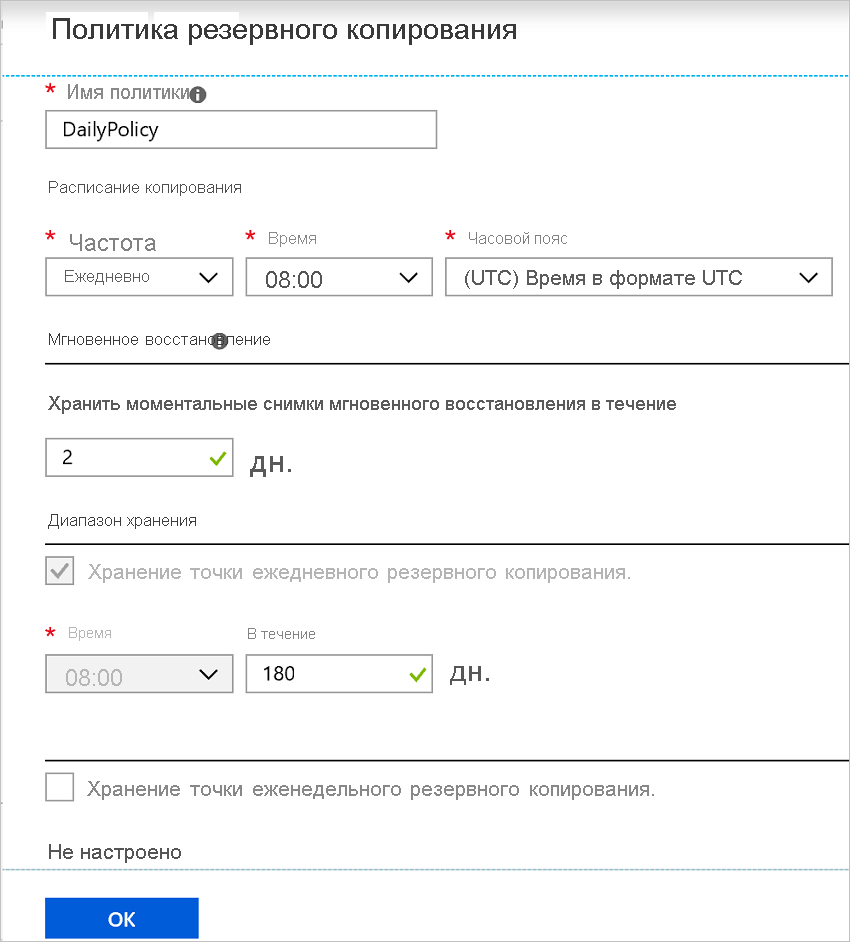

# Включение резервного копирования при создании виртуальной машины Azure

Используйте службу Azure Backup для резервного копирования виртуальных машин Azure. Резервное копирование виртуальных машин выполняется в соответствии с расписанием, указанным в политике резервного копирования, а точки восстановления создаются из резервных копий. Точки восстановления хранятся в хранилищах служб восстановления.

В этой статье подробно описано, как включить резервное копирование при создании виртуальной машины (ВМ) в портал Azure.  

## Перед началом

- [Проверьте](backup-support-matrix-iaas.md#supported-backup-actions) , какие операционные системы поддерживаются, если вы включаете резервное копирование при создании виртуальной машины.

## Войдите в Azure

Если вы еще не вошли в свою учетную запись, войдите в [портал Azure](https://portal.azure.com).

## Создание виртуальной машины с настроенной резервной копией

1. В портал Azure щелкните **создать ресурс**.

2. В Azure Marketplace щелкните вычисление, а затем выберите образ виртуальной машины.

3. Настройте виртуальную машину в соответствии с инструкциями [Windows](https://docs.microsoft.com/azure/virtual-machines/windows/quick-create-portal) или [Linux](https://docs.microsoft.com/azure/virtual-machines/linux/quick-create-portal) .

4. На вкладке **Управление** в области **Включение резервного копирования**щелкните **вкл**.
5. Azure Backup резервные копии в хранилище служб восстановления. Щелкните **создать** , если у вас нет хранилища.
6. Примите предлагаемое имя хранилища или укажите собственное.
7. Укажите или создайте группу ресурсов, в которой будет расположено хранилище. Хранилище группы ресурсов может отличаться от группы ресурсов виртуальной машины.

    

8. Примите политику резервного копирования по умолчанию или измените параметры.
    - Политика архивации указывает, как часто следует создавать моментальные снимки резервных копий виртуальной машины, а также срок хранения резервных копий.
    - Политика по умолчанию создает резервную копию виртуальной машины раз в день.
    - Вы можете настроить собственную политику резервного копирования для виртуальной машины Azure, чтобы создавать резервные копии ежедневно или еженедельно.
    - Дополнительные [сведения](backup-azure-vms-introduction.md#backup-and-restore-considerations) о вопросах резервного копирования для виртуальных машин Azure.
    - Дополнительные [сведения](backup-instant-restore-capability.md) о функции мгновенного восстановления.

      

> [!NOTE]
> Azure Backup служба создает отдельную группу ресурсов (отличную от группы ресурсов виртуальной машины) для хранения моментального снимка с форматом именования **AzureBackupRG_geography_number** (например: AzureBackupRG_northeurope_1). Данные в этой группе ресурсов будут храниться в течение суток, указанного в разделе *Сохранение моментального снимка мгновенного восстановления* политики архивации виртуальных машин Azure.  Применение блокировки к этой группе ресурсов может привести к сбоям при архивации. 
Эта группа ресурсов также должна быть исключена из любых ограничений имени или тега, так как политика ограничения будет блокировать создание коллекций точек ресурсов в ней снова, вызывая сбои резервного копирования.

## Запуск резервного копирования после создания виртуальной машины

Резервное копирование виртуальной машины будет выполняться в соответствии с политикой архивации. Однако рекомендуется запустить начальную резервную копию.

После создания виртуальной машины выполните следующие действия.

1. В свойствах виртуальной машины щелкните **резервное копирование**. Состояние виртуальной машины находится в состоянии "Начальная Архивация", пока не будет запущена начальная Архивация
2. Щелкните **создать** резервную копию сейчас, чтобы запустить резервное копирование по запросу.

    

## Использование шаблона диспетчер ресурсов для развертывания защищенной виртуальной машины

В предыдущих шагах объясняется, как использовать портал Azure для создания виртуальной машины и ее защиты в хранилище служб восстановления. Чтобы быстро развернуть одну или несколько виртуальных машин и защитить их в хранилище служб восстановления, см. шаблон [развертывание виртуальной машины Windows и включение резервного копирования](https://azure.microsoft.com/resources/templates/101-recovery-services-create-vm-and-configure-backup/).

## Следующие шаги

Теперь, когда вы защитили виртуальную машину, вы узнаете, как управлять ими и восстанавливать их.

- [Управление виртуальными машинами и их мониторинг](backup-azure-manage-vms.md)
- [Восстановление виртуальной машины](backup-azure-arm-restore-vms.md)

Если возникнут проблемы, [Ознакомьтесь](backup-azure-vms-troubleshoot.md) с руководством по устранению неполадок.
