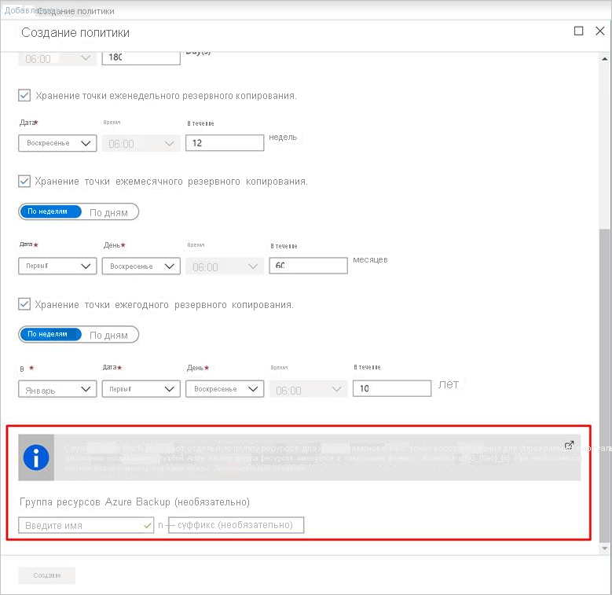
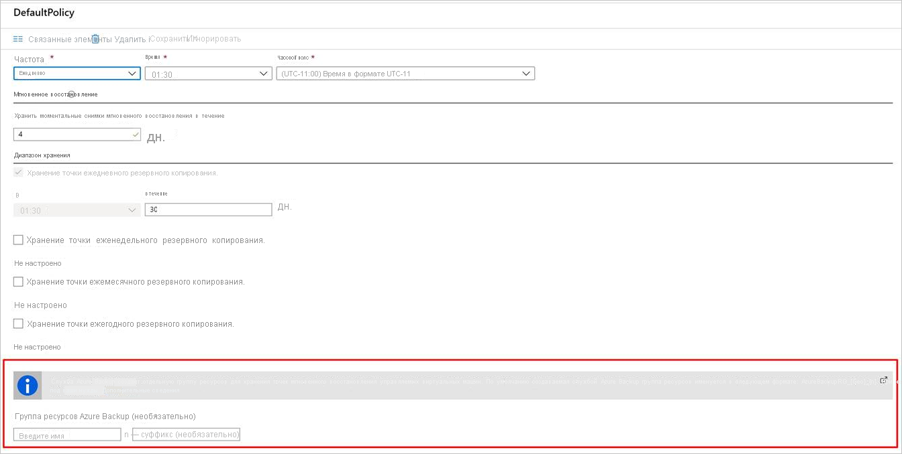

# Включение резервного копирования при создании виртуальной машины Azure

Используйте службу Azure Backup для резервного копирования виртуальных машин Azure. Резервное копирование виртуальных машин выполняется в соответствии с расписанием, указанным в политике резервного копирования, а точки восстановления создаются из резервных копий. Точки восстановления хранятся в хранилищах служб восстановления.

В этой статье подробно описано, как включить резервное копирование при создании виртуальной машины (ВМ) в портал Azure.  

## Прежде чем начать

- [Проверьте](backup-support-matrix-iaas.md#supported-backup-actions) , какие операционные системы поддерживаются, если вы включаете резервное копирование при создании виртуальной машины.

## Вход в Azure

Если вы еще не вошли в свою учетную запись, войдите в [портал Azure](https://portal.azure.com).

## Создание виртуальной машины с настроенной резервной копией

1. В портал Azure щелкните **создать ресурс**.

2. В Azure Marketplace щелкните **Вычисление**, а затем выберите образ виртуальной машины.

3. Настройте виртуальную машину в соответствии с инструкциями [Windows](https://docs.microsoft.com/azure/virtual-machines/windows/quick-create-portal) или [Linux](https://docs.microsoft.com/azure/virtual-machines/linux/quick-create-portal) .

4. На вкладке **Управление** в области **Включение резервного копирования**щелкните **вкл**.
5. Azure Backup резервные копии в хранилище служб восстановления. Щелкните **создать** , если у вас нет хранилища.
6. Примите предлагаемое имя хранилища или укажите собственное.
7. Укажите или создайте группу ресурсов, в которой будет расположено хранилище. Хранилище группы ресурсов может отличаться от группы ресурсов виртуальной машины.

    

8. Примите политику резервного копирования по умолчанию или измените параметры.
    - Политика архивации указывает, как часто следует создавать моментальные снимки резервных копий виртуальной машины, а также срок хранения резервных копий.
    - Политика по умолчанию создает резервную копию виртуальной машины раз в день.
    - Вы можете настроить собственную политику резервного копирования для виртуальной машины Azure, чтобы создавать резервные копии ежедневно или еженедельно.
    - Дополнительные [сведения](backup-azure-vms-introduction.md#backup-and-restore-considerations) о вопросах резервного копирования для виртуальных машин Azure.
    - Дополнительные [сведения](backup-instant-restore-capability.md) о функции мгновенного восстановления.

      

## Azure Backup группы ресурсов для виртуальных машин

Служба резервного копирования создает отдельную группу ресурсов (RG), отличную от группы ресурсов виртуальной машины для хранения коллекции точек восстановления (RPC). В RPC находятся точки мгновенного восстановления управляемых виртуальных машин. Формат именования по умолчанию для группы ресурсов, созданной службой резервного копирования: `AzureBackupRG_<Geo>_<number>`. Например: *AzureBackupRG_northeurope_1*. Теперь можно настроить имя группы ресурсов, созданной Azure Backup.

Примечания:

1. Можно либо использовать имя по умолчанию RG, либо изменить его в соответствии с требованиями вашей компании.
2. Шаблон имени RG предоставляется в качестве входных данных во время создания политики резервного копирования виртуальной машины. Имя RG должно иметь следующий формат: `<alpha-numeric string>* n <alpha-numeric string>`. символ "n" заменяется целым числом (начиная с 1) и используется для масштабирования, если первый RG заполнен. У одного RG может быть не более 600 RPC сегодня.
               политики
3. Шаблон должен соответствовать правилам именования RG ниже, а общая длина не должна превышать максимально допустимую длину RG имени.
    1. Имена групп ресурсов допускают только буквы, цифры, точки, символы подчеркивания, дефисы и круглые скобки. Они не могут заканчиваться точкой.
    2. Имена групп ресурсов могут содержать до 74 символов, включая имя RG и суффикс.
4. Первый `<alpha-numeric-string>` является обязательным, а второй после "n" является необязательным. Это применимо только в том случае, если вы выдаете настраиваемое имя. Если в любом из текстовых полей ничего не вводить, используется имя по умолчанию.
5. Имя RG можно изменить, изменив политику, если это необходимо. Если шаблон имени изменен, в новом RG будет создан новый RP. Однако старый RP будет по-прежнему находиться в старом RG и не будет перемещен, так как коллекция RP не поддерживает перемещение ресурсов. Со временем RP будет собирать мусор по истечении срока действия точек.

6. Рекомендуется не блокировать группу ресурсов, созданную для использования службой резервного копирования.

## Запуск резервного копирования после создания виртуальной машины

Резервное копирование виртуальной машины будет выполняться в соответствии с политикой архивации. Однако рекомендуется запустить начальную резервную копию.

После создания виртуальной машины выполните следующие действия.

1. В свойствах виртуальной машины щелкните **резервное копирование**. Состояние виртуальной машины находится в состоянии "Начальная Архивация", пока не будет запущена начальная Архивация
2. Щелкните **создать** резервную копию сейчас, чтобы запустить резервное копирование по запросу.

    

## Использование шаблона диспетчер ресурсов для развертывания защищенной виртуальной машины

В предыдущих шагах объясняется, как использовать портал Azure для создания виртуальной машины и ее защиты в хранилище служб восстановления. Чтобы быстро развернуть одну или несколько виртуальных машин и защитить их в хранилище служб восстановления, см. шаблон [развертывание виртуальной машины Windows и включение резервного копирования](https://azure.microsoft.com/resources/templates/101-recovery-services-create-vm-and-configure-backup/).

## Дальнейшие действия

Теперь, когда вы защитили виртуальную машину, вы узнаете, как управлять ими и восстанавливать их.

- [Управление виртуальными машинами и их мониторинг](backup-azure-manage-vms.md)
- [Восстановление виртуальной машины](backup-azure-arm-restore-vms.md)

Если возникнут проблемы, [Ознакомьтесь](backup-azure-vms-troubleshoot.md) с руководством по устранению неполадок.
