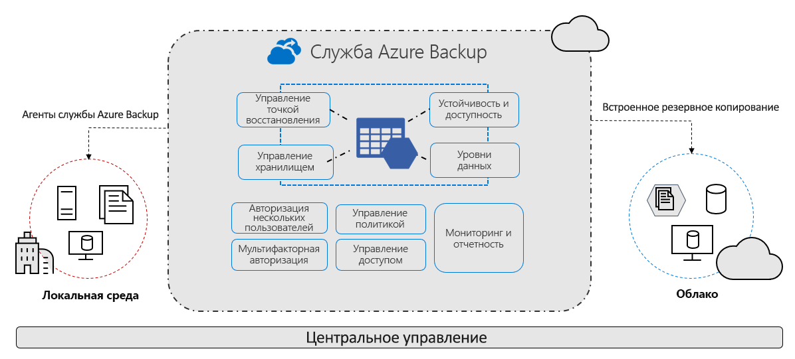

# Часто задаваемые вопросы о службе Azure Backup

Служба Azure Backup предоставляет простые, безопасные и экономичные решения для резервного копирования и восстановления данных из облака Microsoft Azure.

> [!VIDEO https://www.youtube.com/embed/elODShatt-c]

## Ограничения, связанные с резервным копированием

- **Локальное** — резервное копирование файлов, папок, состояния системы с помощью [агента Службы восстановления Microsoft Azure](backup-support-matrix-mars-agent.md). Вы также можете использовать агент DPM или Azure Backup Server (MABS) для защиты локальных виртуальных машин ([Hyper-V](back-up-hyper-v-virtual-machines-mabs.md) и [VMware](backup-azure-backup-server-vmware.md)) и других [локальных рабочих нагрузок](backup-mabs-protection-matrix.md).
- **Виртуальные машины Azure** - [Резервное копирование всех виртуальных машин Windows и Linux](backup-azure-vms-introduction.md) (с помощью расширений резервного копирования) или резервное копирование файлов, папок и состояния системы с помощью [агента MARS](backup-azure-manage-mars.md).
- **Управляемые диски Azure** - [Резервное копирование управляемых дисков Azure (предварительная версия)](backup-managed-disks.md)
- **Общие папки Azure** - [Резервное копирование общих папок Azure в учетной записи хранения](backup-afs.md)
- **SQL Server в виртуальной машине Azure** -  [Резервное копирование баз данных SQL Server, работающих в виртуальных машинах Azure](backup-azure-sql-database.md).
- **Базы данных SAP HANA на виртуальных машинах Azure** - [Резервное копирование баз данных SAP HANA, выполняемых на виртуальных машинах Azure](backup-azure-sap-hana-database.md)
- **Серверы Базы данных Azure для PostgreSQL (предварительная версия)**  -  [Резервное копирование баз данных Azure PostgreSQL и хранение резервных копий до 10 лет](backup-azure-database-postgresql.md)

## Зачем использовать службу архивации Azure?

Azure Backup предоставляет следующие основные преимущества:

- **Разгрузка локального резервного копирования**. Служба Azure Backup предлагает простое решение для резервного копирования локальных ресурсов в облаке. Создавайте краткосрочные и долгосрочные резервные копии без необходимости развертывания комплексных локальных решений резервного копирования.
- **Резервное копирование виртуальных машин IaaS Azure**. Служба Azure Backup предоставляет независимые и изолированные резервные копии для защиты от случайного удаления исходных данных. Резервные копии хранятся в хранилище Служб восстановления со встроенным управлением точками восстановления. Конфигурация и масштабируемость просты, резервные копии оптимизированы, и вы можете легко восстанавливать их по мере необходимости.
- **Простое масштабирование**. Azure Backup использует мощность и неограниченную масштабируемость облачной платформы Azure, чтобы обеспечить высокий уровень доступности без затрат на обслуживание и мониторинг.
- **Отсутствие ограничений на передачу данных**. В Azure Backup не ограничивается объем входящего или исходящего трафика, а также не взимается плата за передаваемые данные.
  - Исходящими данными считаются те данные, которые передаются из хранилища служб восстановления в процессе восстановления.
  - Если вы выполняете начальное резервное копирование в автономном режиме, используя службу импорта и экспорта Azure для импорта больших объемов данных, вам нужно будет оплатить входящий трафик.  [Подробнее](backup-azure-backup-import-export.md).
- **Безопасность данных**. Azure Backup предоставляет решения для защиты данных [при их передаче](backup-azure-security-feature.md) и [хранении](backup-azure-security-feature-cloud.md).
- **Централизованное наблюдение и управление**: Azure Backup предоставляет [встроенные возможности мониторинга и оповещения](backup-azure-monitoring-built-in-monitor.md) в хранилище Служб восстановления. Эти возможности доступны без какой бы то ни было дополнительной инфраструктуры управления. Кроме того, вы также можете увеличить масштаб мониторинга и создания отчетов, [используя Azure Monitor](backup-azure-monitoring-use-azuremonitor.md).
- **Обеспечение согласованности резервных копий с приложением**. Это означает, что точка восстановления имеет все необходимые данные для восстановления резервной копии. Служба Azure Backup предоставляет резервные копии, согласованные на уровне приложений, что позволяет обойтись без дополнительных действий при восстановлении данных. Восстановление данных с согласованием на уровне приложений сокращает время восстановления, позволяя быстро вернуть приложение в рабочее состояние.
- **Краткосрочное и долгосрочное хранение данных**. [Хранилища служб восстановления](backup-azure-recovery-services-vault-overview.md) можно использовать для краткосрочного и долгосрочного хранения данных.
- **Автоматическое управление хранением** — в гибридных средах часто используется неоднородное хранилище, т. е. сочетание локальных и облачных систем. Служба Azure Backup избавит вас от лишних затрат при использовании локальных устройств для хранения данных. Служба архивации Azure обеспечивает автоматическое выделение хранилища для резервных копий и управление им, при этом оплата осуществляется по мере использования. Поэтому вы платите только за фактически потребляемый объем хранилища. [Дополнительные сведения](https://azure.microsoft.com/pricing/details/backup) о ценах.
- **Несколько вариантов хранения** — Azure Backup предлагает три типа репликации для обеспечения высокого уровня доступности хранилища или данных.
  - [Локально избыточное хранилище (LRS)](../storage/common/storage-redundancy.md#locally-redundant-storage) троекратно реплицирует данные (создает три копии) в единице масштабирования хранилища в центре обработки данных. Все копии данных находятся в одном регионе. LRS — это экономный способ защиты данных от сбоев локального оборудования.
  - По умолчанию рекомендуется использовать для репликации [геоизбыточное хранилище (GRS)](../storage/common/storage-redundancy.md#geo-redundant-storage). Геоизбыточное хранилище реплицирует данные в дополнительный регион, который находится в сотнях километров от основного расположения данных. Этот вариант дороже, чем LRS, но GRS обеспечивает высокий уровень устойчивости данных, даже если региональный центр обработки данных выйдет из строя.
  - [Хранилище, избыточное между зонами (ZRS),](../storage/common/storage-redundancy.md#zone-redundant-storage) реплицирует данные в [зоны доступности](../availability-zones/az-overview.md#availability-zones), гарантируя расположение и устойчивость данных в пределах одного региона. ZRS работает без простоев. Поэтому для критически важных рабочих нагрузок, для которых важно [место расположения данных](https://azure.microsoft.com/resources/achieving-compliant-data-residency-and-security-with-azure/) и отсутствие простоев, резервное копирование можно выполнять в ZRS.

## Дальнейшие действия

- [Проверьте](backup-architecture.md) архитектуру и компоненты для разных сценариев резервного копирования.
- [Проверьте](backup-support-matrix.md) требования к поддержке и ограничения для резервного копирования, а также для [резервного копирования виртуальных машин Azure](backup-support-matrix-iaas.md).
