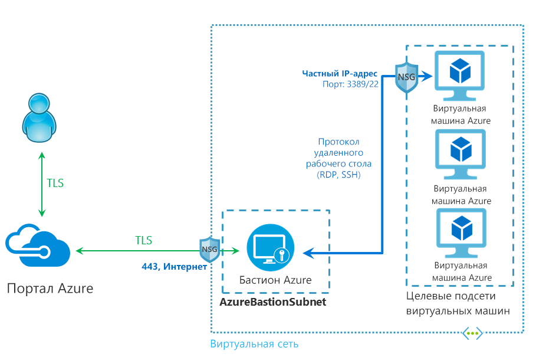

# Что такое Бастион Azure (предварительная версия)

Служба Бастион Azure — это новая полностью управляемая платформой PaaS-служба, которая подготавливается в виртуальной сети. В ней предоставляется безопасное и бесперебойное подключение RDP или SSH к виртуальным машинам непосредственно на портале Azure по протоколу SSL. При подключении с помощью Бастиона Azure виртуальным машинам не требуются общедоступные IP-адреса.

 Бастион обеспечивает безопасное подключение RDP и SSH ко всем виртуальным машинам в виртуальной сети, в которой он предоставляется. Использование Бастиона Azure защищает порты RDP и SSH ваших виртуальных машин от внешних проникновений, обеспечивая при этом безопасный доступ с использованием этих протоколов. С помощью Бастиона Azure вы подключитесь к виртуальной машине прямо с портала Azure. Не требуется дополнительный клиент, агент или часть программного обеспечения.

> [!IMPORTANT]
> Эта общедоступная предварительная версия предоставляется без соглашения об уровне обслуживания и не должна использоваться для производственных рабочих нагрузок. Некоторые функции могут не поддерживаться, иметь ограничения и быть доступными не во всех расположениях Azure. См. [дополнительные условия использования для предварительных версий Microsoft Azure](https://azure.microsoft.com/support/legal/preview-supplemental-terms/).
>

## Архитектура

Бастион Azure развертывается в вашей виртуальной сети, а после развертывания обеспечивает безопасное взаимодействие RDP или SSH для всех виртуальных машин в виртуальной сети. Подготовив службу Бастиона Azure в своей виртуальной сети, вы сможете легко установить подключение RDP или SSH ко всем своим виртуальным машинам в одной виртуальной сети. Служба развертывается на уровне виртуальной сети, а не подписки, учетной записи или виртуальной машины.

RDP и SSH являются одними из основных средств, с помощью которых вы можете подключаться к рабочим нагрузкам, которые выполняются в Azure. Предоставление портов RDP или SSH через Интернет нежелательно и рассматривается как поверхность существенной угрозы. Часто это связано с уязвимостями протокола. Чтобы сдержать эту поверхность угрозы, можно развернуть узлы-Бастионы (также известные как jump-серверы) на открытой стороне вашей сети периметра. Серверы Бастиона разработаны и настроены для выдерживания атак. Серверы Бастиона также обеспечивают подключение RDP и SSH к рабочим нагрузкам, которые находятся за Бастионом, а также внутри сети.

На этом рисунке показана архитектура развертывания Бастиона Azure. На этой схеме:

* Узел Бастиона развернут в виртуальной сети.
* Пользователь подключается к порталу Azure с помощью любого браузера HTML5.
* Чтобы подключиться, пользователь выбирает виртуальную машину.
* Одним щелчком мыши в браузере открывается сеанс RDP или SSH.
* На виртуальной машине Azure не требуется общедоступный IP-адрес.

## Основные возможности

В общедоступной предварительной версии доступны следующие функции:

* **RDP и SSH прямо на портале Azure:** Вы можете напрямую перейти к сеансу RDP и SSH прямо на портале Azure, используя один щелчок для совместной работы.
* **Удаленный сеанс по протоколу SSL и обход брандмауэра для RDP и SSH:** Бастион Azure использует веб-клиент на основе HTML5, который автоматически передается на локальное устройство, поэтому сеанс RDP и SSH по протоколу SSL через порт 443 позволяет безопасно обходить корпоративные брандмауэры.
* **На виртуальной машине Azure не требуется общедоступный IP-адрес:** Бастион Azure открывает подключение RDP и SSH к вашей виртуальной машине Azure, используя частный IP-адрес на виртуальной машине. На вашей виртуальной машине не требуется общедоступный IP-адрес.
* **Без лишних проблем с управлением NSG:** Бастион Azure — это полностью управляемая платформа службы PaaS от Azure, которая внутреннее защищена для обеспечения надежного подключения RDP или SSH. Не нужно применять какие-либо NSG в подсети Бастиона Azure. Поскольку Бастион Azure подключается к вашим виртуальным машинам по частному IP-адресу, вы можете настроить свои NSG так, чтобы они разрешали RDP или SSH только из Бастиона Azure. Это устраняет необходимость управлять NSG каждый раз, когда необходимо безопасно подключиться к виртуальным машинам.
* **Защита от сканирования портов:** Поскольку вам не нужно предоставлять свои виртуальные машины в общедоступный Интернет, ваши виртуальные машины защищены от сканирования портов неавторизированными пользователями и пользователями-злоумышленниками, расположенными за пределами вашей виртуальной сети.
* **Защита от эксплойтов нулевого дня. Защищает только в одном месте:** Бастион Azure — это полностью управляемая платформой PaaS-служба. Поскольку он находится по периметру виртуальной сети, не стоит беспокоиться об усилении защиты каждой виртуальной машины в вашей виртуальной сети. Платформа Azure защищает от эксплойтов нулевого дня, в результате чего Бастион Azure — защищен и всегда для вас актуальный.

## Часто задаваемые вопросы

[!INCLUDE [Bastion FAQ](../../includes/bastion-faq-include.md)]

## Дополнительная информация

* [Создание ресурса узла Бастиона Azure](bastion-create-host-portal.md).
* Дополнительные сведения о некоторых других ключевых [сетевых возможностях](../networking/networking-overview.md) Azure.
