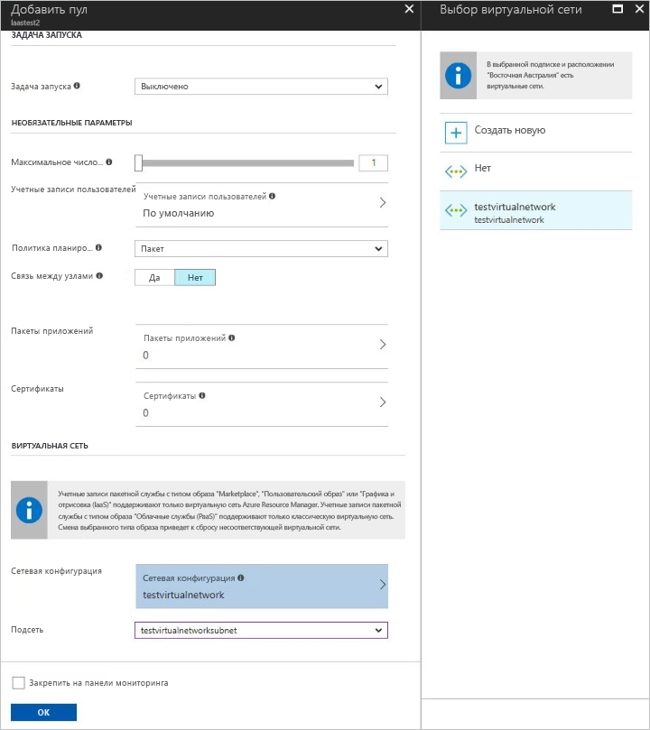
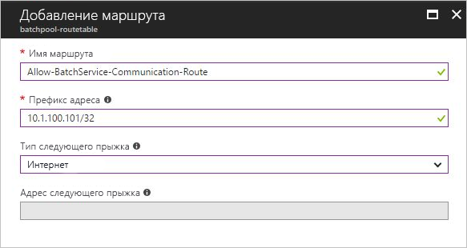

# Создание пула пакетной службы Azure в виртуальной сети

Если вы создадите пул пакетной службы Azure, его можно будет подготовить в подсети любой [виртуальной сети Azure](../virtual-network/virtual-networks-overview.md). В этой статье описывается настройка пула пакетной службы в виртуальной сети.

## Для чего нужна виртуальная сеть?

Вычислительные узлы в пуле могут взаимодействовать друг с другом, например для выполнения задач с несколькими экземплярами, не требуя отдельной виртуальной сети. Однако по умолчанию узлы в пуле не могут взаимодействовать с виртуальными машинами, находящимися за пределами пула, например серверами лицензий или файловыми серверами.

Чтобы обеспечить безопасную связь между узлами вычислений с другими виртуальными машинами или с локальной сетью, пул можно подготавливать в подсети Azure VNet.

## Предварительные требования

- **Проверка подлинности**. Для использования виртуальной сети Azure API клиента пакетной службы должен использовать проверку подлинности Azure Active Directory (AD). Поддержка Azure AD пакетной службой Azure описана в статье [Аутентификация решений пакетной службы с помощью Active Directory](batch-aad-auth.md).

- **Виртуальная сеть Azure**. Требования к виртуальной сети и конфигурация приведены в следующем разделе. Чтобы заранее подготовить виртуальную сеть с одной или несколькими подсетями, вы можете использовать портал Azure, Azure PowerShell, интерфейс командной строки Azure (CLI) или другие методы.
  - Чтобы создать виртуальную сеть на основе Azure Resource Manager, изучите раздел [Create a virtual network](../virtual-network/manage-virtual-network.md#create-a-virtual-network) (Создание виртуальной сети). Для новых развертываний рекомендуется использовать виртуальную сеть на основе диспетчер ресурсов. она поддерживается только для пулов, использующих конфигурацию виртуальной машины.
  - Чтобы создать классическую виртуальную сеть, см. статью [Создание (классической) виртуальной сети с несколькими подсетями](/previous-versions/azure/virtual-network/create-virtual-network-classic). Классическая виртуальная сеть поддерживается только для пулов, использующих конфигурацию облачных служб.

## Требования к виртуальной сети

[!INCLUDE [batch-virtual-network-ports](../../includes/batch-virtual-network-ports.md)]

## Создание пула с виртуальной сетью в портал Azure

Когда вы создадите виртуальную сеть и назначите ей подсеть, вы сможете создать пул пакетной службы с этой виртуальной сетью. Выполните следующие действия для создания пула с помощью портала Azure: 

1. Войдите в свою учетную запись пакетной службы на портале Azure. Эта учетная запись должна принадлежать к той же подписке и региону, что и группа ресурсов, содержащая целевую виртуальную сеть.
2. В окне **Параметры** слева выберите пункт меню **Пулы**.
3. В окне **Пулы** выберите **Добавить**.
4. В окне **Добавить пул** из раскрывающегося списка **Тип образа** выберите нужный вариант.
5. Выберите правильного **издателя, предложение, SKU** для пользовательского образа.
6. Укажите оставшиеся необходимые параметры, в том числе **Размер узла**, **Target dedicated nodes** (Целевые выделенные узлы) и **Узлы с низким приоритетом**, а также любые необходимые дополнительные параметры.
7. В разделе **Виртуальная сеть** выберите виртуальную сеть и подсеть, которые вы хотите использовать.

   

## Пользовательские маршруты для принудительного туннелирования

В вашей организации могут быть требования для перенаправления (принудительно) трафика, связанного с Интернетом, из подсети обратно в локальное расположение для проверки и ведения журнала. Кроме того, возможно, вы включили принудительное туннелирование для подсетей в виртуальной сети.

Чтобы убедиться, что узлы в пуле работают в виртуальной сети с включенным принудительным туннелированием, необходимо добавить следующие [определяемые пользователем маршруты](../virtual-network/virtual-networks-udr-overview.md) (UDR) для этой подсети.

- Пакетная служба должна взаимодействовать с узлами для планирования задач. Чтобы обеспечить такое взаимодействие, добавьте пользовательские маршруты для всех IP-адресов, которые использует пакетная служба, в том регионе, где существует ваша учетная запись пакетной службы. Чтобы получить список IP-адресов пакетной службы, см. раздел [теги служб в локальной среде](../virtual-network/service-tags-overview.md).

- Убедитесь, что исходящий трафик к службе хранилища Azure (в частности, URL-адреса формы `<account>.table.core.windows.net` , `<account>.queue.core.windows.net` и `<account>.blob.core.windows.net` ) не заблокирован локальной сетью.

При добавлении определяемого пользователем маршрута укажите маршрут для каждого связанного префикса IP-адреса пакетной службы, а также задайте для параметра **Тип следующего прыжка** значение **Интернет**.

> [!WARNING]
> IP-адреса пакетной службы могут меняться со временем. Чтобы предотвратить сбои из-за изменения IP-адреса, создайте процесс обновления IP-адресов пакетной службы автоматически и обновите их в таблице маршрутов.

## Дальнейшие действия

- Узнайте подробнее о [рабочем процессе и основных ресурсах пакетной службы](batch-service-workflow-features.md), таких как пулы, узлы, задания и задачи.
- Узнайте, как [создать определяемый пользователем маршрут в портал Azure](../virtual-network/tutorial-create-route-table-portal.md).
