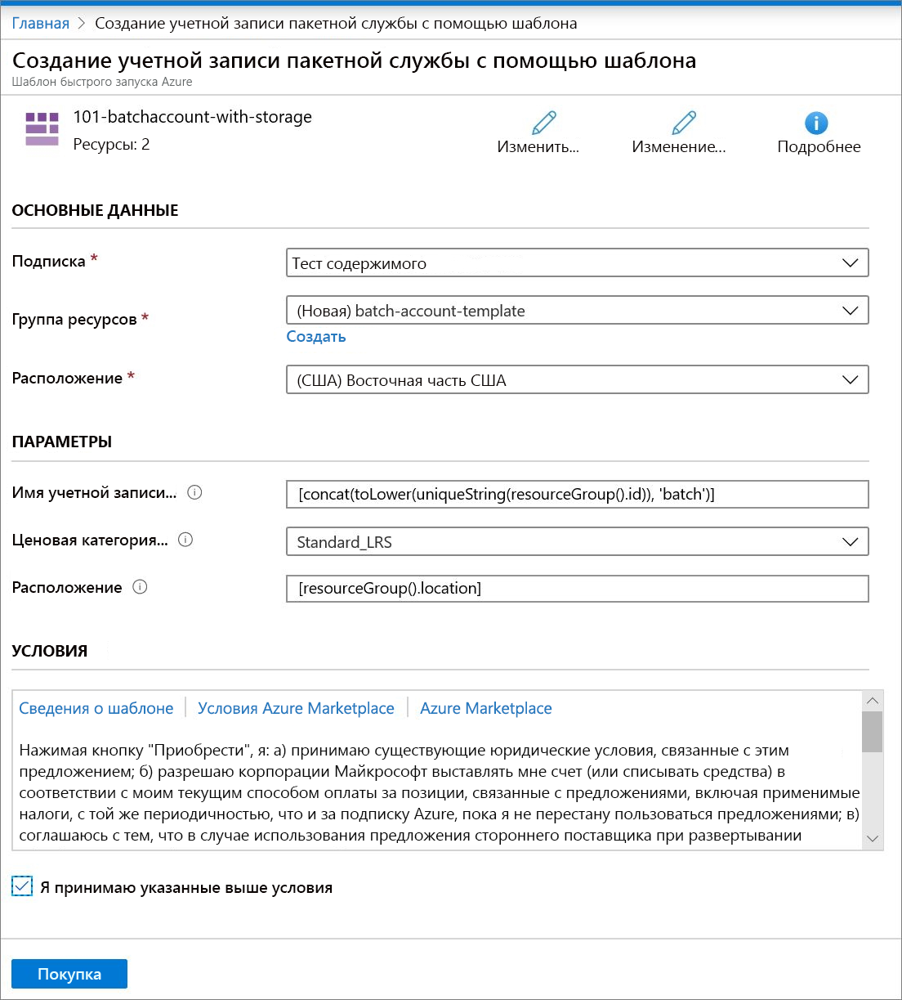

# Краткое руководство. Создание учетной записи пакетной службы с помощью шаблона Azure Resource Manager

Для создания вычислительных ресурсов (пулов вычислительных узлов) и заданий в пакетной службе потребуется учетная запись пакетной службы. Вы можете связать учетную запись хранения Azure с учетной записью пакетной службы, что будет удобно для развертывания приложений и хранения входных и выходных данных в большинстве реальных рабочих нагрузок. В этом кратком руководстве показано, как с помощью шаблона Azure Resource Manager создать учетную запись пакетной службы, включая хранилище. Выполняя действия из этого краткого руководства, вы изучите основные понятия пакетной службы и сможете использовать ее с более реалистичными рабочими нагрузками в большем масштабе.

[!INCLUDE [About Azure Resource Manager](../../includes/resource-manager-quickstart-introduction.md)]

## Предварительные требования

У вас должна быть активная подписка Azure.

- [!INCLUDE [quickstarts-free-trial-note](../../includes/quickstarts-free-trial-note.md)]

## Создание учетной записи пакетной службы и хранилища

### Изучение шаблона

Шаблон, используемый в этом кратком руководстве, взят из [шаблонов быстрого запуска Azure](https://azure.microsoft.com/resources/templates/101-batchaccount-with-storage/).

:::code language="json" source="~/quickstart-templates/101-batchaccount-with-storage/azuredeploy.json" range="1-80" highlight="36-69":::

В шаблоне определено два ресурса Azure:

- [Microsoft.Storage/storageAccounts](/azure/templates/microsoft.storage/storageaccounts): Создание учетной записи хранения.
- [Microsoft.Batch/batchAccounts](/azure/templates/microsoft.batch/batchaccounts): Создает учетную запись пакетной службы.

### Развертывание шаблона

1. Выберите следующее изображение, чтобы войти на портал Azure и открыть шаблон. Этот шаблон создает учетную запись пакетной службы Azure и учетную запись хранения.

   

1. Введите или выберите следующие значения.

   

   - **Подписка**. Выберите нужную подписку Azure.
   - **Группа ресурсов**. Щелкните **Создать**, введите уникальное имя новой группы ресурсов и нажмите кнопку **ОК**.
   - **Расположение**. Выберите расположение. Например, **центральная часть США**.
   - **Имя учетной записи пакетной службы**. Оставьте значение по умолчанию.
   - **Ценовая категория учетной записи**. Выберите тип учетной записи хранения. Например, **Standard_LRS**.
   - **Расположение.** Сохраните значение по умолчанию, чтобы ресурсы создавались в том же расположении, что и группа ресурсов.
   - "Я принимаю указанные выше условия". **Выбрать**.

1. Щелкните **Приобрести**.

Через несколько минут вы увидите уведомление о том, что учетная запись пакетной службы успешно создана.

В нашем примере для развертывания шаблона используется портал Azure. В дополнение к порталу Azure можно также использовать Azure PowerShell, Azure CLI и REST API. Дополнительные сведения о других методах развертывания см. в статье о [развертывании с использованием шаблонов](../azure-resource-manager/templates/deploy-powershell.md).

## Проверка развертывания

Вы можете проверить развертывание на портале Azure, перейдя к созданной группе ресурсов. На экране **Обзор** убедитесь, что здесь присутствуют учетная запись пакетной службы и учетная запись хранения.

## Очистка ресурсов

Если вы планируете продолжить работу с последующими [учебниками](./tutorial-parallel-dotnet.md), эти ресурсы можно пока сохранить. Если же они больше не нужны, [удалите группу ресурсов](../azure-resource-manager/management/delete-resource-group.md?tabs=azure-portal#delete-resource-group), что автоматически удалит ранее созданные учетную запись пакетной службы и учетную запись хранения.

## Дальнейшие действия

В этом кратком руководстве вы создали учетную запись пакетной службы и учетную запись хранения. Чтобы узнать больше о пакетной службе Azure, изучите следующие руководства.

> [!div class="nextstepaction"]
> [Руководства по пакетной службе Azure](./tutorial-parallel-dotnet.md)
