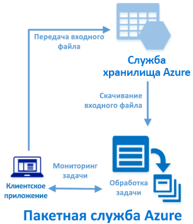

# <a name="quickstart-use-python-api-to-run-an-azure-batch-job"></a>Краткое руководство. Выполнение задания пакетной службы Azure с помощью API Python

Начните работу с пакетной службой Azure, воспользовавшись API Python для запуска задания пакетной службы из приложения. Приложение отправляет несколько входных файлов данных в Службу хранилища Azure, а затем создает пул вычислительных узлов пакетной службы (виртуальные машины). Затем, используя простую команду, оно создает задание, которое запускает задачи по обработке каждого входного файла в пуле.

Выполнив действия из этого краткого руководства, вы изучите основные понятия пакетной службы и сможете использовать ее с более реалистичными рабочими нагрузками в большем масштабе.



## <a name="prerequisites"></a>Предварительные требования

- Учетная запись Azure с активной подпиской. [Создайте учетную запись](https://azure.microsoft.com/free/?WT.mc_id=A261C142F) бесплатно.

- учетная запись пакетной службы и связанная учетная запись службы хранилища Azure. Чтобы создать эти учетные записи, см. примеры быстрого начала работы с пакетной службой с помощью [портала Azure](quick-create-portal.md) или [Azure CLI](quick-create-cli.md).

- [Python](https://python.org/downloads) версии 2.7, 3.3 или более поздней, включая диспетчер пакетов [pip](https://pip.pypa.io/en/stable/installing/).

## <a name="sign-in-to-azure"></a>Вход в Azure

Войдите на портал Azure по адресу [https://portal.azure.com](https://portal.azure.com).

[!INCLUDE [batch-common-credentials](../../includes/batch-common-credentials.md)]

## <a name="download-the-sample"></a>Скачивание примера приложения

[Скачайте или клонируйте пример приложения](https://github.com/Azure-Samples/batch-python-quickstart) с GitHub. Чтобы клонировать пример репозитория приложения с клиентом Git, выполните следующую команду:

```bash
git clone https://github.com/Azure-Samples/batch-python-quickstart.git
```

Перейдите в каталог, в котором содержится сценарий Python `python_quickstart_client.py`.

В среде разработки Python установите необходимые пакеты с помощью `pip`.

```bash
pip install -r requirements.txt
```

Откройте файл `config.py`. Замените строки учетных данных учетной записи пакетной службы и учетной записи хранения значениями, полученными для ваших учетных записей. Пример:

```Python
_BATCH_ACCOUNT_NAME = 'mybatchaccount'
_BATCH_ACCOUNT_KEY = 'xxxxxxxxxxxxxxxxE+yXrRvJAqT9BlXwwo1CwF+SwAYOxxxxxxxxxxxxxxxx43pXi/gdiATkvbpLRl3x14pcEQ=='
_BATCH_ACCOUNT_URL = 'https://mybatchaccount.mybatchregion.batch.azure.com'
_STORAGE_ACCOUNT_NAME = 'mystorageaccount'
_STORAGE_ACCOUNT_KEY = 'xxxxxxxxxxxxxxxxy4/xxxxxxxxxxxxxxxxfwpbIC5aAWA8wDu+AFXZB827Mt9lybZB1nUcQbQiUrkPtilK5BQ=='
```

## <a name="run-the-app"></a>Запустите приложение

Чтобы просмотреть действие рабочего процесса пакетной службы, запустите сценарий:

```bash
python python_quickstart_client.py
```

После запуска сценария просмотрите код, чтобы узнать, как работает каждый компонент приложения.

Когда вы запустите пример приложения, консоль будет выглядеть так. Во время выполнения может возникнуть пауза на этапе `Monitoring all tasks for 'Completed' state, timeout in 00:30:00...`, когда будут запускаться вычислительные узлы пула. Задачи помещаются в очередь для запуска после выполнения первого вычислительного узла. Перейдите в учетную запись пакетной службы на [портале Azure](https://portal.azure.com), чтобы отследить пул, вычислительные узлы, задание и задачи в учетной записи пакетной службы.

```output
Sample start: 11/26/2018 4:02:54 PM

Container [input] created.
Uploading file taskdata0.txt to container [input]...
Uploading file taskdata1.txt to container [input]...
Uploading file taskdata2.txt to container [input]...
Creating pool [PythonQuickstartPool]...
Creating job [PythonQuickstartJob]...
Adding 3 tasks to job [PythonQuickstartJob]...
Monitoring all tasks for 'Completed' state, timeout in 00:30:00...
```

После завершения задач отобразятся выходные данные для каждой задачи, аналогичные приведенным ниже.

```output
Printing task output...
Task: Task0
Node: tvm-2850684224_3-20171205t000401z
Standard out:
Batch processing began with mainframe computers and punch cards. Today it still plays a central role in business, engineering, science, and other pursuits that require running lots of automated tasks....
...
```

Обычное время выполнения — примерно 3 минуты, если для приложения задана конфигурация по умолчанию. Настройка начального пула занимает больше всего времени.

## <a name="review-the-code"></a>Просмотр кода

Приложение Python в этом кратком руководстве выполняет следующие задачи.

- Отправляет три небольших текстовых файла в контейнер больших двоичных объектов в учетной записи хранения Azure. Эти файлы являются входными данными для обработки в пакетных задачах.
- Создает пул из двух вычислительных узлов под управлением Ubuntu 18.04 LTS.
- Создает задание, а также три задачи, выполняемые на узлах. Каждая задача обрабатывает один из входных файлов, используя командную строку оболочки Bash.
* Отображает файлы, возвращаемые задачами.

Дополнительные сведения см. в следующих разделах и в файле `python_quickstart_client.py`.

### <a name="preliminaries"></a>Предварительные требования

Для взаимодействия с учетной записью хранения приложение использует пакет [azure-storage-blob](https://pypi.python.org/pypi/azure-storage-blob) для создания объекта [BlockBlobService](/python/api/azure-storage-blob/azure.storage.blob.blockblobservice.blockblobservice).

```python
blob_client = azureblob.BlockBlobService(
    account_name=config._STORAGE_ACCOUNT_NAME,
    account_key=config._STORAGE_ACCOUNT_KEY)
```

Приложение использует ссылку `blob_client` для создания контейнера в учетной записи хранения и передачи в него файлов данных. Файлы в хранилище определяются как объекты пакетной службы [ResourceFile](/python/api/azure-batch/azure.batch.models.resourcefile), которые она может впоследствии скачать на вычислительные узлы.

```python
input_file_paths = [os.path.join(sys.path[0], 'taskdata0.txt'),
                    os.path.join(sys.path[0], 'taskdata1.txt'),
                    os.path.join(sys.path[0], 'taskdata2.txt')]

input_files = [
    upload_file_to_container(blob_client, input_container_name, file_path)
    for file_path in input_file_paths]
```

Приложение создает объект [BatchServiceClient](/python/api/azure.batch.batchserviceclient) для создания пулов, заданий и задач в пакетной службе, а также для управления ими. В примере клиент пакетной службы использует проверку подлинности с общим ключом. Пакетная служба также поддерживает аутентификацию на основе Azure Active Directory.

```python
credentials = batch_auth.SharedKeyCredentials(config._BATCH_ACCOUNT_NAME,
                                              config._BATCH_ACCOUNT_KEY)

batch_client = batch.BatchServiceClient(
    credentials,
    batch_url=config._BATCH_ACCOUNT_URL)
```

### <a name="create-a-pool-of-compute-nodes"></a>Создание пула вычислительных узлов

Чтобы создать пул пакетной службы, приложение использует класс [PoolAddParameter](/python/api/azure-batch/azure.batch.models.pooladdparameter) для настройки количества узлов, размера виртуальной машины и конфигурации пула. Объект [VirtualMachineConfiguration](/python/api/azure-batch/azure.batch.models.virtualmachineconfiguration) указывает [ImageReference](/python/api/azure-batch/azure.batch.models.imagereference) в образе Ubuntu Server 18.04 LTS, опубликованном в Azure Marketplace. Пакетная служба поддерживает широкий спектр образов Linux и Windows Server в Azure Marketplace, а также пользовательских образов виртуальной машины.

Количество узлов (`_POOL_NODE_COUNT`) и размер виртуальной машины (`_POOL_VM_SIZE`) являются определенными константами. В образце по умолчанию создается пул с 2 узлами размера *Standard_A1_v2*. Предлагаемый размер в этом кратком руководстве обеспечивает оптимальный баланс производительности и стоимости.

Метод [pool.add](/python/api/azure-batch/azure.batch.operations.pooloperations) отправляет пул в пакетную службу.

```python
new_pool = batch.models.PoolAddParameter(
    id=pool_id,
    virtual_machine_configuration=batchmodels.VirtualMachineConfiguration(
        image_reference=batchmodels.ImageReference(
            publisher="Canonical",
            offer="UbuntuServer",
            sku="18.04-LTS",
            version="latest"
        ),
        node_agent_sku_id="batch.node.ubuntu 18.04"),
    vm_size=config._POOL_VM_SIZE,
    target_dedicated_nodes=config._POOL_NODE_COUNT
)
batch_service_client.pool.add(new_pool)
```

### <a name="create-a-batch-job"></a>Создание пакетного задания

Пакетное задание — это логическая группа из одной или нескольких задач. Задание включает в себя параметры, общие для задач (например, приоритет и пул для запуска задач). Это приложение использует класс [JobAddParameter](/python/api/azure-batch/azure.batch.models.jobaddparameter) для создания задания в пуле. Метод [job.add](/python/api/azure-batch/azure.batch.operations.joboperations) добавляет задание в указанную учетную запись пакетной службы. Изначально у задания нет задач.

```python
job = batch.models.JobAddParameter(
    id=job_id,
    pool_info=batch.models.PoolInformation(pool_id=pool_id))
batch_service_client.job.add(job)
```

### <a name="create-tasks"></a>Создание задач

Это приложение создает список объектов задачи с помощью класса [TaskAddParameter](/python/api/azure-batch/azure.batch.models.taskaddparameter). Каждая задача обрабатывает входной объект `resource_files`, используя параметр `command_line`. В этом примере командная строка запускает команду оболочки Bash `cat`, чтобы отобразить текстовый файл. Эта команда является простым примером для демонстрационных целей. При использовании пакетной службы в командной строке задайте приложение или скрипт. В пакетной службе предусмотрен ряд способов для развертывания приложений и скриптов на вычислительных узлах.

Затем приложение добавляет задачи к заданию с помощью метода [task.add_collection](/python/api/azure-batch/azure.batch.operations.taskoperations), который ставит их в очередь для запуска на вычислительных узлах.

```python
tasks = list()

for idx, input_file in enumerate(input_files):
    command = "/bin/bash -c \"cat {}\"".format(input_file.file_path)
    tasks.append(batch.models.TaskAddParameter(
        id='Task{}'.format(idx),
        command_line=command,
        resource_files=[input_file]
    )
    )
batch_service_client.task.add_collection(job_id, tasks)
```

### <a name="view-task-output"></a>Просмотр выходных данных задачи

Приложение отслеживает состояние задачи, чтобы убедиться в том, что ее выполнение завершено. Затем для каждой завершенной задачи приложение отображает файл `stdout.txt`. Если задача выполняется успешно, выходные данные команды задачи записываются в файл `stdout.txt`.

```python
tasks = batch_service_client.task.list(job_id)

for task in tasks:

    node_id = batch_service_client.task.get(job_id, task.id).node_info.node_id
    print("Task: {}".format(task.id))
    print("Node: {}".format(node_id))

    stream = batch_service_client.file.get_from_task(
        job_id, task.id, config._STANDARD_OUT_FILE_NAME)

    file_text = _read_stream_as_string(
        stream,
        encoding)
    print("Standard output:")
    print(file_text)
```

## <a name="clean-up-resources"></a>Очистка ресурсов

Приложение автоматически удаляет созданный контейнер хранилища, а также предоставляет возможность удалить пул и задание пакетной службы. Но если во время работы узлов используется пул, плата взимается даже если задания не запланированы. Если вы больше не будете использовать пул, удалите его. При удалении пула удаляются все выходные данные задачи на узлах. 

Ставшие ненужными группу ресурсов, учетную запись пакетной службы и учетную запись хранения можно удалить. Для этого на портале Azure выберите группу ресурсов для учетной записи пакетной службы и нажмите **Удалить группу ресурсов**.

## <a name="next-steps"></a>Дальнейшие действия

В этом кратком руководстве вы запустили небольшое приложение, созданное с помощью API пакетной службы для Python, для создания пула пакетной службы и пакетного задания. Это задание запустило образец задач и скачало выходные данные, созданные на одном узле. Изучив основные понятия пакетной службы, вы сможете использовать ее с более реалистичными рабочими нагрузками в большем масштабе. Дополнительные сведения о пакетной службе Azure и параллельной рабочей нагрузке с реальным приложением см. в следующем руководстве по пакетной службе для Python.

> [!div class="nextstepaction"]
> [Руководство. Запуск параллельной рабочей нагрузки с помощью пакета Azure с использованием Python API](tutorial-parallel-python.md)
