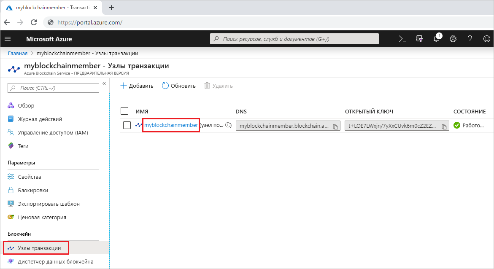
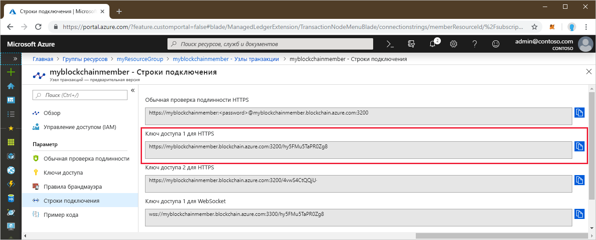

# <a name="quickstart-use-geth-to-connect-to-a-transaction-node"></a>Краткое руководство. Использование Geth для подключения к узлу транзакций

Geth — это клиент Go Ethereum, который можно использовать для подключения к экземпляру Geth на узле транзакций службы "Блокчейн Azure".

[!INCLUDE [quickstarts-free-trial-note](../../../includes/quickstarts-free-trial-note.md)]

## <a name="prerequisites"></a>Предварительные требования

* Установите [Geth](https://github.com/ethereum/go-ethereum/wiki/geth).
* См. подробнее об [использовании созданию участника блокчейна на портале Azure](create-member.md) и [руководство по созданию участника блокчейна службы "Блокчейн Azure" с помощью Azure CLI](create-member-cli.md);

## <a name="get-the-geth-connection-string"></a>Получите строку подключения Geth.

Строку подключения можно найти на портале Azure.

1. Войдите на [портале Azure](https://portal.azure.com).
1. Перейдите в область участника службы "Блокчейн Azure". Выберите **Transaction nodes** (Узлы транзакций) и щелкните ссылку на узел транзакций по умолчанию.

    

1. Выберите элемент **Строки подключения**.
1. Скопируйте строку подключения в разделе **HTTPS (Access key 1)** (HTTPS (ключ доступа 1)). Команда понадобится вам при работе со следующим разделом.

    

## <a name="connect-to-geth"></a>Подключение к Geth

1. Откройте окно командной строки или оболочку.
1. Используйте подкоманду geth attach для присоединения к запущенному экземпляру Geth на узле транзакций. Вставьте строку подключения в качестве аргумента для подкоманды attach. Например,

    ```
    geth attach <connection string>
    ```

1. После подключения к консоли Ethereum для узла транзакций можно вызвать web3 JavaScript Dapp API или API администратора.

    Например, используйте указанный ниже API-интерфейс, чтобы получить значение chainId.

    ```bash
    admin.nodeInfo.protocols.istanbul.config.chainId
    ```

    В этом примере значением для chainId будет 297.

    

1. Чтобы отключиться от консоли, введите `exit`.

## <a name="next-steps"></a>Дополнительная информация

При работе с этим кратким руководством вы использовали клиент Geth для подключения к экземпляру Geth на узле транзакций службы "Блокчейн Azure". В следующем руководстве описано, как с помощью комплекта SDK службы "Блокчейн Azure" для Ethereum и Truffle создать, собрать, развернуть и выполнить функцию смарт-контракта путем совершения транзакции.

> [!div class="nextstepaction"]
> [Создание и развертывание смарт-контрактов с помощью Visual Studio Code](send-transaction.md)