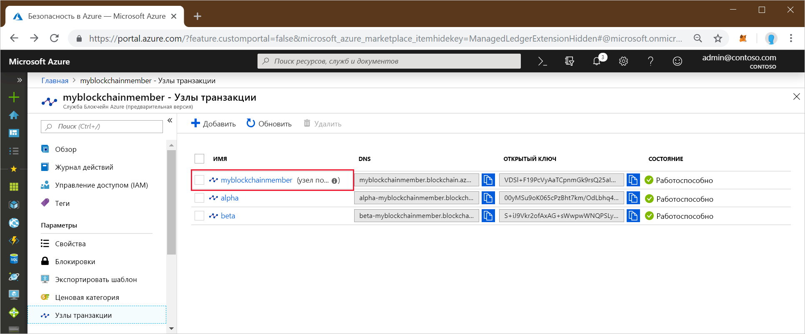
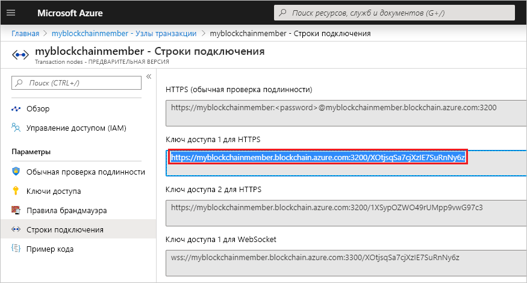
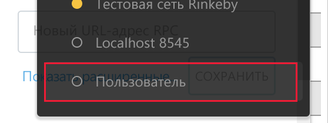
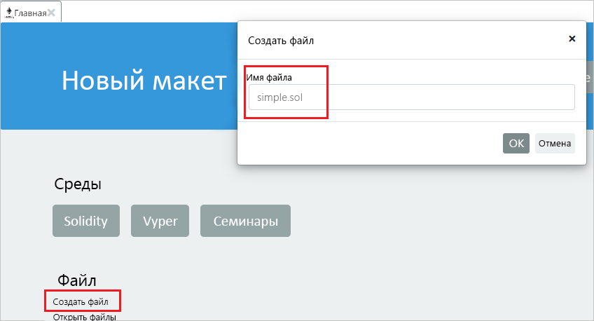
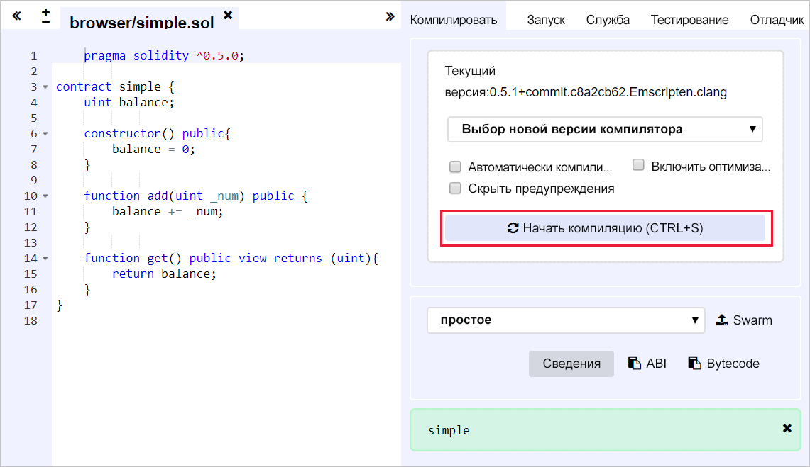
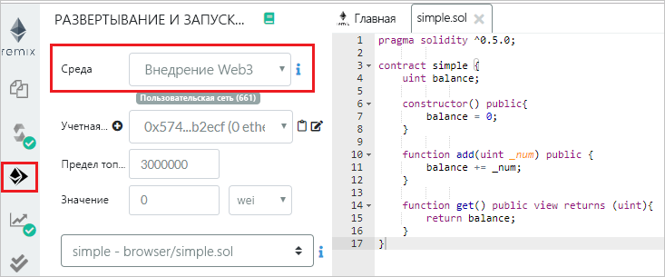
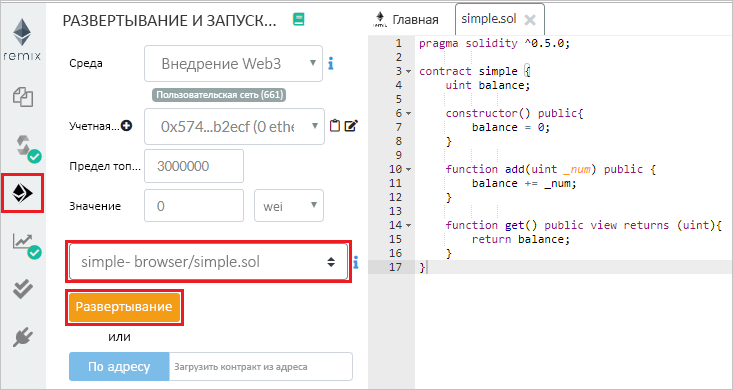
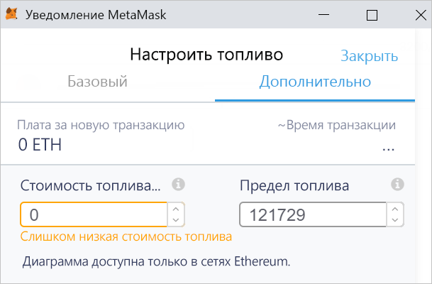
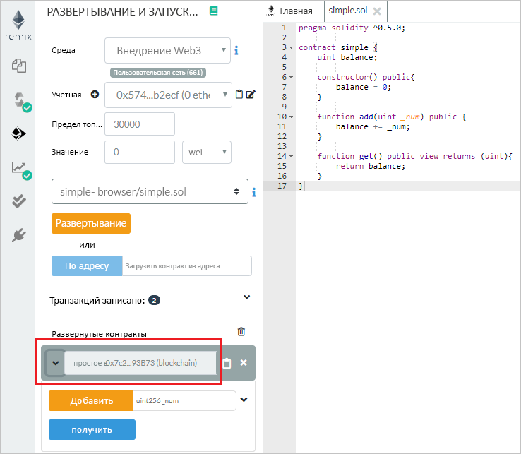
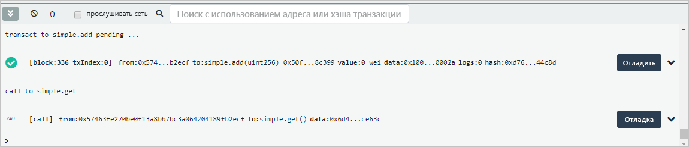

# <a name="quickstart-use-metamask-to-connect-and-deploy-a-smart-contract"></a>Краткое руководство. Подключение и развертывание смарт-контрактов с использованием MetaMask

Из этого краткого руководства вы узнаете, как с помощью MetaMask подключиться к сети службы "Блокчейн Azure", а с помощью Remix развернуть смарт-контракт. Metamask — это расширение браузера для управления кошельком Ether и выполнения действий со смарт-контрактами.

[!INCLUDE [quickstarts-free-trial-note](../../../includes/quickstarts-free-trial-note.md)]

## <a name="prerequisites"></a>Предварительные требования

* См. подробнее об [использовании созданию участника блокчейна на портале Azure](create-member.md) и [руководство по созданию участника блокчейна службы "Блокчейн Azure" с помощью Azure CLI](create-member-cli.md);
* Установите [расширение браузера MetaMask](https://metamask.io).
* Создайте [кошелек](https://metamask.zendesk.com/hc/en-us/articles/360015488971-New-to-MetaMask-Learn-How-to-Setup-MetaMask-the-First-Time) MetaMask.

## <a name="get-endpoint-address"></a>Получение адреса конечной точки

Для подключения к сети блокчейн требуется адрес конечной точки службы "Блокчейн Azure". Адрес конечной точки и ключи доступа можно найти на портале Azure.

1. Войдите на [портале Azure](https://portal.azure.com).
1. Перейдите в область участника службы "Блокчейн Azure". Выберите **Transaction nodes** (Узлы транзакций) и щелкните ссылку на узел транзакций по умолчанию.

    

1. Последовательно выберите **Строки подключения > Ключи доступа**.
1. Скопируйте адрес конечной точки из раздела **HTTPS (Access key 1)** (HTTPS (ключ доступа 1)). Этот адрес понадобится вам при работе со следующим разделом.

    

## <a name="connect-metamask"></a>Подключение MetaMask

1. Откройте расширение браузера MetaMask и выполните вход.
1. В раскрывающемся списке сетей выберите **Custom RPC** (Настраиваемая сеть RPC).

    

1. В поле **New Network > New RPC URL** (Новая сеть > Новый URL-адрес RPC) введите адрес конечной точки, скопированный при работе с предыдущим разделом.
1. Щелкните **Сохранить**.

    Если подключение успешно установлено, имя частной сети будет отображаться в раскрывающемся списке сетей.

    

## <a name="deploy-smart-contract"></a>Развертывание смарт-контракта

Remix — это среда разработки на языке Solidity, запускаемая в браузере. С помощью MetaMask и Remix вы можете развертывать смарт-контракты и выполнять действия с ними.

1. В браузере перейдите по адресу `https://remix.ethereum.org`.
1. Выберите **New file** (Новый файл) на вкладке **Home** (Главная) в разделе **File** (Файл).

    Дайте новому файлу имя `simple.sol`.

    

    Нажмите кнопку **ОК**.
1. В редакторе Remix вставьте приведенный ниже код **простого смарт-контракта**.

    ```solidity
    pragma solidity ^0.5.0;
             
    contract simple {
        uint balance;
                 
        constructor() public{
            balance = 0;
        }
                 
        function add(uint _num) public {
            balance += _num;
        }
                 
        function get() public view returns (uint){
            return balance;
        }
    }
    ```

    В **простом контракте** объявлена переменная состояния с именем **balance**. Также в нем определены две функции. Функция **add** позволяет добавить число для переменной **balance**. А функция **get** отвечает за возврат значения переменной **balance**.
1. Чтобы скомпилировать контракт, сначала выберите область компилятора Solidity, а затем **Compile simple.sol** (Компилировать simple.sol). 

    

1. В разделе **Deploy & Run** (Развертывание и запуск) задайте параметру **Environment** (Среда) значение **Injected Web3**, чтобы подключиться к своему участнику блокчейна с помощью MetaMask.

    

1. Выберите контракт **simple** и щелкните **Deploy** (Развернуть).

    


1. Отобразится уведомление MetaMask о том, что недостаточно средств для выполнения транзакции.

    Для общедоступной сети блокчейн вам потребуется оплатить стоимость транзакции в Ether. Так как это частная сеть в консорциуме, можете задать для цены на газ нулевое значение.

1.  Выберите **Gas Fee > Edit > Advanced** (Оплата газа > Изменить > Дополнительно) и задайте для параметра **Gas Price** (Цена на газ) значение 0.

    

    Щелкните **Сохранить**.

1. Выберите **Confirm** (Подтвердить), чтобы развернуть смарт-контракт в блокчейне.
1. В разделе **Deployed Contracts** (Развернутые контракты) разверните список рядом с именем **simple**.

    

    Появятся два действия: **add** и **get**. Они соответствуют функциям, определенным в контракте.

1. Чтобы выполнить транзакцию **add** с блокчейном, введите число, которое нужно добавить, и нажмите кнопку **add**. Вы можете получить сообщение об ошибке оценки газа от Remix. Вы отправляете транзакцию в частный блокчейн, в котором не требуется газ. Выберите **Send Transaction** (Отправить транзакцию), чтобы принудительно выполнить ее.
1. Как и при развертывании контракта, отобразится уведомление MetaMask о том, что недостаточно средств для выполнения транзакции.

    Так как это частная сеть в консорциуме, можно задать для цены на газ"нулевое значение.

1.  Выберите **Gas Fee > Edit > Advanced** (Оплата газа > Изменить > Дополнительно), задайте для параметра **Gas Price** (Цена на газ) значение 0 и нажмите кнопку **Save** (Сохранить).
1. Выберите **Confirm** (Подтвердить), чтобы отправить транзакцию в блокчейн.
1. Выберите действие **get**. Это вызов для запроса данных узла. Транзакцию выполнять не нужно.
1. В области отладки Remix вы увидите сведения о транзакциях с блокчейном.

    

    Здесь отображаются данные о создании контракта **simple**, а также о транзакции для **simple.add** и вызове **simple.get**.

1. Журнал транзакций можно просмотреть и в MetaMask. Откройте расширение браузера MetaMask.
1. В разделе **History** (Журнал) можно просматривать журнал развернутого контракта и транзакций.

## <a name="next-steps"></a>Дополнительная информация

При работе с этим кратким руководством вы подключились к узлу транзакций службы "Блокчейн Azure", развернули смарт-контракт и отправили транзакцию в блокчейн с помощью расширения браузера MetaMask. В следующем руководстве описано, как с помощью комплекта SDK службы "Блокчейн Azure" для Ethereum и Truffle создать, собрать, развернуть и выполнить функцию смарт-контракта путем совершения транзакции.

> [!div class="nextstepaction"]
> [Создание и развертывание смарт-контрактов с помощью Visual Studio Code](send-transaction.md)