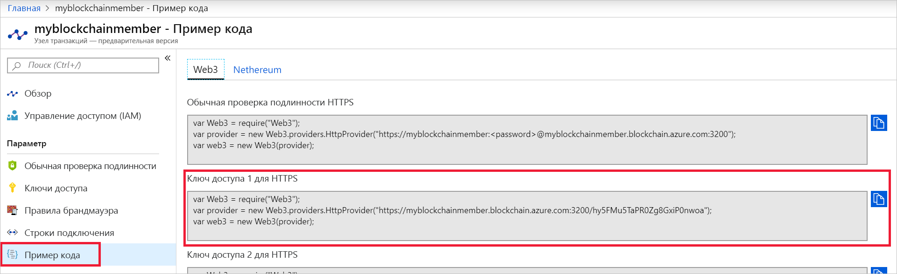

# <a name="quickstart-use-truffle-to-connect-to-a-an-azure-blockchain-service-network"></a>Краткое руководство. Подключение к сети службы "Блокчейн Azure" с использованием Truffle

Truffle — это среда разработки блокчейна, с помощью которой можно подключиться к узлу службы "Блокчейн Azure".

[!INCLUDE [quickstarts-free-trial-note](../../../includes/quickstarts-free-trial-note.md)]

## <a name="prerequisites"></a>Предварительные требования

* [Создайте участника службы "Блокчейн Azure".](create-member.md)
* Для работы с Truffle нужно установить несколько средств, включая [Node.js](https://nodejs.org), [Git](https://git-scm.com/book/en/v2/Getting-Started-Installing-Git) и [Truffle](https://github.com/trufflesuite/truffle).

    Для быстрой настройки в Windows 10 установите [Ubuntu в Windows](https://www.microsoft.com/p/ubuntu/9nblggh4msv6), чтобы получить доступ к терминалу оболочки Unix Bash, а затем установите [Truffle](https://github.com/trufflesuite/truffle). Дистрибутив Ubuntu в Windows уже содержит Node.js и Git.

## <a name="create-truffle-project"></a>Создание проекта Truffle

1. Откройте окно терминала оболочки Bash.
1. Перейдите к каталогу, в котором нужно создать каталог проекта Truffle. Например,

    ``` bash
    cd /mnt/c
    ```

1. Создайте каталог для проекта и укажите путь к новому каталогу. Например,

    ``` bash
    mkdir truffledemo
    cd truffledemo
    ```

1. Установите web3 (API JavaScript для Ethereum) в папке проекта. Сейчас требуется web3 версии 1.0.0-beta.37.

    ``` bash
    npm install web3@1.0.0-beta.37
    ```

    Во время установки могут появиться предупреждения npm.

1. Инициализируйте проект Truffle.

    ``` bash
    truffle init
    ```

1. Запустите интерактивную консоль разработки Truffle.

    ``` bash
    truffle develop
    ```

    Truffle создает блокчейн для локальной разработки и предоставляет интерактивную консоль.

## <a name="connect-to-transaction-node"></a>Подключение к узлу транзакций

Для подключения к узлу транзакций мы будем использовать Web3. Вы можете получить строку подключения Web3 на портале Azure.

1. Войдите на [портале Azure](https://portal.azure.com).
1. Перейдите в область участника службы "Блокчейн Azure". Выберите **Transaction nodes** (Узлы транзакций) и щелкните ссылку на узел транзакций по умолчанию.

    

1. Выберите **Sample Code > Web3** (Пример кода > Web3).
1. Скопируйте код JavaScript в разделе **HTTPS (Access key 1)** (HTTPS (ключ доступа 1)). Этот код понадобится для интерактивной консоли разработки Truffle.

    

1. Вставьте код JavaScript из предыдущего шага в интерактивную консоль разработки Truffle. С помощью кода создается объект web3, подключенный к узлу транзакций службы "Блокчейн Azure".

    Выходные данные примера:

    ```bash
    truffle(develop)> var Web3 = require("Web3");
    truffle(develop)> var provider = new Web3.providers.HttpProvider("https://myblockchainmember.blockchain.azure.com:3200/hy5FMu5TaPR0Zg8GxiPwned");
    truffle(develop)> var web3 = new Web3(provider);
    truffle(develop)>
     ```

    Вы можете вызывать методы в объекте **web3** для взаимодействия с узлом транзакций.

1. Вызовите метод **getBlockNumber**, чтобы отобразился текущий номер блока.

    ```bash
    web3.eth.getBlockNumber();
    ```

    Выходные данные примера:

    ```bash
    truffle(develop)> web3.eth.getBlockNumber();
    18567
    ```
1. Выйдите из консоли разработки Truffle.

    ```bash
    .exit
    ```

## <a name="next-steps"></a>Дополнительная информация

При работе с этим кратким руководством вы создали проект Truffle для подключения к узлу транзакций по умолчанию в службе "Блокчейн Azure".

Ознакомьтесь со следующим руководством, чтобы узнать, как использовать Truffle для отправки транзакции в вашу сеть блокчейна консорциума.

> [!div class="nextstepaction"]
> [Отправка транзакций](send-transaction.md)