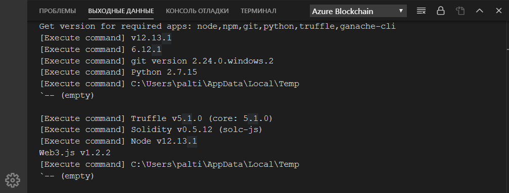
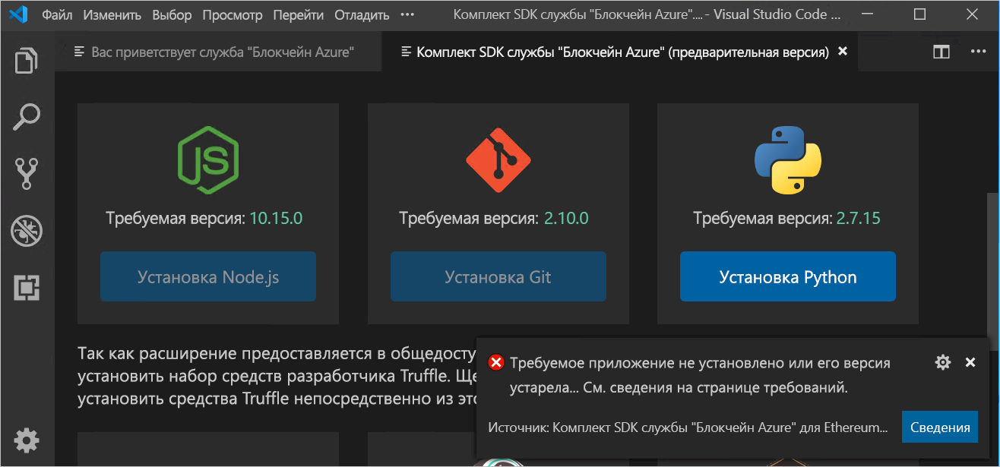
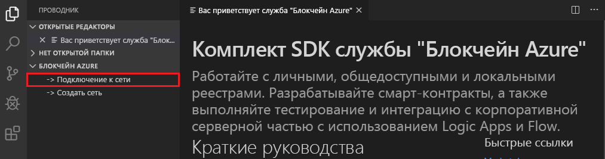
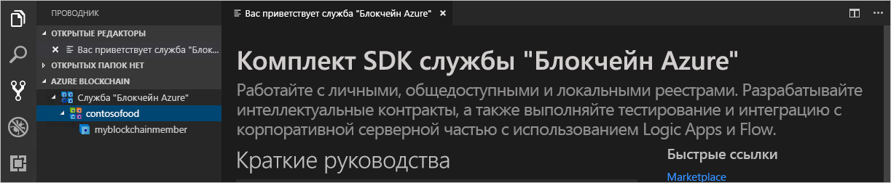

# Краткое руководство. Подключение к сети консорциума службы "Блокчейн Azure" с помощью Visual Studio Code

В этом кратком руководстве вы научитесь устанавливать и использовать комплект SDK службы "Блокчейн Azure" для Ethereum Visual Studio Code, чтобы присоединиться к консорциуму в службе "Блокчейн Azure". Комплект SDK службы "Блокчейн Azure" упрощает создание, подключение, сборку и развертывание смарт-контрактов в реестре Ethereum. 

[!INCLUDE [quickstarts-free-trial-note](../../../includes/quickstarts-free-trial-note.md)]

## Предварительные требования

* См. подробнее об [использовании созданию участника блокчейна на портале Azure](create-member.md) и [руководство по созданию участника блокчейна службы "Блокчейн Azure" с помощью Azure CLI](create-member-cli.md);
* [Visual Studio Code](https://code.visualstudio.com/Download)
* [расширение "Комплект SDK Блокчейна Azure для Ethereum"](https://marketplace.visualstudio.com/items?itemName=AzBlockchain.azure-blockchain);
* [Node.js](https://nodejs.org)
* [Git](https://git-scm.com)
* [Python](https://www.python.org/downloads/release/python-2715/). Добавьте в путь файл python.exe. Это необходимо для комплекта SDK службы "Блокчейн Azure".
* [Truffle](https://www.trufflesuite.com/docs/truffle/getting-started/installation);
* [Ganache CLI](https://github.com/trufflesuite/ganache-cli);

### Проверка среды комплекта SDK службы "Блокчейн Azure"

Комплект SDK службы "Блокчейн Azure" проверяет, выполняются ли необходимые условия для среды разработки. Чтобы проверить среду разработки, выполните следующие действия:

В палитре команд VS Code выберите **Azure Blockchain: Show Welcome Page** (Блокчейн Azure. Показать страницу приветствия).

Комплект SDK службы "Блокчейн Azure" запускает проверочный скрипт, выполнение которого займет около минуты. Чтобы просмотреть выходные данные, выберите **Терминал > Создать терминал**. В строке меню терминала выберите вкладку **Выходные данные**, а в раскрывающемся списке — **Блокчейн Azure**. При успешном завершении проверки отобразится следующий результат:

 Если требуемое средство отсутствует, отобразится новая вкладка **Azure Blockchain Development Kit - Preview** (Комплект SDK службы "Блокчейн Azure" — предварительная версия) со списком приложений, которые нужно установить, и ссылками для их скачивания.

Чтобы продолжить изучение краткого руководства установите недостающие компоненты.

## Подключение к участнику консорциума

Подключиться к участникам консорциума можно с помощью расширения "Комплект SDK службы "Блокчейн Azure" для VS Code. После подключения к консорциуму вы можете создавать и развертывать смарт-контракты в участнике консорциума службы "Блокчейн Azure".

Если у вас нет доступа к участнику консорциума службы "Блокчейн Azure", выполните предварительные требования, изложенные в [руководстве по созданию участника блокчейна на портале Azure](create-member.md) и [руководство по созданию участника блокчейна службы "Блокчейн Azure" с помощью Azure CLI](create-member-cli.md).

1. В области обозревателя Visual Studio Code (VS Code) разверните расширение **Блокчейн Azure**.
1. Выберите **Connect to Consortium** (Подключиться к консорциуму).

   

    При появлении запроса на проверку подлинности Azure следуйте инструкциям, чтобы выполнить аутентификацию с помощью браузера.
1. В раскрывающемся списке палитры команд выберите **Connect to Azure Blockchain Service consortium** (Подключиться к консорциуму службы "Блокчейн Azure").
1. Выберите подписку и группу ресурсов, связанные с участником консорциума службы "Блокчейн Azure".
1. Выберите свой консорциум из списка.

Консорциум и участники блокчейна отображаются на боковой панели проводника Visual Studio.

## Дополнительная информация

В этом кратком руководстве вы использовали комплект SDK службы "Блокчейн Azure" для Ethereum Visual Studio Code, чтобы присоединиться к консорциуму в службе "Блокчейн Azure". В следующем руководстве описано, как с помощью комплекта SDK службы "Блокчейн Azure" для Ethereum и Truffle создать, собрать, развернуть и выполнить функцию смарт-контракта путем совершения транзакции.

> [!div class="nextstepaction"]
> [Создание и развертывание смарт-контрактов с помощью Visual Studio Code](send-transaction.md)