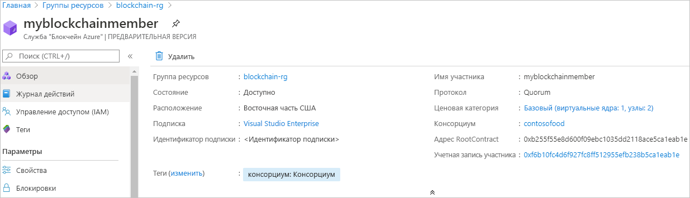

# Краткое руководство. Создание участника Блокчейна Azure с помощью шаблона Resource Manager

В этом кратком руководстве показано, как развернуть нового участника блокчейн-сети и консорциум в Блокчейне Azure с помощью шаблона Resource Manager. Элемент в службе "Azure Блокчейн" — это блокчейн-узел в частной сети блокчейн-консорциума. При подготовке элемента можно создать сеть консорциума или присоединиться к ней. Для сети консорциума требуется хотя бы один элемент. Количество элементов блокчейн-сети, необходимых участникам консирцуима, зависит от вашего сценария. У участников консорциума может быть один или несколько элементов блокчейн-сети или участники могут использовать их совместно. Дополнительные сведения о консорциумах см. в разделе [Консорциум службы "Блокчейн Azure"](consortium.md).

[!INCLUDE [About Azure Resource Manager](../../../includes/resource-manager-quickstart-introduction.md)]

Если у вас еще нет подписки Azure, создайте [бесплатную](https://azure.microsoft.com/free/) учетную запись Azure, прежде чем начинать работу.

## Предварительные требования

Нет.

## Создание члена службы "Блокчейн"

### Изучение шаблона

Шаблон, используемый в этом кратком руководстве, взят из [шаблонов быстрого запуска Azure](https://azure.microsoft.com/resources/templates/201-blockchain-asaservice/).

:::code language="json" source="~/quickstart-templates/201-blockchain-asaservice/azuredeploy.json" range="1-84" highlight="52-80":::

В шаблоне определены следующие ресурсы Azure:

* [**Microsoft.Blockchain/blockchainMembers**](/azure/templates/microsoft.blockchain/blockchainmembers)

### Развертывание шаблона

1. Выберите следующую ссылку, чтобы войти на портал Azure и открыть шаблон.

    

1. Укажите параметры для участника Блокчейна Azure.

    Параметр | Описание
    --------|------------
    Подписка | Выберите подписку Azure, которую нужно использовать для службы. Если у вас есть несколько подписок, выберите ту, в которой взимается плата за использование ресурса.
    Группа ресурсов | Создайте группу ресурсов или используйте имеющуюся группу из подписки.
    Расположение | Выберите расположение для создания участника. Все участники консорциума должны находится в одном расположении. Доступные расположения для развертывания: *westeurope, eastus, southeastasia, westeurope, northeurope, westus2* и *japaneast*.
    Имя участника | Выберите уникальное имя для участника в службе "Блокчейн Azure". Имя участника блокчейн-сети может содержать только строчные буквы и цифры. Первый символ должен быть буквой. Значение должно иметь длину от 2 до 20 символов.
    Имя консорциума | Укажите уникальное имя. Дополнительные сведения о консорциумах см. в разделе [Консорциум службы "Блокчейн Azure"](consortium.md).
    Пароль участника | Пароль учетной записи участника используется для шифрования закрытого ключа для учетной записи Ethereum, созданного для вашего участника. Учетная запись участника и ее пароль используются для управления консорциумом.
    Уровень SKU | Ценовая категория новой службы. Выберите уровень **Стандартный** или **Базовый**. Используйте уровень *Базовый* для разработки, тестирования и подтверждения концепций. Используйте уровень *Стандартный* для рабочих развертываний. Если вы работаете с Диспетчером данных блокчейна или отправляете большой объем частных транзакций, используйте ценовую категорию *Стандартный*. Изменение ценовой категории "Базовый" и "Стандартный" после создания элемента не поддерживается.
    Имя SKU | Настройка и стоимость узла для новой службы.

1. Щелкните **Приобрести**, чтобы развернуть шаблон.

  Для развертывания шаблона здесь используется портал Azure. Вы можете также использовать Azure PowerShell, Azure CLI и REST API. Дополнительные сведения о других методах развертывания см. в статье о [развертывании с использованием шаблонов](../../azure-resource-manager/templates/deploy-powershell.md).

## Просмотр развернутых ресурсов

Вы можете просматривать сведения о развернутом элементе службы "Блокчейн Azure" на портале Azure. На портале перейдите к группе ресурсов, содержащей элемент службы "Блокчейн Azure". Выберите созданный элемент блокчейна.

## Очистка ресурсов

Данные о созданном участнике блокчейн-сети можно использовать для работы со следующим кратким руководством или учебником. Если ресурсы больше не нужны, вы можете удалить их. Для этого удалите группу ресурсов, которую создали для работы с этим кратким руководством.

Чтобы удалить группу ресурсов, сделайте следующее:

1. На портале Azure перейдите к **группам ресурсов** в области навигации слева и выберите группу ресурсов, которую необходимо удалить.
2. Выберите **Удалить группу ресурсов**. Подтвердите удаление, введя имя группы ресурсов и выбрав **Удалить**.

## Дальнейшие действия

В этом кратком руководстве вы развернули участника службы "Блокчейн Azure" и новый консорциум. Ознакомьтесь со следующим кратким руководством, чтобы использовать комплект SDK службы "Блокчейн Azure" для Ethereum для присоединения к элементу в службе "Блокчейн Azure".

> [!div class="nextstepaction"]
> [Краткое руководство. Подключение к сети консорциума службы "Блокчейн Azure" с помощью Visual Studio Code](connect-vscode.md)