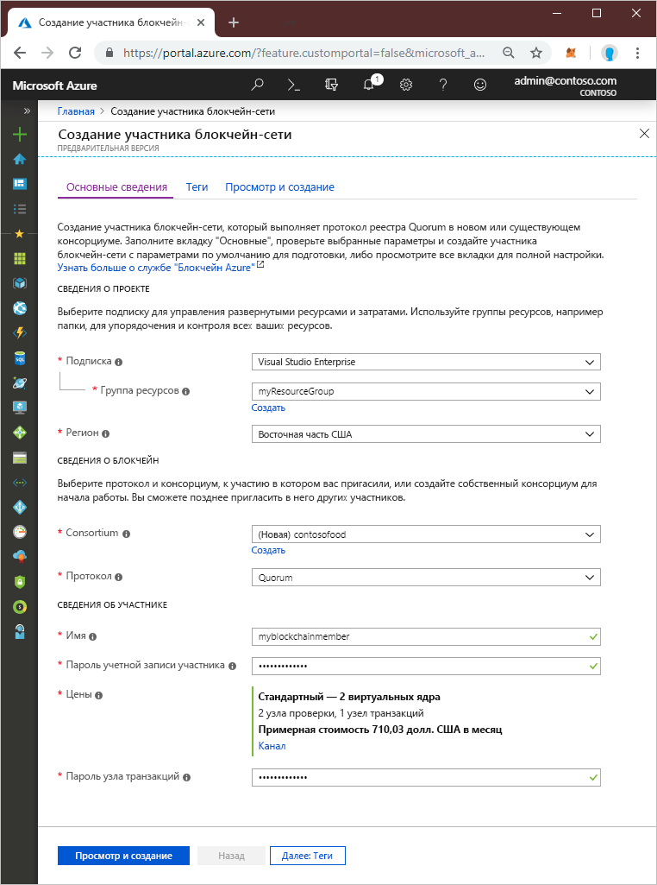
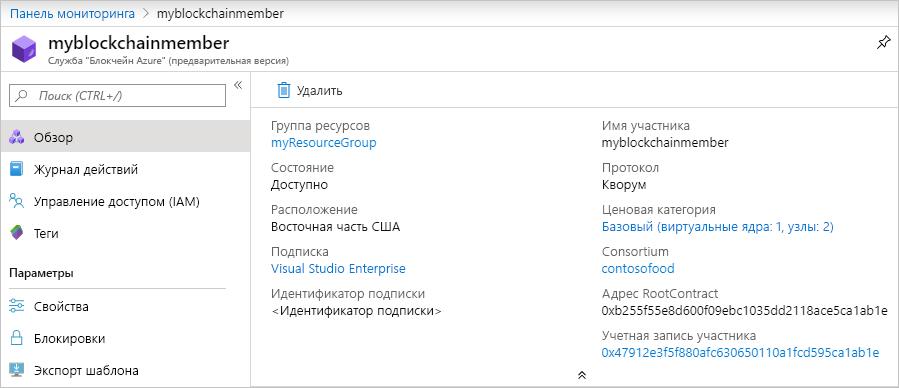

# Краткое руководство. Создание участника блокчейн-сети службы "Блокчейн Azure" с помощью портала Azure

Служба "Блокчейн Azure" — это платформа для блокчейна, на которой можно реализовать бизнес-логику в рамках смарт-контрактов. В этом кратком руководстве объясняется, как создать участника блокчейн-сети с помощью портала Azure.

[!INCLUDE [quickstarts-free-trial-note](../../../includes/quickstarts-free-trial-note.md)]

## Создание участника блокчейн-сети

Создайте участника блокчейн-сети, который выполняет протокол реестра Quorum в новом или существующем консорциуме.

1. Войдите на [портале Azure](https://portal.azure.com).
1. Щелкните **Создать ресурс** в верхнем левом углу окна портала Azure.
1. Выберите **Блокчейн** > **Azure Blockchain Service**  (Служба "Блокчейн Azure").
1. Заполните шаблон.

    

    Параметр | ОПИСАНИЕ
    --------|------------
    Участник блокчейн-сети | Задайте уникальное имя, идентифицирующее участника блокчейн-сети в службе "Блокчейн Azure". Имя участника блокчейн-сети может содержать только строчные буквы и цифры. Первый символ должен быть буквой. Значение должно иметь длину от 2 до 20 символов.
    Subscription | Выберите подписку Azure, которую нужно использовать для службы. Если у вас есть несколько подписок, выберите ту, в которой взимается плата за использование ресурса.
    Resource group | Новое имя группы ресурсов или уже имеющееся из подписки.
    Регион | Расположение должно быть одинаковым для всех участников консорциума.
    Пароль учетной записи участника | Пароль учетной записи участника используется для шифрования закрытого ключа для учетной записи Ethereum, созданного для вашего участника. Учетная запись участника и ее пароль используются для управления консорциумом.
    Имя консорциума | Введите уникальное имя для нового консорциума. Если вы присоединяетесь к консорциуму посредством приглашения, укажите имя этого консорциума.
    ОПИСАНИЕ | Описание консорциума.
    Протокол |  В предварительной версии поддерживается протокол Quorum.
    Цены | Настройка узла для новой службы. Выберите **Стандартная**. Параметры по умолчанию — 2 узла проверки и 1 узел транзакций.
    Пароль узла транзакций | Пароль для узла транзакций по умолчанию участника. Этот пароль используется для обычной проверки подлинности при подключении к общедоступной конечной точке узла транзакций участника блокчейна.

1. Щелкните **Создать**, чтобы подготовить службу. Подготовка занимает примерно 10 минут.
1. На панели инструментов щелкните **Уведомления**, чтобы отслеживать процесс развертывания.
1. После развертывания перейдите в область участника блокчейн-сети.

Выберите **Обзор**, чтобы просмотреть основные сведения о службе, включая учетную запись участника и адрес RootContract.

## Очистка ресурсов

Данные о созданном участнике можно использовать для работы со следующим руководством или учебником. Если ресурсы больше не нужны, вы можете удалить их. Для этого удалите группу ресурсов `myResourceGroup`, которую создали с помощью службы "Блокчейн Azure".

Чтобы удалить группу ресурсов, сделайте следующее:

1. На портале Azure перейдите к **группам ресурсов** в области навигации слева и выберите группу ресурсов, которую необходимо удалить.
2. Выберите **Удалить группу ресурсов**. Подтвердите удаление, введя имя группы ресурсов и выбрав **Удалить**.

## Дополнительная информация

> [!div class="nextstepaction"]
> [Подключение и развертывание смарт-контрактов с использованием MetaMask](connect-metamask.md)