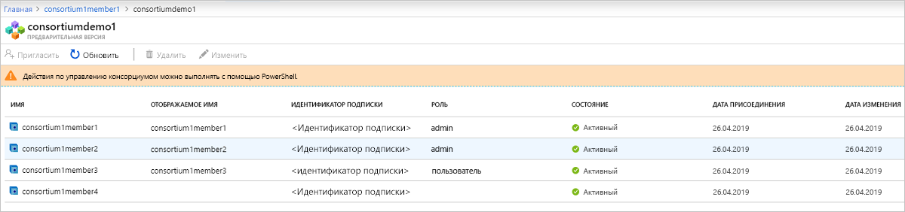

# Что собой представляет служба "Блокчейн Azure"?

Служба "Блокчейн Azure" — это полностью управляемая финансовая служба, которая позволяет пользователям расширять и использовать сети блокчейна в Azure. Обеспечивая унифицированный контроль для управления как инфраструктурой, так и сетями блокчейна, служба "Блокчейн Azure" предоставляет:

* простое развертывание и использование сети;
* встроенные возможности управления консорциумом;
* разработка смарт-контрактов с помощью привычных средств разработки.

Служба "Блокчейн Azure" предназначена для поддержки нескольких финансовых протоколов. В настоящее время она поддерживает протокол Ethereum [Quorum](https://www.jpmorgan.com/Quorum), используя механизм консенсуса [IBFT](https://github.com/jpmorganchase/quorum/wiki/Quorum-Consensus).

Эти возможности почти не требуют администрирования и предоставляются без дополнительной оплаты. Вы можете сосредоточиться на разработке приложений и бизнес-логики, не тратя время и ресурсы на управление виртуальными машинами и инфраструктурой. Кроме того, вы можете продолжить разработку приложения, используя инструменты и платформу с открытым кодом по вашему выбору, чтобы предоставлять решения, не изучая ничего нового.

## Развертывание и использование сети

Развертывание службы "Блокчейн Azure" выполняется с помощью портала Azure, Azure CLI или Visual Studio Code с расширением для Блокчейн Azure. Развертывание упрощено, включая подготовку узлов транзакций и проверки, виртуальных сетей Azure для изоляции в целях безопасности и хранилища, управляемого службой.  Кроме того, при развертывании нового элемента блокчейна пользователи также создают консорциум или присоединяются к нему.  Консорциумы позволяют нескольким участникам в разных подписках Azure безопасно взаимодействовать друг с другом в общем блокчейне.  Это упрощает развертывание сети блокчейна и сокращает его с нескольких дней до нескольких минут.

### Уровни производительности и служб

Служба "Блокчейн Azure" предлагает два уровня служб: *Базовый* и *Стандартный*. Каждый уровень предоставляет различную производительность и возможности, обеспечивая поддержку от упрощенных рабочих нагрузок для разработки и тестирования до крупномасштабных производственных развертываний блокчейна. Оба уровня включают в себя по крайней мере один узел транзакций и один узел проверки (цен. категория "Базовый") или два узла проверки (цен. категория "Стандартный").

Помимо двух узлов проверки уровень *Стандартный* обеспечивает 2 *виртуальных ядра* для каждого узла транзакций и узла проверки, в то время как уровень "Базовый" обеспечивает одно виртуальное ядро.  Имея 2 виртуальных ядра для узлов транзакций и проверки, одно из них можно выделить для протокола Quorum, а оставшееся виртуальное ядро можно использовать для других служб, связанных с инфраструктурой, обеспечив тем самым оптимальную производительность рабочих нагрузок блокчейна. Дополнительные сведения о ценах см. в разделе [Цены на службу "Блокчейн Azure"](https://azure.microsoft.com/pricing/details/blockchain-service).

### Безопасность и обслуживание

После подготовки первого элемента блокчейна вы можете добавить в него дополнительные узлы транзакций.  По умолчанию узлы транзакций защищаются с помощью правил брандмауэра и должны быть настроены для доступа.  Кроме того, все узлы транзакций шифруют данные при передаче по протоколу TLS.  Существует несколько вариантов защиты доступа к узлу транзакций, включая правила брандмауэра, обычную проверку подлинности, ключи доступа и интеграцию Azure Active Directory. Чтобы узнать больше, ознакомьтесь с [настройкой узлов транзакций](configure-transaction-nodes.md) и [настройкой доступа Azure Active Directory](configure-aad.md).

Являясь управляемой службой, Блокчейн Azure гарантирует, что на узлы вашего элемента блокчейна будут устанавливаться последние обновления программного стека операционной системы и финансового протокола и что они будут настроены для обеспечения высокой доступности (только для уровня "Стандартный"), что устраняет большую часть операций DevOps, необходимых для традиционных узлов блокчейна IaaS.  Чтобы узнать больше об установке исправлений и обновлений, ознакомьтесь с [поддерживаемыми службой "Блокчейн Azure" версиями финансовых протоколов](ledger-versions.md).

### Мониторинг и ведение журнала

Кроме того, служба "Блокчейн Azure" предоставляет информативные метрики на основе службы Azure Monitor, обеспечивая аналитические сведения о загрузке ЦП, использовании памяти и хранилищ узлов,  а также полезные сведения об операциях сети блокчейна, таких как транзакции и вычисленные блоки, глубина очереди транзакций, а также активные подключения.  Метрики можно настроить для получения представлений с аналитическими сведениями, важными для приложения блокчейна.  Кроме того, можно определить пороги с использованием оповещений, позволяющих пользователям активировать такие действия, как отправка электронного сообщения или SMS, выполнение приложения логики, функции Azure или перенаправление в пользовательский веб-перехватчик.

С помощью журналов Azure Monitor пользователи могут просматривать журналы, связанные с протоколом Quorum, или другие важные сведения, например число попыток подключения к узлам транзакций.

## Встроенные возможности управления консорциумом

При развертывании первого элемента блокчейна вы либо присоединяетесь к консорциуму, либо создаете консорциум.  Консорциум — это логическая группа, используемая для управления элементами блокчейна, участвующими в многопользовательском процессе, и подключениями между ними.  Служба "Блокчейн Azure" предоставляет встроенные элементы управления посредством предопределенных смарт-контрактов, которые определяют действия, которые могут выполнять участники консорциума.  При необходимости эти элементы управления могут быть настроены администратором консорциума. При создании консорциума ваш элемент блокчейна является администратором консорциума по умолчанию, что позволяет приглашать других пользователей присоединиться к вашему консорциуму.  Вы можете присоединиться к консорциуму, только если вас пригласили.  После присоединения к консорциуму управление вашим элементом блокчейна осуществляется посредством элементов управления, настроенных администратором консорциума.

Действия по управлению консорциумом, такие как добавление и удаление участников консорциума, можно выполнять с помощью PowerShell и REST API. Можно программно управлять консорциумом, используя общие интерфейсы, а не изменяя и отправляя смарт-контракты на основе Solidity. Чтобы узнать больше, ознакомьтесь с [управлением консорциумом](consortium.md).

## Разработка с использованием привычных инструментов

Используя финансовый протокол Quorum Ethereum с открытым кодом, вы можете разрабатывать приложения для службы "Блокчейн Azure" так же, как и для существующих приложений Ethereum. Благодаря сотрудничеству с ведущими партнерами в отрасли, расширение Visual Studio Code для комплекта SDK Блокчейна Azure позволяет разработчикам использовать привычные инструменты, такие как Truffle Suite, для создания смарт-контрактов. С помощью расширения для комплекта SDK Блокчейна Azure разработчики могут создать консорциум или подключиться к существующему консорциуму, чтобы вы могли создавать и развертывать смарт-контракты из одной интегрированной среды разработки. С помощью расширения Visual Studio Code для Блокчейна Azure вы можете создать консорциум или подключиться к существующему консорциуму, чтобы создавать и развертывать смарт-контракты из одной интегрированной среды разработки. Чтобы узнать больше, ознакомьтесь с [комплектом SDK для Блокчейна Azure в marketplace VS Code](https://aka.ms/vscodebcextension) и прочитайте руководство пользователя по комплекту SDK для Блокчейна Azure на [этой странице](https://aka.ms/vscodebcextensionwiki).

## Публикация данных блокчейна

Диспетчер данных блокчейна для службы "Блокчейн Azure" собирает, преобразовывает и доставляет данные о транзакциях службы "Блокчейн Azure" в разделы службы "Сетка событий Azure". Решение обеспечивает надежную и масштабируемую интеграцию реестра блокчейна с другими службами Azure. Вы можете использовать Диспетчер данных блокчейна для интеграции автономных приложений и хранилищ данных. Дополнительные сведения см. в статье [Что собой представляет диспетчер данных блокчейна для службы "Блокчейн Azure"?](data-manager.md)

## Поддержка и обратная связь

Вам нужна помощь или у вас есть предложение?

* Посетите [блог по Блокчейну Azure](https://azure.microsoft.com/blog/topics/blockchain/), сайт [Microsoft Tech Community](https://techcommunity.microsoft.com/t5/Blockchain/bd-p/AzureBlockchain) и [форум по Блокчейну Azure](https://social.msdn.microsoft.com/Forums/home?forum=azureblockchain).
* Чтобы отправить отзыв или отправить запрос на новые возможности, создайте запись через [UserVoice](https://feedback.azure.com/forums/921130-azure-blockchain-service).

## Дополнительная информация

Чтобы приступить к работе, воспользуйтесь кратким руководством или найдите дополнительные сведения в этих ресурсах.
* [Создайте элемент блокчейна, используя портал Azure](create-member.md) или [Azure CLI](create-member-cli.md).
* Перейдите на [страницу цен](https://azure.microsoft.com/pricing/details/blockchain-service) для сравнения цен и доступа к калькуляторам.
* Создайте первое приложение с помощью [комплекта SDK Блокчейна Azure](https://github.com/Azure-Samples/blockchain-devkit).
* [Руководство пользователя](https://github.com/Microsoft/vscode-azure-blockchain-ethereum/wiki) по расширению VS Code для Блокчейна Azure.
