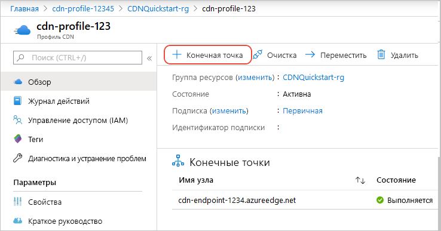
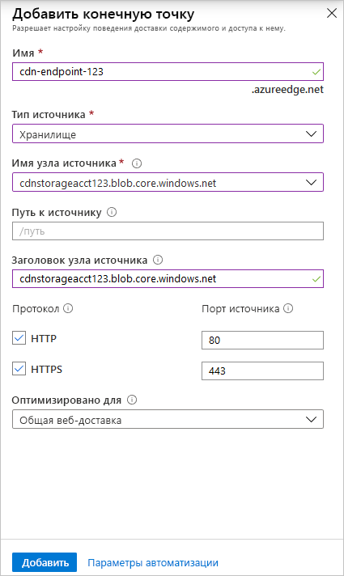
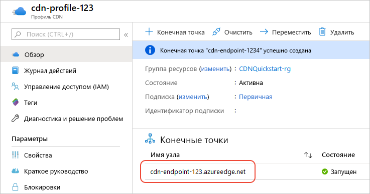

# Краткое руководство. Создание профиля и конечной точки Azure CDN

С помощью этого краткого руководства вы включите сеть доставки содержимого (CDN) Azure, создав профиль CDN, который представляет собой коллекцию с одной или несколькими конечными точками CDN. Когда профиль и конечная точка будут созданы, можете приступить к доставке содержимого своим клиентам.

## Предварительные требования

- Учетная запись Azure с активной подпиской. [Создайте учетную запись](https://azure.microsoft.com/free/?ref=microsoft.com&utm_source=microsoft.com&utm_medium=docs&utm_campaign=visualstudio) бесплатно.
- Учетная запись службы хранилища Azure с именем *cdnstorageacct123*, которую вы используете в качестве имени узла источника. Чтобы выполнить это требование, воспользуйтесь статьей [Интеграция учетной записи хранения Azure с Azure CDN](cdn-create-a-storage-account-with-cdn.md).

## Вход на портал Azure

Войдите на [портал Azure](https://portal.azure.com) с помощью своей учетной записи Azure.

[!INCLUDE [cdn-create-profile](../../includes/cdn-create-profile.md)]

## Создание новой конечной точки сети CDN

Создав профиль CDN, вы можете использовать его для создания конечной точки.

1. На портале Azure выберите на панели мониторинга созданный профиль CDN. Если его не удается найти, попробуйте открыть группу ресурсов, в которой он был создан, либо ввести имя профиля в панель поиска в верхней части портала и выбрать профиль из результатов поиска.
   
1. На странице профиля CDN выберите **+ Endpoint** (Добавить конечную точку).
   
    
   
    Появится диалоговое окно **Добавить конечную точку**.

3. Введите следующие значения для параметров.

    | Параметр | Значение |
    | ------- | ----- |
    | **имя**; | В качестве имени узла конечной точки введите *cdn-endpoint-123*. Это имя должно быть глобально уникальным. Если оно уже используется, введите другое имя. Это имя будет использоваться для доступа к кэшированным ресурсам в домене _&lt;имя конечной точки&gt;_ .azureedge.net.|
    | **Тип источника** | Выберите **Хранилище**. | 
    | **Имя узла источника** | В раскрывающемся списке выберите имя узла учетной записи хранения Azure, которое вы используете, например *cdnstorageacct123.blob.core.windows.net*. |
    | **Путь к источнику** | Не указывайте. |
    | **Заголовок узла источника** | Сохраните значение по умолчанию (то есть имя узла учетной записи хранения). |  
    | **протокол**; | Оставьте выбранные по умолчанию параметры **HTTP** и **HTTPS**. |
    | **Порт источника** | Оставьте значения портов по умолчанию. | 
    | **Оптимизировано для** | Оставьте значение по умолчанию — **Общая веб-доставка**. |

    

3. Для создания конечной точки нажмите кнопку **Добавить**. Созданная конечная точка отображается в списке конечных точек для профиля.
    
   
    
   Время, необходимое для распространения конечной точки, зависит от выбранной при создании профиля ценовой категории. **Akamai (цен. категория "Стандартный")** обычно требует не более одной минуты, **Microsoft (цен. категория "Стандартный")**  — примерно 10 минут, а **Verizon (цен. категория "Стандартный")** и **Verizon (цен. категория "Премиум")**  — до 90 минут.

## Очистка ресурсов

На предыдущих шагах вы создали профиль и конечную точку CDN в группе ресурсов. Сохраните эти ресурсы, чтобы перейти к разделу [Дополнительная информация](#next-steps) и узнать, как добавить личный домен к конечной точке. Но если в будущем эти ресурсы вам не понадобятся, их можно удалить, удалив группу ресурсов, чтобы избежать дополнительных затрат:

1. На портале Azure в меню слева щелкните **Группы ресурсов**, а затем выберите **CDNQuickstart-rg**.

2. На странице **Группа ресурсов** выберите **Удалить группу ресурсов**, в текстовом поле введите *CDNQuickstart-rg* и щелкните **Удалить**. В результате удалится группа ресурсов, профиль и конечная точка, которые вы создали с помощью этого краткого руководства.

## Дальнейшие действия

> [!div class="nextstepaction"]
> [Руководство. по добавлению сети доставки содержимого Azure в веб-приложение службы приложений Azure](cdn-add-to-web-app.md)

> [!div class="nextstepaction"]
> [Руководство. Добавление личного домена к конечной точке Azure CDN](cdn-map-content-to-custom-domain.md)
