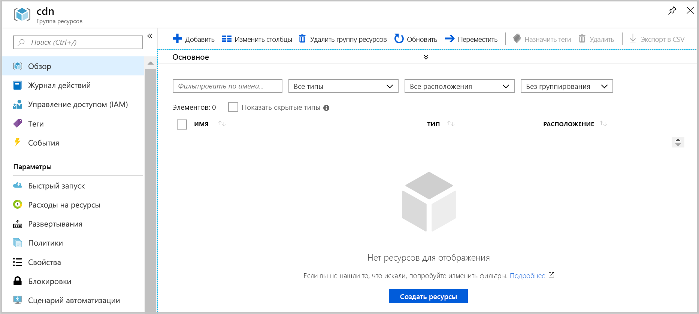

# <a name="quickstart-create-an-azure-cdn-profile-and-endpoint-using-resource-manager-template"></a>Краткое руководство. Создание профиля Azure CDN и конечной точки с помощью шаблона Resource Manager

В этом кратком руководстве вы создадите шаблон Azure Resource Manager, используя интерфейс командной строки. Шаблон, который вы создаете, развертывает профиль CDN и конечную точку CDN, связанные с веб-приложением.
Выполнения этих действий займет примерно 10 минут.

[!INCLUDE [quickstarts-free-trial-note](../../includes/quickstarts-free-trial-note.md)]

## <a name="prequisites"></a>Предварительные требования

В рамках этого краткого руководства, в качестве источника вы должны использовать веб-приложение. Пример веб-приложения, использованного в этом кратком руководстве, был развернут на сайте https://cdndemo.azurewebsites.net.

Дополнительные сведения см. в статье [Создание статического веб-приложения HTML в Azure](https://docs.microsoft.com/azure/app-service/app-service-web-get-started-html).

## <a name="create-a-resource-group"></a>Создание группы ресурсов

Все ресурсы должны развертываться в одной группе ресурсов.

Создайте группу ресурсов в выбранном расположении. В этом примере показано, как создать группу ресурсов с именем cdn в восточной части США.

```bash
az group create --name cdn --location eastus
```



## <a name="create-the-resource-manager-template"></a>Создание шаблона Resource Manager

На этом шаге вы создадите файл шаблона, который развертывает ресурсы.

Хотя в этом примере рассматривается сценарий общего ускорения веб-сайта, есть и множество других параметров, которые могут быть настроены. Эти параметры доступны в ссылке на шаблон Azure Resource Manager. См. ссылки для [профиля CDN](https://docs.microsoft.com/en-us/azure/templates/microsoft.cdn/2017-10-12/profiles) и [конечной точки профиля CDN](https://docs.microsoft.com/en-us/azure/templates/microsoft.cdn/2017-10-12/profiles/endpoints).

Обратите внимание на то, что Microsoft CDN не поддерживает изменение списка типов содержимого.

Сохраните шаблон как **resource-manager-cdn.json**.

```json
{
    "$schema": "https://schema.management.azure.com/schemas/2015-01-01/deploymentTemplate.json#",
    "contentVersion": "1.0.0.0",
    "parameters": {
        "cdnProfileSku": {
            "type": "string",
            "allowedValues": [
                "Standard_Microsoft",
                "Standard_Akamai",
                "Standard_Verizon",
                "Premium_Verizon"
            ]
        },
        "endpointOriginHostName": {
            "type": "string"
        }
    },
    "variables": {
        "profile": {
            "name": "[replace(toLower(parameters('cdnProfileSku')), '_', '-')]"
        },
        "endpoint": {
            "name": "[replace(toLower(parameters('endpointOriginHostName')), '.', '-')]",
            "originHostName": "[parameters('endpointOriginHostName')]"
        }
    },
    "resources": [
        {
            "type": "Microsoft.Cdn/profiles",
            "apiVersion": "2017-10-12",
            "location": "[resourceGroup().location]",
            "name": "[variables('profile').name]",
            "sku": {
                "name": "[parameters('cdnProfileSku')]"
            }
        },
        {
            "dependsOn": [
                "[resourceId('Microsoft.Cdn/profiles', variables('profile').name)]"
            ],
            "type": "Microsoft.Cdn/profiles/endpoints",
            "apiVersion": "2017-10-12",
            "location": "[resourceGroup().location]",
            "name": "[concat(variables('profile').name, '/', variables('endpoint').name)]",
            "properties": {
                "hostName": "[concat(variables('endpoint').name, '.azureedge.net')]",
                "originHostHeader": "[variables('endpoint').originHostName]",
                "isHttpAllowed": true,
                "isHttpsAllowed": true,
                "queryStringCachingBehavior": "IgnoreQueryString",
                "origins": [
                    {
                        "name": "[replace(variables('endpoint').originHostName, '.', '-')]",
                        "properties": {
                            "hostName": "[variables('endpoint').originHostName]",
                            "httpPort": 80,
                            "httpsPort": 443
                        }
                    }
                ],
                "contentTypesToCompress": [
                    "application/eot",
                    "application/font",
                    "application/font-sfnt",
                    "application/javascript",
                    "application/json",
                    "application/opentype",
                    "application/otf",
                    "application/pkcs7-mime",
                    "application/truetype",
                    "application/ttf",
                    "application/vnd.ms-fontobject",
                    "application/xhtml+xml",
                    "application/xml",
                    "application/xml+rss",
                    "application/x-font-opentype",
                    "application/x-font-truetype",
                    "application/x-font-ttf",
                    "application/x-httpd-cgi",
                    "application/x-javascript",
                    "application/x-mpegurl",
                    "application/x-opentype",
                    "application/x-otf",
                    "application/x-perl",
                    "application/x-ttf",
                    "font/eot",
                    "font/ttf",
                    "font/otf",
                    "font/opentype",
                    "image/svg+xml",
                    "text/css",
                    "text/csv",
                    "text/html",
                    "text/javascript",
                    "text/js",
                    "text/plain",
                    "text/richtext",
                    "text/tab-separated-values",
                    "text/xml",
                    "text/x-script",
                    "text/x-component",
                    "text/x-java-source"
                ],
                "isCompressionEnabled": true,
                "optimizationType": "GeneralWebDelivery"
            }
        }
    ],
    "outputs": {
        "cdnUrl": {
            "type": "string",
            "value": "[concat('https://', variables('endpoint').name, '.azureedge.net')]"
        }
    }
}
```

## <a name="create-the-resources"></a>Создание ресурсов

Разверните шаблон с помощью интерфейса командной строки Azure. Вам будет предложено ввести 2 варианта входных данных:

**cdnProfileSku** — провайдер CDN, который вы хотите использовать. Доступны следующие параметры.

* Standard_Microsoft
* Standard_Akamai
* Standard_Verizon
* Premium_Verizon

**endpointOriginHostName** — конечная точка, которая будет обрабатываться с помощью CDN, например, cdndemo.azurewebsites.net.

```bash
az group deployment create --resource-group cdn --template-file arm-cdn.json
```


## <a name="view-the-cdn-profile"></a>Просмотр профиля CDN

```bash
az cdn profile list --resource-group cdn -o table
```


## <a name="view-the-cdn-endpoint-for-the-profile-standard-microsoft"></a>Просмотр конечной точки CDN для профиля standard-microsoft

```bash
az cdn endpoint list --profile-name standard-microsoft --resource-group cdn -o table
```


Чтобы просмотреть содержимое, используйте имя узла. Например, получите доступ к https://cdndemo-azurewebsites-net.azureedge.net с помощью браузера.

## <a name="clean-up"></a>Очистка

Удаление группы ресурсов автоматически удалит все ресурсы, которые были развернуты в нем.

```bash
az group delete --name cdn
```


## <a name="references"></a>Ссылки

* Для профиля CDN — [Справочник по шаблону Azure Resource Manager](https://docs.microsoft.com/en-us/azure/templates/microsoft.cdn/2017-10-12/profiles).
* Для конечной точки CDN — [Справочная документация по шаблону Azure Resource Manager](https://docs.microsoft.com/en-us/azure/templates/microsoft.cdn/2017-10-12/profiles/endpoints).

## <a name="next-steps"></a>Дополнительная информация

Дополнительные сведения о добавлении личного домена к конечной точке CDN см. в следующем руководстве:

> [!div class="nextstepaction"]
> [Руководство Добавление личного домена к конечной точке Azure CDN](cdn-map-content-to-custom-domain.md)
