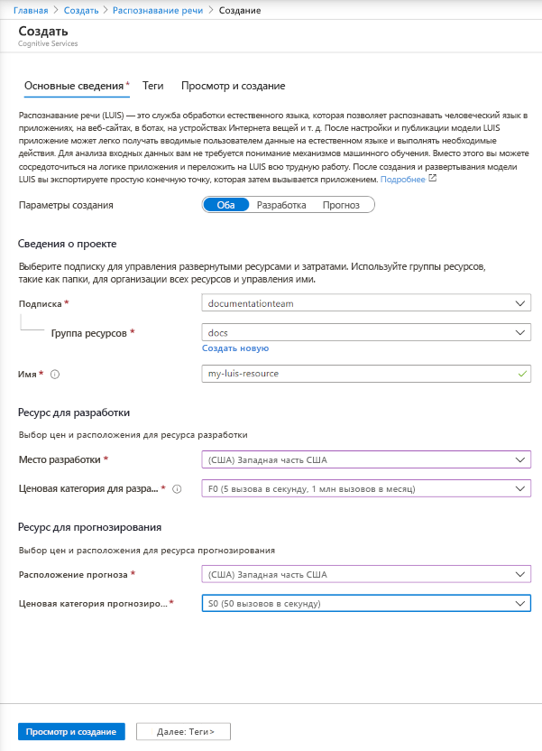

## Создание ресурсов LUIS на портале Azure

1. Используйте [эту ссылку](https://ms.portal.azure.com/#create/Microsoft.CognitiveServicesLUISAllInOne), чтобы начать создание ресурсов LUIS на портале Azure.

1. Введите все необходимые параметры:

    |Имя|Назначение|
    |--|--|
    |имя подписки;| Подписка, для которой будет выставлен счет за ресурс.|
    |Группа ресурсов| Выбранное или созданное пользователем имя группы ресурсов. Группы ресурсов позволяют группировать ресурсы Azure для осуществления доступа и управления.|
    |Имя| Выбранное пользователем имя, используемое в качестве пользовательского поддомена для запросов конечной точки разработки и прогнозирования.|
    |Место разработки|Регион, связанный с вашей моделью.|
    |Ценовая категория для разработки|Ценовая категория определяет максимальное количество транзакций в секунду за месяц.|
    |Расположение среды выполнения|Регион, связанный с опубликованной средой выполнения конечной точки прогнозирования.|
    |Ценовая категория среды выполнения|Ценовая категория определяет максимальное количество транзакций в секунду за месяц.|

    > [!div class="mx-imgBorder"]
    > 

1. Щелкните **Просмотр и создание** и дождитесь создания ресурса.
1. После создания обоих ресурсов выберите на портале Azure новый ресурс для разработки, а затем щелкните **Быстрое начало**, чтобы получить **URL-адрес конечной точки** разработки и **ключ** для разработки программным способом.

> [!TIP]
> Чтобы использовать ресурсы, [назначьте их](../luis-how-to-azure-subscription.md#assign-an-authoring-resource-in-the-luis-portal-for-all-apps) на портале LUIS.