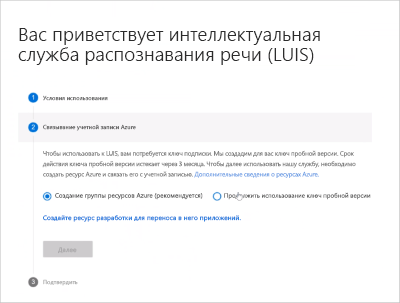
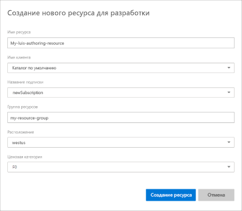
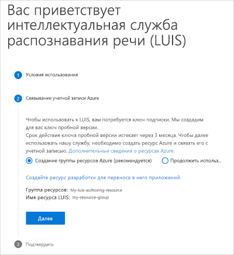
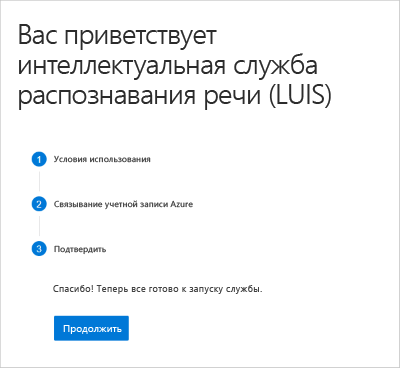

## Вход на портал LUIS

Новому пользователю LUIS следует выполнить следующие действия:

1. Войдите на [портал LUIS](https://www.luis.ai), выберите свою страну и примите условия использования.
1. Последовательно выберите **Create Azure resource** (Создать ресурс Azure) и **Create an authoring resource to migrate your apps to** (Создать ресурс для разработки, в который будут перенесены ваши приложения).

    

1. Укажите сведения о ресурсе.

    

    При **создании ресурса для разработки** укажите следующие сведения: 

    * **Имя ресурса.** Выбранное пользователем имя, используемое в качестве части URL-адреса для запросов конечной точки разработки и прогнозирования.
    * **Клиент.** Клиент, с которым связана подписка Azure. 
    * **Имя подписки.** Подписка, для которой будет выставлен счет за ресурс.
    * **Группа ресурсов.** Выбранное или созданное пользователем имя группы ресурсов. Группы ресурсов позволяют группировать ресурсы Azure для осуществления доступа и управления. 
    * **Расположение.** Выбор расположения зависит от выбранной **группы ресурсов**.
    * **Ценовая категория.** Ценовая категория определяет максимальное количество транзакций в секунду и месяц.

1. Отобразится сводка по создаваемому ресурсу. Щелкните **Далее**.

    

1. Подтвердите введенные данные, выбрав **Продолжить**. 

    